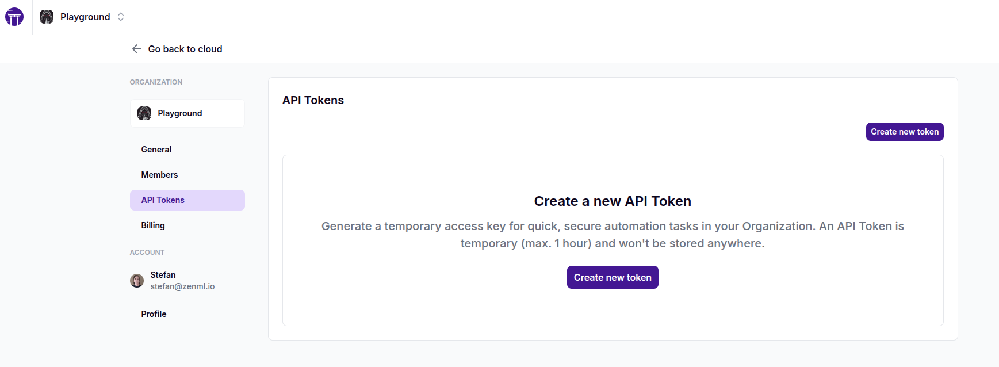
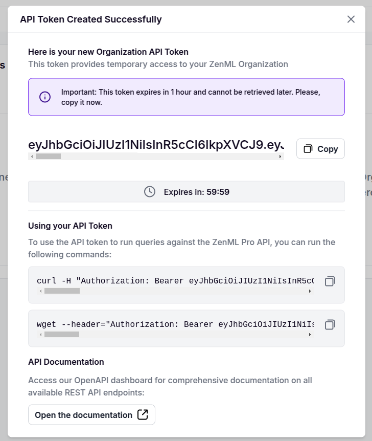

# Using the ZenML Pro API

ZenML Pro offers a powerful API that allows you to interact with your ZenML resources. Whether you're using the [SaaS version](https://cloud.zenml.io) or a self-hosted ZenML Pro instance, you can leverage this API to manage workspaces, organizations, users, roles, and more.

The SaaS version of ZenML Pro API is hosted at [https://cloudapi.zenml.io](https://cloudapi.zenml.io).

## API Overview

The ZenML Pro API is a RESTful API that follows OpenAPI 3.1.0 specifications. It provides endpoints for various resources and operations, including:

- Workspace management
- Organization management
- User management
- Role-based access control (RBAC)
- Authentication and authorization

## Authentication

To use the ZenML Pro API, you need to authenticate your requests. If you are logged in to your ZenML Pro account,
you can use the same browser window to authenticate requests to your ZenML Pro API, directly in the OpenAPI docs. 

For example, for the SaaS variant, you can access the docs here: [https://cloudapi.zenml.io](https://cloudapi.zenml.io). You can make requests
by being logged into ZenML Pro at [https://cloud.zenml.io](https://cloud.zenml.io).

### Programmatic access with API tokens

API tokens provide a way to authenticate with the ZenML Pro API for temporary automation tasks. These tokens are scoped to your user account and are valid for 1 hour by default. You can use the generated API tokens for programmatic access to the ZenML Pro REST API.

To generate a new API token for the ZenML Pro API:

1. Navigate to the organization settings page in your ZenML Pro dashboard
2. Select "API Tokens" from the left sidebar

    

3. Click the "Create new token" button. Once generated, you'll see a dialog showing your new API token. 

    

4. Simply use the API token as the bearer token in your HTTP requests. For example, you can use the following command to check your current user:
    * using curl:
      ```bash
      curl -H "Authorization: Bearer YOUR_API_TOKEN" https://cloudapi.zenml.io/users/me
      ```
    * using wget:
      ```bash
      wget -qO- --header="Authorization: Bearer YOUR_API_TOKEN" https://cloudapi.zenml.io/users/me
      ```
    * using python:
      ```python
      import requests

      response = requests.get(
        "https://cloudapi.zenml.io/users/me",
        headers={"Authorization": f"Bearer YOUR_API_TOKEN"}
      )
      print(response.json())
      ```


**Important Notes**

- API tokens expire after 1 hour and cannot be retrieved after initial generation
- Tokens are scoped to your user account and inherit your permissions


### Workspace programmatic access

Programmatic access to the ZenML Pro workspace API is achieved essentially the same way as the ZenML OSS server API. You can use one of these two methods:

* [Generate and use temporary API tokens](../../reference/api-reference.md#using-a-short-lived-api-token)
* [Create a service account and use its API key](../../reference/api-reference.md#using-a-service-account-and-an-api-key)

Please consult the indicated sections for more information.

## Key API Endpoints

Here are some important endpoints you can use with the ZenML Pro API:

### Workspace Management

- List workspaces: `GET /workspaces`
- Create a workspace: `POST /workspaces`
- Get workspace details: `GET /workspaces/{workspace_id}`
- Update a workspace: `PATCH /workspaces/{workspace_id}`

### Organization Management

- List organizations: `GET /organizations`
- Create an organization: `POST /organizations`
- Get organization details: `GET /organizations/{organization_id}`
- Update an organization: `PATCH /organizations/{organization_id}`

### User Management

- List users: `GET /users`
- Get current user: `GET /users/me`
- Update user: `PATCH /users/{user_id}`

### Role-Based Access Control

- Create a role: `POST /roles`
- Assign a role: `POST /roles/{role_id}/assignments`
- Check permissions: `GET /permissions`

## Error Handling

The API uses standard HTTP status codes to indicate the success or failure of requests. In case of errors, the response body will contain more details about the error, including a message and sometimes additional information.

## Rate Limiting

Be aware that the ZenML Pro API may have rate limiting in place to ensure fair usage. If you exceed the rate limit, you may receive a 429 (Too Many Requests) status code. Implement appropriate backoff and retry logic in your applications to handle this scenario.

Remember to refer to the complete API documentation available at [https://cloudapi.zenml.io](https://cloudapi.zenml.io) for detailed information about all available endpoints, request/response schemas, and additional features.
<!-- For scarf -->
<figure></figure>


