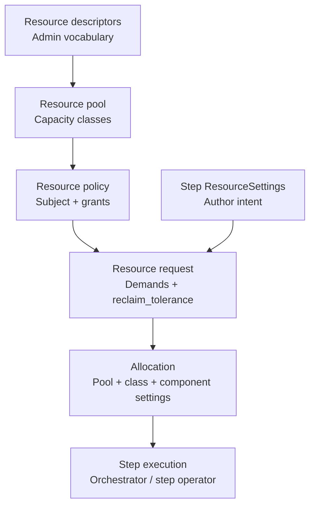

# Core concepts

This page defines the building blocks of ZenML Pro resource pools. For
step-by-step setup, see the [Admin guide](resource-pools-admin-guide.md) and
[User guide](resource-pools-user-guide.md).


Resource pools apply only to [dynamic pipelines](https://docs.zenml.io/how-to/steps-pipelines/dynamic_pipelines).
Static pipelines do not create resource requests or wait for pool allocation
today.


## Resource descriptors and the resource language

A resource descriptor is an admin-defined entry in your organization's resource
catalog. It describes what can be requested — not how much exists or who may
use it.

| Field | Meaning |
| --- | --- |
| `name` | Stable identifier used in pool capacity and exact requests (for example `h200`, `GPU`) |
| `kind` | Generic type label used in selectors (for example `cpu`, `gpu`, `memory`) |
| `attributes` | Descriptive key/value map (for example `vram_gb: 141`, `vendor: nvidia`) |
| `units` | Optional unit catalog for multiple counting schemes (see [Admin guide](resource-pools-admin-guide.md#descriptor-units)) |

Admins define descriptors once; the whole organization uses the same vocabulary
in pools, policies, and (for custom resources) step requests.

### Default descriptors

Every organization starts with stock system descriptors:

| Name | Kind | Typical use |
| --- | --- | --- |
| `CPU` | `cpu` | Milli-CPU and CPU units |
| `memory` | `memory` | RAM in byte units |
| `GPU` | `gpu` | Generic GPU accelerators |
| `step run` | `step_run` | Concurrent step-slot throttling |

These bootstrap the catalog. Admins add custom descriptors (for example `h200`,
`training-license`) through the ZenML Pro UI.

### Kind vs name

Descriptors are referenced by `name` or matched by `kind`:

- Use `name` when you refer to a specific descriptor (`resource: "h200"`).
- Use `kind` when any matching descriptor of that type may satisfy the demand
  (for example `kind: "gpu"` with optional attribute predicates).

#### Default kinds and ResourceSettings

ZenML's typed `ResourceSettings` fields form a unified default language. They
always emit demands by **kind**, not by descriptor name:

| ResourceSettings field | Demand kind | Matches descriptors with kind |
| --- | --- | --- |
| `cpu_count` | `cpu` | `cpu` (for example `CPU`) |
| `memory` | `memory` | `memory` |
| `gpu_count` / `gpu_class` | `gpu` | `gpu` (for example `GPU`, or custom `h200` if its kind is `gpu`) |
| (ZenML convention) | `step_run` | `step_run` (for example `step run`) |

For isolated dynamic steps, ZenML also adds a `step_run` demand (quantity 1)
when the step did not already request one — a platform convention for
concurrency throttling, not something authors set through a typed field.

Authors who only use `cpu_count`, `gpu_count`, and `memory` never need to know
descriptor names. Custom entries in `ResourceSettings.resources` target
descriptors by **name** (or advanced selectors) and are required for resources
whose kind is outside the default set (for example licenses).

## Resource pools and capacity classes

A resource pool is a named virtual ledger of capacity. Capacity is declared as
a list of classes — each class is a bucket for one resource in that pool.

Each capacity class entry has:

| Field | Meaning |
| --- | --- |
| `resource` | Descriptor name (for example `h200`, `GPU`) |
| `class` | Pool-local label (for example `reserved`, `adhoc`, `spot`) |
| `quantity` | How many units exist in this bucket |
| `rank` | Preference when multiple classes could satisfy a request (higher tried first) |
| `reclaimable` | External interrupt risk: `never`, `coordinated`, or `unsafe` |
| `attributes` | Class metadata for matching (for example `tier: tier-a-gpu`, `region: eu-west`) |
| `component_settings` | Placement overrides when this class is allocated (for example node selectors and tolerations) |

### What admins encode in classes

Admins express scheduling intent through `rank` and `reclaimable`, not through
real-world cost or availability numbers in the pool definition:

| Class label (example) | Typical meaning | Typical `reclaimable` | Typical `rank` |
| --- | --- | --- | --- |
| `reserved` | Dedicated contract capacity | `never` | High |
| `adhoc` | Shared on-demand burst | `never` or `coordinated` | Medium |
| `spot` | Preemptible cloud nodes | `unsafe` | Low |

`reclaimable` describes how safely capacity can be interrupted from outside
ZenML (for example spot nodes or external reclaim). It works together with
request `reclaim_tolerance` (see below).

### Mapping pools to infrastructure

One pool can hold multiple classes for the same resource. Multiple pools can
each correspond to a Kubernetes node or node pool — for example one pool per
node with `attributes` such as `kubernetes_node: node-a`. Policies and
component settings then tie allocations to the right placement settings.

Configure pools, classes, attributes, and component settings in the ZenML Pro
UI. The CLI offers a simplified flat capacity map for quick starts (see
[Admin guide](resource-pools-admin-guide.md)).


Every pool should declare capacity for `CPU`, `memory`, and `step run` — not
only scarce resources such as `GPU`. Steps always send demands for CPU, memory,
and (for isolated dynamic steps) a `step_run` slot. There is no unbounded
fallback: if a demand is not covered by the pool, the request is rejected.

Grantless policies (`grants: []`) treat the whole pool as the subject's target
(effective reservation 0, limit equal to pool capacity for each resource in the
pool). A demand still must match a resource that exists in the pool.


## Policies and subjects

A policy connects a subject to a pool and defines how much capacity that subject
may use.

### Two subject types

| Subject | ZenML concept | Typical use |
| --- | --- | --- |
| Stack component | Orchestrator or step operator | Pipeline steps run through that component |
| User or service account | Workspace user or service account | Direct resource requests from external workloads |

Exactly one subject is set per policy: either `component_id` or `account_id`.

### Grants

Each policy carries one or more grant line items:

| Grant field | Meaning |
| --- | --- |
| `resource` | Descriptor name |
| `class_name` | Exactly one pool-local capacity class this grant covers (for example `reserved`) |
| `reserved` | Guaranteed slice; non-reclaimable requests must fit here |
| `limit` | Hard ceiling; omit or set null to track current pool capacity |

Policy-level fields:

| Field | Meaning |
| --- | --- |
| `priority` | Contention ordering; higher wins (required when `priority_lane` is false) |
| `priority_lane` | Internal maximum priority for external or critical workloads |
| `grants` | Grant list; empty list = grantless (admit to all pool capacity) |


Each grant covers one descriptor and one class. If a subject may use the same
resource in multiple classes, configure one grant per class. If a step's
request includes a demand (for example `kind: cpu`, `kind: memory`, or
`kind: step_run`) that is not covered by any grant on the policy, the request
is rejected — even when the pool has free capacity. Grantless policies skip
per-resource grants but still require every demand to match a resource declared
in the pool.

Requests with `reclaim_tolerance: none` must fit within a grant's `reserved`
amount for each demand. If reserved is 0 or the grant omits that resource, the
request is rejected immediately.



Reservations are validated against pool capacity per resource and class. For a
given pool, resource, and `class_name`, the sum of `reserved` across all
policies attached to that pool cannot exceed the matching capacity bucket. For
example, if `datacenter-gpus` has `GPU/reserved` capacity `8`, all policy
grants for `GPU` with `class_name: "reserved"` on that pool can reserve at most
8 total.



A single orchestrator or step operator may have several policies, each pointing
at a different pool. ZenML still treats each step as one resource request. The
step may queue in more than one pool, but at most one pool wins. ZenML never
splits demands across pools (for example GPUs from one pool and CPU from
another).

Every pool and policy that might win must declare and grant every resource
authors can request on that stack. See
[Examples — Multiple pools](resource-pools-examples.md#multiple-pools-one-request).


## Resource requests and demands

When a dynamic step is ready to launch (or an external client calls the API),
ZenML creates a resource request with one or more demands.


Only dynamic pipeline steps participate in resource queuing and allocation
waiting. The server creates the request when the step is ready to launch and
the step launcher blocks until allocation (or a terminal status).


Each demand specifies what is needed:

| Demand field | When to use |
| --- | --- |
| `kind` | Match any descriptor of that kind (typical for `cpu`, `gpu`, `memory` from `ResourceSettings`) |
| `resource` | Match an exact descriptor name |
| `resource_selector` | Match descriptors by attributes |
| `class` / `class_selector` | Prefer or require specific capacity classes |
| `quantity`, `unit` | How much to allocate |

### From ResourceSettings to demands

| Step setting | Demand shape |
| --- | --- |
| `gpu_count` | `kind: "gpu"`, optional `class` from `gpu_class` |
| `cpu_count` | `kind: "cpu"`, `unit: "CPU"` |
| `memory` | `kind: "memory"`, `unit` = byte suffix (for example `GiB`) |
| `resources` (custom) | `resource: "<name>"` by descriptor name |
| (automatic) | `kind: "step_run"`, quantity 1 for isolated dynamic steps when not already requested |

### Reclaim tolerance vs class reclaimable

Each request carries `reclaim_tolerance`:

| Value | Meaning | Compatible class `reclaimable` |
| --- | --- | --- |
| `none` | Never interrupted for pool reasons | `never` only; must fit grant `reserved` |
| `coordinated` | Can be stopped and retried | `never`, `coordinated` |
| `any` | Best-effort; may use unsafe capacity | all three |

Legacy `preemptible=False` maps to `reclaim_tolerance: none`;
`preemptible=True` maps to `coordinated`. Prefer `reclaim_tolerance` in new
code.

Default when unset: isolated dynamic steps use `any`; inline dynamic steps
use `none`.

### Request statuses

| Status | Meaning |
| --- | --- |
| `pending` | Queued, waiting for capacity |
| `allocated` | Capacity granted; step may run |
| `preempting` | Being stopped to free capacity for another request |
| `preempted` | Stopped by preemption |
| `rejected` | Cannot be satisfied (policy or capacity rules) |
| `cancelled` | Cancelled (including lease expiry while pending) |
| `released` | Completed; capacity returned |
| `expired` | Lease expired while allocated |

Inspect requests in the UI, or with `zenml resource-request list` and
`zenml resource-pool requests`.

## Leases

Many allocations are leased — a time-bound claim tracked on the resource
request as `lease_expires_at`. Leases let the reconciler recover capacity when
a client stops renewing. Not every pipeline request uses a running lease:

| Step pattern | Typical lease while running | Default reclaim tolerance |
| --- | --- | --- |
| Inline dynamic step | No lease | `none` (not preemptible for pool reasons) |
| Isolated dynamic step with heartbeat | Yes — renewed each heartbeat | `any` when unset |
| Isolated step, heartbeat disabled | No lease renewal | Must use `none` (validation rejects `coordinated` / `any`) |
| External workload | Yes — client renews via API | Set on the request |

While a leased workload holds capacity:

- Isolated pipeline steps: the step launcher waits until `allocated`, sets an
  initial lease for startup (`initialization_lease_seconds`), then the step
  heartbeat renews the lease and checks for preemption signals.
- Inline pipeline steps: no running lease; capacity is held for the step
  duration and released when the step completes.
- External workloads: the client renews explicitly through the API.

If a lease expires without renewal (missed heartbeats, crashed client,
abandoned request), the reconciler releases capacity back to the pool. See
[Reconciliation process](resource-pools-reconciliation.md) and the
[User guide](resource-pools-user-guide.md#leases-heartbeat-and-reclaim-tolerance)
for author-facing details.

## How the pieces fit together

## See also

* [Resource pools](resource-pools.md) — overview and walkthrough
* [Admin guide](resource-pools-admin-guide.md) — configure descriptors, pools, policies
* [User guide](resource-pools-user-guide.md) — annotate steps with ResourceSettings
* [External workloads](resource-pools-external-workloads.md) — direct requests and priority lanes
* [Examples](resource-pools-examples.md) — end-to-end scenarios
* [Reconciliation process](resource-pools-reconciliation.md) — queueing, preemption, leases
