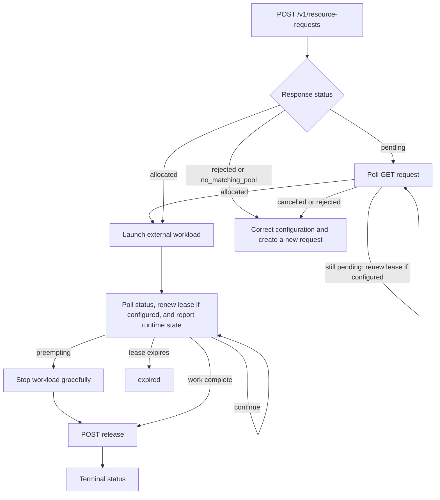

# External workloads

External workloads are jobs that consume the same infrastructure as ZenML
pipelines but are not launched as ZenML steps. Examples include online
inference services, batch jobs managed by another scheduler, or emergency
capacity reservations driven by an internal platform service.

Resource pools can govern those workloads when they create Resource Manager
resource requests with the same subject and demand conventions as ZenML steps.

## Common pattern

1. Create a ZenML Pro service account for the external system.
2. Configure a resource pool through the Resource Manager API with classes
   that represent the real infrastructure bundle the workload consumes.
3. Attach a policy for the service account. Use priority lane only for
   workloads that must outrank normal pipeline work.
4. The external service creates, renews, and releases Resource Manager resource
   requests while it holds capacity. Include a service-account subject for the
   policy and a target subject, such as a service connector, for the pool
   target binding.

## Policy for an external service

For an inference service that needs to reclaim an H200 node pool during peak
traffic, use a service-account policy. A grantless policy is often appropriate
when the service should access the full matching class bundle.

```json
{
  "pool": "prod-eu-gpu",
  "subject_selector": {
    "any": [
      {
        "subject_type": "organization",
        "subject_id": "<org-id>",
        "contains": {
          "subject_type": "account",
          "subject_id": "<service-account-id>",
          "attributes": {
            "is_service_account": true
          }
        }
      }
    ]
  },
  "preemption_group": {
    "subject_type": "organization",
    "subject_id": "<org-id>",
    "contains": {
      "subject_type": "account",
      "subject_id": "<service-account-id>",
      "attributes": {
        "is_service_account": true
      }
    }
  },
  "priority_lane": true,
  "concurrency_limit": 8,
  "grants": []
}
```

`priority_lane: true` gives the policy the maximum Resource Manager priority.
In authoritative mode, it can reclaim lower-priority work that opted into
reclaim. It still respects pool target bindings, class matching, class
capacity, and concurrency limits.

Use grant-based policies instead when the external service should receive only
a slice of the pool:

```json
{
  "pool": "prod-eu-gpu",
  "subject_selector": {
    "subject_type": "organization",
    "subject_id": "<org-id>",
    "contains": {
      "subject_type": "account",
      "subject_id": "<service-account-id>",
      "attributes": {
        "is_service_account": true
      }
    }
  },
  "priority": 200,
  "priority_lane": false,
  "grants": [
    {
      "class": "h200-reserved",
      "resources": [
        {
          "resource": "h200",
          "reserved": 2,
          "limit": 4,
          "unit": "GPU",
          "missing_action": "reject"
        },
        {
          "resource": "CPU",
          "reserved": 16,
          "limit": 64,
          "unit": "CPU",
          "missing_action": "default",
          "default_value": 8
        },
        {
          "resource": "memory",
          "reserved": 128,
          "limit": 512,
          "unit": "GiB",
          "missing_action": "default",
          "default_value": 64
        }
      ]
    }
  ]
}
```

## Direct request shape

Direct callers use the Resource Manager resource-request API. The complete
owner-side lifecycle is exposed through these routes:

| Operation | Route |
| --- | --- |
| Create a request | `POST /v1/resource-requests` |
| List or recover requests | `GET /v1/resource-requests` |
| Read a request | `GET /v1/resource-requests/{request_id}` |
| Renew a lease and report runtime state | `POST /v1/resource-requests/{request_id}/renew` |
| Release an allocation or cancel a pending request | `POST /v1/resource-requests/{request_id}/release` |

The examples below assume that `RESOURCE_MANAGER_URL` points to the Resource
Manager service and that `RESOURCE_MANAGER_TOKEN` contains the external service
account's bearer token.

Create requests with subjects and demands. The service account subject should
follow the same root-first convention used by ZenML:
`organization -> account`.

```json
{
  "subjects": [
    {
      "subject_type": "organization",
      "subject_id": "<org-id>",
      "child": {
        "subject_type": "account",
        "subject_id": "<service-account-id>",
        "attributes": {
          "is_service_account": true,
          "name": "inference-capacity-controller"
        }
      }
    },
    {
      "subject_type": "organization",
      "subject_id": "<org-id>",
      "child": {
        "subject_type": "workspace",
        "subject_id": "<workspace-id>",
        "child": {
          "subject_type": "service_connector",
          "subject_id": "<connector-id>",
          "attributes": {
            "connector_type": "gcp",
            "effective_resource_type": "kubernetes-cluster",
            "effective_resource_id": "prod-eu"
          }
        }
      }
    }
  ],
  "pool": "prod-eu-gpu",
  "demands": [
    {
      "resource": "h200",
      "quantity": 4,
      "unit": "GPU",
      "class": "h200-reserved"
    },
    {
      "resource": "CPU",
      "quantity": 48,
      "unit": "CPU",
      "class": "h200-reserved"
    },
    {
      "resource": "memory",
      "quantity": 384,
      "unit": "GiB",
      "class": "h200-reserved"
    }
  ],
  "reclaim_tolerance": "none",
  "lease_expires_at": "2030-07-23T18:30:00Z",
  "metadata": {
    "workload": "online-inference",
    "service": "recommendations"
  }
}
```

Send that body to the create route:

```shell
curl --request POST \
  --url "${RESOURCE_MANAGER_URL}/v1/resource-requests" \
  --header "Authorization: Bearer ${RESOURCE_MANAGER_TOKEN}" \
  --header "Content-Type: application/json" \
  --data @resource-request.json
```

The API returns HTTP 201 even when admission produces `pending`, `rejected`, or
`no_matching_pool`. Always inspect the response `status`; do not treat the HTTP
status alone as proof that capacity was allocated.

## Understand the response

The create, read, renew, and release routes all return the same resource-request
shape. The most useful response fields are:

| Field | Meaning |
| --- | --- |
| `id` | Stable request ID to use for every later lifecycle call |
| `organization_id`, `workspace_id`, and `user_id` | Ownership and user attribution resolved for the request |
| `subjects` | Complete scheduling identities used for target and policy matching |
| `status` and `status_reason` | Admission or lifecycle state and, when available, its explanation |
| `runtime_state` | State last reported by the workload owner: `unknown`, `pending`, `submitted`, `running`, or `idle` |
| `pool_id`, `pool_name`, and `pool_scope` | Concrete pool selected by admission |
| `pool_selector` | Original pool attribute selector, if the request used one instead of an exact pool |
| `preemption_group` | Request-level fallback selector used to protect related allocations from one another |
| `demands` | Requested demands plus demands added by grant defaults; a defaulted demand has `default: true` |
| `allocations` | Concrete resource, class, quantity, policy, grant, priority, and target matches granted to the request |
| `queue_entries` | Pools and policies through which a pending request is queued, including its priority and enqueue time |
| `matched_target_ids` | Pool target binding IDs that matched the allocated request |
| `target_settings` | Merged target configuration selected by the successful admission route |
| `lease_expires_at`, `allocation_deadline`, and `renewed_at` | Current lease deadline, optional allocation wait deadline, and last accepted renewal time |
| `created`, `updated`, `queued_at`, `allocated_at`, and `released_at` | Lifecycle timestamps |
| `preemption_initiated_by_id` | Higher-priority request that initiated preemption, when applicable |
| `metadata` | Caller-owned data copied from the create request |

Each allocation also identifies `capacity_entry_name`, `resource_name`,
`class`, `quantity`, `unit`, `base_quantity`, `admitted_by_policy_id`, and
`resolved_grant_id`. A null `resolved_grant_id` means that a grantless policy
admitted it. A null `demand_index` means that the allocation came from a grant
default rather than an explicit item in the request's `demands` list.

For example, a request that has been admitted but is waiting for capacity has
no allocations and one or more queue entries. This response is abbreviated to
the fields an external controller normally needs:

```json
{
  "id": "7b910832-b8a5-421d-8a24-160e531fa28b",
  "status": "pending",
  "status_reason": null,
  "runtime_state": "unknown",
  "pool_id": "456e1c9c-da1a-4194-a0d8-cd6c32ad522b",
  "pool_name": "prod-eu-gpu",
  "pool_scope": "organization",
  "allocations": [],
  "queue_entries": [
    {
      "request_id": "7b910832-b8a5-421d-8a24-160e531fa28b",
      "pool_id": "456e1c9c-da1a-4194-a0d8-cd6c32ad522b",
      "pool_name": "prod-eu-gpu",
      "policy_id": "d237d87f-df42-4574-867a-c9ce39d25962",
      "priority": 200,
      "enqueued_at": "2030-07-23T17:00:00Z"
    }
  ],
  "lease_expires_at": "2030-07-23T18:30:00Z",
  "queued_at": "2030-07-23T17:00:00Z"
}
```

After reconciliation grants capacity, a later read returns `allocated` and
populates `allocations`. The external controller may launch the workload only
after observing this state:

```json
{
  "id": "7b910832-b8a5-421d-8a24-160e531fa28b",
  "status": "allocated",
  "runtime_state": "unknown",
  "pool_name": "prod-eu-gpu",
  "demands": [
    {
      "resource": "h200",
      "quantity": 4,
      "unit": "GPU",
      "class": "h200-reserved",
      "default": false
    }
  ],
  "allocations": [
    {
      "request_id": "7b910832-b8a5-421d-8a24-160e531fa28b",
      "capacity_entry_name": "gke-h200-reserved",
      "resource_name": "h200",
      "resource_kind": "gpu",
      "class": "h200-reserved",
      "quantity": 4,
      "unit": "GPU",
      "base_quantity": 4,
      "admitted_by_policy_id": "d237d87f-df42-4574-867a-c9ce39d25962",
      "resolved_grant_id": "4d217bcc-1b86-4919-933c-732e59d57864",
      "allocation_priority": 200,
      "preemption_state": "none"
    }
  ],
  "queue_entries": [],
  "allocated_at": "2030-07-23T17:01:12Z",
  "lease_expires_at": "2030-07-23T18:30:00Z"
}
```

### Request statuses

| Status | What the external controller should do |
| --- | --- |
| `pending` | Capacity has not been granted. Keep polling and, if the request has a lease, renewing. Do not launch the workload. |
| `allocated` | Capacity is held. Launch or continue the workload, renew any lease, and release when finished. |
| `preempting` | Stop the external workload safely, then call the release route to acknowledge preemption. |
| `released` | The owner released an allocated request. This is terminal. |
| `preempted` | Preemption completed. This is terminal. |
| `cancelled` | A pending request was cancelled, including when its lease expired before allocation. This is terminal. |
| `expired` | An allocated or preempting request exceeded its lease deadline. Its allocation is returned during reconciliation. This is terminal. |
| `rejected` | A pool matched, but static admission failed. Inspect `status_reason`, correct the request or policy, and create a new request. This is terminal. |
| `no_matching_pool` | No visible pool target binding matched the request subjects. This create-only response is not persisted; correct the subjects or target bindings and create a new request. |

## Operate the request lifecycle

Creating a request is only the first part of the integration. The external
controller owns the infrastructure workload, so it must wait for allocation,
keep any lease alive, react to preemption, and release capacity.



### Poll before launching

The create call may allocate immediately or leave the request pending. Poll the
request route until it becomes `allocated` or terminal:

```shell
curl --request GET \
  --url "${RESOURCE_MANAGER_URL}/v1/resource-requests/${REQUEST_ID}" \
  --header "Authorization: Bearer ${RESOURCE_MANAGER_TOKEN}"
```

Persist the request ID with the external job record. This lets a restarted
controller resume polling or release a capacity claim instead of creating a
duplicate request. If local state is lost, list requests by service-account
subject and caller-owned metadata before creating another one:

```shell
curl --get \
  --url "${RESOURCE_MANAGER_URL}/v1/resource-requests" \
  --header "Authorization: Bearer ${RESOURCE_MANAGER_TOKEN}" \
  --data-urlencode "subject_id=${SERVICE_ACCOUNT_ID}" \
  --data-urlencode "metadata[external_job_id]=batch-2048"
```

Back off between reads rather than polling continuously.

### Choose whether to use a lease

`lease_expires_at` is optional. Choose deliberately between these two modes:

* Include an absolute, future RFC 3339 timestamp to request a lease. Resource
  Manager treats that timestamp as a safety deadline and returns capacity if
  the controller stops renewing.
* Omit `lease_expires_at` (or send `null`) for a request with no automatic
  expiry. The controller must eventually call the release route; losing its
  state can otherwise leave capacity allocated indefinitely.

A lease is recommended for external controllers that can heartbeat reliably.
Use a rolling deadline that is comfortably longer than the normal renewal
interval. Resource Manager accepts a replacement expiration timestamp; it does
not extend the old timestamp by a duration.

This smaller request deliberately has no lease and therefore needs no renewal:

```json
{
  "subjects": [
    {
      "subject_type": "organization",
      "subject_id": "<org-id>",
      "child": {
        "subject_type": "account",
        "subject_id": "<service-account-id>",
        "attributes": {"is_service_account": true}
      }
    }
  ],
  "pool": "prod-eu-cpu",
  "demands": [
    {"kind": "cpu", "quantity": 8, "unit": "CPU"},
    {"kind": "memory", "quantity": 32, "unit": "GiB"}
  ],
  "lease_expires_at": null,
  "metadata": {"external_job_id": "batch-2048"}
}
```

### Renew a lease and report runtime state

While a leased request is `pending`, `allocated`, or `preempting`, renew it
with a new absolute deadline:

```shell
curl --request POST \
  --url "${RESOURCE_MANAGER_URL}/v1/resource-requests/${REQUEST_ID}/renew" \
  --header "Authorization: Bearer ${RESOURCE_MANAGER_TOKEN}" \
  --header "Content-Type: application/json" \
  --data '{
    "lease_expires_at": "2030-07-23T18:45:00Z",
    "runtime_state": "running"
  }'
```

The optional `runtime_state` is an owner-reported operational signal:

| Runtime state | Intended meaning |
| --- | --- |
| `unknown` | The owner has not reported a state |
| `pending` | Capacity is allocated or queued, but the external workload has not been submitted |
| `submitted` | The workload was submitted to the external runtime |
| `running` | The external runtime confirms that the workload is running |
| `idle` | The request still holds capacity but the owner reports no active use |

Pool ledger summaries count all active allocations as occupied capacity and use
the `running` signal to distinguish capacity reported as in use. Runtime state
does not replace the resource-request status: only `status: allocated` grants
permission to launch or keep consuming capacity.

Read the response to every renewal. Renewal returns a terminal request
unchanged, and it may return `preempting`; a heartbeat loop must therefore act
on the returned status instead of assuming that a successful HTTP response
means the workload may continue.

### Release capacity or abort a pending request

When the workload finishes, stop it in the external infrastructure first and
then release its Resource Manager request:

```shell
curl --request POST \
  --url "${RESOURCE_MANAGER_URL}/v1/resource-requests/${REQUEST_ID}/release" \
  --header "Authorization: Bearer ${RESOURCE_MANAGER_TOKEN}"
```

There is no separate owner-side abort route. Calling `release` on a `pending`
request changes it to `cancelled`; calling it on an `allocated` request changes
it to `released`; and calling it on a `preempting` request acknowledges the
preemption and changes it to `preempted`. Repeated calls on terminal requests
are harmless and return the request unchanged.

Resource Manager accounts for capacity; it does not stop an external
Kubernetes Job, Deployment, VM, or other workload. Releasing before the
workload has actually stopped can let another request use the same accounted
capacity and oversubscribe the infrastructure.

### Handle preemption

Set `reclaim_tolerance` according to the infrastructure on which the workload
may run:

| Value | Eligible class reclaim behavior | Owner contract |
| --- | --- | --- |
| `none` | `never` | Resource Manager does not select the request as a normal preemption victim. |
| `coordinated` | `never` or `coordinated` | The owner monitors for `preempting`, stops cleanly, and calls `release`. |
| `any` | `never`, `coordinated`, or `unsafe` | The owner tolerates both coordinated interruption and capacity that can disappear without a handshake. |

For coordinated preemption, Resource Manager changes the request status to
`preempting`, sets `status_reason`, and marks its active allocations with
`preemption_state: requested`. The owner can observe that signal through its
normal GET or renewal call. It should stop accepting work, drain or checkpoint,
delete the external infrastructure workload, and then call `release`.

For example, the relevant portion of a preemption response looks like this:

```json
{
  "id": "7b910832-b8a5-421d-8a24-160e531fa28b",
  "status": "preempting",
  "status_reason": "Capacity required by a higher-priority request.",
  "preemption_initiated_by_id": "a162578b-4721-4577-8555-afef93d8a469",
  "allocations": [
    {
      "resource_name": "h200",
      "class": "h200-burst",
      "quantity": 4,
      "preemption_state": "requested",
      "preemption_reason": "Capacity required by a higher-priority request."
    }
  ]
}
```

Do not renew indefinitely after observing `preempting`. Renewal keeps the lease
alive but does not cancel the preemption signal. If graceful shutdown fails,
an administrator can terminate the request as described in the
[admin guide](resource-pools-admin-guide.md#terminate-or-cancel-requests).

## Pool selectors

External systems can use `pool` for an exact pool name or `pool_selector` to
target pools by attributes. Pool selectors are useful when you model one pool
per node, cluster, region, or machine-type family.

```json
{
  "pool_selector": {
    "all": [
      {"equals": {"cluster": "prod-eu"}},
      {"equals": {"node_pool": "h200-reserved"}}
    ]
  },
  "demands": [
    {"kind": "gpu", "quantity": 2, "class": "h200-reserved"}
  ]
}
```

## Reclaim behavior

External workloads typically use one of two patterns:

| Pattern | Policy | Request reclaim tolerance |
| --- | --- | --- |
| Critical service reclaiming shared hardware | Priority lane, often grantless | `none` |
| Opportunistic external batch work | Normal priority, grant-based limits | `coordinated` or `any` |

In authoritative pools, priority-lane work can preempt lower-priority requests
only when those requests are eligible for reclaim. It does not preempt other
priority-lane work at the same priority.

In governance pools, Resource Manager records governance decisions and target
settings, but allocation and preemption are expected to happen in the external
infrastructure scheduler.

## Target subjects and returned settings

A direct request can include a service connector as a target subject, as shown
in the complete request example above. That subject lets a pool target binding
restrict admission to requests associated with a particular connector or
connected Kubernetes cluster. It does not tell Resource Manager to launch the
external workload.

The response `target_settings` list contains the settings merged from the
successful pool, class, capacity-entry, policy, and grant route. ZenML uses
supported component target settings when it launches ZenML-managed workloads.
A direct external controller must define and implement its own contract before
using returned settings to configure Kubernetes pods or other infrastructure.
Do not configure service-connector target settings as a substitute for the
service connector subject and pool target binding; that target-settings type is
not currently supported by ZenML.

## Operational checklist

Before putting an external controller into production:

* Use a service account for the external system, not a personal user account.
* Keep direct request subjects scoped like ZenML subjects so target bindings and
  policies match predictably.
* Persist the Resource Manager request ID beside the external workload ID and
  reconcile both systems after a controller restart.
* Launch only after observing `status: allocated`; a successful HTTP 201 is not
  sufficient.
* Use leases when the controller can renew reliably. Alert before the renewal
  loop reaches its safety margin.
* Stop the infrastructure workload before releasing capacity, including during
  coordinated preemption.
* Treat `rejected`, `cancelled`, `released`, `expired`, and `preempted` as
  terminal. Create a new request instead of trying to revive one.
* Reserve priority lane for workloads that genuinely need maximum priority.
* Include CPU and memory in class bundles and demands when the external
  workload consumes them, even if GPU is the scarce resource.
* Use caller-owned `metadata`, such as an external job ID, to correlate requests
  during incident response. Administrators can filter request lists with
  `metadata[key]=value` query parameters.

## See also

* [Admin guide](resource-pools-admin-guide.md) - configure service-account
  policies.
* [Core concepts](resource-pools-core-concepts.md) - selector and request
  conventions.
* [Reconciliation process](resource-pools-reconciliation.md) - priority,
  preemption, and leases.
* [Examples](resource-pools-examples.md) - external inference example.
