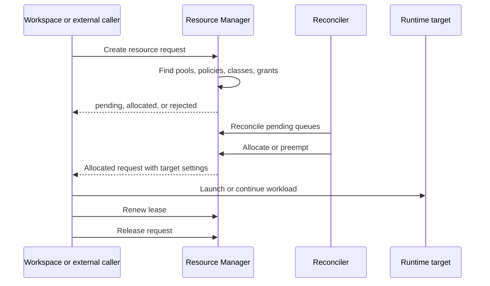

# Reconciliation process

This page explains what happens after a dynamic step or external caller creates
a Resource Manager request. For definitions, see
[Core concepts](resource-pools-core-concepts.md). For author-facing settings,
see the [User guide](resource-pools-user-guide.md).

Most of this page describes `authoritative` pools, where Resource Manager owns
allocation decisions. `advisory` and `governance` modes are covered separately
below.

## Lifecycle

1. **Request creation** - ZenML or an external caller sends subjects, demands,
   reclaim tolerance, optional pool selectors, optional preemption group, and
   lease settings.
2. **Admission discovery** - Resource Manager finds pools whose target bindings
   match the request and policies whose subject selectors match the request.
3. **Planning** - For each matching policy, Resource Manager builds candidate
   allocation plans against eligible classes and grants. Grantless policies
   consider every matching class in the pool.
4. **Queueing** - If a plan is eligible but capacity is not currently free, the
   request stays `pending` in the pool queue.
5. **Allocation** - When a plan fits capacity, limits, reservations, and
   concurrency caps, Resource Manager marks the request `allocated` and records
   allocation lines.
6. **Heartbeat and renewal** - The owner renews the lease while work is active.
7. **Release or expiry** - Completed work releases capacity. Expired leases
   return capacity automatically.



## Admission rules

A request is statically eligible only when all of these are true:

* The pool scope is visible to the request.
* The request matches a pool target binding, or the pool has no target
  bindings.
* A policy subject selector matches at least one request subject.
* The request can run on the candidate class `reclaimable` value.
* Every demand matches exactly one resource in the class bundle.
* For grant-based policies, every demanded class resource is present in the
  grant and the requested quantity fits the grant limit.
* For grantless policies, every demanded resource is present in the class and
  the requested quantity fits the class resource quantity.
* The request's exact `class`, `resource`, kind, and selectors can all be
  resolved.

Resource Manager does not split one request across pools. A plan must satisfy
all demands in one pool, one class, one policy, and either one grant or a
grantless policy path.

## Ordering

Candidate plans are ordered deterministically:

1. Lower accounting pressure first for advisory ordering.
2. Priority lane before normal priority.
3. Higher policy priority.
4. Higher pool rank.
5. Higher class rank.
6. Stable subject, target, policy, class, capacity, and grant identifiers.

Within a pool queue, older requests win after the priority and rank ordering
keys are equal.

## Accounting modes

| Mode | Reconciliation behavior |
| --- | --- |
| `authoritative` | Enforces class quantities, grant limits, reservations, pool/class/policy/grant concurrency, queueing, allocation, and preemption. |
| `advisory` | Computes pressure and orders plans, but does not reject a plan solely because current accounting pressure is high. Use with care. |
| `governance` | Keeps policy and target-setting decisions in ZenML while external infrastructure schedulers handle allocation and preemption. |

Use `authoritative` for the examples in this documentation unless a scenario
explicitly calls out infrastructure-level scheduling.

## Concurrency limits

Concurrency limits cap active requests rather than resource quantities:

| Limit location | Counts active requests in |
| --- | --- |
| Pool | The pool |
| Class | The selected pool class |
| Policy | The selected policy |
| Grant | The selected grant |

Grantless policies have no grant-level concurrency limit because no grant row
is selected. Pool, class, and policy concurrency still apply.

Use concurrency limits when the scarce thing is "how many workloads can run at
once" rather than a descriptor quantity. For example, a pool can enforce at
most eight active H200 jobs even when CPU and memory are tracked as unlimited.

## Reservations and limits

Grant-based policies use:

* `reserved` as protected share.
* `limit` as active usage ceiling. `null` follows the class resource quantity.
* `missing_action` to decide what to do when a request omits a resource that is
  listed in the grant.

For `reclaim_tolerance: "none"`, a grant-based request in an authoritative pool
must fit inside the grant's reserved share. This prevents non-reclaimable work
from depending on capacity that another policy may need back.

Grantless policies have reservation 0 and limits equal to class resources.
They are useful when the policy subject should access the whole matching pool
instead of a reserved slice.

## Preemption

Preemption happens when an authoritative pool has an eligible pending request
that cannot currently allocate without reclaiming capacity or concurrency.

Victims must be eligible:

* Lower priority than the waiting request, or same-priority borrowed usage that
  can be reclaimed for protected reserved share.
* Not protected by the same preemption group.
* Not configured with `reclaim_tolerance: "none"`.
* Currently active and holding capacity or concurrency needed by the waiter.

Priority-lane policies sit at the maximum internal priority. They can reclaim
lower-priority eligible work, but they do not automatically preempt other
priority-lane work at the same priority.

Preemption is cooperative where possible: Resource Manager marks a request
`preempting`, the owner stops or retries, and capacity is returned. If leases
expire or forceful termination is required, the request eventually becomes
terminal and the ledger is cleared.

## Leases and heartbeats

An allocated request holds a lease. The owner renews it while the workload is
running. ZenML step launchers do this automatically for dynamic steps.

Leases protect the ledger from stale allocations:

* If a queued request times out or is cancelled, queue entries are removed.
* If an allocated request stops renewing, it becomes `expired`.
* Released, cancelled, rejected, preempted, and expired requests no longer hold
  active capacity.

For external workloads, renew the lease before `lease_expires_at` and release
the request promptly when the work is done.

## Target settings merge

When a plan wins, Resource Manager returns the target settings selected along
the route. ZenML merges settings from broader to narrower scope:

1. Pool target route and pool target settings.
2. Pool class target settings.
3. Policy target settings.
4. Grant target settings, when a grant was selected.

The UI currently exposes component settings at all four levels and service
connector settings at pool and class levels. These settings are applied to the
selected stack component or service connector after allocation.

## Troubleshooting

| Symptom | Likely cause |
| --- | --- |
| Request rejected with no admitting policy | No pool target matched, no policy subject matched, wrong class, missing descriptor, or grant missing a demanded resource |
| Non-reclaimable request rejected for reserved share | Grant-based policy did not reserve enough of one demanded resource |
| Request stays pending | Capacity, grant limit, reservation pressure, or concurrency limit is currently blocking allocation |
| Lower-priority work was preempted | Higher-priority eligible work needed the capacity or concurrency and the lower-priority request allowed reclaim |
| Target settings did not apply | The winning pool, class, policy, or grant did not include settings for the selected target type |

Inspect stuck requests in the UI or with:

```shell
zenml resource-request list --status pending
zenml resource-request describe <request-id>
```

## See also

* [Core concepts](resource-pools-core-concepts.md) - descriptors, classes,
  policies, subjects, and requests.
* [User guide](resource-pools-user-guide.md) - author settings and request
  inspection.
* [External workloads](resource-pools-external-workloads.md) - direct requests
  and priority-lane policies.
* [Examples](resource-pools-examples.md) - complete scenarios.
* [Resource pools](resource-pools.md) - overview.
