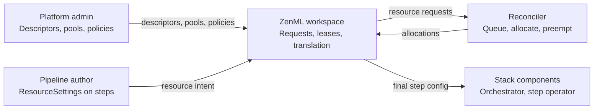

# Resource pools


Resource pools are part of ZenML's paid features. For availability and plans,
see the [pricing page](https://www.zenml.io/pricing).



Resource pools are only available for [dynamic pipelines](https://docs.zenml.io/how-to/steps-pipelines/dynamic_pipelines).


If you run AI or ML work in a shared environment, you have probably seen the
same problems: jobs fighting over GPUs, surprise slowdowns when another team
launches a big run, or expensive hardware sitting idle while someone waits in a
queue. Resource pools are ZenML Pro's answer. They are aimed at platform and
team leaders who need clear rules, and at practitioners who want their steps to
get the right compute without babysitting the cluster.

The feature is built around three actors:

| Actor | Role |
| --- | --- |
| Platform admin | Defines the organization's resource language, pools, capacity classes, policies, and stack-component settings |
| Pipeline author | Annotates steps with `ResourceSettings` — CPU, memory, GPUs — without knowing cluster details |
| ZenML + reconciler | Converts step settings into resource requests, queues and allocates capacity, renews leases, and applies runtime settings to stack components |

## Problems this feature addresses

These scenarios come from real platform requirements.

### Production jobs must finish — no surprises

A team runs long training, fine-tuning, or inference that cannot vanish because
someone else submitted a heavier workload. They need a clear agreement: this
stack or team gets a dependable slice of capacity, and critical steps are not
stopped to make room for ad hoc work. Production workloads stay on reserved
capacity; experiments may borrow burst capacity only when they accept
interruption.

### We share one pool of GPUs across many teams

One place describes how much capacity exists, who may use it, and what happens
when everyone wants it at once — without maintaining a separate spreadsheet or
manual booking process for every pipeline. Teams compete through priority and
queue order instead of opaque cluster politics.

### We paid for the hardware — we should use it when it is free

When one group is quiet, other teams use spare capacity so machines do not sit
empty. The original team gets their capacity back when they return, without a
long negotiation or a cluster reconfiguration every time. Preemptible steps can
use adhoc or spot classes; non-preemptible steps stay within reserved grants.

### Engineers describe needs; ops maps them to reality

Pipeline authors say what each step requires — GPUs, CPU, memory, optional
GPU class. Platform ops defines descriptors, pools, capacity classes,
and policies that tie stacks to shared capacity. The same pipeline code can run
in different environments or stages without hard-coding cluster names, node
pools, or taint tolerations.

### I need an H200 — find the right GPU for me

An engineer declares `gpu_count` and optionally `gpu_class` (for example
`reserved` or a hardware tier). They should not have to know which Kubernetes
cluster, node pool, or step operator currently has free H200s. Admins model
GPUs as descriptors with `kind: "gpu"` and pool classes; ZenML resolves the
request to a pool, class, and stack component with the right placement settings.

### We need to ration more than just GPUs

Alongside standard compute, an organization may need to track licenses, special
hardware slots, or how many pipeline steps may run at once. Resource descriptors
and pool capacity cover any countable resource the platform agrees to name.
Parallel step runs are modeled through the `step run` descriptor so admins can
cap concurrency alongside GPU demand.

### Too many steps at once should queue, not stampede

One engineer launches ten sweep variants at 6pm; the pool has four GPUs. The
first four allocate; the rest queue automatically and roll in as slots free.
The user walks away and expects all ten to finish overnight — without manually
staggering submissions or watching the cluster.

### Higher-priority teams should win fairly

Two teams share one pool. Production training runs at high priority on reserved
capacity. A sandbox team runs eval jobs at lower priority on adhoc capacity.
When production needs its reserved slice, lower-priority work yields only when
policy and reclaim tolerance allow — not through ad hoc cluster intervention.

### Inference scales up and must reclaim GPUs from low-priority work

A team runs inference on shared GPU nodes. When traffic ramps up at peak hours,
external workloads (managed outside ZenML pipelines) must take priority over
opportunistic ZenML jobs that borrowed idle capacity overnight. Capacity returns
through preemption and lease release; eval steps re-queue when adhoc frees again.

### Map shared capacity to real infrastructure

Platform ops needs pools and classes to correspond to actual nodes or node
pools — reserved H200 nodes in one region, spot burst in another. Component
settings on capacity classes apply node selectors and tolerations when ZenML
launches the step. The orchestrator or step operator adds CPU, memory, and GPU
resource requests from the author's `ResourceSettings` on top of those placement
settings. Authors still request by kind; admins own the mapping to Kubernetes.

### Tell me why my run is queued

A step has been pending for twenty minutes. The engineer wants to know whether
it is making progress or stuck — waiting for reserved capacity, blocked behind
higher-priority work, or rejected by policy rules. Run and request views should
show status and a plain-language reason so nobody has to ask in chat for queue
weather updates.

### Critical versus best-effort should be an explicit choice

Authors choose reclaim tolerance (or legacy `preemptible`) per step.
Non-reclaimable steps opt into a smaller dependable slice: they only consume
reserved capacity and are not evicted for pool reasons. Best-effort steps may
access burst capacity but can be interrupted when higher-priority work needs
GPUs — with automatic re-queue when retries are configured.

None of this replaces your orchestrator or cloud provider. ZenML coordinates
demand on top of your existing infrastructure so teams see fair queuing,
optional sharing of idle capacity, and explicit rules for critical versus
best-effort work.

## How it works: language, intent, realization

ZenML separates three concerns:

1. Language — Admins define the organization's resource vocabulary and capacity
   rules:
   - Resource descriptors — what can be requested (`h200`, `GPU`, `CPU`, custom
     licenses).
   - Resource pools — how much of each descriptor exists, split into capacity
     classes such as `reserved`, `adhoc`, or `spot`.
   - Policies — which stack components or accounts may draw from each pool,
     with grants (reserved, limit, priority) that govern who gets which slice.
2. Intent — Authors express workload needs through `ResourceSettings` on
   pipeline steps, or external clients create direct resource requests.
3. Realization — When a step is ready to run, ZenML resolves the request to
   a pool, class, and stack component, merges placement-related component
   settings from the winning allocation (for example Kubernetes node selectors
   and tolerations), and the orchestrator or step operator applies resource
   requests from the author's `ResourceSettings`.



Stock descriptors (`CPU`, `memory`, `GPU`, `step run`) ship with every
organization so you can bootstrap quickly. Admins extend the catalog, declare
pool capacity, and attach policies in the ZenML Pro UI (see
[Admin guide](resource-pools-admin-guide.md)).

## A minimal walkthrough

1. Admin defines a pool (CLI quick start).
Platform ops create a workspace pool and record how much of each resource exists
there. The CLI accepts a flat capacity map; under the hood each key becomes a
`default` capacity class.

```shell
zenml resource-pool create datacenter-gpus \
  --capacity '{"GPU": 8}' \
  --description "Shared training GPUs"
```

For multiple capacity classes, per-class ranks, reclaim risk, and component
settings, use the ZenML Pro UI (see [Admin guide](resource-pools-admin-guide.md)).


Real pipeline steps also request CPU, memory, and (for isolated dynamic steps)
a `step run` slot. The CLI example above only models `GPU`. For production
stacks, add `CPU`, `memory`, and `step run` to the pool and policy grants in
the UI (or SDK). There is no unbounded fallback — missing resources reject the
request even when GPUs are free. See [Admin guide](resource-pools-admin-guide.md).


2. Admin attaches a policy.

They bind a stack component (orchestrator or step operator) to the pool with
reserved amounts, limits, and priority.

```shell
zenml resource-pool attach-policy datacenter-gpus prod-k8s-orch \
  --priority 100 \
  --reserved '{"GPU": 4}' \
  --limit '{"GPU": 8}'
```

3. Author annotates a step.  
The data scientist declares GPUs, CPU, and memory on the step. ZenML converts
typed fields into resource demands by kind.

```python
from zenml import step, pipeline
from zenml.config import ResourceSettings

@step(
    settings={
        "resources": ResourceSettings(
            gpu_count=2,
            cpu_count=4,
            memory="16GiB",
        )
    }
)
def train() -> None:
    ...

@pipeline(dynamic=True)
def my_pipeline() -> None:
    train()
```

When they launch a dynamic run on a stack whose orchestrator has a policy on
`datacenter-gpus`, ZenML creates a resource request. If capacity is free, the
step proceeds; if not, it waits in the queue; if the ask breaks policy rules,
it fails fast with a clear status.

## Where to go next

| Page | For whom | What you learn |
| --- | --- | --- |
| [Core concepts](resource-pools-core-concepts.md) | Everyone | Descriptors, pools, classes, policies, requests, leases |
| [Admin guide](resource-pools-admin-guide.md) | Platform admins | Build vocabulary, pools, policies, component settings |
| [User guide](resource-pools-user-guide.md) | Pipeline authors | `ResourceSettings`, reclaim tolerance, inspecting requests |
| [External workloads](resource-pools-external-workloads.md) | Platform admins, integrators | Service accounts, direct requests, priority lanes |
| [Reconciliation process](resource-pools-reconciliation.md) | Admins, operators | Queueing, preemption, leases, heartbeats |
| [Examples](resource-pools-examples.md) | Everyone | End-to-end scenarios in increasing complexity |

## See also

* [Workspaces](./workspaces.md) — pools are managed at workspace scope today.
* [Teams](./teams.md) — organizational context for who owns stacks and policies.
* [Service accounts](./service-accounts.md) — identity for external workload
  integrations.
* ZenML OSS: [step and pipeline configuration](https://docs.zenml.io/how-to/steps-pipelines/configuration).
