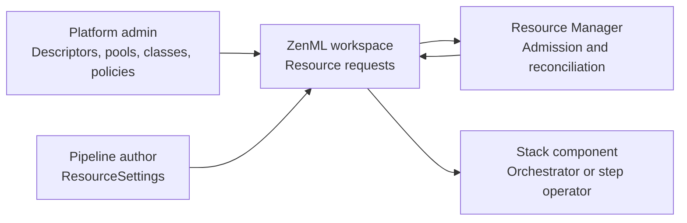

# Resource pools


Resource pools are part of ZenML's paid features. For availability and plans,
see the [pricing page](https://www.zenml.io/pricing).



Resource pools are only available for [dynamic pipelines](https://docs.zenml.io/how-to/steps-pipelines/dynamic_pipelines).


Resource pools let platform teams describe shared infrastructure once and let
ZenML decide when a dynamic pipeline step may run. A pool is a virtual ledger
over real infrastructure: Kubernetes node pools, GPU machines, cloud machine
types, service connector resources, or any other bounded platform resource.

The current user-facing configuration flow is in the ZenML Pro UI:

* Organization-level pools: **Organization Settings > Resource Pools**.
* Workspace-level pools: **Workspace Settings > Resource Pools**.

Both pages use the same concepts. Admins define descriptors, create pools,
group resources into pool classes, attach policies, and inspect requests from
the UI. The JSON examples in this section use the Resource Manager REST API
shape for teams that automate the same configuration.

## Who uses resource pools

| Actor | Role |
| --- | --- |
| Platform admin | Defines resource descriptors, pools, classes, target bindings, target settings, and policies |
| Pipeline author | Annotates dynamic steps with `ResourceSettings` such as CPU, memory, GPU count, custom resources, and reclaim tolerance |
| ZenML and the reconciler | Convert step settings into resource requests, match policies, queue work, allocate capacity, renew leases, and merge target settings into selected stack components |

## What resource pools solve

### Production jobs need dependable capacity

Critical training, fine-tuning, and inference steps should not disappear
because another team launched a sweep. Policies reserve slices of shared
capacity, assign priority, and decide which work can be interrupted when
contention appears.

### Shared hardware should not sit idle

Reserved capacity can be protected for production while lower-priority work
uses idle capacity up to a configured limit. When higher-priority work returns,
the reconciler can reclaim capacity from work that opted into interruption.

### Infrastructure is bundled in real life

Modern infrastructure rarely gives you a GPU without CPU, memory, storage, and
placement constraints. Resource pool classes now model those real bundles. A
class can contain H200 GPUs, CPU, memory, and other descriptors together, with
one class rank, one reclaimability setting, and optional target settings.

### Authors should request intent, not cluster details

Pipeline authors request resources by kind:

```python
from zenml import pipeline, step
from zenml.config import ResourceSettings


@step(
    settings={
        "resources": ResourceSettings(
            gpu_count=2,
            gpu_class="h200-reserved",
            cpu_count=8,
            memory="64GiB",
            reclaim_tolerance="none",
        )
    }
)
def train() -> None:
    ...


@pipeline(dynamic=True)
def training_pipeline() -> None:
    train()
```

Admins decide which pool, class, stack component, node selector, toleration,
and service connector satisfy that intent.

## How it works

ZenML separates resource governance into three layers:

1. **Language**: resource descriptors define names, kinds, units, and
   attributes. Stock descriptors are `CPU`, `memory`, and `GPU`; admins can add
   custom descriptors such as `h200` or `training-license`.
2. **Supply**: resource pools and classes describe the resource bundles that
   exist. A Kubernetes H200 node-pool class might include `h200`, `CPU`, and
   `memory` together.
3. **Access**: policies and grants decide which subjects may use a pool, at
   which priority, with which reservations, limits, defaults, concurrency caps,
   and target settings.



## Minimal UI walkthrough

1. Open **Organization Settings > Resource Pools** or
   **Workspace Settings > Resource Pools**.
2. Add or review resource descriptors. Use the stock `CPU`, `memory`, and
   `GPU` descriptors for common requests; add custom descriptors for specific
   hardware or licenses.
3. Create a resource pool. Choose the accounting mode, rank, optional pool
   concurrency limit, and the target subjects that the pool governs.
4. Add classes to the pool. Each class is a resource bundle, for example
   `h200-reserved` with H200 GPUs, CPU, and memory. A class resource can be
   finite or unlimited. Unlimited class resources are tracked for traceability
   but are not limited at the pool-class level.
5. Configure pool or class target settings. The UI exposes component settings
   and service connector settings where they are currently supported.
6. Open the pool detail page and attach policies. Policies select who may use
   the pool. Grants optionally reserve and limit resources inside individual
   classes. A policy with `grants: []` admits the subject to all matching
   classes in the pool with reservation 0 and limits equal to the class
   resources.
7. Run dynamic pipelines. ZenML creates resource requests when steps are ready,
   queues them if needed, and applies selected settings when capacity is
   allocated.

## Minimal API shape

The exact Resource Manager REST API uses nested subject selectors and class
resource bundles. This shortened example shows the important shape:

```json
{
  "name": "prod-h200-pool",
  "description": "Production H200 Kubernetes capacity",
  "rank": 100,
  "accounting_mode": "authoritative",
  "concurrency_limit": 24,
  "target_bindings": [
    {
      "target_selector": {
        "any": [
          {
            "subject_type": "organization",
            "subject_id": "<org-id>",
            "contains": {
              "subject_type": "workspace",
              "subject_id": "<workspace-id>",
              "contains": {
                "subject_type": "component",
                "subject_id": "<step-operator-id>",
                "attributes": {
                  "component_type": "step_operator"
                }
              }
            }
          },
          {
            "subject_type": "organization",
            "subject_id": "<org-id>",
            "contains": {
              "subject_type": "workspace",
              "subject_id": "<workspace-id>",
              "contains": {
                "subject_type": "service_connector",
                "subject_id": "<connector-id>",
                "attributes": {
                  "connector_type": "gcp"
                }
              }
            }
          }
        ]
      }
    }
  ],
  "classes": [
    {
      "class": "h200-reserved",
      "rank": 100,
      "reclaimable": "never",
      "concurrency_limit": 8,
      "resources": [
        {"resource": "h200", "quantity": 8, "unit": "GPU"},
        {"resource": "CPU", "quantity": 128, "unit": "CPU"},
        {"resource": "memory", "quantity": 1024, "unit": "GiB"}
      ]
    }
  ],
  "target_settings": [
    {
      "target_type": "service_connector",
      "settings": {
        "connector_id": "<connector-id>",
        "resource_type": "kubernetes-cluster",
        "resource_id": "prod-eu"
      }
    }
  ],
  "attributes": {
    "region": "eu-west-1",
    "platform": "kubernetes"
  }
}
```

Continue with the [Core concepts](resource-pools-core-concepts.md) for the
schema and selector conventions, then use the
[Admin guide](resource-pools-admin-guide.md) for the UI workflow.

## Where to go next

| Page | For whom | What you learn |
| --- | --- | --- |
| [Core concepts](resource-pools-core-concepts.md) | Everyone | Descriptors, pool classes as bundles, policies, subjects, requests, leases |
| [Admin guide](resource-pools-admin-guide.md) | Platform admins | Configure descriptors, pools, classes, target settings, policies, and grants in the UI |
| [User guide](resource-pools-user-guide.md) | Pipeline authors | `ResourceSettings`, reclaim tolerance, and request inspection |
| [External workloads](resource-pools-external-workloads.md) | Platform admins, integrators | Service accounts, direct requests, and priority lanes |
| [Reconciliation process](resource-pools-reconciliation.md) | Admins, operators | Queueing, accounting modes, preemption, leases, and heartbeats |
| [Examples](resource-pools-examples.md) | Everyone | Believable end-to-end resource pool setups |

## See also

* [Workspaces](./workspaces.md) - workspace-scoped pools and settings.
* [Teams](./teams.md) - organizational subjects for policy access.
* [Service accounts](./service-accounts.md) - identity for external workload
  integrations.
* ZenML OSS: [step and pipeline configuration](https://docs.zenml.io/how-to/steps-pipelines/configuration).
