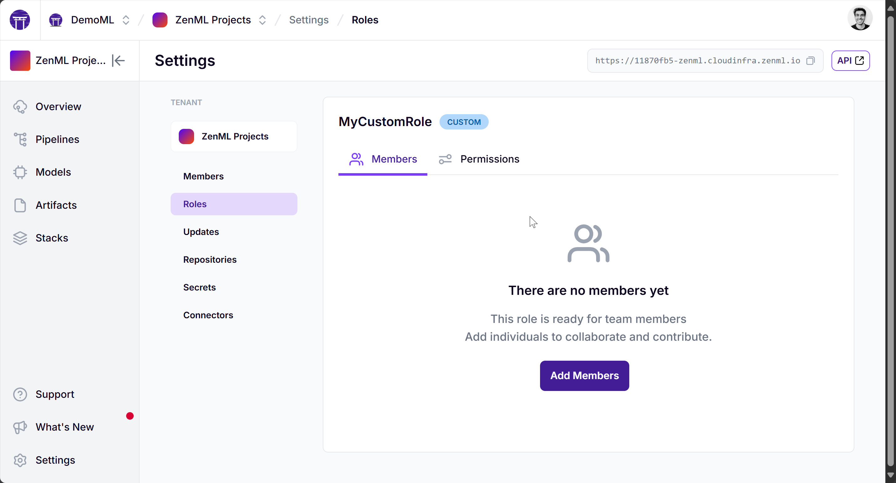
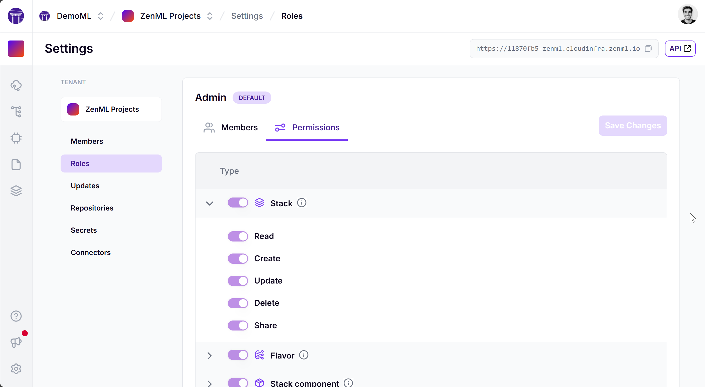
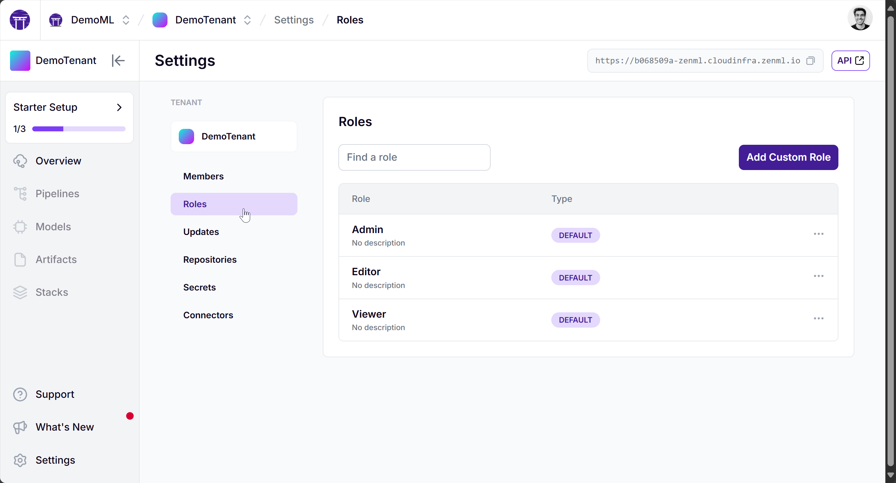
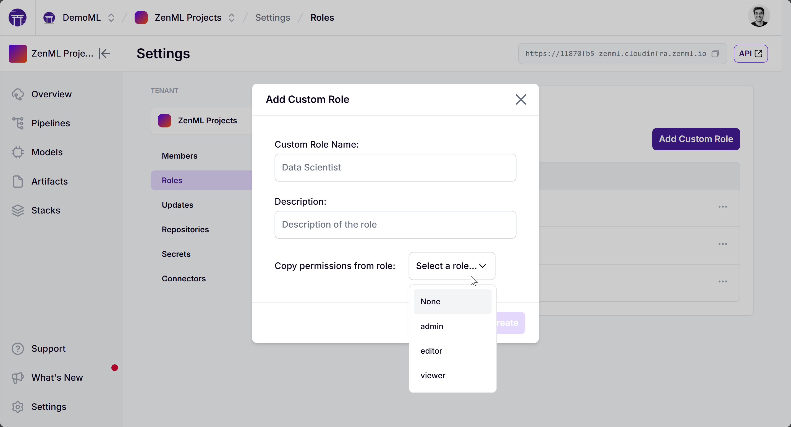
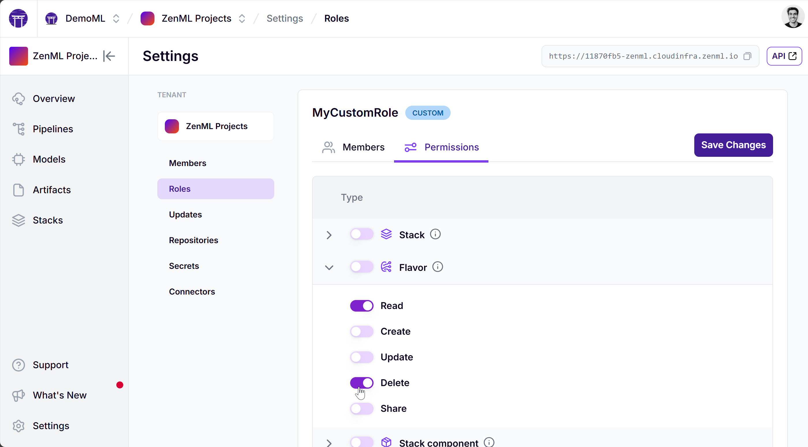
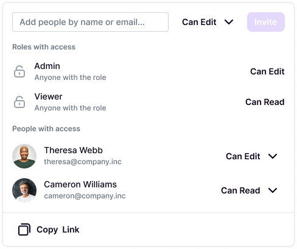

# ZenML Pro: Roles and Permissions

ZenML Pro offers a robust role-based access control (RBAC) system to manage permissions across your organization and tenants. This guide will help you understand the different roles available, how to assign them, and how to create custom roles tailored to your team's needs.

Please note that roles can be assigned to both individual users and [teams](./teams.md).

## Organization-Level Roles

At the organization level, ZenML Pro provides three predefined roles:

1. **Org Admin**
   - Full control over the organization
   - Can add members, create and update tenants
   - Can manage billing information
   - Can assign roles to other members

2. **Org Editor**
   - Can manage tenants and teams
   - Cannot access subscription information
   - Cannot delete the organization

3. **Org Viewer**
   - Can view tenants within the organization
   - Read-only permissions

To assign organization roles:

1. Navigate to the Organization settings page
2. Click on the "Members" tab
3. Use the "Invite Member" button to add new members or update existing ones

Some points to note:
- In addition to adding organization roles, you might also want to add tenant roles for people who you want to have access to a specific tenant.
- An organization admin can add themselves to a tenant with any tenant role they desire.
- However, an organization editor and viewer cannot add themselves to existing tenants that they are not a part of. They won't be able to view such tenants in the organization either.
- Currently, you cannot create custom organization roles via the ZenML Pro dashboard. However, this is possible via the [ZenML Pro API](https://cloudapi.zenml.io/).

## Tenant-Level Roles

Tenant roles determine a user's permissions within a specific ZenML tenant. There are predefined roles available, and you can also create custom roles for more granular control.

### Predefined Tenant Roles

1. **Admin**
   - Full control over the tenant
   - Can create, read, update, and delete all resources

2. **Editor**
   - Can create, read, and share resources
   - Cannot modify or delete existing resources

3. **Viewer**
   - Read-only access to all resources and information

## Custom Roles

Custom roles allow you to define specific permissions for users or groups. To create a custom role
for a tenant:

1. Go to the tenant settings page

2. Click on "Roles" in the left sidebar and Select "Add Custom Role"

3. Provide a name and description for the role. Choose a base role to inherit permissions from

4. Edit permissions as needed

  
A custom role allows you to set permissions for various resources, including:

- Artifacts
- Models
- Model Versions
- Pipelines
- Runs
- Stacks
- Components
- Secrets
- Service Connectors

For each resource, you can define the following permissions:

- Create
- Read
- Update
- Delete
- Share

You can then assign this role to a user or a team on the "Members" page.

To manage permissions for a role:

1. Go to the Roles page in tenant settings
2. Select the role you want to modify
3. Click on "Edit Permissions"
4. Adjust permissions for each resource type as needed

## Sharing individual resources

While roles define permission on broad resource groups, users can also share individual resources
through the dashboard like this:

## Best Practices

1. **Least Privilege**: Assign the minimum necessary permissions to each role.
2. **Regular Audits**: Periodically review and update role assignments and permissions.
3. **Use Custom Roles**: Create custom roles for teams or projects with specific needs.
4. **Document Roles**: Maintain documentation of your custom roles and their intended use.

By leveraging ZenML Pro's role-based access control, you can ensure that your team members have the right level of access to resources, maintaining security while enabling collaboration across your MLOps projects.