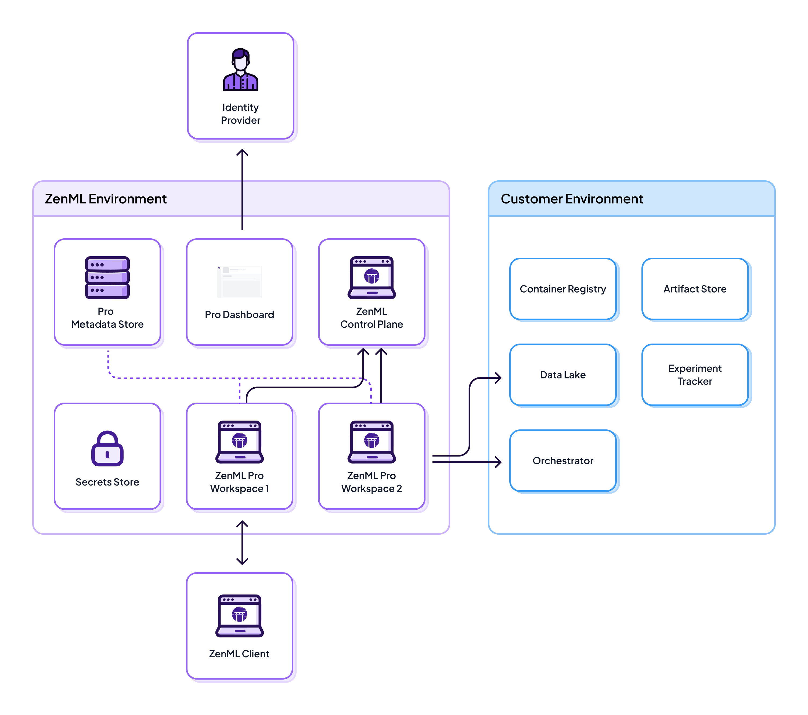

# SaaS Deployment

ZenML Pro SaaS is the fastest and easiest way to get started with enterprise-grade MLOps. With zero infrastructure setup required, you can be running production pipelines within minutes while maintaining full control over your data and compute resources.


To get access to ZenML Pro, [book a call](https://www.zenml.io/book-your-demo).


## Overview

In a SaaS deployment, ZenML manages all server infrastructure while your sensitive data and compute resources remain in your own cloud environment. This architecture provides the fastest time-to-value while maintaining data sovereignty for your ML workloads.

## Architecture

### What Runs Where

| Component | Location | Purpose |
|-----------|----------|---------|
| **ZenML Pro Server** | ZenML Infrastructure | Manages pipeline orchestration and metadata |
| **Pro Control Plane** | ZenML Infrastructure | Handles authentication, RBAC, and workspace management |
| **Metadata Store** | ZenML Infrastructure | Stores pipeline runs, model metadata, and tracking information |
| **Secrets Store** | ZenML Infrastructure (default) | Stores credentials for accessing your infrastructure |
| **Compute Resources** | Your infrastructure through [stacks](https://docs.zenml.io/stacks) | Executes pipeline steps and training jobs |
| **Data & Artifacts** | Your infrastructure through [stacks](https://docs.zenml.io/stacks) | Stores datasets, models, and pipeline artifacts |

## Key Benefits

### Fastest Setup

* Minutes to production - No infrastructure provisioning required for ZenML services
* Low maintenance - Updates and patches handled automatically
* Instant scaling - Infrastructure scales with your needs

### Security & Compliance

* SOC 2 Type II certified
* ISO 27001 certified 
* You keep data sovereignty - Your ML data stays in your infrastructure
* Encrypted communications - All data in transit is encrypted
* Optionally use your own secret management solution to store secrets

### Production Ready from Day 1

* High availability - Built-in redundancy and failover
* Automatic backups - Metadata backed up continuously
* Monitoring included - Health checks and alerting configured
* Professional support - Direct access to ZenML engineers

### Collaboration Features

* Multi-user support - Full team collaboration capabilities
* SSO integration - Connect with your identity provider
* Role-based access control - Granular permissions management
* Workspaces & projects - Organize teams and resources

## Ideal Use Cases

ZenML Pro SaaS is perfect for:

* **Startups and scale-ups** that need production MLOps quickly without infrastructure overhead
* **Teams without dedicated DevOps** that want managed infrastructure and support
* **Organizations with existing cloud infrastructure** comfortable with SaaS tools
* **Teams prioritizing velocity** over complete infrastructure control
* **POC and pilot projects** that need to demonstrate value quickly

## Secret Management Options

### Default: ZenML-Managed Secrets Store

By default, ZenML Pro SaaS stores your cloud credentials securely in our managed secrets store. This provides:

* Zero configuration required
* Automatic encryption at rest and in transit
* Access controls via RBAC

### Alternative: Customer-Managed Secrets Store

For organizations with strict security requirements, you can configure ZenML to use your own [secrets management](..deploying-zenml/secret-management) solution:

* AWS Secrets Manager
* Google Cloud Secret Manager
* Azure Key Vault
* HashiCorp Vault

This keeps all credentials within your infrastructure while still benefiting from managed ZenML services - [Book a call](https://www.zenml.io/book-your-demo) with us if you want this set up.

## Network Architecture

### No ingress required

ZenML Pro SaaS requires no inbound connectivity into your infrastructure—all communication is initiated from your environment to ZenML, keeping your systems protected behind your firewall.

### (optional) Artifact Store Access

To enable the following features, you must whitelist ZenML to access your artifact store:

* Pipeline visualizations
* Model comparison views
* Artifact lineage graphs
* Step logs and outputs

You control this access by configuring appropriate cloud IAM permissions.

## Getting Started

### 1. Sign Up

[Book a demo](https://www.zenml.io/book-your-demo) to get started with ZenML Pro SaaS.

### 2. Connect Your Cloud

Configure access to your cloud infrastructure:

* Set up an artifact store (S3, GCS, Azure Blob, etc.)
* Configure compute resources (AWS, GCP, Azure, or Kubernetes)
* Provide necessary credentials via secrets

### 3. You're ready to run your pipelines and monitor them through the Frontend

## Pricing & Support

ZenML Pro SaaS includes:

* Managed infrastructure and updates
* Professional support with SLA
* Regular security patches and updates
* Access to pro-exclusive features
* Usage-based pricing model

[Contact us](https://www.zenml.io/book-your-demo) for pricing details and custom plans.

## Comparison with Other Deployments

| Feature                | SaaS               | Hybrid SaaS           | Self-hosted          |
| ---------------------- | ------------------ | --------------------- | -------------------- |
| Setup Time             | ⚡ Minutes          | Hours                 | Days                 |
| Maintenance            | Zero               | Workspace only        | Full stack           |
| Infrastructure Control | Minimal            | Moderate              | Complete             |
| Data Sovereignty       | Metadata on ZenML  | Full                  | Full                 |
| Best For               | Fast time-to-value | Security requirements | Strictest compliance |

[Compare all deployment options →](scenarios.md)

## Migration Path

Already running ZenML OSS? Migrating to SaaS is possible with the assistance of the ZenML support team. Reach out to us at hello@zenml.io or on (slack)\[https://zenml.io/slack] to learn more.

## Related Resources

- [System Architecture](system-architecture.md)
- [Scenarios](scenarios.md)
- [Hybrid SaaS Deployment](hybrid-deployment.md)
- [Self-hosted Deployment](self-hosted-deployment.md)
- [Configuration Details](configuration-details.md)
- [Upgrades and Updates](upgrades-updates.md)

## Get Started

Ready to get started with ZenML Pro SaaS?

[Book a Demo](https://www.zenml.io/book-your-demo)

Have questions? [Contact us](mailto:cloud@zenml.io) or check out our [documentation](https://docs.zenml.io).
