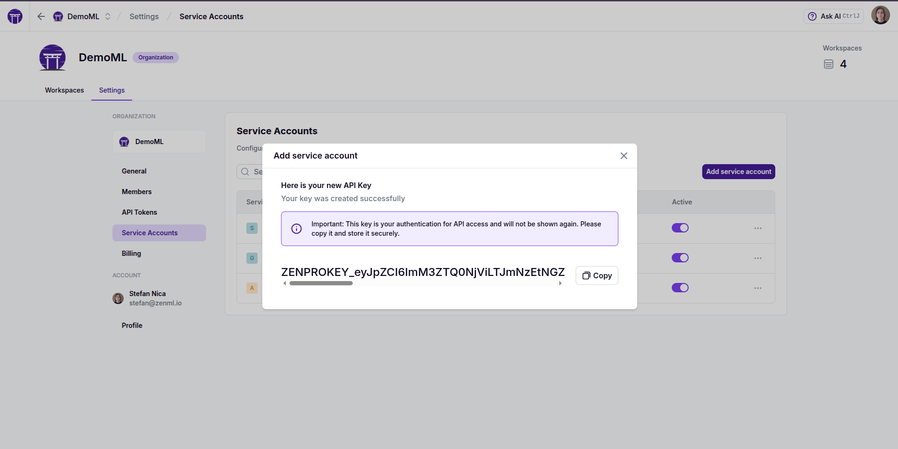

# ZenML Pro Organization Service Accounts

Service accounts in ZenML Pro provide a secure way to authenticate automated systems, CI/CD pipelines, and other non-interactive applications with your ZenML Pro organization. Unlike user accounts, service accounts are designed specifically for programmatic access and can be managed centrally through the Organization Settings interface.


**Organization-Level Management**

Service accounts in ZenML Pro are managed at the organization level, not at the workspace level. This provides centralized control and consistent access patterns across all workspaces within your organization.


## Accessing Service Account Management

To manage service accounts in your ZenML Pro organization:

1. Navigate to your ZenML Pro dashboard
2. Click on **"Settings"** in the organization navigation menu
3. Select **"Service Accounts"** from the settings sidebar
4. All service accounts associated with the organization will be displayed, showing:
   - Service account name
   - Active/inactive status
   - Last login date
   - Number of API keys associated with the service account

This is the main interface where you can perform all service account and API key operations.


## Service Account Operations

### Creating a New Service Account

Creating a service account allows you to establish a new identity for programmatic access to your ZenML Pro organization.

**To create a service account:**

1. In the Service Accounts interface, click **"Create Service Account"**
2. Provide the following information:
   - **Name**: A descriptive name for the service account (e.g., "CI/CD Automation", "Data Ingestion Service")
   - **Username**: A unique username for the service account (e.g., "ci-cd-automation", "data-ingestion-service")
   - **Description** (optional): Additional context about the service account's purpose
   - **Role**: The initial organization role of the service account (e.g., "Organization Admin", "Organization Member")
3. **Optional**: Create a default API key immediately by checking **"Create a default API key"**
4. Click **"Create"** to establish the service account



**API Key Security**

If you choose to create a default API key during service account creation, the API key value will only be displayed once. Make sure to copy and securely store it immediately, as it cannot be retrieved later.





### Managing Service Account Roles and Permissions

Service accounts are no different from regular users in that they can be assigned different [Organization, Workspace and Project roles](./roles.md) to control their access to different parts of the organization and they can be organized into [teams](./teams.md). They are marked as "BOT" in the UI, to clearly identify them as non-human users.


### Activating and Deactivating Service Accounts

Service account activation controls whether the account can be used for authentication. Deactivating a service account immediately prevents all associated API keys from working.

**To deactivate a service account:**

1. Locate the service account in the list
2. Click the **"Active"** toggle switch to turn it off
3. Confirm the action when prompted


**To reactivate a service account:**

1. Locate the deactivated service account (shown with an inactive indicator)
2. Click the **"Active"** toggle switch to turn it on
3. The service account and its active API keys will immediately resume working


**Immediate Effect**

Deactivating a service account has immediate effect on all ZenML Pro API calls using any of its API keys. Ensure you coordinate with your team before deactivating production service accounts.



**Delayed workspace-level effect**

API tokens associated with the deactivated service account issued for workspaces in your organization may still be valid for up to one hour after the service account is deactivated.


### Deleting a Service Account

Deleting a service account permanently removes it and all associated API keys from your organization.

**To delete a service account:**

1. Click the **"⋮"** (more options) menu next to the service account
2. Select **"Delete"**
3. Confirm the deletion when prompted
4. Click **"Delete"** to permanently remove the service account



**Delayed workspace-level effect**

API tokens associated with the deleted service account issued for workspaces in your organization may still be valid for up to one hour after the service account is deleted.


## API Key Management

API keys are the credentials used by applications to authenticate as a service account. Each service account can have multiple API keys, allowing for key rotation and different access patterns. When you create a new service account, you have the option to automatically create a default API key for it.

### Viewing API Keys

**To view all API keys for a service account:**

1. Click on the service account name to open its details
2. All API keys associated with the service account will be displayed, showing:
   - Key name and description
   - Last login date
   - Last rotated date
   - Active/inactive status


### Creating an API Key

**To create a new API key for a service account:**

1. Open the service account details
2. Click **"Add API Key"**
3. Provide:
   - **Name**: A descriptive name for the API key (e.g., "production", "staging-deployment")
   - **Description** (optional): Additional context about the key's intended use
4. Click **"Create"**
5. **Important**: Copy the displayed API key value immediately and store it securely


**One-Time Display**

The API key value is only shown once during creation and cannot be retrieved later. If you lose an API key, you must create a new one or rotate the existing key.



### Activating and Deactivating API Keys

Individual API keys can be activated or deactivated independently of the service account status.

**To deactivate an API key:**

1. In the API Keys list, locate the key you want to deactivate
2. Click the **"Active"** toggle switch to turn it off
3. The API key will immediately stop working for authentication


**To reactivate an API key:**

1. Locate the deactivated API key
2. Click the **"Inactive"** toggle switch to turn it on
3. The API key will immediately resume working (provided the service account is also active)


**Delayed workspace-level effect**

API tokens associated with the deactivated API key issued for workspaces in your organization may still be valid for up to one hour after the API key is deactivated.


### Rotating API Keys

API key rotation creates a new key value while optionally preserving the old key for a transition period. This is essential for maintaining security without service interruption.

**To rotate an API key:**

1. Click the **"⋮"** (more options) menu next to the API key
2. Select **"Rotate"**
3. Configure rotation options:
   - Toggle **"Include Retention Period"** to keep the old key active for a period of time
   - Set the retention period to how long to keep the old key active (minutes)
4. Click **"Rotate Key"**
5. Copy the new API key value and store it securely
6. Update your applications to use the new key before the retention period expires



**Zero-Downtime Rotation**

By setting a retention period, you can update your applications to use the new API key while the old key remains functional. This enables zero-downtime key rotation for production systems.


### Deleting API Keys

**To permanently delete an API key:**

1. Click the **"⋮"** (more options) menu next to the API key
2. Select **"Delete"**
3. Confirm the deletion when prompted
4. The API key will be immediately revoked and cannot be recovered



**Delayed workspace-level effect**

API tokens associated with the deleted API key issued for workspaces in your organization may still be valid for up to one hour after the API key is deleted.


## Security Best Practices

### Key Management
- **Regular Rotation**: Rotate API keys regularly (recommended: every 90 days for production keys)
- **Principle of Least Privilege**: Create separate service accounts for different purposes rather than sharing keys
- **Secure Storage**: Store API keys in secure credential management systems, never in code repositories
- **Monitor Usage**: Regularly review the "last used" timestamps to identify unused keys

### Access Control
- **Descriptive Naming**: Use clear, descriptive names for service accounts and API keys to track their purposes
- **Documentation**: Maintain documentation of which systems use which service accounts
- **Regular Audits**: Periodically review and clean up unused service accounts and API keys

### Operational Security
- **Immediate Deactivation**: Deactivate service accounts and API keys immediately when they're no longer needed
- **Incident Response**: Have procedures in place to quickly rotate or deactivate compromised keys
- **Team Coordination**: Coordinate with your team before making changes to production service accounts

## Using Service Account API Keys

Once you have created a service account and API key, you can use them to authenticate to the ZenML Pro API and use it to programmatically manage your organization. You can also use the API key to access all the workspaces in your organization to e.g. run pipelines from the ZenML Python client.

### ZenML Pro API programmatic access

The API key can be used to generate JWT session tokens that are valid for 1 hour. You simply have to pass the API key string as the `password` to the `/auth/login` endpoint. A new session token will be generated every time:

```python
curl -X 'POST' \
  'https://cloudapi.zenml.io/auth/login' \
  -H 'Content-Type: application/x-www-form-urlencoded' \
  -d 'password=ZENPROKEY_eyJpZCI6I...'

{"access_token":"...(access-token-value)...","expires_in":3600,"token_type":"bearer","device_id":null,"device_metadata":null}
```

Then finally, the generated API access token is used as a bearer token when calling ZenML Pro API endpoints:

```python
curl -H "Authorization: Bearer ...(access-token-value)..." https://cloudapi.zenml.io/users/me

{"password":null,"password_expired":null,"name":"Automation Bot","avatar_url":null,"company":null,"job_title":null,"metadata":{},"id":"9ceb3e75-0c18-4cfb-b41b-d5db1d640077","username":"autobot","email":"autobot","oauth_provider":null,"oauth_id":null,"is_active":true,"is_superuser":false,"is_service_account":true,"organization_id":"fc992c14-d960-4db7-812e-8f070c99c6f0"}
```

See the [API documentation](https://docs.zenml.io/api-reference/pro-api/getting-started) for detailed information on programmatic access patterns.

It is also possible to authenticate as the service account using the OpenAPI UI available at https://cloudapi.zenml.io:


The session token is stored as a cookie, which essentially authenticates your entire OpenAPI UI session. Not only that, but you can now open https://cloud.zenml.io and navigate your organization and its resources as the service account.


### Workspace access

You can also use the ZenML Pro API key to access all the workspaces in your organization:

* with environment variables:
```bash
# set this to the ZenML Pro workspace URL
export ZENML_STORE_URL=https://your-org.zenml.io
export ZENML_STORE_API_KEY=<your-api-key>
# optional, for self-hosted ZenML Pro API servers, set this to the ZenML Pro
# API URL, if different from the default https://cloudapi.zenml.io
export ZENML_PRO_API_URL=https://...
```

* with the CLI:
```bash
zenml login <your-workspace-name> --api-key
# You will be prompted to enter your API key
```

## Migration of workspace level service accounts

Service accounts and API keys at the workspace level are deprecated and will be removed in the future. You can migrate them to the organization level by following these steps:

1. Create a new service account in the organization. Make sure to use the exact same username as the old service account, if you want to preserve the assigned resources, but be aware that all workspaces will share this service account.
2. [Assign Organization and Workspace roles](./roles.md) to the new service account. At a minimum, you should assign the Organization Member role and the Workspace Admin role to the service account for it to be equivalent to the old service account. It is, however, recommended to assign only the roles and permissions that are actually needed.
3. (Optional) Delete all API keys for the old service account.


## Troubleshooting

### Common Issues

**API Key Not Working**
- Verify the service account is active
- Verify the specific API key is active
- Check that the API key hasn't expired (if using rotation with retention)
- Ensure the API key is correctly formatted in your environment variables

**Cannot Delete Service Account**
- Verify you have the necessary permissions in the organization

**API Key Creation Failed**
- Ensure you have write permissions in the organization
- Check that the service account is active
- Verify the API key name doesn't conflict with existing keys


**Need Help?**

If you encounter issues with service account management, check the ZenML Pro documentation or contact your organization administrator for assistance with permissions and access control.
