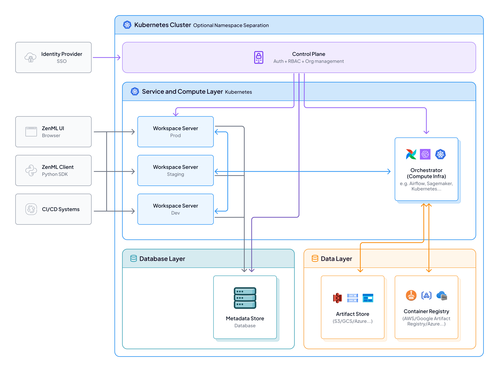

# System Architecture

ZenML Pro's architecture consists of two core services that work together to execute, track, and manage your ML pipelines. Understanding these services helps you make informed decisions about deployment, security, and infrastructure.

## Core Services

A single **Control Plane** manages one or more **Workspace Servers**. This allows you to have separate workspaces for different teams, projects, or environments (dev/staging/prod) while maintaining centralized authentication and organization management.

| Service | Purpose | Deployment Location |
|---------|---------|---------------------|
| [**Control Plane**](#control-plane) | Authentication, RBAC, organization management (1 per organization) | ZenML infrastructure (SaaS/Hybrid) or yours (Self-hosted) |
| [**Workspace Server**](#workspace-server) | Stores metadata, serves APIs, manages entities, runs pipelines from UI (1 or more per Control Plane) | Your infrastructure (Hybrid/Self-hosted) or ZenML (SaaS) |

## Control Plane

The **Control Plane** is the organization-level management layer. It sits above individual workspaces and provides centralized authentication, authorization, and administrative functions.

**Key responsibilities:**

- **Authentication & Identity:** User authentication with SSO integration, identity federation via OIDC and social login providers, API key management for personal access tokens and service accounts
- **Authorization & RBAC:** Role management (Admin, Editor, Viewer), permission enforcement across workspaces, team management with shared permissions
- **Organization Management:** Workspace lifecycle management (SaaS), user invitations and membership handling
- **Workspace Coordination:** Workspace registry, health monitoring for Hybrid/Self-hosted deployments, version management for SaaS upgrades

| Deployment | Control Plane Location |
|------------|------------------------|
| **SaaS** | ZenML infrastructure (fully managed) |
| **Hybrid** | ZenML infrastructure (fully managed) |
| **Self-hosted** | Your infrastructure (you manage) |

## Workspace Server

The **Workspace Server** is the central hub for your ML operations. It provides the API layer that your SDK, dashboard, and orchestrators connect to for all pipeline-related operations.

**Key responsibilities:**

- **Metadata Storage & API:** Pipeline run tracking with status, timing, and lineage; step execution details; artifact registry (pointers to your artifact store); model registry with versions and stages
- **Entity Management:** Stacks and components, pipeline definitions, artifact versions, code repository connections
- **Token & Credential Management:** Short-lived service connector tokens for cloud resources, stack component authentication, API validation
- **Integration Hub:** REST API for Python SDK, dashboard backend, orchestrator callbacks for status updates
- **Pipeline Execution from UI:** The workspace server includes a workload manager that creates ad-hoc runner pods in a Kubernetes cluster to execute pipelines triggered from the dashboard

| Deployment | Workspace Server Location |
|------------|---------------------------|
| **SaaS** | ZenML infrastructure (fully managed) |
| **Hybrid** | Your infrastructure (you manage) |
| **Self-hosted** | Your infrastructure (you manage) |

## Where Data Lives

Understanding data residency is crucial for security and compliance:

| Data Type | Description | Location |
|-----------|-------------|----------|
| **Pipeline Metadata** | Run status, step execution details, artifact pointers | Workspace Server database |
| **Artifacts** | Model weights, datasets, evaluation results | Your artifact store (S3, GCS, etc.) |
| **Container Images** | Docker images with your code and dependencies | Your container registry |
| **Logs** | Execution logs from pipeline runs | Your configured log backend |
| **Secrets** | Credentials and sensitive configuration | ZenML secrets store or external vault |
| **User/Org Data** | Authentication, RBAC, organization settings | Control Plane database |


In all ZenML deployment scenarios, your actual ML data (models, datasets, artifacts) stays in your infrastructure. Only metadata flows to the ZenML services.


## Security Considerations

The Control Plane handles sensitive authentication data but never accesses your ML data, artifacts, or pipeline code:

| Data Type | Sensitivity | Storage |
|-----------|-------------|---------|
| User credentials | High | Managed through IDP |
| API tokens | High | Secure cookie storage |
| Organization settings | Medium | Control Plane database |
| Audit logs | Medium | Control Plane database |
| Workspace metadata | Low | Control Plane database |

## Related Documentation

- [Scenarios](scenarios.md) - Choose the right deployment option
- [Configuration Details](configuration-details.md) - Detailed configuration reference for each component
- [Upgrades and Updates](upgrades-updates.md) - How to upgrade components

<figure><figcaption></figcaption></figure>
