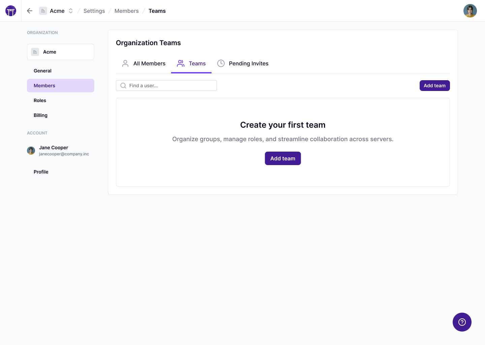
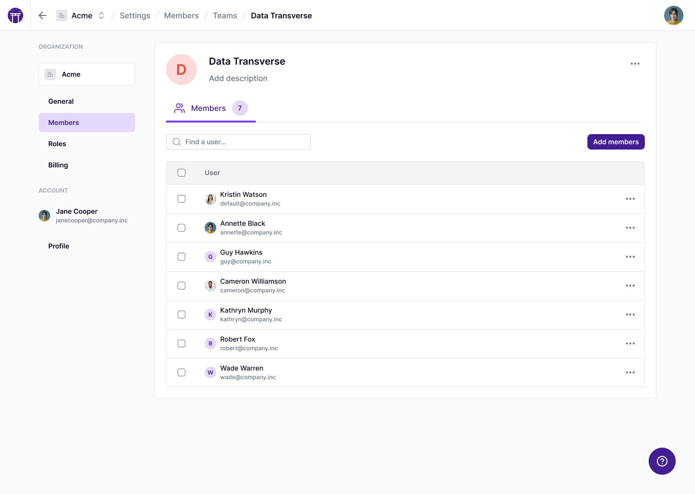
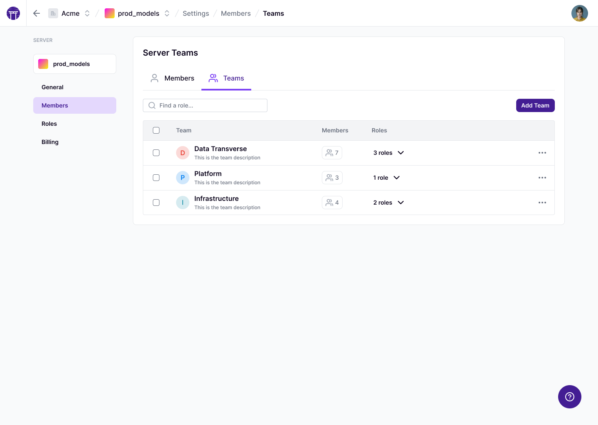
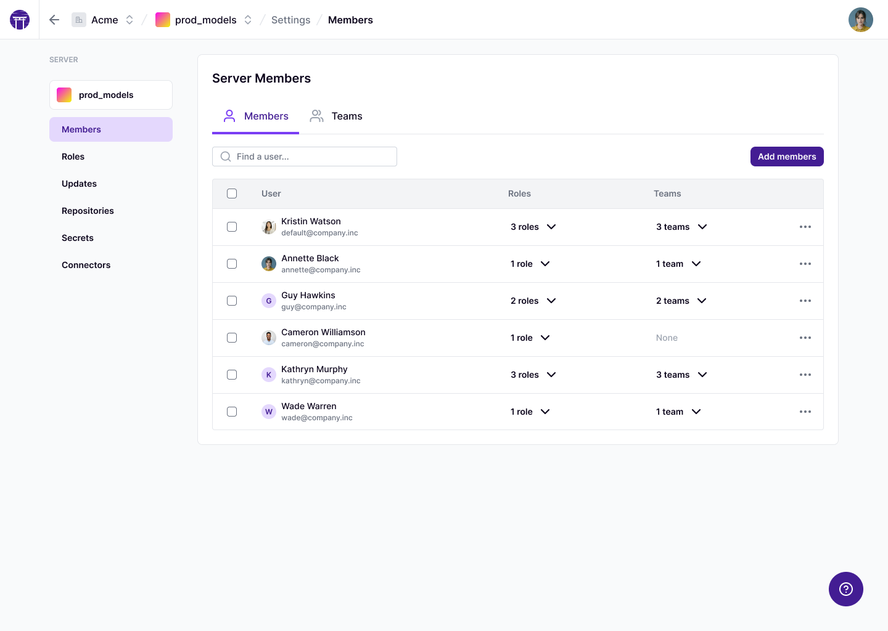

# Organize users in Teams

ZenML Pro introduces the concept of Teams to help you manage groups of users efficiently. A team is a collection of users that acts as a single entity within your organization and tenants. This guide will help you understand how teams work, how to create and manage them, and how to use them effectively in your MLOps workflows.

## Understanding Teams

Teams in ZenML Pro offer several key benefits:

1. **Group Management**: Easily manage permissions for multiple users at once.
2. **Organizational Structure**: Reflect your company's structure or project teams in ZenML.
3. **Simplified Access Control**: Assign roles to entire teams rather than individual users.

## Creating and Managing Teams

Teams are created at the organization level and can be assigned roles within tenants, similar to individual users.

To create a team:

1. Navigate to the Organization settings page
2. Click on the "Teams" tab
3. Use the "Add team" button to add a new team

When creating a team, you'll need to provide:

- Team name
- Description (optional)
- Initial team members

## Adding Users to Teams

To add users to an existing team:

1. Go to the "Teams" tab in Organization settings
2. Select the team you want to modify
3. Click on "Add Members"
4. Choose users from your organization to add to the team

## Assigning Teams to Tenants

Teams can be assigned to tenants just like individual users. To add a team to a tenant:

1. Go to the tenant settings page
2. Click on "Members" tab and click on the "Teams" tab.
3. Select "Add Team"
4. Choose the team and assign a role

## Team Roles and Permissions

When you assign a role to a team within a tenant, all members of that team inherit the permissions associated with that role. This can be a predefined role (Admin, Editor, Viewer) or a custom role you've created.

For example, if you assign the "Editor" role to a team in a specific tenant, all members of that team will have Editor permissions in that tenant.

## Best Practices for Using Teams

1. **Reflect Your Organization**: Create teams that mirror your company's structure or project groups.
3. **Combine with Custom Roles**: Use custom roles with teams for fine-grained access control.
4. **Regular Audits**: Periodically review team memberships and their assigned roles.
5. **Document Team Purposes**: Maintain clear documentation about each team's purpose and associated projects or tenants.

By leveraging Teams in ZenML Pro, you can streamline user management, simplify access control, and better organize your MLOps workflows across your organization and tenants.
<!-- For scarf -->
<figure></figure>

