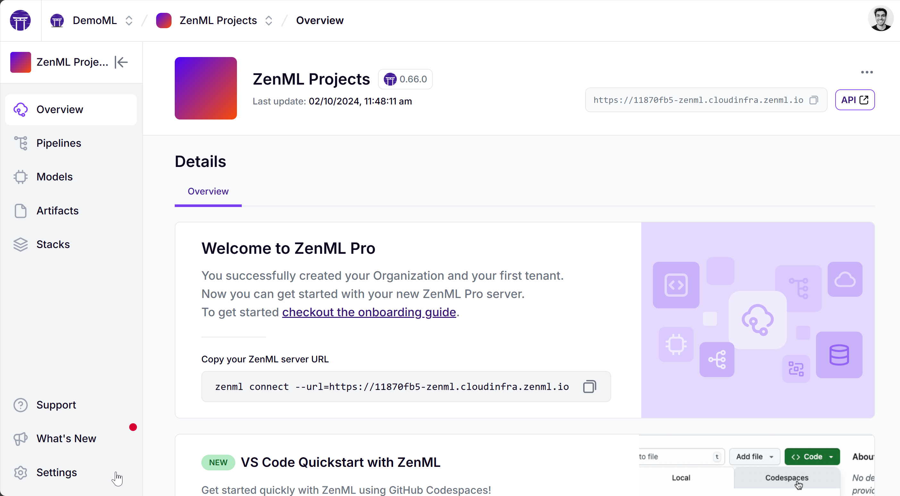
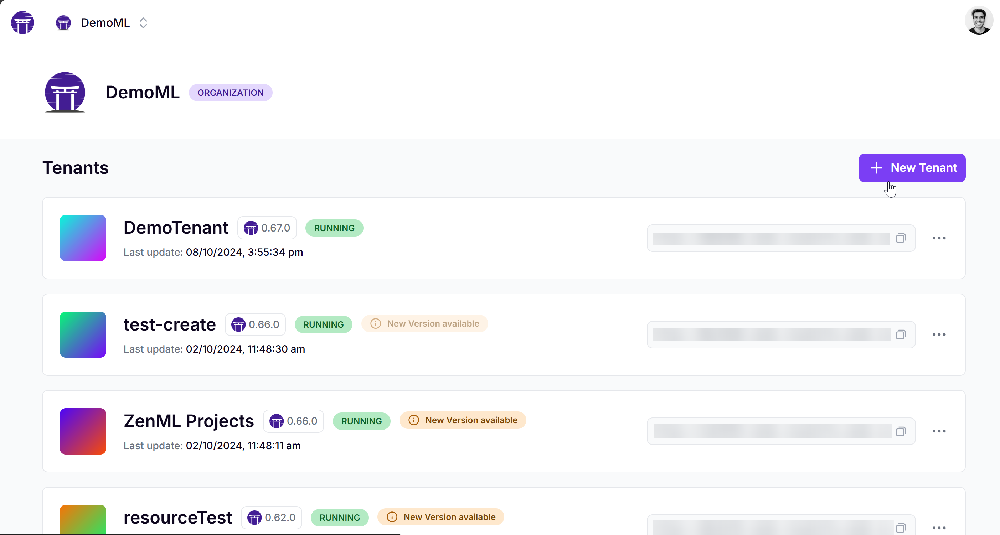
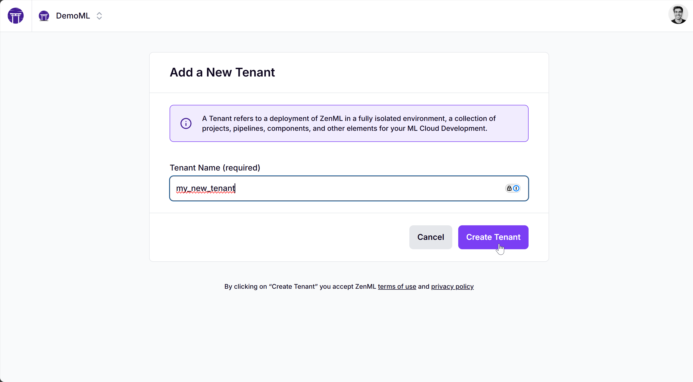
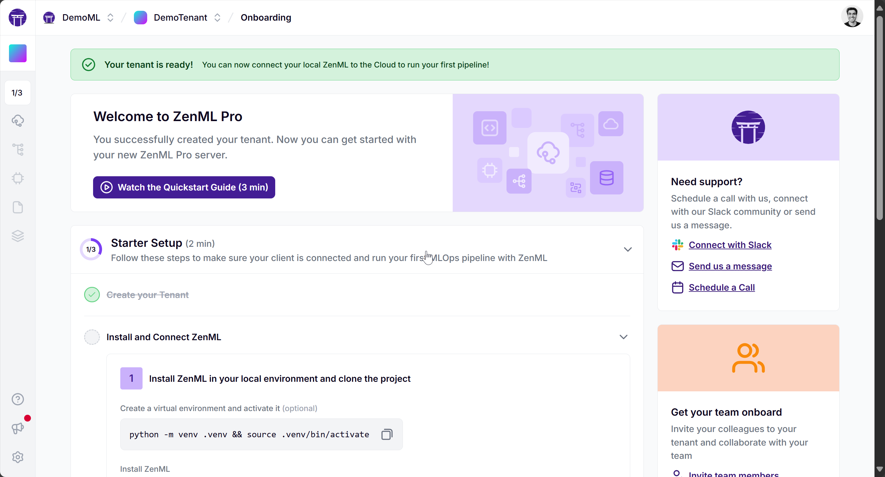
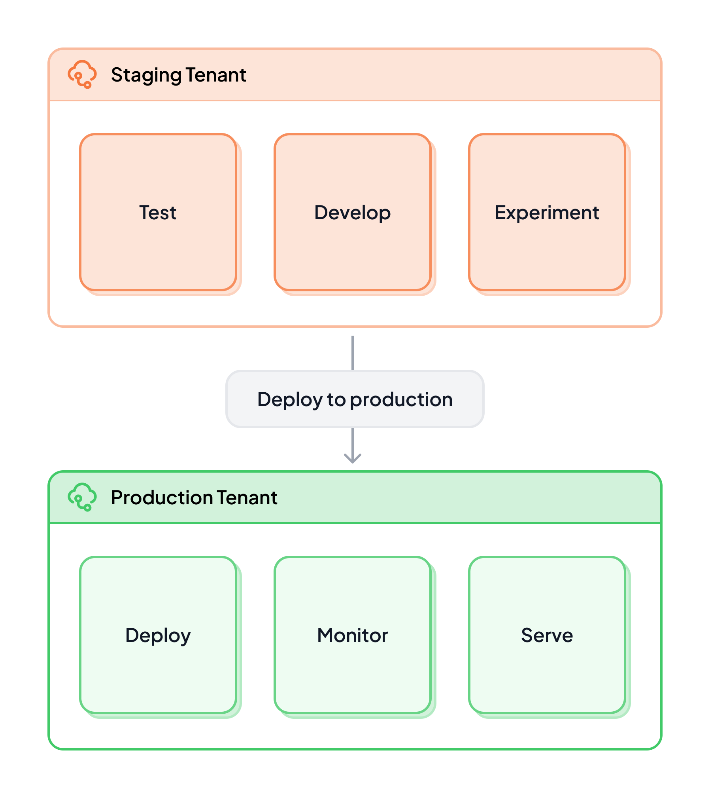
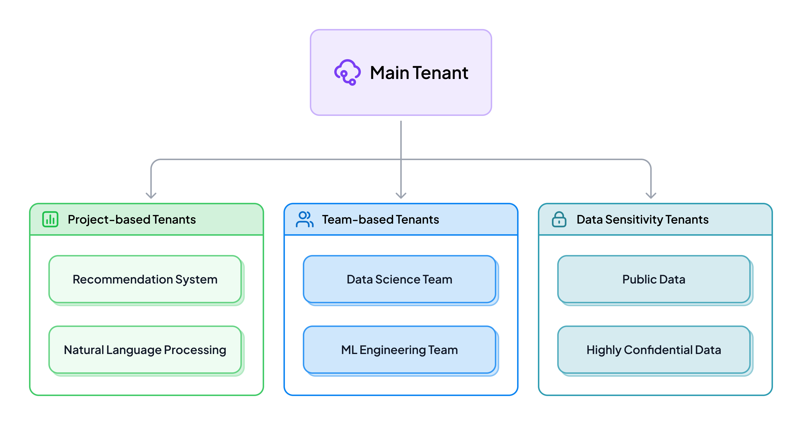
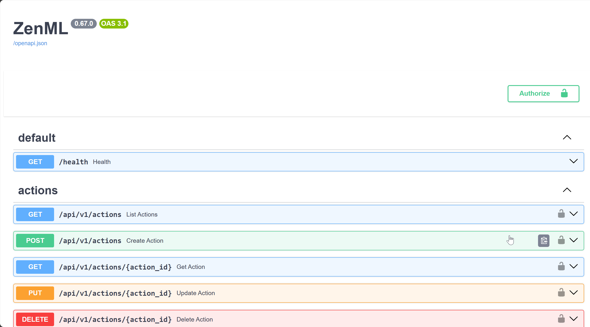

# Tenants

Tenants are individual, isolated deployments of the ZenML server. Each tenant has its own set of users, roles, and resources. Essentially, everything you do in ZenML Pro revolves around a tenant: all of your pipelines, stacks, runs, connectors, etc. are scoped to a tenant.

The ZenML server that you get through a tenant is a supercharged version of the open-source ZenML server. This means that you get all the features of the open-source version, plus some extra Pro features.

## Create a Tenant in your organization

A tenant is a crucial part of your Organization and holds all of your pipelines, experiments and models, among other things. You need to have a tenant to fully utilize the benefits that ZenML Pro brings. The following is how you can create a tenant yourself:

- Go to your organization page
- Click on the "+ New Tenant" button

- Give your tenant a name and click on the "Create Tenant" button

The tenant will then be created and added to your organization. In the meantime, you can already get started with setting up your environment for the onboarding experience.

The image below shows you how the overview page looks like when you are being onboarded. Follow the instructions on the screen to get started.


You can also create a tenant through the Cloud API by navigating to https://cloudapi.zenml.io/ and using the `POST /organizations` endpoint to create a tenant.


## Organizing your tenants

Organizing your tenants effectively is crucial for managing your MLOps infrastructure efficiently. There are primarily two dimensions to consider when structuring your tenants:

### Organizing tenants in `staging` and `production`

One common approach is to separate your tenants based on the development stage of your ML projects. This typically involves creating at least two types of tenants:

1. **Staging Tenants**: These are used for development, testing, and experimentation. They provide a safe environment where data scientists and ML engineers can:
   - Develop and test new pipelines
   - Experiment with different models and hyperparameters
   - Validate changes before moving to production

2. **Production Tenants**: These host your live, customer-facing ML services. They are characterized by:
   - Stricter access controls
   - More rigorous monitoring and alerting
   - Optimized for performance and reliability

This separation allows for a clear distinction between experimental work and production-ready systems, reducing the risk of untested changes affecting live services.

### Organizing tenants by business logic

Another approach is to create tenants based on your organization's structure or specific use cases. This method can help in:

1. **Project-based Separation**: Create tenants for different ML projects or products. For example:
   - Recommendation System Tenant
   - Natural Language Processing Tenant
   - Computer Vision Tenant

2. **Team-based Separation**: Align tenants with your organizational structure:
   - Data Science Team Tenant
   - ML Engineering Team Tenant
   - Business Intelligence Team Tenant

3. **Data Sensitivity Levels**: Separate tenants based on data classification:
   - Public Data Tenant
   - Internal Data Tenant
   - Highly Confidential Data Tenant

This organization method offers several benefits:
- Improved resource allocation and cost tracking
- Better alignment with team structures and workflows
- Enhanced data security and compliance management

Of course, both approaches of organizing your tenants can be mixed and matched to create a structure that works best for you.

### Best Practices for Tenant Organization

Regardless of the approach you choose, consider these best practices:

1. **Clear Naming Conventions**: Use consistent, descriptive names for your tenants to easily identify their purpose.
2. **Access Control**: Implement [role-based access control](./roles.md) within each tenant to manage permissions effectively.
3. **Documentation**: Maintain clear documentation about the purpose and contents of each tenant.
4. **Regular Reviews**: Periodically review your tenant structure to ensure it still aligns with your organization's needs.
5. **Scalability**: Design your tenant structure to accommodate future growth and new projects.

By thoughtfully organizing your tenants, you can create a more manageable, secure, and efficient MLOps environment that scales with your organization's needs.

## Using your tenant

As previously mentioned, a tenant is a supercharged ZenML server that you can use to run your pipelines, carry out experiments and perform all the other actions you expect out of your ZenML server.

Some Pro-only features that you can leverage in your tenant are as follows:

- [Model Control Plane](../../../../docs/book/how-to/use-the-model-control-plane/register-a-model.md)
- [Artifact Control Plane](../../how-to/handle-data-artifacts/README.md)
- [Ability to run pipelines from the Dashboard](../../../../docs/book/how-to/trigger-pipelines/use-templates-rest-api.md), 
- [Create templates out of your pipeline runs](../../../../docs/book/how-to/trigger-pipelines/use-templates-rest-api.md)

and [more](https://zenml.io/pro)!

### Accessing tenant docs

Every tenant has a connection URL that you can use to connect your `zenml` client to your deployed Pro server. This URL can also be used to access the OpenAPI specification for the ZenML Server.
Simply visit `<TENANT_URL>/docs` on your browser to see a full list of methods that you can execute from it, like running a pipeline through the REST API.

Read more about to access the API [here](../../reference/api-reference.md).<!-- For scarf -->
<figure></figure>

