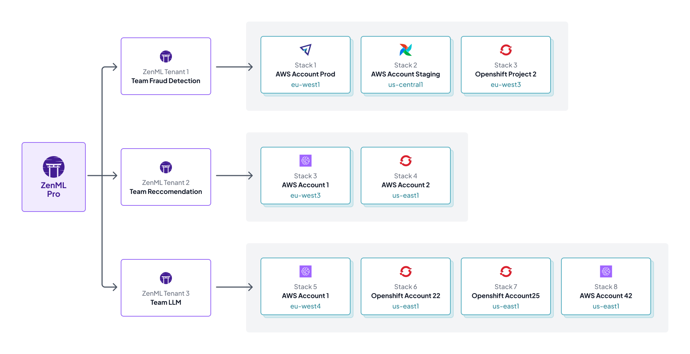
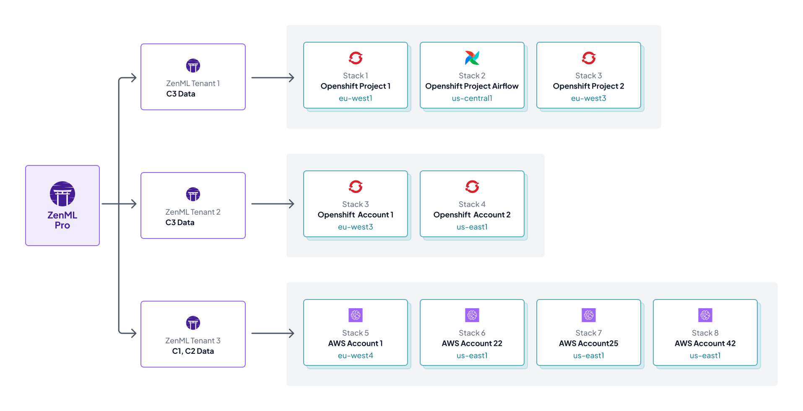

# Tenants

Tenants are individual, isolated deployments of the ZenML server. Each tenant has its own set of users, roles, and resources. Essentially, everything you do in ZenML Pro revolves around a tenant: all of your pipelines, stacks, runs, connectors, etc. are scoped to a tenant.

The ZenML server that you get through a tenant is a supercharged version of the open-source ZenML server. This means that you get all the features of the open-source version, plus some extra Pro features.

## Create a Tenant in your organization

A tenant is a crucial part of your Organization and holds all of your pipelines, experiments and models, among other things. You need to have a tenant to fully utilize the benefits that ZenML Pro brings. The following is how you can create a tenant yourself:

- Go to your organization page
- Click on the "+ New Tenant" button

- Give your tenant a name and click on the "Create Tenant" button

The tenant will then be created and added to your organization. In the meantime, you can already get started with setting up your environment for the onboarding experience.

The image below shows you how the overview page looks like when you are being onboarded. Follow the instructions on the screen to get started.


You can also create a tenant through the Cloud API by navigating to https://cloudapi.zenml.io/ and using the `POST /organizations` endpoint to create a tenant.


## Organizing your tenants

You can also restrict what your team members can access within a tenant by using roles. Read more about roles [here](../../../../docs/book/getting-started/zenml-pro/roles.md).

You can choose to define and organize tenants in any way you wish, depending on your needs. One example could be creating different tenants for different projects or teams in your organization.
The diagram below shows this use case, where folks working on the recommender systems, LLMs and fraud detection each have a separate tenant.

This helps you better manage project resources. You can imagine that 
- certain teams might be based in a different region and have requirements for deployments within that region.
- some teams may have external contributors and you don't want them to have any knowledge of other internal tenants and projects.

...and so on.

One other example could be separating tenants based on the type of data they handle. The diagram below shows how C1 and C2 type data (highly confidential) are handled differently.

## Using your tenant

As said already, a tenant is a supercharged ZenML server that you can use to run your pipelines, carry out experiments and perform all the other actions you expect out of your ZenML server.

Some Pro-only features that you can leverage in your tenant are as follows:
- the [Model Control Plane](../../../../docs/book/how-to/use-the-model-control-plane/register-a-model.md)
- Artifact Control Plane
- [ability to run pipelines from the Dashboard](../../../../docs/book/how-to/trigger-pipelines/use-templates-rest-api.md), 
- [create templates out of your pipeline runs](../../../../docs/book/how-to/trigger-pipelines/use-templates-rest-api.md)

and more!

### Accessing tenant docs

Every tenant has a connection URL that you can use to connect your `zenml` client to your deployed Pro server. This URL can also be used to access the OpenAPI specification for the ZenML Server.
Simply visit `<URL>/docs` on your browser to see a full list of methods that you can execute from it, like running a pipeline through the REST API.

