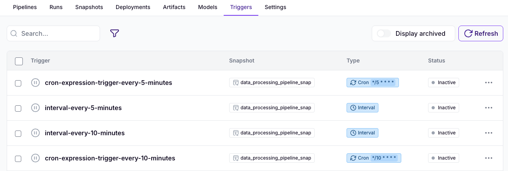
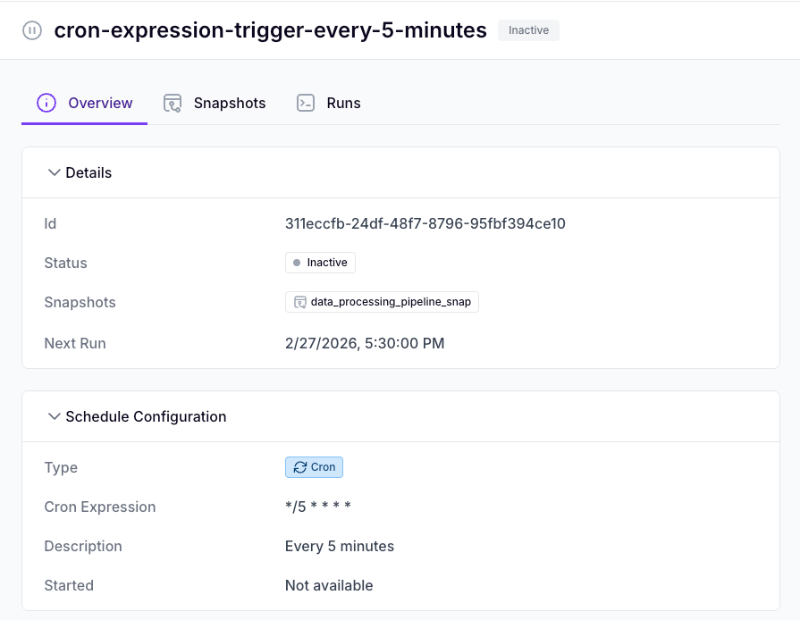
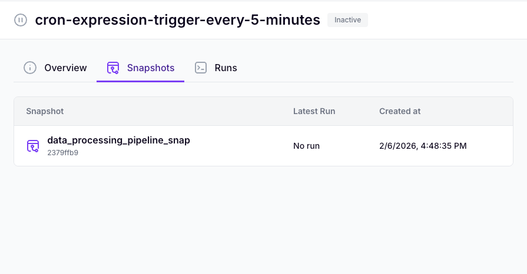
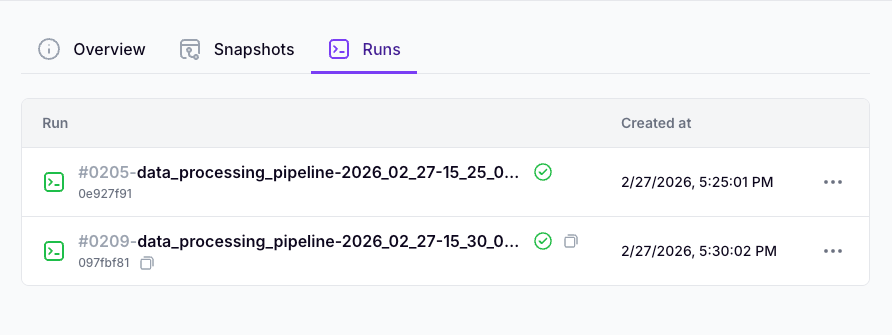
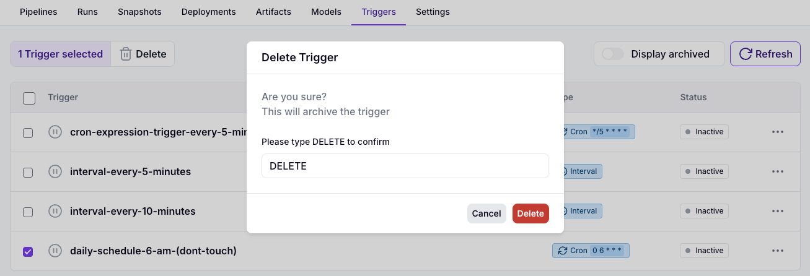
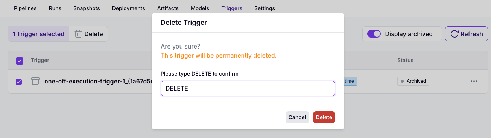

# Triggers

In the [snapshots](./snapshots.md) section, you learned how to prepare snapshots and execute them on demand via 
the dashboard, CLI, or SDK. In many cases, however, pipelines need to run automatically - either on a schedule or in 
response to an event.

Triggers enable this behavior. A Trigger is a configuration that defines one or more events that automatically 
start a pipeline.

## Schedule Triggers

*Schedule* triggers enable users to define and manage an execution schedule. See below a comprehensive list of the
schedule configuration options:

| Attribute           | Description                                                  | Notes                        |
|---------------------|--------------------------------------------------------------|------------------------------|
| name                | The name of the schedule                                     | Unique within project        |
| cron_expression     | A cron expression describing your schedule's frequency       | Standard 5-field cron format |
| interval            | An interval (in seconds) describing the schedule's frequency | Combined with start_time     |
| run_once_start_time | One-off execution at a specific time in the future           | UTC                          |
| start_time          | The beginning of the schedule                                | UTC                          |
| end_time            | The end time of the schedule                                 | UTC                          |
| active              | Status of the schedule (active/inactive)                     | -                            |
| concurrency         | Option to control how concurrent runs should be handled      | Skip is the default option   |

### Create a schedule

Let's start by creating a schedule. We can do so, via the SDK or the CLI.

Via the SDK:

~~~python
from zenml.client import Client
from zenml.enums import TriggerRunConcurrency

client = Client()

daily_schedule = client.create_schedule_trigger(
    name='daily-schedule-6-am',
    cron_expression='0 6 * * *',
    active=True,
    concurrency=TriggerRunConcurrency.SKIP,
)
~~~

Via the CLI:

~~~bash
zenml trigger schedule create daily-schedule-6-am --cron-expression "0 6 * * *"
~~~

### Attach/Detach schedules and snapshots

So far we have instructed our system with *when* to execute but not *what*. To do so,
we need to *attach* a schedule to a snapshot.

Via the SDK:

~~~python
from zenml.client import Client

client = Client()
client.attach_trigger_to_snapshot(
    trigger_id="<TRIGGER_ID>",
    pipeline_snapshot_id="<>SNAPSHOT_ID"
)
~~~

Via the CLI:

~~~bash
zenml trigger schedule attach "<TRIGGER_ID>" "<SNAPSHOT_ID>"
~~~

Triggers can be *detached* from snapshots as well.

Via the SDK:

~~~python
from zenml.client import Client

client = Client()
client.detach_trigger_from_snapshot(
    trigger_id="<TRIGGER_ID>",
    pipeline_snapshot_id="<>SNAPSHOT_ID"
)
~~~

Via the CLI:

~~~bash
zenml trigger schedule detach "<TRIGGER_ID>" "<SNAPSHOT_ID>"
~~~

The ability to detach and attach snapshots is particularly useful as pipelines evolve. When a new pipeline 
version becomes available, you can update the schedule to use it by detaching the previous 
snapshot and attaching the new one.


As with on-demand execution, scheduling requires snapshots with a **remote stack** with at least:
- Remote orchestrator
- Remote artifact store
- Container registry

### Update schedules

You can update a schedule's configuration at any point. In the example, we will de-activate and rename the schedule.

Via the SDK:

~~~python
from zenml.client import Client

client = Client()
client.update_schedule_trigger(
    trigger_id="<TRIGGER_ID>",
    active=False,
    name="daily-schedule-6-am[DO NOT TOUCH]"
)
~~~

Via the CLI:

~~~bash
zenml trigger schedule update "<TRIGGER_ID>" --active=false --name="daily-schedule-6-am-(dont-touch)"
~~~

### View Schedules

Triggers are a first-level citizen of the ZenML platform. You can view detailed information in the
dashboard as well as via the SDK and CLI.

Via the dashboard:

To view schedules, you need to navigate to the `Triggers` tab:

You can inspect a schedule's information:

Or its attached snapshots and executed pipeline runs:

Via the SDK:

~~~python
from zenml.client import Client

client = Client()

active_schedules = client.list_schedule_triggers(
    active=True,
)  # list schedules

schedule = client.get_schedule_trigger(trigger_id="<SCHEDULE_ID>")  # get a schedule by ID

for snapshot in schedule.snapshots:  # iterate a schedule's attached snapshots
    print(snapshot.id)
~~~

Via the CLI:

~~~bash
zenml trigger schedule list --active=true
~~~

### Delete schedules

Triggers in ZenML are archivable objects. When a Trigger is archived (soft-deleted), it is deactivated and can no 
longer be used, but it remains in the system to preserve references for visibility and debugging.

Archiving (soft deletion) is the default deletion mode. Triggers can also be permanently deleted. Neither 
operation can be reversed.

Via the dashboard:

You can view archived schedules by setting the `Display archived` where can you also
hard delete them.

Via the SDK:

~~~python
from zenml.client import Client

client = Client()

client.delete_trigger(
    trigger_id="<SCHEDULE_ID>",
    soft=True,  # set to False if you want to hard-delete the schedule.
)
~~~

Via the CLI:

~~~bash
zenml trigger schedule delete "<SCHEDULE_ID>" --soft=true  # set to False to hard-delete the schedule
~~~

## Triggers vs OSS schedules

ZenML provides [scheduling](../../how-to/steps-pipelines/scheduling.md) as an open-source feature. This section 
outlines the differences between open-source schedules and schedule-based Triggers, and explains why Triggers are 
better suited for production workloads:

* Lifecycle management
  * Triggers: You can update or delete a schedule at any time, and changes are automatically applied across the system.
  * OS Schedules: Updates and deletions must be managed manually on the orchestrator side (except when using the `KubernetesOrchestrator`).
* Feature support
  * Triggers: All scheduling features are consistently available across stacks.
  * OS Schedules: Feature availability depends on the scheduling capabilities of the selected orchestrator.
* Flexibility
  * Triggers: Snapshots and schedules are managed independently. You can dynamically attach or detach snapshots to or from schedules.
  * OS Schedules: Schedules are bound to individual pipelines and cannot be shared across multiple pipelines.
* Visibility
  * Triggers: Extended dashboard visibility and management.
  * OS Schedules: Limited dashboard exposure.
