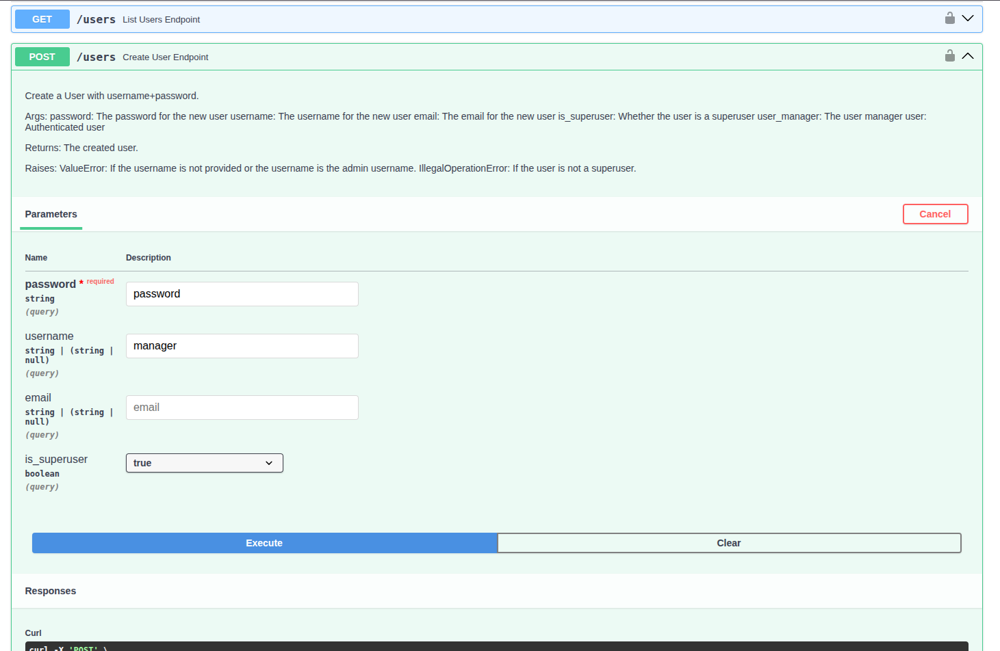

# User Accounts

This guide covers user account types and management for ZenML Pro self-hosted deployments. Understanding the different account types and their capabilities is essential for effectively managing access to your ZenML Pro instance.


This guide applies to [the fully self-hosted scenario](self-hosted-deployment.md) where you manage the ZenML Pro control plane. In the [hybrid](hybrid-deployment.md) and [SaaS](saas-deployment.md) scenarios, user management is handled through the ZenML Pro cloud service.


## User Account Types

ZenML Pro self-hosted deployments support several types of user accounts, each with different characteristics and use cases.

### SSO Users

SSO users authenticate through an external OIDC identity provider configured in your ZenML Pro deployment. These accounts:

- Are created automatically when a user first logs in via SSO
- Are associated with the email address from the identity provider
- Cannot set a local password — authentication is always delegated to the IdP
- Inherit any MFA or security policies enforced by the identity provider

SSO users are the recommended account type for production deployments as they centralize user management in your organization's identity provider. See the [Single Sign-On (SSO)](sso.md) guide for configuration details.

### Local Users

Local users authenticate directly with the ZenML Pro control plane using a username and password. These accounts:

- Are created manually by administrators through the API
- Store credentials in the ZenML Pro database
- Are only available when password authentication is enabled
- Are prompted to reset their password on first login

Local users are useful for:

- Initial setup before SSO is configured
- Emergency access when the identity provider is unavailable
- Testing and development environments
- Organizations that prefer not to use SSO

### Super-User Accounts

Super-users are user accounts (either SSO or local) with elevated privileges that allow them to:

- Bypass RBAC restrictions across the entire ZenML Pro instance
- Create, modify, and delete organizations
- Manage all user accounts, including granting or revoking super-user privileges
- Access and manage all workspaces and resources


Super-user privileges should be granted sparingly and only to trusted administrators. These accounts have unrestricted access to the entire ZenML Pro instance.


Super-user privileges can be granted to any user account:

- The first user to log in via SSO is automatically granted super-user privileges
- The first user account created via the API is automatically granted super-user privileges
- Local users can be created with super-user privileges or have them granted later
- Super-user status can be revoked at any time through the API

### The Admin Reserved Account

The admin account is a special reserved account that exists specifically for bootstrap and emergency operations:

- **Username**: `admin` (can be customized via configuration)
- **Availability**: Only when password authentication is enabled
- **Password**: Auto-generated during deployment (can be customized via configuration)

The admin account has capabilities similar to a super-user but with some restrictions:

- Can create and manage user accounts
- Can grant super-user privileges to other users
- Cannot be deleted or have its username changed
- Is disabled when password authentication is disabled


The admin account should only be used for:
- Initial onboarding: creating the first super-user account after deployment
- Emergency access: restoring super-user privileges if all super-users are locked out

Use a regular user account with appropriate roles for day-to-day operations.


To retrieve the admin password after deployment (Kubernetes with Helm):

```bash
kubectl get secret --namespace zenml-pro zenml-pro \
  -o jsonpath="{.data.ZENML_CLOUD_ADMIN_PASSWORD}" | base64 --decode; echo
```

## Managing Local Users

Local user management is currently only supported through the ZenML Pro API. There is no UI support for creating or managing local user accounts.


Only users with super-user privileges or the admin reserved account can manage other user accounts.


### Accessing the API

There are several ways to access the ZenML Pro API for user management:

**OpenAPI Interface**: Access the interactive API documentation at `https://<zenml-pro-url>/api/v1`. Authenticate using the username and password (for admin or local users)

**Programmatic Access**: Use tools like `curl`, `wget`, or any HTTP client. Authenticate using:
- Bearer token obtained via username/password login
- Direct PAT or API key in the Authorization header

See the [Personal Access Tokens](personal-access-tokens.md) and [Service Accounts](service-accounts.md) documentation for details on programmatic authentication.

### Creating Local Users



1. Navigate to `https://<zenml-pro-url>/api/v1`
2. Authenticate with the admin account or a super-user account
3. Find the `POST /api/v1/users` endpoint
4. Provide the following parameters:
   - `username`: The username for the new account
   - `password`: Initial password (user will be prompted to change it)
   - `is_superuser`: Set to `true` to grant super-user privileges (optional)





First, obtain a bearer token:

```bash
# Authenticate with admin credentials
curl -X POST https://<zenml-pro-url>/api/v1/auth/login \
  -H "Content-Type: application/x-www-form-urlencoded" \
  -d "username=admin&password=<admin-password>"
```

Create the user:

```bash
# Create a new local user
curl -X POST "https://<zenml-pro-url>/api/v1/users?username=newuser&password=initial-password" \
  -H "Authorization: Bearer <access-token>"

# Create a new super-user
curl -X POST "https://<zenml-pro-url>/api/v1/users?username=newsuperuser&password=initial-password&is_superuser=true" \
  -H "Authorization: Bearer <access-token>"
```




New local users are required to reset their password on first login.


### Updating Local Users



```bash
# Update user details
curl -X PATCH "https://<zenml-pro-url>/api/v1/users/<user-id>" \
  -H "Authorization: Bearer <access-token>" \
  -H "Content-Type: application/json" \
  -d '{
    "name": "updated-username"
  }'

# Grant super-user privileges
curl -X PATCH "https://<zenml-pro-url>/api/v1/users/<user-id>" \
  -H "Authorization: Bearer <access-token>" \
  -H "Content-Type: application/json" \
  -d '{
    "is_superuser": true
  }'

# Revoke super-user privileges
curl -X PATCH "https://<zenml-pro-url>/api/v1/users/<user-id>" \
  -H "Authorization: Bearer <access-token>" \
  -H "Content-Type: application/json" \
  -d '{
    "is_superuser": false
  }'
```



### Resetting Passwords

Administrators can reset a local user's password:



```bash
# Reset a user's password
curl -X PATCH "https://<zenml-pro-url>/api/v1/users/<user-id>" \
  -H "Authorization: Bearer <access-token>" \
  -H "Content-Type: application/json" \
  -d '{
    "password": "new-temporary-password"
  }'
```




After an administrator resets a password, the user will be prompted to change it on their next login.


### Deleting Local Users



```bash
# Delete a user
curl -X DELETE "https://<zenml-pro-url>/api/v1/users/<user-id>" \
  -H "Authorization: Bearer <access-token>"
```




Deleting a user removes their account but does not delete resources they created. Those resources remain accessible to other organization members based on their roles.



## Related Resources

- [Single Sign-On (SSO)](sso.md)
- [Roles & Permissions](roles.md)
- [Teams](teams.md)
- [Organizations](organization.md)
- [Personal Access Tokens](personal-access-tokens.md)
- [Service Accounts](service-accounts.md)
