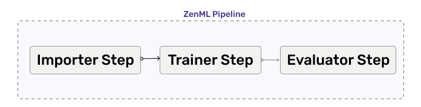
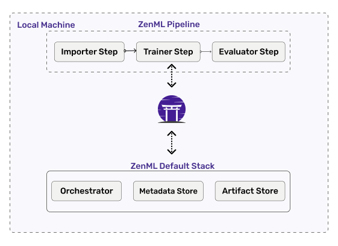
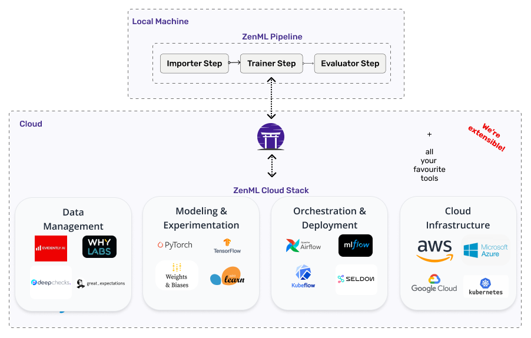

# Core Concepts

ZenML consists of a few components. This guide walks through the various pieces you'll encounter, starting from the basics to things you'll only encounter when deploying to the cloud. 

Here's a high-level overview of a typical ZenML workflow:

1. Writing a *pipeline* to define what happens in your machine learning workflow.
2. Configuring a ZenML *stack*.
3. Switching between *stacks* depending on needs.
4. Customizing your *stack* with different *components*.

So first, the basics.

## Pipeline and Steps

At its core, ZenML follows a pipeline-based workflow for your data projects.
A **pipeline** consist of a series of **steps**, organized in any order that makes sense for your use case. 

Below, you can see three **steps** running one after another in a **pipeline**. 

The steps might have dependencies between them. 
For example, a step might use the outputs from a previous step and thus must wait until the previous step completes before starting. This is something you can keep in mind when organizing your steps.

You can have multiple pipelines for different purposes. For example, a training pipeline to train and evaluate models and an inference pipeline to serve the model.

Pipelines and steps are defined in code using Python *decorators*.
This is where the core business logic and
value of your work lives, and you will spend most of your time defining these two things. Your code lives inside a Repository, which is the main abstraction within which your project-specific pipelines should live.

When it comes to running your pipeline, ZenML offers an abstraction to handle how your pipeline gets run. This is where **Stacks** come into play.

## Stacks, Components and Stores
A **Stack** is the configuration of the underlying infrastructure and choices around how your pipeline will be run. For example, you can choose to run your pipeline locally or on the cloud by changing the stack you use.

ZenML comes with a default stack that runs locally, as seen in the following diagram:

In any Stack, there **must** be at least three basic **Stack Components** -

1. Orchestrator.
2. Artifact Store.
3. Metadata Store.

### Orchestrator

An **Orchestrator** is the workhorse that coordinates all the steps to run in a pipeline.

Since pipelines can be set up with complex combinations of steps with various asynchronous dependencies between them, the Orchestrator is the component that decides what steps to run, when, and how to pass data between the steps.

ZenML comes with a built-in *local orchestrator* designed to run on your local machine. This is useful especially during the exploration phase of your project. You don't have to rent a cloud instance just to try out basic things.

Once the pipeline is established you can switch to a full-fledged cloud stack that uses more sophisticated orchestrators like the Airflow or Kubeflow orchestrator. See the list of all orchestrators [here](../mlops_stacks/orchestrators/overview.md).

### Artifact Store

An **Artifact Store** is a component that houses all data that pass through the pipeline.
Data in the artifact store are called *artifacts*.

These artifacts may have been produced by the pipeline steps, or they may be the
data ingested into a pipeline via an importer step.
The artifact store houses all intermediary pipeline step results, which in turn will be tracked in the metadata store.

The fact that all your data inputs and outputs are tracked
and versioned in the artifact store allows for extremely useful features
like data caching which speeds up your workflow.

### Metadata Store

A **Metadata Store** keeps track of all the bits of extraneous data from a pipeline run. It allows you to fetch specific steps from your pipeline run and their output artifacts in a post-execution workflow.

With a metadata store, you are able to access all of your previous experiments with the associated details.
This is extremely helpful in troubleshooting.

When you start working with ZenML, you'll likely spend most of your time
here, working with the default stack on initialization. 

### Other Stack Components
We've covered the three basic stack components that you will encounter most frequently. They work well on a local machine, but is rarely enough in production.

At some point, you might want to scale up your stack to run elsewhere. Eg. on a cloud with powerful GPUs for training or CPUs for deployment.

ZenML provides many other stack components to suit these use cases.
Having these components in your stack supercharges your pipeline for production.

For other stack components check out this [page](../mlops_stacks/categories.md).

## Cloud Training, Deployment and Monitoring
We've seen how to run a pipeline locally. But that is rarely the case in production.

When you are ready to switch out your infrastructure and the components used as
part of your machine learning workflow, you can do so with a single CLI
command that switches out your stack. The code defining your steps and pipelines
stays the same, but it gets run in whatever cloud infrastructure you've set up
in your custom stack; all you change is the stack you're using and your pipeline
code gets run someplace different.

Running workflows in the cloud often requires certain custom behaviors, so ZenML
offers a number of extra Stack Components that handle these common use cases.
For example, it's common to want to deploy models so we have a Model Deployer
component. Similarly, you might want to use popular tools like Weights & Biases
or MLflow to track your experiments, so we have an Experiment Tracker stack
component. Any additional software needed for these components can be added and
installed by using ZenML's Integration installer.

It is this modular and configurable nature of the ZenML stack that offers you
ways to get productive quickly. If we don't support some specific tool you want
to use, our stack components are extensible and well documented so this 
shouldn't be a barrier for you.

All the stack components configured as part of the stack carry their
configuration parameters so whether it's an AWS Sagemaker cluster you need to
run your training on or an Google Cloud container registry you need to connect
to, ZenML handles the connections between these various parts on your behalf.

## Bits and Pieces

There are lots of different ways to use ZenML which will depend on your precise
use case. The following concepts and stack components are things you'll possibly
encounter further down the road while using ZenML.

- **Materializers** - ZenML stores the data inputs and outputs to your steps in the
  Artifact Store as we saw above. In order to store the data, it needs to
  serialize everything in a format that can fit into the Artifact Store. ZenML
  handles serialization (and deserialization) of the most common artifacts, but
  if you try to do something we haven't already thought of you'll need to write
  your own custom materializer. This isn't hard, but you should be aware that
  it's something you might need do to. The ZenML CLI will let you know with a
  clear error message when you need to do this.
- **Profiles** - Profiles are groupings of stacks. You might want to keep all your
  AWS stacks separate from your GCP stacks, for example, or your work
  infrastructure use separate from that which you use for your personal
  projects. Profiles allow you to separate these out, and switching between them
  is effortless.
- **Service** - A service is a longer-lived entity that extends the capabilities of
  ZenML beyond the run of a pipeline. For example, a service could be a
  prediction service that loads models for inference in a production setting.
- **ZenServer** - ZenML is building out functionality to host a shared server that
  allows teams to collaborate and share stacks, data stores and more.

There's a lot more detail to digest when it comes to ZenML, but with the above
you should be sufficiently armed to understand how the framework works and where
you might want to extend it.
