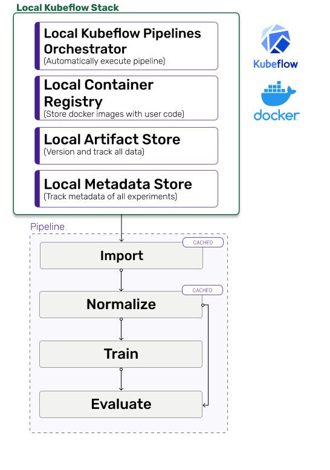

# Deploy to production

If you want to see the code for this chapter of the guide, head over to the [GitHub](https://github.com/zenml-io/zenml/tree/main/examples/low\_level\_guide/chapter\_7.py).

You can also watch a tutorial video of a Kubeflow stack based example [here](https://www.youtube.com/watch?v=b5TXRYkdL3w).

## Deploy pipelines to production

When developing ML models, you probably develop your pipelines on your local machine initially as this allows for quicker iteration and debugging. However, at a certain point when you are finished with its design, you might want to transition to a more production-ready setting and deploy the pipeline to a more robust environment.

### Pre-requisites

In order to run this example, we have to install a few tools that allow ZenML to spin up a local Kubeflow Pipelines setup:

* [K3D](https://k3d.io/v5.2.1/#installation) to spin up a local Kubernetes cluster
* The Kubernetes command-line tool [Kubectl](https://kubernetes.io/docs/tasks/tools/#kubectl) to deploy Kubeflow Pipelines
* [Docker](https://docs.docker.com/get-docker/) to build Docker images that run your pipeline in Kubernetes pods


The local Kubeflow Pipelines deployment requires more than 2 GB of RAM, so if you're using Docker Desktop make sure to update the resource limits in the preferences.


### Installation

Next, we will install all packages that are required for ZenML to run on Kubeflow Pipelines:

```bash
zenml integration install kubeflow
```

### Create a local Kubeflow Pipelines Stack

A [Stack](../../introduction/core-concepts.md) is the configuration of the surrounding infrastructure where ZenML pipelines are run and managed. For now, a `Stack` consists of:

* A metadata store: To store metadata like parameters and artifact URIs
* An artifact store: To store interim data step output.
* An orchestrator: A service that actually kicks off and runs each step of the pipeline.
* An optional container registry: To store Docker images that are created to run your pipeline.

When you did `zenml init` at the start of this guide, a default `local_stack` was created with local version of all of these. In order to see the stack you can check it out in the command line:

```bash
zenml stack list
```

Output:

```bash
STACKS:
key                   stack_type    metadata_store_name    artifact_store_name    orchestrator_name      container_registry_name
--------------------  ------------  ---------------------  ---------------------  ---------------------  -------------------------
local_stack           base          local_metadata_store   local_artifact_store   local_orchestrator
```


Let's stick with the `local_metadata_store` and a `local_artifact_store` for now and create a stack with a Kubeflow orchestrator and a local container registry

```bash
# Make sure to create the local registry on port 5000 for it to work 
zenml container-registry register local_registry --type=default --uri=localhost:5000 
zenml orchestrator register kubeflow_orchestrator --type=kubeflow
zenml stack register local_kubeflow_stack \
    -m local_metadata_store \
    -a local_artifact_store \
    -o kubeflow_orchestrator \
    -c local_registry

# Activate the newly created stack
zenml stack set local_kubeflow_stack
```

Output:

```bash
Container registry `local_registry` successfully registered!
Orchestrator `kubeflow_orchestrator` successfully registered!
Stack `local_kubeflow_stack` successfully registered!
Active stack: local_kubeflow_stack
```




In the real world we would also switch to something like a MySQL-based metadata store and an Azure-, GCP-, or S3-based artifact store. We have just skipped that part to keep everything in one machine to make it a bit easier to run this guide.


### Start up Kubeflow Pipelines locally

ZenML takes care of setting up and configuring the local Kubeflow Pipelines deployment. All we need to do is run:

```bash
zenml stack up
```

When the setup is finished, you should see a local URL which you can access in your browser and take a look at the Kubeflow Pipelines UI.

### Run the pipeline

There is one minor change we need to make to run the pipeline from the previous chapter: we need to specify the Python package requirements that ZenML should install inside the Docker image it creates for you. We do that by passing a file path as a parameter to the `@pipeline` decorator:

```python
@pipeline(requirements_file="path_to_requirements.txt")
def mnist_pipeline(...)
```

We can now run the pipeline by simply executing the Python script:

```bash
python chapter_7.py
```

Even though the pipeline script is essentially the same, the output will be a lot different from last time. ZenML will detect that `local_kubeflow_stack` is the active stack, and do the following:

* Build a docker image containing all the necessary python packages and files
* Push the docker image to the local container registry
* Schedule a pipeline run in Kubeflow Pipelines

Once the script is finished, you should be able to see the pipeline run [here](http://localhost:8080/#/runs).

### Clean up

Once you're done experimenting, you can delete the local Kubernetes cluster and all associated resources by calling:

```bash
zenml stack down
```

### Run the same pipeline on Kubeflow Pipelines deployed to GCP

We will now run the same pipeline in Kubeflow Pipelines deployed to a Google Kubernetes Engine cluster. As you can see from the long list of additional pre-requisites, this requires lots of external setup steps at the moment. In future releases ZenML will be able to automate most of these steps for you, so make sure to revisit this guide if this is something you're interested in!

#### Additional pre-requisites

* An existing [GCP container registry](https://cloud.google.com/container-registry/docs).
* An existing [GCP bucket](https://cloud.google.com/storage/docs/creating-buckets).
* [Kubeflow Pipelines](https://www.kubeflow.org/docs/distributions/gke/deploy/overview/) deployed to a Google Kubernetes Engine cluster.
* The local docker client has to be [authorized](https://cloud.google.com/container-registry/docs/advanced-authentication) to access the GCP container registry.
* Kubectl can [access](https://cloud.google.com/kubernetes-engine/docs/how-to/cluster-access-for-kubectl) your GCP Kubernetes cluster.
* The [current context](https://kubernetes.io/docs/reference/kubectl/cheatsheet/#kubectl-context-and-configuration) configured in Kubectl points to your GCP cluster.

#### Create a GCP Kubeflow Pipelines stack

To run our pipeline on Kubeflow Pipelines deployed to GCP, we will create a new stack with these components:

* The **artifact store** stores step outputs in a GCP Bucket.
* The **metadata store** stores metadata inside the Kubeflow Pipelines internal MySQL database.
* The docker images that are created to run your pipeline are stored in GCP **container registry**.
* The **Kubeflow orchestrator** is the same as in the local Kubeflow Pipelines example.

When running the upcoming commands, make sure to replace `$PATH_TO_YOUR_CONTAINER_REGISTRY` and `$PATH_TO_YOUR_GCP_BUCKET` with the actual URI's of your container registry and bucket.

```bash
# In order to create the GCP artifact store, we need to install one additional ZenML integration:
zenml integration install gcp

# Create the stack and its components
zenml container-registry register gcp_registry  --type=default --uri=$PATH_TO_YOUR_CONTAINER_REGISTRY
zenml metadata-store register kubeflow_metadata_store --type=kubeflow
zenml artifact-store register gcp_artifact_store --type=gcp --path=$PATH_TO_YOUR_GCP_BUCKET
zenml stack register gcp_kubeflow_stack \
    -m kubeflow_metadata_store \
    -a gcp_artifact_store \
    -o kubeflow_orchestrator \
    -c gcp_registry
    
# Activate the newly created stack
zenml stack set gcp_kubeflow_stack
```

## Conclusion

If you made it this far, congratulations! You're one step closer to being production-ready with your ML workflows! Here is what we achieved in this entire guide:

* Experimented locally and built-up a ML pipeline.
* Transitioned to production by deploying a continuously training pipeline on newly arriving data.
* All the while retained complete lineage and tracking over parameters, data, code, and metadata.

### Coming soon

There are lot's more things you do in production that you might consider adding to your workflows:

* Adding a step to automatically deploy the models to a REST endpoint.
* Setting up a drift detection and validation step to test models before deploying.
* Creating a batch inference pipeline to get predictions.

ZenML will help with all of these and above -> Watch out for future releases and the next extension of this guide coming soon!
