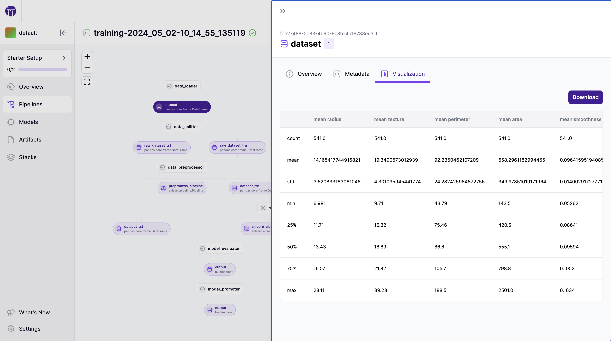

# Visualizations

Data visualization is a powerful tool for understanding your ML pipeline outputs. ZenML provides built-in capabilities to visualize artifacts, helping you gain insights into your data, model performance, and pipeline execution.

## Accessing Visualizations

ZenML automatically generates visualizations for many common data types, making it easy to inspect your artifacts without additional code.

### Dashboard Visualizations

The ZenML dashboard displays visualizations for artifacts produced by your pipeline runs:

To view visualizations in the dashboard:

1. Navigate to the **Runs** tab
2. Select a specific pipeline run
3. Click on any step to view its outputs
4. Select an artifact to view its visualizations


### Notebook Visualizations

You can also display artifact visualizations in Jupyter notebooks using the `visualize()` method:

```python
from zenml.client import Client

# Get an artifact from a previous pipeline run
run = Client().get_pipeline_run("<PIPELINE_RUN_ID>")
artifact = run.steps["<STEP_NAME>"].outputs[<OUTPUT_NAME>][0]

# Display the visualization
artifact.visualize()
```


## Supported Visualization Types

ZenML supports visualizations for many common data types out of the box:

- A statistical representation of a [Pandas](https://pandas.pydata.org/docs/reference/api/pandas.DataFrame.html) Dataframe represented as a png image.
- Drift detection reports by [Evidently](https://docs.zenml.io/stacks/stack-components/data-validators/evidently), [Great Expectations](https://docs.zenml.io/stacks/stack-components/data-validators/great-expectations), and [whylogs](https://docs.zenml.io/stacks/stack-components/data-validators/whylogs).
- A [Hugging Face](https://zenml.io/integrations/huggingface) datasets viewer embedded as a HTML iframe.


## Creating Custom Visualizations

It is simple to associate a custom visualization with an artifact in ZenML, if the visualization is one of the supported visualization types. Currently, the following visualization types are supported:

* **HTML:** Embedded HTML visualizations such as data validation reports,
* **Image:** Visualizations of image data such as Pillow images (e.g. `PIL.Image`) or certain numeric numpy arrays,
* **CSV:** Tables, such as the pandas DataFrame `.describe()` output,
* **Markdown:** Markdown strings or pages.
* **JSON:** JSON strings or objects.

There are three ways how you can add custom visualizations to the dashboard:

* If you are already handling HTML, Markdown, CSV or JSON data in one of your steps, you can have them visualized in just a few lines of code by casting them to a [special class](#visualization-via-special-return-types) inside your step.
* If you want to automatically extract visualizations for all artifacts of a certain data type, you can define type-specific visualization logic by [building a custom materializer](#visualization-via-materializers).

### Curated Visualizations Across Resources

Curated visualizations let you surface a specific artifact visualization across multiple ZenML resources. Each curated visualization links to exactly one resource—for example, a model performance report that appears on the model detail page, or a deployment health dashboard that shows up in the deployment view.

To cover multiple resources with the same visualization, create separate curated visualizations for each resource type. This gives you fine-grained control over which dashboards appear where.

Curated visualizations currently support the following resources:

- **Projects** – high-level dashboards and KPIs that summarize the state of a project.
- **Deployments** – monitoring pages for deployed pipelines.
- **Models** – evaluation dashboards and health views for registered models.
- **Pipelines** – reusable visual documentation attached to pipeline definitions.
- **Pipeline Runs** – detailed diagnostics for specific executions.
- **Pipeline Snapshots** – configuration/version comparisons for snapshot history.

You can create a curated visualization programmatically by linking an artifact visualization to a single resource. The example below shows how to create separate visualizations for different resource types:

```python
from uuid import UUID

from zenml.client import Client
from zenml.enums import (
    CuratedVisualizationSize,
    VisualizationResourceTypes,
)
from zenml.models import CuratedVisualizationResource

client = Client()
artifact_version_id = UUID("<ARTIFACT_VERSION_ID>")
project = client.active_project
pipeline = client.list_pipelines().items[0]
pipeline_run = pipeline.runs()[0]
snapshot = pipeline_run.snapshot()
deployment = client.list_deployments().items[0]
model = client.list_models().items[0]

# Create a visualization for the model
model_viz = client.create_curated_visualization(
    artifact_version_id=artifact_version_id,
    visualization_index=0,
    resource=CuratedVisualizationResource(
        id=model.id,
        type=VisualizationResourceTypes.MODEL
    ),
    display_name="Model performance dashboard",
    layout_size=CuratedVisualizationSize.FULL_WIDTH,
)

# Create a visualization for the deployment
deployment_viz = client.create_curated_visualization(
    artifact_version_id=artifact_version_id,
    visualization_index=0,
    resource=CuratedVisualizationResource(
        id=deployment.id,
        type=VisualizationResourceTypes.DEPLOYMENT
    ),
    display_name="Deployment health dashboard",
    layout_size=CuratedVisualizationSize.HALF_WIDTH,
)

# Create a visualization for the project
project_viz = client.create_curated_visualization(
    artifact_version_id=artifact_version_id,
    visualization_index=0,
    resource=CuratedVisualizationResource(
        id=project.id,
        type=VisualizationResourceTypes.PROJECT
    ),
    display_name="Project overview dashboard",
    layout_size=CuratedVisualizationSize.FULL_WIDTH,
)
```

Note that each visualization is created separately and can reference the same artifact visualization (by using the same `artifact_version_id` and `visualization_index`). This allows you to show the same underlying visualization in multiple contexts while maintaining separate display settings for each resource. Use the optional `layout_size` argument to control whether the visualization spans the full width of the dashboard or renders as a half-width tile. If omitted, the layout defaults to `CuratedVisualizationSize.FULL_WIDTH`.

To list curated visualizations for a specific resource, you can use the `Client.list_curated_visualizations` convenience parameters:

```python
client.list_curated_visualizations(project_id=project.id)
client.list_curated_visualizations(deployment_id=deployment.id)
client.list_curated_visualizations(model_id=model.id)
client.list_curated_visualizations(pipeline_id=pipeline.id)
client.list_curated_visualizations(pipeline_run_id=pipeline_run.id)
client.list_curated_visualizations(pipeline_snapshot_id=snapshot.id)
```

Each call returns a `Page[CuratedVisualizationResponse]` object so you can iterate through the visualizations or fetch the hydrated version for additional metadata.

#### Updating curated visualizations

Once you've created a curated visualization, you can update its display name, order, or tile size using `Client.update_curated_visualization`:

```python
from uuid import UUID

client.update_curated_visualization(
    visualization_id=UUID("<CURATED_VISUALIZATION_ID>"),
    display_name="Updated Dashboard Title",
    display_order=10,
    layout_size=CuratedVisualizationSize.HALF_WIDTH,
)
```

When a visualization is no longer relevant, you can remove it entirely:

```python
client.delete_curated_visualization(visualization_id=UUID("<CURATED_VISUALIZATION_ID>"))
```

#### Controlling display order and size

The optional `display_order` field determines how visualizations are sorted when displayed. Visualizations with lower order values appear first, while those with `None` (the default) appear at the end in creation order.

When setting display orders, consider leaving gaps between values (e.g., 10, 20, 30 instead of 1, 2, 3) to make it easier to insert new visualizations later without renumbering everything:

```python
# Leave gaps for future insertions
visualization_a = client.create_curated_visualization(
    artifact_version_id=artifact_version_id,
    visualization_index=0,
    resource=CuratedVisualizationResource(
        id=model.id,
        type=VisualizationResourceTypes.MODEL
    ),
    display_order=10,  # Primary dashboard
    layout_size=CuratedVisualizationSize.FULL_WIDTH,
)

visualization_b = client.create_curated_visualization(
    artifact_version_id=artifact_version_id,
    visualization_index=1,
    resource=CuratedVisualizationResource(
        id=model.id,
        type=VisualizationResourceTypes.MODEL
    ),
    display_order=20,  # Secondary metrics
    layout_size=CuratedVisualizationSize.HALF_WIDTH,  # Compact chart beside the primary tile
)

# Later, easily insert between them
visualization_c = client.create_curated_visualization(
    artifact_version_id=artifact_version_id,
    visualization_index=2,
    resource=CuratedVisualizationResource(
        id=model.id,
        type=VisualizationResourceTypes.MODEL
    ),
    display_order=15,  # Now appears between A and B
    layout_size=CuratedVisualizationSize.HALF_WIDTH,
)
```

#### RBAC visibility

Curated visualizations respect the access permissions of the resource they're linked to. A user can only see a curated visualization if they have read access to the specific resource it targets. If a user lacks permission for the linked resource, the visualization will be hidden from their view.

For example, if you create a visualization linked to a specific deployment, only users with read access to that deployment will see the visualization. If you need the same visualization to appear in different contexts with different access controls (e.g., on both a project page and a deployment page), create separate curated visualizations for each resource. This ensures that visualizations never inadvertently expose information from resources a user shouldn't access, while giving you fine-grained control over visibility.

### Visualization via Special Return Types

If you already have HTML, Markdown, CSV or JSON data available as a string inside your step, you can simply cast them to one of the following types and return them from your step:

* `zenml.types.HTMLString` for strings in HTML format, e.g., `"<h1>Header</h1>Some text"`,
* `zenml.types.MarkdownString` for strings in Markdown format, e.g., `"# Header\nSome text"`,
* `zenml.types.CSVString` for strings in CSV format, e.g., `"a,b,c\n1,2,3"`.
* `zenml.types.JSONString` for strings in JSON format, e.g., `{"key": "value"}`.

#### Example:

```python
from zenml import step
from zenml.types import CSVString

@step
def my_step() -> CSVString:
    some_csv = "a,b,c\n1,2,3"
    return CSVString(some_csv)
```

This would create the following visualization in the dashboard:




**Shared CSS for Consistent Visualizations**

When creating multiple HTML visualizations across your pipeline, consider using a shared CSS file to maintain consistent styling. Create a central CSS file with your design system (colors, components, layouts) and Python utilities to load it into your HTML templates. This approach eliminates code duplication, ensures visual consistency across all reports, and makes it easy to update styling across all visualizations from a single location.

You can create helper functions that return complete HTML templates with shared styles, and use CSS variables for theme management. This pattern is especially valuable for teams generating multiple HTML reports or dashboards where maintaining a professional, cohesive appearance is important.


Another example is visualizing a matplotlib plot by embedding the image in an HTML string:

```python
import matplotlib.pyplot as plt
import base64
import io

from zenml.types import HTMLString
from zenml import step, pipeline

@step
def create_matplotlib_visualization() -> HTMLString:
    """Creates a matplotlib visualization and returns it as embedded HTML."""
    # Create plot
    fig, ax = plt.subplots()
    ax.plot([1, 2, 3, 4], [1, 4, 2, 3])
    ax.set_title('Sample Plot')
    
    # Convert plot to base64 string
    buf = io.BytesIO()
    fig.savefig(buf, format='png', bbox_inches='tight', dpi=300)
    plt.close(fig)  # Clean up
    image_base64 = base64.b64encode(buf.getvalue()).decode('utf-8')
    
    # Create HTML with embedded image
    html = f'''
    <div style="text-align: center;">
        
    </div>
    '''
    
    return HTMLString(html)

@pipeline
def visualization_pipeline():
    create_matplotlib_visualization()

if __name__ == "__main__":
    visualization_pipeline()
```

### Visualization via Materializers

If you want to automatically extract visualizations for all artifacts of a certain data type, you can do so by overriding the `save_visualizations()` method of the corresponding [materializer](materializers.md). Let's look at an example of how to visualize matplotlib figures in your ZenML dashboard:

#### Example: Matplotlib Figure Visualization

**1. Custom Class** First, we create a custom class to hold our matplotlib figure:

```python
from typing import Any
from pydantic import BaseModel

class MatplotlibVisualization(BaseModel):
    """Custom class to hold matplotlib figures."""
    figure: Any  # This will hold the matplotlib figure
```

**2. Materializer** Next, we create a [custom materializer](materializers.md#creating-custom-materializers) that handles this class and implements the visualization logic:

```python
import os
from typing import Dict
from zenml.materializers.base_materializer import BaseMaterializer
from zenml.enums import VisualizationType
from zenml.io import fileio

class MatplotlibMaterializer(BaseMaterializer):
    """Materializer that handles matplotlib figures."""
    ASSOCIATED_TYPES = (MatplotlibVisualization,)

    def save_visualizations(
        self, data: MatplotlibVisualization
    ) -> Dict[str, VisualizationType]:
        """Create and save visualizations for the matplotlib figure."""
        visualization_path = os.path.join(self.uri, "visualization.png")
        with fileio.open(visualization_path, 'wb') as f:
            data.figure.savefig(f, format='png', bbox_inches='tight')
        return {visualization_path: VisualizationType.IMAGE}
```

**3. Step** Finally, we create a step that returns our custom type:

```python
import matplotlib.pyplot as plt
from zenml import step

@step
def create_matplotlib_visualization() -> MatplotlibVisualization:
    """Creates a matplotlib visualization."""
    fig, ax = plt.subplots()
    ax.plot([1, 2, 3, 4], [1, 4, 2, 3])
    ax.set_title('Sample Plot')
    return MatplotlibVisualization(figure=fig)
```


When you use this step in your pipeline:
1. The step creates and returns a `MatplotlibVisualization`
2. ZenML finds the `MatplotlibMaterializer` and calls `save_visualizations()`
3. The figure is saved as a PNG file in your artifact store
4. The dashboard loads and displays this PNG when you view the artifact


For another example, see our [Hugging Face datasets materializer](https://github.com/zenml-io/zenml/blob/main/src/zenml/integrations/huggingface/materializers/huggingface_datasets_materializer.py) which visualizes datasets by embedding their preview viewer.

## Controlling Visualizations

### Access to Visualizations

In order for the visualizations to show up on the dashboard, the following must be true:

#### Configuring a Service Connector

Visualizations are usually stored alongside the artifact, in the [artifact store](https://docs.zenml.io/stacks/stack-components/artifact-stores). Therefore, if a user would like to see the visualization displayed on the ZenML dashboard, they must give access to the server to connect to the artifact store.

The [service connector](https://docs.zenml.io/stacks/service-connectors/auth-management) documentation goes deeper into the concept of service connectors and how they can be configured to give the server permission to access the artifact store. For a concrete example, see the [AWS S3](https://docs.zenml.io/stacks/stack-components/artifact-stores/s3) artifact store documentation.


When using the default/local artifact store with a deployed ZenML, the server naturally does not have access to your local files. In this case, the visualizations are also not displayed on the dashboard.

Please use a service connector enabled and remote artifact store alongside a deployed ZenML to view visualizations.


#### Configuring Artifact Stores

If all visualizations of a certain pipeline run are not showing up in the dashboard, it might be that your ZenML server does not have the required dependencies or permissions to access that artifact store. See the [custom artifact store docs page](https://docs.zenml.io/stacks/stack-components/artifact-stores/custom#enabling-artifact-visualizations-with-custom-artifact-stores) for more information.

### Enabling/Disabling Visualizations

You can control whether visualizations are generated at the pipeline or step level:

```python
# Disable visualizations for a pipeline
@pipeline(enable_artifact_visualization=False)
def my_pipeline():
    ...

# Disable visualizations for a step
@step(enable_artifact_visualization=False)
def my_step():
    ...
```

You can also configure this in YAML:

```yaml
enable_artifact_visualization: False

steps:
  my_step:
    enable_artifact_visualization: True
```

## Conclusion

Visualizing artifacts is a powerful way to gain insights from your ML pipelines. ZenML's built-in visualization capabilities make it easy to understand your data and model outputs, identify issues, and communicate results.

By leveraging these visualization tools, you can better understand your ML workflows, debug problems more effectively, and make more informed decisions about your models.
