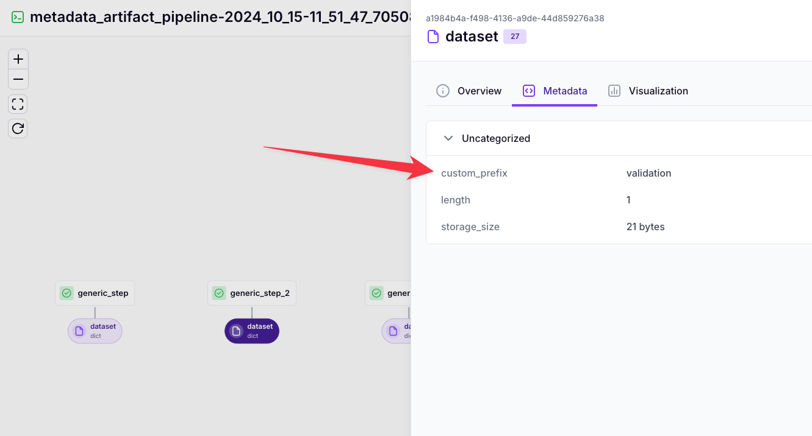

# Dynamically assign artifact names

In ZenML pipelines, you often need to reuse the same step multiple times with
different inputs, resulting in multiple artifacts. However, the default naming
convention for artifacts can make it challenging to track and differentiate
between these outputs, especially when they need to be used in subsequent
pipelines. Below you can find a detailed exploration of how you might go about dynamically generating steps and artifacts to improve pipeline
flexibility and maintainability.

By default, ZenML uses type annotations in function definitions to determine artifact names. While this works well for steps used once in a pipeline, it becomes problematic when:

1. The same step is called multiple times with different inputs.
2. The resulting artifacts need to be used in different pipelines later.
3. Output artifacts are saved with the same name and incremented version numbers.

For example, when using a preprocessor step that needs to transform train, validation, and test data separately, you might end up with three versions of an artifact called `transformed_data`, making it difficult to track which is which.

ZenML offers two possible ways to address this problem:

1. Using factory functions to create dynamic steps with custom artifact names.
2. Using metadata to identify artifacts in a single step.

## 1. Using factory functions for dynamic artifact names

This approach allows you to create steps with custom artifact names dynamically:

```python
from typing import Any, Dict
from typing_extensions import Annotated
from zenml import step, pipeline, get_step_context, ArtifactConfig

def create_step(prefix: str):
    def _entrypoint(data: Any) -> Annotated[Dict[str, Any], ArtifactConfig(name=f"{prefix}_artifact")]:
        context = get_step_context()
        return {"processed_data": data, "step_name": context.step_name}

    step_name = f"dynamic_step_{prefix}"
    _entrypoint.__name__ = step_name
    s = step(_entrypoint)
    globals()[step_name] = s
    return s

# Create the dynamic steps
train_step = create_step(prefix="train")
validation_step = create_step(prefix="validation")
test_step = create_step(prefix="test")

# Resolve the steps
train_step.resolve()
validation_step.resolve()
test_step.resolve()

@pipeline
def dynamic_artifact_pipeline(train_data, val_data, test_data):
    train_result = train_step(train_data)
    validation_result = validation_step(val_data)
    test_result = test_step(test_data)


dynamic_artifact_pipeline(train_data=1, val_data=2, test_data=3)
```

This method generates unique artifact names for each step, making it easier to
track and retrieve specific artifacts later in your workflow.


One caveat applies to this first method which is that either of the following
two things must be true:

- The factory must be in the same file as where the steps are defined -> This is
  so the logic with `globals()` works
- The user must have use the same variable name for the step as the `__name__`
  of the entrypoint function

As you can see, this is not always possible or desirable and you should use
the second method if you can.

## 2. Using Metadata for Custom Artifact Identification

If you prefer using a single step and differentiating artifacts through metadata, try this approach:

```python
from typing import Any, Dict
from typing_extensions import Annotated
from zenml import step, get_step_context, pipeline

@step
def generic_step(data: Any, prefix: str) -> Annotated[Dict[str, Any], "dataset"]:
    result = {"processed_data": data}

    # Add custom metadata
    step_context = get_step_context()
    step_context.add_output_metadata(
        output_name="dataset",
        metadata={"custom_prefix": prefix}
    )

    return result

@pipeline
def metadata_artifact_pipeline(train_data, val_data, test_data):
    generic_step(train_data, prefix="train")
    generic_step(val_data, prefix="validation")
    generic_step(test_data, prefix="test")

metadata_artifact_pipeline(train_data=1, val_data=2, test_data=3)
```

We can see the metadata in the dashboard:



This method uses a single `generic_step` but adds custom metadata to each artifact. You can later use this metadata to identify and differentiate between artifacts:

```python
from zenml.client import Client

client = Client()
artifacts = client.list_artifact_versions("generic_artifact")
for artifact in artifacts:
    prefix = artifact.run_metadata.get("custom_prefix")
    if prefix == "train":
        train_data = artifact.load()
    elif prefix == "validation":
        val_data = artifact.load()
    elif prefix == "test":
        test_data = artifact.load()
```

Both solutions provide ways to custom-identify your artifacts without modifying
ZenML's core functionality. The factory function approach offers more control
over the artifact name itself, while the metadata approach maintains consistent
artifact names but adds custom metadata for identification.

<!-- For scarf -->
<figure></figure>


