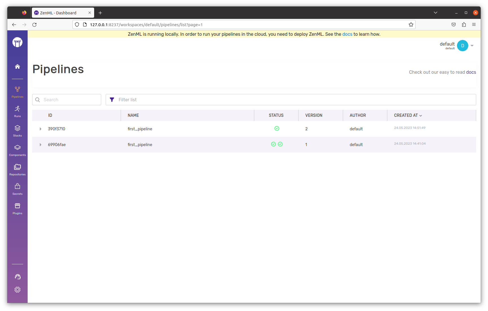


This is an older version of the ZenML documentation. To read and view the latest version please [visit this up-to-date URL](https://docs.zenml.io).



# Version pipelines

You might have noticed that when you run a pipeline in ZenML with the same name, but with different steps, it creates a new **version** of the pipeline. Consider our example pipeline:

```python
from zenml import pipeline

@pipeline
def first_pipeline(gamma: float = 0.002):
    X_train, X_test, y_train, y_test = training_data_loader()
    svc_trainer(gamma=gamma, X_train=X_train, y_train=y_train)


if __name__ == "__main__":
    first_pipeline()
```

Running this the first time will create a single `run` for `version 1` of the pipeline called `first_pipeline`.

```
$python run.py
...
Registered pipeline first_pipeline (version 1).
...
```

Running it again (`python run.py`) will create _yet another_ `run` for `version 1` of the pipeline called `first_pipeline`. So now the same pipeline has two runs. You can also verify this in the dashboard.

However, now let's change the pipeline configuration itself. You can do this by modifying the step connections within the `@pipeline` function or by replacing a concrete step with another one. For example, let's create an alternative step called `digits_data_loader` which loads a different dataset.

```python
import pandas as pd

from zenml import step
from typing import Tuple
from typing_extensions import Annotated

@step
def digits_data_loader() -> Tuple[
    Annotated[pd.DataFrame, "X_train"],
    Annotated[pd.DataFrame, "X_test"],
    Annotated[pd.Series, "y_train"],
    Annotated[pd.Series, "y_test"],
]:
    """Loads the digits dataset and splits it into train and test data."""
    # Load data from the digits dataset
    digits = load_digits(as_frame=True)
    # Split into datasets
    X_train, X_test, y_train, y_test = train_test_split(
        digits.data, digits.target, test_size=0.2, shuffle=True
    )
    return X_train, X_test, y_train, y_test


@pipeline
def first_pipeline(gamma: float = 0.002):
    X_train, X_test, y_train, y_test = digits_data_loader()
    svc_trainer(gamma=gamma, X_train=X_train, y_train=y_train)


if __name__ == "__main__":
    first_pipeline()
```

```bash
python run.py
...
Registered pipeline first_pipeline (version 2).
...
```

This will now create a single `run` for `version 2` of the pipeline called `first_pipeline`.

<figure><figcaption></figcaption></figure>

<figure><figcaption></figcaption></figure>
