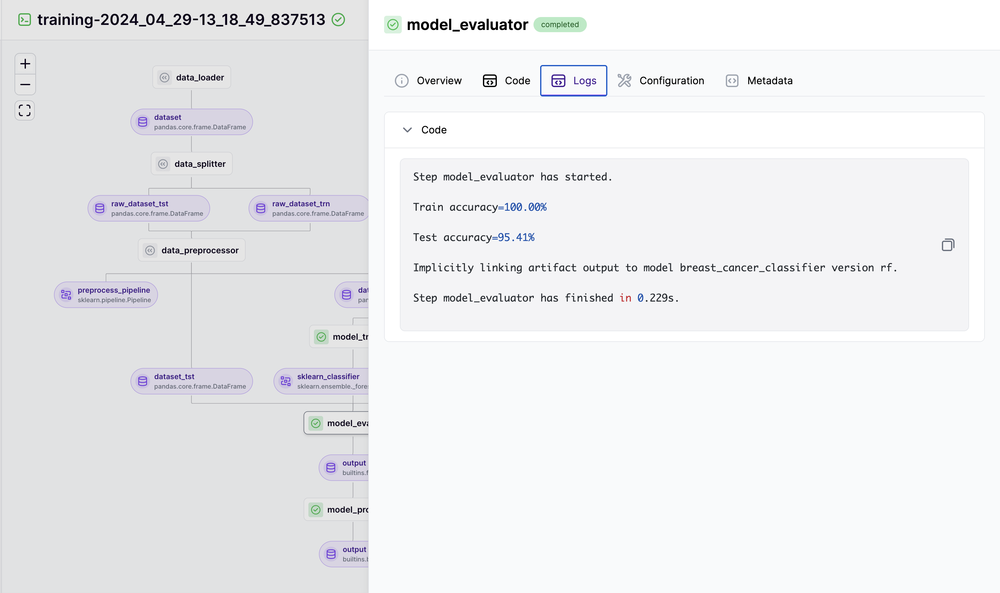

# Viewing logs on the dashboard

By default, ZenML uses a logging handler to capture the logs that occur during the execution of a step. Users are free to use the default python logging module or print statements, and ZenML's logging handler will catch these logs and store them.

```python
import logging

from zenml import step

@step 
def my_step() -> None:
    logging.warning("`Hello`")  # You can use the regular `logging` module.
    print("World.")  # You can utilize `print` statements as well. 
```

These logs are stored within the respective artifact store of your stack. This means that you can only view these logs in the dashboard
*if the deployed ZenML server has direct access to the underlying artifact store*. There are two cases in which this will be true:

* In case of a local ZenML server (via `zenml login --local`), both local and remote artifact stores may be accessible, depending on configuration of the client.
* In case of a deployed ZenML server, logs for runs on a [local artifact store](../../component-guide/artifact-stores/local.md) will not be accessible. Logs
for runs using a [remote artifact store](../../user-guide/production-guide/remote-storage.md) **may be** accessible, if the artifact store has been configured
with a [service connector](../../infrastructure-deployment/auth-management/service-connectors-guide.md). Please read [this chapter](../../user-guide/production-guide/remote-storage.md) of
the production guide to learn how to configure a remote artifact store with a service connector.

If configured correctly, the logs are displayed in the dashboard as follows:




If you do not want to store the logs for your pipeline (for example due to performance reduction or storage limits),
you can follow [these instructions](./enable-or-disable-logs-storing.md).


<!-- For scarf -->
<figure></figure>
