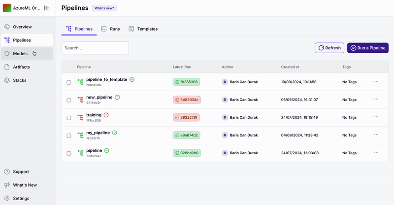

Are you tired of constantly tweaking code to adjust your pipeline 
configurations? Meet **Run Templates**, a powerful ZenML Pro feature designed 
to simplify and accelerate your workflow!

## What are Run Templates?

**Run Templates** are pre-defined, parameterized configurations for your ZenML 
pipelines that can be easily executed from the ZenML dashboard or via our 
Client/REST API. Think of them as blueprints for your pipeline runs, ready 
to be customized on the fly.

## Why Use Run Templates?

- **Efficient Iteration**: Test different configurations rapidly without 
modifying your codebase.
- **Accessibility**: Empower non-technical team members to run pipelines with 
custom parameters.
- **API-Friendly**: Perfect for integration with other tools and 
automation workflows.

## Getting Started


Ready to streamline your ML pipeline execution? [Sign up here](https://cloud.zenml.io) 
for [ZenML Pro](https://zenml.io/pro) to unlock the full potential of Run 
Templates and take your ML workflow to the next level!


In the following sections, we'll dive deeper into creating, managing, and 
running templates to maximize your productivity.

<table data-view="cards"><thead><tr><th></th><th></th><th></th><th data-hidden data-card-target data-type="content-ref"></th></tr></thead><tbody><tr><td>Create a run template</td><td></td><td></td><td><a href="create-a-run-template.md">create-a-run-template.md</a></td></tr><tr><td>Run a template</td><td></td><td></td><td><a href="run-a-template.md">run-a-template.md</a></td></tr></tbody></table>

<figure><figcaption></figcaption></figure>

