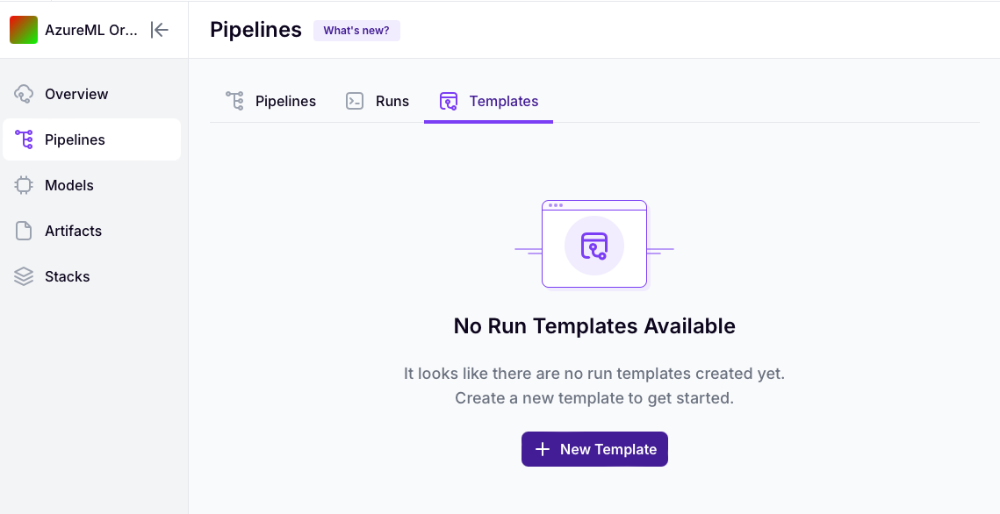
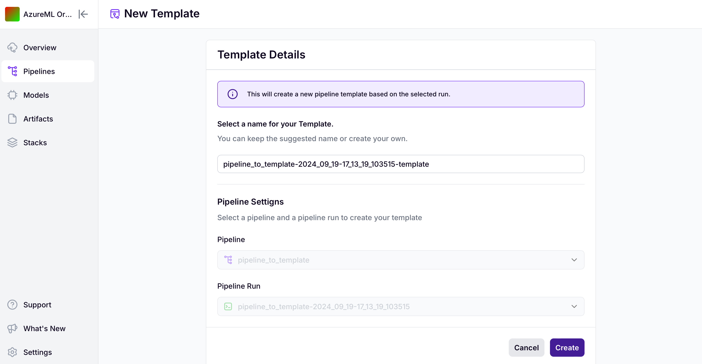

# Create a run template from a previous pipeline run


This is a [ZenML Pro](https://zenml.io/pro)-only feature. Please
[sign up here](https://cloud.zenml.io) to get access.


In order to create a run template, you need **a pipeline run that was executed
on a remote stack** (i.e. at least a remote orchestrator, artifact store,
and container registry). Once this requirement is fulfilled, you can create a
template based on this run by either using our Python SDK or our dashboard.

## Create a template using the Python SDK

You can use the ZenML client to create a run template:

```python
from zenml.client import Client

run = Client().get_pipeline_run("RUN_NAME_OR_ID")

Client().create_run_template(
    name="TEMPLATE_NAME",
    deployment_id=run.deployment_id
)
```

## Create a template using the dashboard

In order to create a template over the dashboard, go to your pipelines page 
and switch over to the templates tab:



You can click `+ New Template`, give it a name and choose a pipeline and run
to create a template.



<!-- For scarf -->
<figure></figure>
