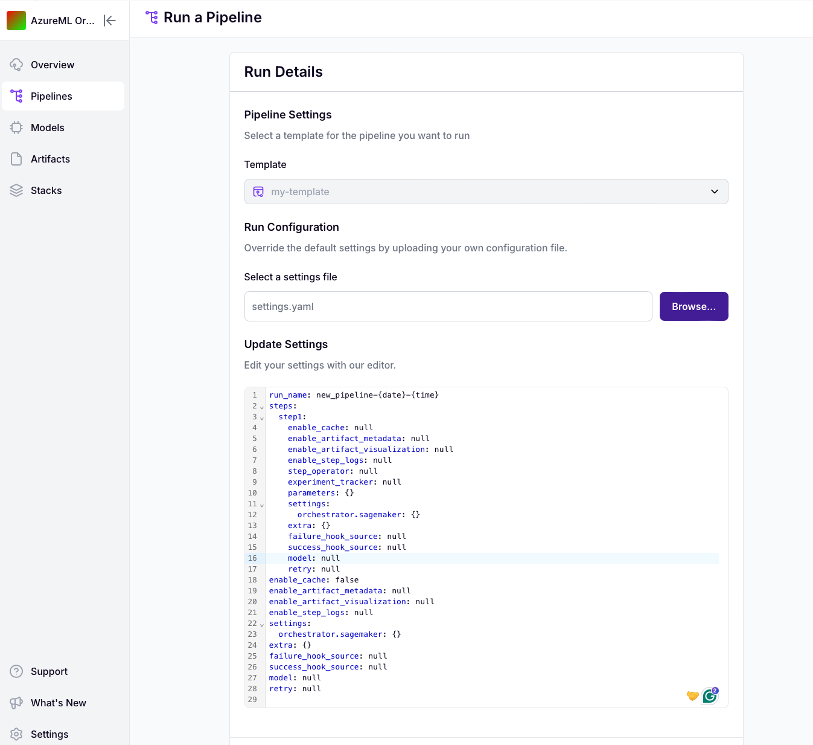

# Run a template


This is a [ZenML Pro](https://zenml.io/pro)-only feature. Please
[sign up here](https://cloud.zenml.io) to get access.


Once your template is set up, you can **run** it and create a new pipeline run 
that will be conducted on the same stack. Before it starts, you have a window
to seamlessly readjust the configuration of your pipelines and steps.

## Run a template using the Python SDK

You can use the ZenML client to run a template:

```python
from zenml.client import Client

template = Client().get_run_template("TEMPLATE_NAME")

config = template.config_template

# [OPTIONAL] ---- modify the config here ----

Client().trigger_pipeline(
    template_id=template.id,
    run_configuration=config,
)
```

## Run a template using the dashboard

In order to run a template from the dashboard:

- You can either click `Run a Pipeline` on the main `Pipelines` page, or
- You can go to a specific template page and click on `Run Template`.

Either way, you will be forwarded to a page where you will see the 
`Run Details`. Here, you have the option to upload a `.yaml` [configurations
file](https://docs.zenml.io/how-to/use-configuration-files) or change the 
configuration on the go by using our editor **(powered with auto-completion and 
type hints)**.



<!-- For scarf -->
<figure></figure>
