
This is an older version of the ZenML documentation. To read and view the latest version please [visit this up-to-date URL](https://docs.zenml.io).



# Dashboard Features

The ZenML dashboard is a powerful web-based interface that provides visualization, management, and analysis capabilities for your ML workflows. This guide offers a comprehensive overview of the dashboard's features, helping you leverage its full potential for monitoring, managing, and optimizing your machine learning pipelines.

## Introduction

The ZenML dashboard serves as a visual control center for your ML operations, offering intuitive interfaces to navigate pipelines, artifacts, models, and metadata. Whether you're using the open-source version or ZenML Pro, the dashboard provides essential capabilities to enhance your ML workflow management.

## Open Source Dashboard Features

The open-source version of ZenML includes a robust set of dashboard features that provide significant value for individual practitioners and teams.

### Pipeline Visualization

The dashboard renders your pipeline as an interactive Directed Acyclic Graph (DAG), making it easy to understand the workflow structure and dependencies between steps.

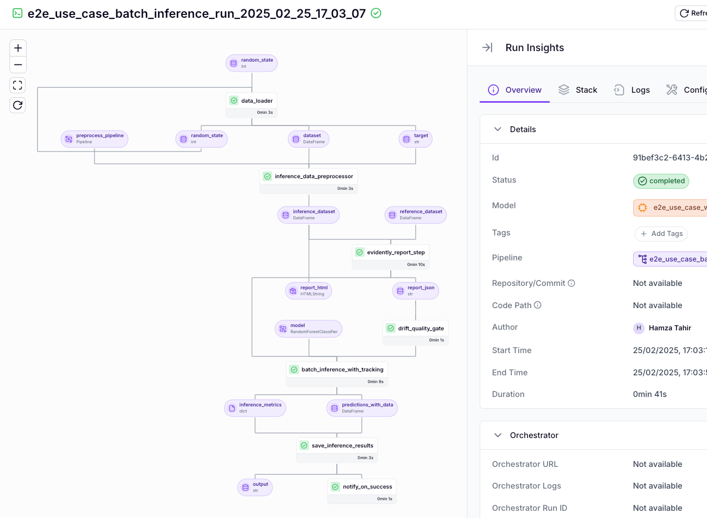

This visualization enables you to:
- See the execution flow between pipeline steps
- Identify bottlenecks or failures quickly
- Understand dependencies between different components
- Track pipeline execution status in real-time

```python
from zenml import pipeline

# Pipelines automatically generate visualizations in the dashboard
@pipeline
def my_training_pipeline():
    # Note: load_data, preprocess, train_model, evaluate_model would be custom step functions
    data = load_data()
    processed_data = preprocess(data)
    model = train_model(processed_data)
    evaluate_model(model, processed_data)
```

### Pipeline Run Management

The dashboard maintains a comprehensive history of pipeline runs, allowing you to:

```python
from zenml.client import Client

# Programmatically access pipeline runs that are visible in the dashboard
pipeline_runs = Client().list_pipeline_runs(
    pipeline_name="my_training_pipeline"
)
```

In the dashboard interface, you can:
- Browse through previous executions
- Compare configurations across runs
- Track changes in pipeline structure over time
- Filter runs by status, name, or other attributes

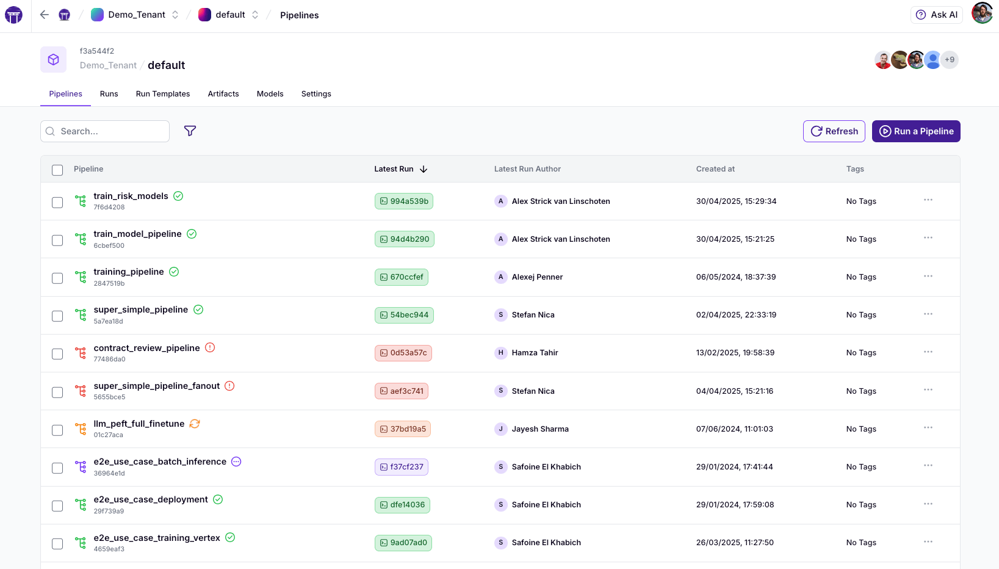

### Artifact Visualization

The dashboard provides built-in visualization capabilities for artifacts produced during pipeline execution.

#### Automatic Data Type Visualizations

Common data types receive automatic visualizations, including:

- Pandas DataFrames displayed as interactive tables
- NumPy arrays rendered as appropriate charts or heatmaps
- Images shown directly in the browser
- Text data formatted for readability

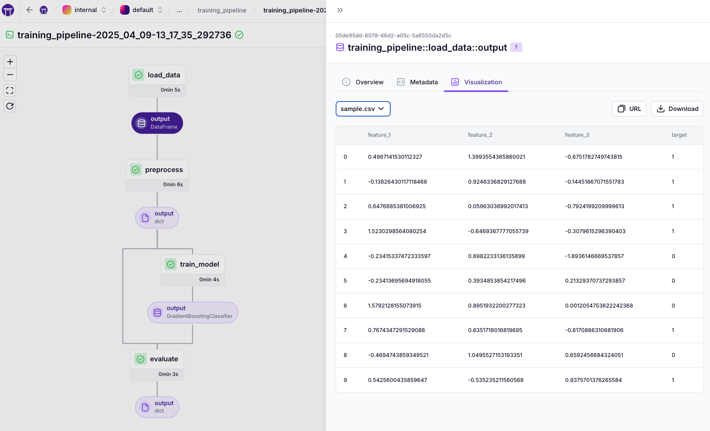

#### Artifact Lineage Tracking

The dashboard shows how artifacts are connected across pipeline steps, enabling you to:
- Trace data transformations through your pipeline
- Understand how intermediate outputs contribute to final results
- Verify data flow through complex workflows

### Step Execution Details

#### Logs and Outputs

Access detailed logs for each step execution directly in the dashboard:
- View standard output and error logs
- Monitor execution progress
- Troubleshoot errors with full context
- Search through logs to identify specific events

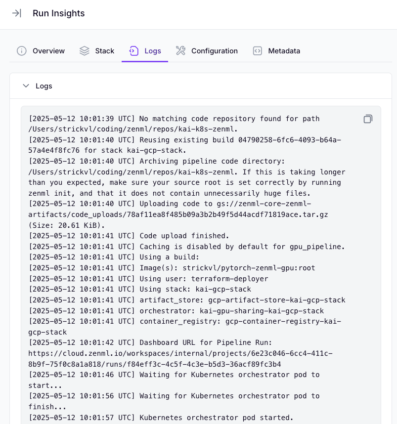

#### Runtime Metrics

Monitor runtime performance metrics for each step:
- Execution duration
- Resource utilization patterns
- Start and end timestamps
- Cache hit/miss information

### Stack and Component Management

The dashboard provides a visual interface for managing your ZenML infrastructure through stacks and components. This graphical approach to MLOps infrastructure management simplifies what would otherwise require complex CLI commands or code.

#### Stack Creation and Configuration

Creating ML infrastructure stacks through the dashboard is intuitive and visual. The interface guides you through selecting compatible components and configuring their settings. You can see the entire stack architecture at a glance, making it easier to understand the relationships between different infrastructure pieces.

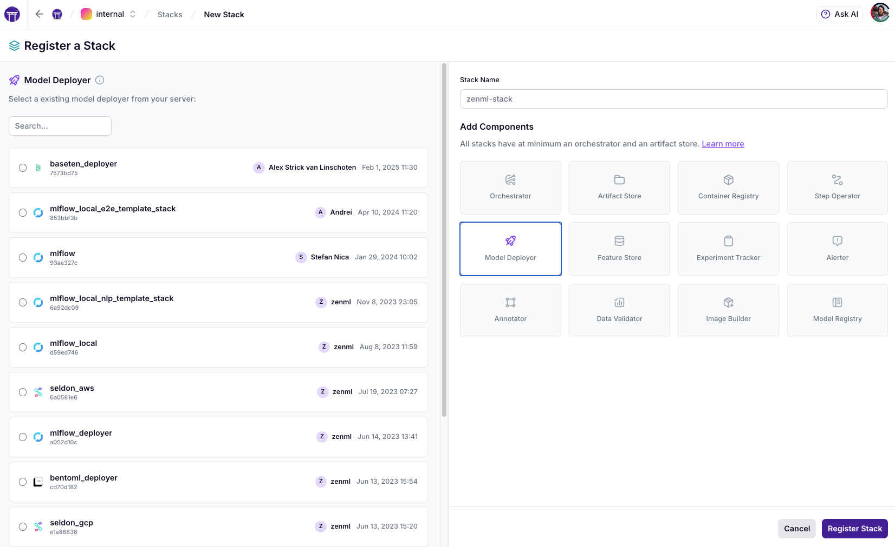

When building a stack, the dashboard helps you browse available components by category and suggests compatible options. Once created, stacks can be shared with team members, enabling consistent infrastructure across your organization.

#### Component Registration

The dashboard streamlines the process of registering individual components like orchestrators, artifact stores, and container registries. Instead of writing configuration code, you can use form-based interfaces to set up each component.

The UI helps connect components to appropriate service connectors and validates
settings before saving. This visual approach to component management reduces
configuration errors and simplifies the setup process, especially for team
members who may not be familiar with the underlying infrastructure details.

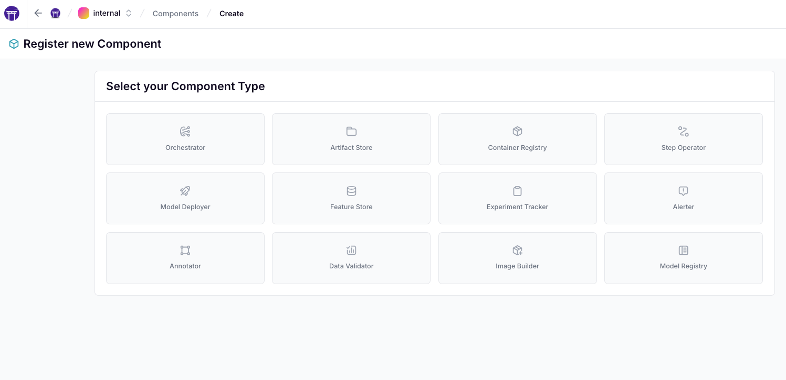

### Integration-Specific Visualizations

The dashboard supports specialized visualizations for outputs from popular integrations:

#### Analytics Reports and Visualizations

- Evidently reports as interactive HTML
- Great Expectations validation results with detailed insights
- WhyLogs profile visualizations
- Confusion matrices and classification reports
- Custom visualization components for specialized data types

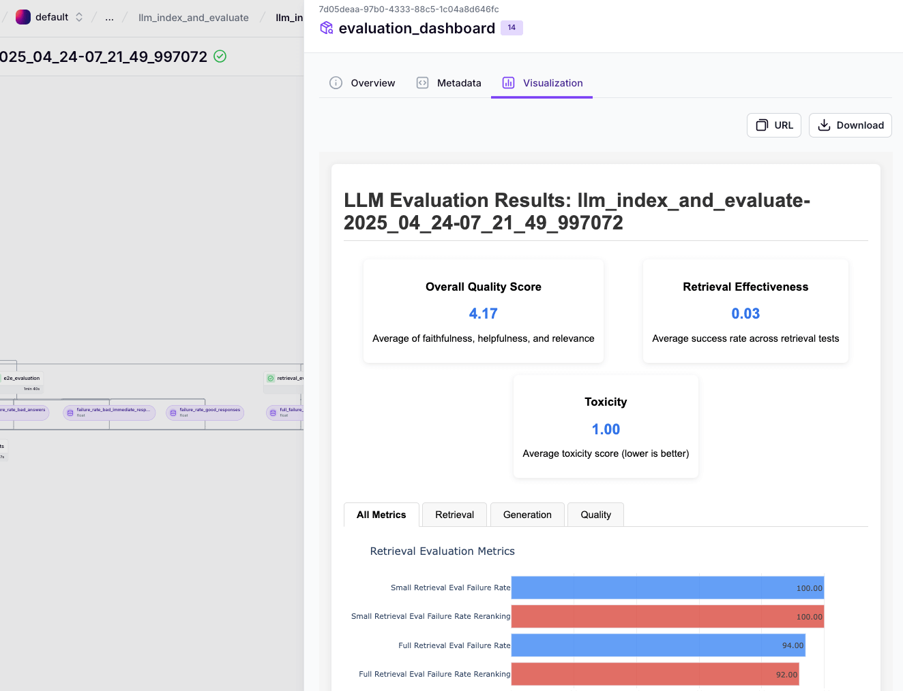

## ZenML Pro Dashboard Features


The following features are available in [ZenML Pro](https://zenml.io/pro). While the basic dashboard is available in the open-source version, these enhanced capabilities provide more advanced visualization, management, and analysis tools.


### Advanced Artifact Control Plane

ZenML Pro provides a sophisticated artifact control plane that enhances your ability to manage and understand data flowing through your pipelines.

#### Comprehensive Metadata Management

The Pro dashboard transforms how you interact with pipeline and model metadata through its powerful exploration tools. When examining ML workflows, metadata provides crucial context about performance metrics, parameters, and execution details.

With the dashboard, you can browse the full set of metadata attributes and apply filters to focus on specific metrics. The interface tracks historical changes to these values, making it easy to understand how your models evolve over time.

Customizable metadata views adapt to different analysis needs, whether you're comparing accuracy across runs or examining resource utilization patterns. This metadata visualization integrates seamlessly with artifact lineage tracking, creating a complete picture of your ML workflow from inputs to outputs.

```python
from zenml import step, log_metadata, get_step_context

@step
def evaluate():
    # Log metrics that will be visualized in the dashboard
    log_metadata(
        metadata={
            "accuracy": 0.95,
            "precision": 0.92,
            "recall": 0.91,
            "f1_score": 0.93
        }
    )
```

### Model Control Plane (MCP)

The Model Control Plane provides centralized model management capabilities designed for production ML workflows.

#### Model Version Management

Track and manage model versions with features like:
- Clear visualization of model version history
- Detailed comparisons between versions
- Performance metrics for each version
- Linkage to generating pipelines and input artifacts

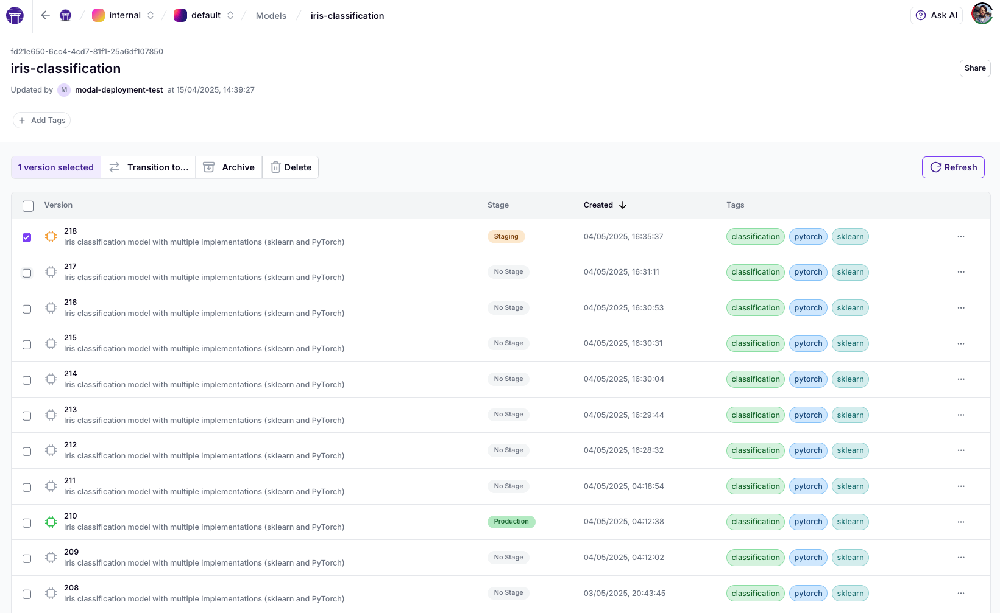

```python
from zenml import Model, pipeline
from zenml.enums import ModelStages

# Models created in code are visible in the dashboard
@pipeline(
    model=Model(
        name="iris_classifier",
        version="1.0.5"
    )
)
def training_pipeline():
    # Pipeline implementation...
```

#### Model Stage Transitions

The Pro dashboard allows you to manage model lifecycle stages:
- Move models between stages (latest, staging, production, archived)
- Track transition history and approvals
- Configure automated promotion rules
- Monitor model status across environments

### Role-Based Access Control and Team Management

ZenML Pro provides comprehensive role-based access control (RBAC) features through the dashboard, enabling enterprise-level user and resource management:

#### Organization and Team Structure

- **Organizations**: Top-level entities containing users, teams, and workspaces
- **Teams**: Groups of users with assigned roles for simplified permission management
- **Workspaces**: Isolated ZenML deployments with separate resources
- **Projects**: Logical subdivisions for organizing related ML assets

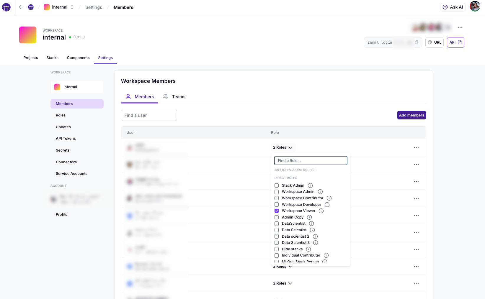

#### Role Management

The dashboard provides intuitive interfaces for managing roles at different levels:

- **Organization roles**: Admin, Manager, Viewer, Billing Admin, Member
- **Workspace roles**: Admin, Developer, Contributor, Viewer, Stack Admin
- **Project roles**: Admin, Developer, Contributor, Viewer
- **Custom roles**: Create roles with fine-grained permissions

#### Access Control UI

The dashboard makes it easy to:
- Configure user and team permissions
- Manage resource sharing
- Implement least-privilege access policies
- Review and audit access rights
- Visualize permission hierarchies

### Experiment Comparison Tools

ZenML Pro offers powerful tools for comparing experiments and understanding the relationships between different runs.

#### Table View Comparisons

Compare metadata, configurations, and outcomes across runs:
- Side-by-side comparison of metrics
- Highlight differences between runs
- Sort and filter by any attribute
- Export comparison data for further analysis

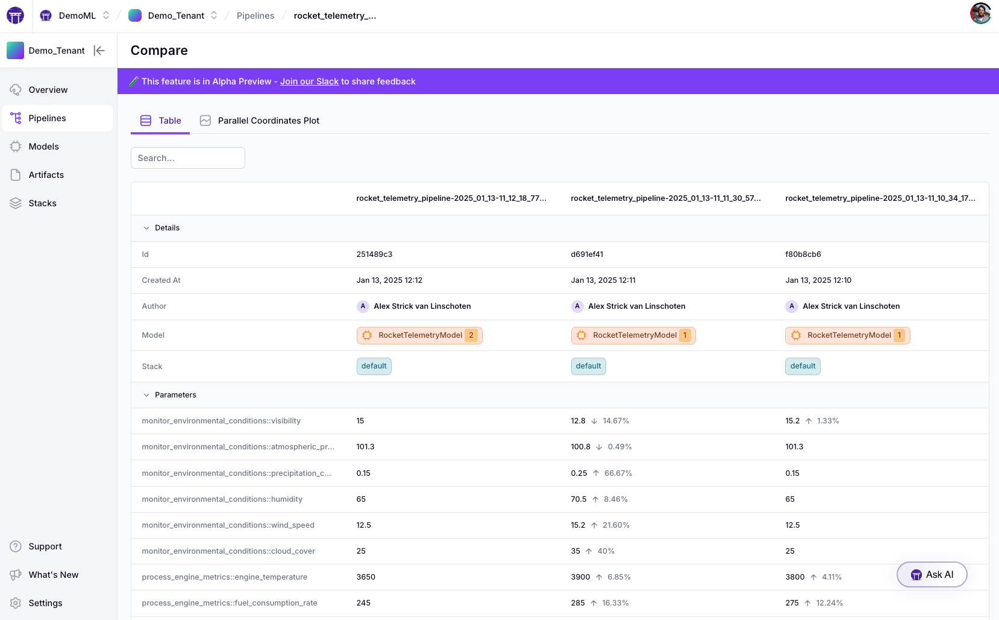

#### Parallel Coordinates Visualization

Understand complex relationships between parameters and outcomes:
- Visualize multiple dimensions simultaneously
- Identify patterns and correlations
- Filter runs interactively
- Focus on specific parameter ranges

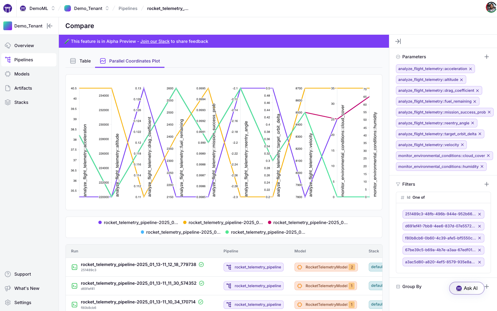


## Dashboard Best Practices

### Organizing Your Dashboard

- **Use Tags**: Apply consistent tags to pipelines, runs, and artifacts to make filtering more effective
- **Naming Conventions**: Create clear naming conventions for pipelines and artifacts
- **Regular Cleanup**: Archive or delete unnecessary runs to maintain dashboard performance
- **Capture Rich Metadata**: The more metadata you track, the more valuable your dashboard visualizations become

### Dashboard for Teams

- Establish consistent patterns for pipeline organization
- Define team conventions for artifact naming and tagging
- Leverage shared stacks and components
- Use the dashboard as a communication tool during team reviews

## Conclusion

Whether you're using the open-source version or ZenML Pro, the dashboard provides powerful capabilities to enhance your ML workflow visibility, management, and optimization. As you build more complex pipelines and models, these visualization and management features become increasingly valuable for maintaining efficiency and quality in your ML operations.


**OSS vs Pro Feature Summary:**
* **ZenML OSS:** Includes pipeline DAG visualization, artifact visualization, integration-specific visualizations, run history, and step execution details
* **ZenML Pro:** Adds model control plane, experiment comparison tools, and comprehensive role-based access control (RBAC) with team management capabilities

