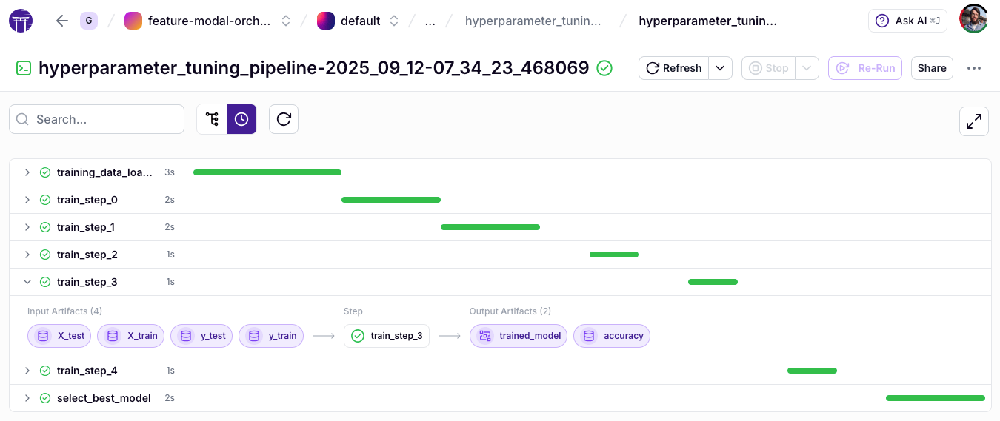

The ZenML dashboard serves as a visual control center for your ML operations, offering intuitive interfaces to navigate pipelines, artifacts, models, and metadata. This guide offers a comprehensive overview of the dashboard's features, helping you leverage its full potential for monitoring, managing, and optimizing your machine learning workflows.

## Open Source Dashboard

The open-source version of ZenML includes a robust set of dashboard features that provide significant value for individual practitioners and teams.

### Pipeline Visualization Options

ZenML offers two complementary ways to visualize pipeline executions: the **DAG View** and the **Timeline View**. Each is optimized for different aspects of pipeline analysis, helping you understand both the structure and performance of your workflows.

#### DAG View

The DAG (Directed Acyclic Graph) view displays your pipeline as a network graph, showing how data flows between steps. It explicitly visualizes parallel branches, artifact connections, and the overall architecture of your workflow.


This view is best for understanding pipeline architecture, tracing data lineage, and debugging dependency issues. While comprehensive, it can become visually dense in pipelines with a very large number of steps.

#### Timeline View

The Timeline View offers a Gantt chart-style visualization where each step is represented by a horizontal bar whose length corresponds to its execution duration. This view excels at performance analysis, making it easy to spot bottlenecks and understand the runtime characteristics of your pipeline.



This view is ideal for performance optimization, identifying bottlenecks, and monitoring pipeline efficiency, especially for large pipelines. For pipelines with a high number of steps (e.g., over 100), ZenML automatically defaults to the Timeline View to ensure a responsive and clear user experience.

These views are complementary and work best when used together. The DAG view helps you understand **what** your pipeline does and **how** it's structured, while the Timeline view shows you **when** things happen and **where** to focus optimization efforts.

**Use the DAG View when you need to:**
- Understand how data flows through your pipeline.
- Debug issues related to step dependencies.
- Explain the pipeline architecture to stakeholders.
- Verify that parallel execution paths are configured correctly.

**Use the Timeline View when you need to:**
- Identify performance bottlenecks.
- Optimize pipeline execution time.
- Compare execution duration across steps.
- Get a quick overview of which steps dominate runtime.

### Pipeline Run Management

The dashboard maintains a comprehensive history of pipeline runs, allowing you to:

- Browse through previous executions
- Compare configurations across runs
- Track changes in pipeline structure over time
- Filter runs by status, name, or other attributes


### Artifact Visualization

The dashboard provides built-in visualization capabilities for artifacts produced during pipeline execution.

#### Automatic Data Type Visualizations

Common data types receive automatic visualizations, including:

- Pandas DataFrames displayed as interactive tables
- NumPy arrays rendered as appropriate charts or heatmaps
- Images shown directly in the browser
- Text data formatted for readability


#### Artifact Lineage Tracking

The dashboard shows how artifacts are connected across pipeline steps, enabling you to:
- Trace data transformations through your pipeline
- Understand how intermediate outputs contribute to final results
- Verify data flow through complex workflows

### Step Execution Details

#### Logs and Outputs

Access detailed logs for each step execution directly in the dashboard:
- View standard output and error logs
- Monitor execution progress
- Troubleshoot errors with full context
- Search through logs to identify specific events


#### Runtime Metrics

Monitor runtime performance metrics for each step:
- Execution duration
- Resource utilization patterns
- Start and end timestamps
- Cache hit/miss information

### Stack and Component Management

The dashboard provides a visual interface for managing your ZenML infrastructure through stacks and components. This graphical approach to MLOps infrastructure management simplifies what would otherwise require complex CLI commands or code.

#### Stack Creation and Configuration

Creating ML infrastructure stacks through the dashboard is intuitive and visual. The interface guides you through selecting compatible components and configuring their settings. You can see the entire stack architecture at a glance, making it easier to understand the relationships between different infrastructure pieces.


When building a stack, the dashboard helps you browse available components by category and suggests compatible options. Once created, stacks can be shared with team members, enabling consistent infrastructure across your organization.

#### Component Registration

The dashboard streamlines the process of registering individual components like orchestrators, artifact stores, and container registries. Instead of writing configuration code, you can use form-based interfaces to set up each component.

The UI helps connect components to appropriate service connectors and validates
settings before saving. This visual approach to component management reduces
configuration errors and simplifies the setup process, especially for team
members who may not be familiar with the underlying infrastructure details.


### Integration-Specific Visualizations

The dashboard supports specialized visualizations for outputs from popular integrations:

- Evidently reports as interactive HTML
- Great Expectations validation results with detailed insights
- WhyLogs profile visualizations
- Confusion matrices and classification reports
- Custom visualization components for specialized data types


## ZenML Pro Dashboard

ZenML Pro extends the open-source dashboard with additional capabilities for collaboration, governance, and workflow management. For a broader overview of ZenML Pro features, see [ZenML Pro](https://www.zenml.io/pro). For a side-by-side comparison of ZenML OSS vs ZenML Pro, see [ZenML Open Source vs Pro](https://www.zenml.io/open-source-vs-pro).

This page focuses on Pro features that surface in the dashboard UI. ZenML Pro also includes platform capabilities that are not specific to the dashboard.

### Projects and Access Management

ZenML Pro introduces organizations, workspaces, teams, and projects. **Projects** are the main way to organize related pipelines, runs, artifacts, and models and to separate concerns across teams or environments. In the Pro dashboard, you can create and manage projects, switch project context, and view assets scoped to the active project.

#### Organization and Team Structure

- **Organizations**: Top-level entities containing users, teams, and workspaces
- **Teams**: Groups of users with assigned roles for simplified permission management
- **Workspaces**: Isolated ZenML deployments with separate resources
- **Projects**: Logical subdivisions for organizing related ML assets


#### Role Management

The dashboard provides intuitive interfaces for managing roles at different levels:

- **Organization roles**: Admin, Manager, Viewer, Billing Admin, Member
- **Workspace roles**: Admin, Developer, Contributor, Viewer, Stack Admin
- **Project roles**: Admin, Developer, Contributor, Viewer
- **Custom roles**: Create roles with fine-grained permissions

#### Access Control UI

The dashboard makes it easy to:
- Configure user and team permissions
- Manage resource sharing
- Implement least-privilege access policies
- Review and audit access rights
- Visualize permission hierarchies

### Pipeline Snapshots

A **pipeline snapshot** is an immutable, runnable representation of a pipeline that captures its structure and configuration. Snapshots enable teams to run pipelines from the dashboard without direct access to the codebase and help standardize execution across different users and environments.

To learn how to create and run snapshots from the dashboard, see [Pipeline Snapshots](../snapshots/snapshots.md).

### Artifact Control Plane

ZenML Pro provides a sophisticated artifact control plane that enhances your ability to manage and understand data flowing through your pipelines.

#### Comprehensive Metadata Management

The Pro dashboard transforms how you interact with pipeline and model metadata through its powerful exploration tools. When examining ML workflows, metadata provides crucial context about performance metrics, parameters, and execution details.

With the dashboard, you can browse the full set of metadata attributes and apply filters to focus on specific metrics. The interface tracks historical changes to these values, making it easy to understand how your models evolve over time.

Customizable metadata views adapt to different analysis needs, whether you're comparing accuracy across runs or examining resource utilization patterns. This metadata visualization integrates seamlessly with artifact lineage tracking, creating a complete picture of your ML workflow from inputs to outputs.

```python
from zenml import step, log_metadata, get_step_context

@step
def evaluate():
    # Log metrics that will be visualized in the dashboard
    log_metadata(
        metadata={
            "accuracy": 0.95,
            "precision": 0.92,
            "recall": 0.91,
            "f1_score": 0.93
        }
    )
```

### Model Control Plane

The Model Control Plane provides centralized model management capabilities designed for production ML workflows that allows you to have:

- Clear visualization of model version history
- Detailed comparisons between versions
- Performance metrics for each version
- Linkage to generating pipelines and input artifacts


Additionally, the Pro dashboard allows you to manage model lifecycle stages:

- Move models between stages (latest, staging, production, archived)
- Track transition history and approvals
- Configure automated promotion rules
- Monitor model status across environments

### Experiment Comparison Tools

ZenML Pro offers powerful tools for comparing experiments and understanding the relationships between different runs.

#### Table View Comparisons

Compare metadata, configurations, and outcomes across runs:
- Side-by-side comparison of metrics
- Highlight differences between runs
- Sort and filter by any attribute
- Export comparison data for further analysis


#### Parallel Coordinates Visualization

Understand complex relationships between parameters and outcomes:
- Visualize multiple dimensions simultaneously
- Identify patterns and correlations
- Filter runs interactively
- Focus on specific parameter ranges



For the complete ZenML Pro feature set (including capabilities that are not dashboard-specific), see [ZenML Pro](https://www.zenml.io/pro) and [ZenML Open Source vs Pro](https://www.zenml.io/open-source-vs-pro).
