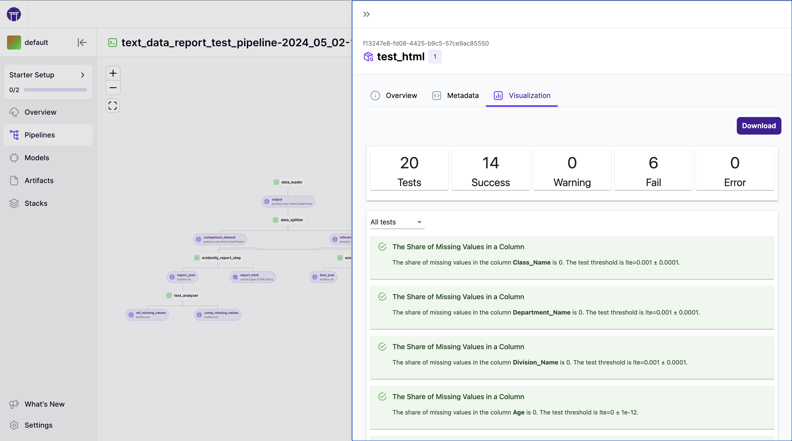

# Handle custom data types

A ZenML pipeline is built in a data-centric way. The outputs and inputs of steps define how steps are connected and the order in which they are executed. Each step should be considered as its very own process that reads and writes its inputs and outputs from and to the [artifact store](../../../component-guide/artifact-stores/artifact-stores.md). This is where **materializers** come into play.

A materializer dictates how a given artifact can be written to and retrieved from the artifact store and also contains all serialization and deserialization logic. Whenever you pass artifacts as outputs from one pipeline step to other steps as inputs, the corresponding materializer for the respective data type defines how this artifact is first serialized and written to the artifact store, and then deserialized and read in the next step.

## Built-In Materializers

ZenML already includes built-in materializers for many common data types. These are always enabled and are used in the background without requiring any user interaction / activation:

<table data-full-width="true"><thead><tr><th>Materializer</th><th>Handled Data Types</th><th>Storage Format</th></tr></thead><tbody><tr><td><a href="https://sdkdocs.zenml.io/latest/core_code_docs/core-materializers/#zenml.materializers.built_in_materializer.BuiltInMaterializer">BuiltInMaterializer</a></td><td><code>bool</code>, <code>float</code>, <code>int</code>, <code>str</code>, <code>None</code></td><td><code>.json</code></td></tr><tr><td><a href="https://sdkdocs.zenml.io/latest/core_code_docs/core-materializers/#zenml.materializers.built_in_materializer.BytesMaterializer">BytesInMaterializer</a></td><td><code>bytes</code></td><td><code>.txt</code></td></tr><tr><td><a href="https://sdkdocs.zenml.io/latest/core_code_docs/core-materializers/#zenml.materializers.built_in_materializer.BuiltInContainerMaterializer">BuiltInContainerMaterializer</a></td><td><code>dict</code>, <code>list</code>, <code>set</code>, <code>tuple</code></td><td>Directory</td></tr><tr><td><a href="https://sdkdocs.zenml.io/latest/core_code_docs/core-materializers/#zenml.materializers.numpy_materializer.NumpyMaterializer">NumpyMaterializer</a></td><td><code>np.ndarray</code></td><td><code>.npy</code></td></tr><tr><td><a href="https://sdkdocs.zenml.io/latest/core_code_docs/core-materializers/#zenml.materializers.pandas_materializer.PandasMaterializer">PandasMaterializer</a></td><td><code>pd.DataFrame</code>, <code>pd.Series</code></td><td><code>.csv</code> (or <code>.gzip</code> if <code>parquet</code> is installed)</td></tr><tr><td><a href="https://sdkdocs.zenml.io/latest/core_code_docs/core-materializers/#zenml.materializers.pydantic_materializer.PydanticMaterializer">PydanticMaterializer</a></td><td><code>pydantic.BaseModel</code></td><td><code>.json</code></td></tr><tr><td><a href="https://sdkdocs.zenml.io/latest/core_code_docs/core-materializers/#zenml.materializers.service_materializer.ServiceMaterializer">ServiceMaterializer</a></td><td><code>zenml.services.service.BaseService</code></td><td><code>.json</code></td></tr><tr><td><a href="https://sdkdocs.zenml.io/latest/core_code_docs/core-materializers/#zenml.materializers.structured_string_materializer.StructuredStringMaterializer">StructuredStringMaterializer</a></td><td><code>zenml.types.CSVString</code>, <code>zenml.types.HTMLString</code>, <code>zenml.types.MarkdownString</code></td><td><code>.csv</code> / <code>.html</code> / <code>.md</code> (depending on type)</td></tr></tbody></table>


ZenML provides a built-in [CloudpickleMaterializer](https://sdkdocs.zenml.io/latest/core\_code\_docs/core-materializers/#zenml.materializers.cloudpickle\_materializer.CloudpickleMaterializer) that can handle any object by saving it with [cloudpickle](https://github.com/cloudpipe/cloudpickle). However, this is not production-ready because the resulting artifacts cannot be loaded when running with a different Python version. In such cases, you should consider building a [custom Materializer](handle-custom-data-types.md#custom-materializers) to save your objects in a more robust and efficient format.

Moreover, using the `CloudpickleMaterializer` could allow users to upload of any kind of object. This could be exploited to upload a malicious file, which could execute arbitrary code on the vulnerable system.


## Integration Materializers

In addition to the built-in materializers, ZenML also provides several integration-specific materializers that can be activated by installing the respective [integration](../../../component-guide/README.md):

<table data-full-width="true"><thead><tr><th width="199.5">Integration</th><th width="271">Materializer</th><th width="390">Handled Data Types</th><th>Storage Format</th></tr></thead><tbody><tr><td>bentoml</td><td><a href="https://sdkdocs.zenml.io/latest/integration_code_docs/integrations-bentoml/#zenml.integrations.bentoml.materializers.bentoml_bento_materializer.BentoMaterializer">BentoMaterializer</a></td><td><code>bentoml.Bento</code></td><td><code>.bento</code></td></tr><tr><td>deepchecks</td><td><a href="https://sdkdocs.zenml.io/latest/integration_code_docs/integrations-deepchecks/#zenml.integrations.deepchecks.materializers.deepchecks_results_materializer.DeepchecksResultMaterializer">DeepchecksResultMateriailzer</a></td><td><code>deepchecks.CheckResult</code>, <code>deepchecks.SuiteResult</code></td><td><code>.json</code></td></tr><tr><td>evidently</td><td><a href="https://sdkdocs.zenml.io/latest/integration_code_docs/integrations-evidently/#zenml.integrations.evidently.materializers.evidently_profile_materializer.EvidentlyProfileMaterializer">EvidentlyProfileMaterializer</a></td><td><code>evidently.Profile</code></td><td><code>.json</code></td></tr><tr><td>great_expectations</td><td><a href="https://sdkdocs.zenml.io/latest/integration_code_docs/integrations-great_expectations/#zenml.integrations.great_expectations.materializers.ge_materializer.GreatExpectationsMaterializer">GreatExpectationsMaterializer</a></td><td><code>great_expectations.ExpectationSuite</code>, <code>great_expectations.CheckpointResult</code></td><td><code>.json</code></td></tr><tr><td>huggingface</td><td><a href="https://sdkdocs.zenml.io/latest/integration_code_docs/integrations-huggingface/#zenml.integrations.huggingface.materializers.huggingface_datasets_materializer.HFDatasetMaterializer">HFDatasetMaterializer</a></td><td><code>datasets.Dataset</code>, <code>datasets.DatasetDict</code></td><td>Directory</td></tr><tr><td>huggingface</td><td><a href="https://sdkdocs.zenml.io/latest/integration_code_docs/integrations-huggingface/#zenml.integrations.huggingface.materializers.huggingface_pt_model_materializer.HFPTModelMaterializer">HFPTModelMaterializer</a></td><td><code>transformers.PreTrainedModel</code></td><td>Directory</td></tr><tr><td>huggingface</td><td><a href="https://sdkdocs.zenml.io/latest/integration_code_docs/integrations-huggingface/#zenml.integrations.huggingface.materializers.huggingface_tf_model_materializer.HFTFModelMaterializer">HFTFModelMaterializer</a></td><td><code>transformers.TFPreTrainedModel</code></td><td>Directory</td></tr><tr><td>huggingface</td><td><a href="https://sdkdocs.zenml.io/latest/integration_code_docs/integrations-huggingface/#zenml.integrations.huggingface.materializers.huggingface_tokenizer_materializer.HFTokenizerMaterializer">HFTokenizerMaterializer</a></td><td><code>transformers.PreTrainedTokenizerBase</code></td><td>Directory</td></tr><tr><td>lightgbm</td><td><a href="https://sdkdocs.zenml.io/latest/integration_code_docs/integrations-lightgbm/#zenml.integrations.lightgbm.materializers.lightgbm_booster_materializer.LightGBMBoosterMaterializer">LightGBMBoosterMaterializer</a></td><td><code>lgbm.Booster</code></td><td><code>.txt</code></td></tr><tr><td>lightgbm</td><td><a href="https://sdkdocs.zenml.io/latest/integration_code_docs/integrations-lightgbm/#zenml.integrations.lightgbm.materializers.lightgbm_dataset_materializer.LightGBMDatasetMaterializer">LightGBMDatasetMaterializer</a></td><td><code>lgbm.Dataset</code></td><td><code>.binary</code></td></tr><tr><td>neural_prophet</td><td><a href="https://sdkdocs.zenml.io/latest/integration_code_docs/integrations-neural_prophet/#zenml.integrations.neural_prophet.materializers.neural_prophet_materializer.NeuralProphetMaterializer">NeuralProphetMaterializer</a></td><td><code>NeuralProphet</code></td><td><code>.pt</code></td></tr><tr><td>pillow</td><td><a href="https://sdkdocs.zenml.io/latest/integration_code_docs/integrations-pillow/#zenml.integrations.pillow.materializers.pillow_image_materializer.PillowImageMaterializer">PillowImageMaterializer</a></td><td><code>Pillow.Image</code></td><td><code>.PNG</code></td></tr><tr><td>polars</td><td><a href="https://sdkdocs.zenml.io/latest/integration_code_docs/integrations-polars/#zenml.integrations.polars.materializers.dataframe_materializer.PolarsMaterializer">PolarsMaterializer</a></td><td><code>pl.DataFrame</code>, <code>pl.Series</code></td><td><code>.parquet</code></td></tr><tr><td>pycaret</td><td><a href="https://sdkdocs.zenml.io/latest/integration_code_docs/integrations-pycaret/#zenml.integrations.pycaret.materializers.model_materializer.PyCaretMaterializer">PyCaretMaterializer</a></td><td>Any <code>sklearn</code>, <code>xgboost</code>, <code>lightgbm</code> or <code>catboost</code> model</td><td><code>.pkl</code></td></tr><tr><td>pytorch</td><td><a href="https://sdkdocs.zenml.io/latest/integration_code_docs/integrations-pytorch/#zenml.integrations.pytorch.materializers.pytorch_dataloader_materializer.PyTorchDataLoaderMaterializer">PyTorchDataLoaderMaterializer</a></td><td><code>torch.Dataset</code>, <code>torch.DataLoader</code></td><td><code>.pt</code></td></tr><tr><td>pytorch</td><td><a href="https://sdkdocs.zenml.io/latest/integration_code_docs/integrations-pytorch/#zenml.integrations.pytorch.materializers.pytorch_module_materializer.PyTorchModuleMaterializer">PyTorchModuleMaterializer</a></td><td><code>torch.Module</code></td><td><code>.pt</code></td></tr><tr><td>scipy</td><td><a href="https://sdkdocs.zenml.io/latest/integration_code_docs/integrations-scipy/#zenml.integrations.scipy.materializers.sparse_materializer.SparseMaterializer">SparseMaterializer</a></td><td><code>scipy.spmatrix</code></td><td><code>.npz</code></td></tr><tr><td>spark</td><td><a href="https://sdkdocs.zenml.io/latest/integration_code_docs/integrations-spark/#zenml.integrations.spark.materializers.spark_dataframe_materializer.SparkDataFrameMaterializer">SparkDataFrameMaterializer</a></td><td><code>pyspark.DataFrame</code></td><td><code>.parquet</code></td></tr><tr><td>spark</td><td><a href="https://sdkdocs.zenml.io/latest/integration_code_docs/integrations-spark/#zenml.integrations.spark.materializers.spark_model_materializer.SparkModelMaterializer">SparkModelMaterializer</a></td><td><code>pyspark.Transformer</code></td><td><code>pyspark.Estimator</code></td></tr><tr><td>tensorflow</td><td><a href="https://sdkdocs.zenml.io/latest/integration_code_docs/integrations-tensorflow/#zenml.integrations.tensorflow.materializers.keras_materializer.KerasMaterializer">KerasMaterializer</a></td><td><code>tf.keras.Model</code></td><td>Directory</td></tr><tr><td>tensorflow</td><td><a href="https://sdkdocs.zenml.io/latest/integration_code_docs/integrations-tensorflow/#zenml.integrations.tensorflow.materializers.tf_dataset_materializer.TensorflowDatasetMaterializer">TensorflowDatasetMaterializer</a></td><td><code>tf.Dataset</code></td><td>Directory</td></tr><tr><td>whylogs</td><td><a href="https://sdkdocs.zenml.io/latest/integration_code_docs/integrations-whylogs/#zenml.integrations.whylogs.materializers.whylogs_materializer.WhylogsMaterializer">WhylogsMaterializer</a></td><td><code>whylogs.DatasetProfileView</code></td><td><code>.pb</code></td></tr><tr><td>xgboost</td><td><a href="https://sdkdocs.zenml.io/latest/integration_code_docs/integrations-xgboost/#zenml.integrations.xgboost.materializers.xgboost_booster_materializer.XgboostBoosterMaterializer">XgboostBoosterMaterializer</a></td><td><code>xgb.Booster</code></td><td><code>.json</code></td></tr><tr><td>xgboost</td><td><a href="https://sdkdocs.zenml.io/latest/integration_code_docs/integrations-xgboost/#zenml.integrations.xgboost.materializers.xgboost_dmatrix_materializer.XgboostDMatrixMaterializer">XgboostDMatrixMaterializer</a></td><td><code>xgb.DMatrix</code></td><td><code>.binary</code></td></tr></tbody></table>


If you are running pipelines with a Docker-based [orchestrator](../../../component-guide/orchestrators/orchestrators.md), you need to specify the corresponding integration as `required_integrations` in the `DockerSettings` of your pipeline in order to have the integration materializer available inside your Docker container. See the [pipeline configuration documentation](../../pipeline-development/use-configuration-files/runtime-configuration.md) for more information.


## Custom materializers

### Configuring a step/pipeline to use a custom materializer

#### Defining which step uses what materializer

ZenML automatically detects if your materializer is imported in your source code and registers them for the corresponding data type (defined in `ASSOCIATED_TYPES`). Therefore, just having a custom materializer definition in your code is enough to enable the respective data type to be used in your pipelines.

However, it is best practice to explicitly define which materializer to use for a specific step and not rely on the `ASSOCIATED_TYPES` to make that connection:

```python
class MyObj:
    ...

class MyMaterializer(BaseMaterializer):
    """Materializer to read data to and from MyObj."""

    ASSOCIATED_TYPES = (MyObj)
    ASSOCIATED_ARTIFACT_TYPE = ArtifactType.DATA

    # Read below to learn how to implement this materializer

# You can define it at the decorator level
@step(output_materializers=MyMaterializer)
def my_first_step() -> MyObj:
    return 1

# No need to explicitly specify materializer here:
# it is coupled with Artifact Version generated by
# `my_first_step` already.
def my_second_step(a: MyObj):
    print(a)

# or you can use the `configure()` method of the step. E.g.:
my_first_step.configure(output_materializers=MyMaterializer)
```

When there are multiple outputs, a dictionary of type `{<OUTPUT_NAME>: <MATERIALIZER_CLASS>}` can be supplied to the decorator or the `.configure(...)` method:

```python
class MyObj1:
    ...

class MyObj2:
    ...

class MyMaterializer1(BaseMaterializer):
    """Materializer to read data to and from MyObj1."""

    ASSOCIATED_TYPES = (MyObj1)
    ASSOCIATED_ARTIFACT_TYPE = ArtifactType.DATA

class MyMaterializer2(BaseMaterializer):
    """Materializer to read data to and from MyObj2."""

    ASSOCIATED_TYPES = (MyObj2)
    ASSOCIATED_ARTIFACT_TYPE = ArtifactType.DATA

# This is where we connect the objects to the materializer
@step(output_materializers={"1": MyMaterializer1, "2": MyMaterializer2})
def my_first_step() -> Tuple[Annotated[MyObj1, "1"], Annotated[MyObj2, "2"]]:
    return 1
```

Also, as briefly outlined in the [configuration docs](../../pipeline-development/use-configuration-files/what-can-be-configured.md) section, which materializer to use for the output of what step can also be configured within YAML config files.

For each output of your steps, you can define custom materializers to handle the loading and saving. You can configure them like this in the config:

```yaml
...
steps:
  <STEP_NAME>:
    ...
    outputs:
      <OUTPUT_NAME>:
        materializer_source: run.MyMaterializer
```

Check out [this page](../../../user-guide/starter-guide/manage-artifacts.md) for information on your step output names and how to customize them.

#### Defining a materializer globally

Sometimes, you would like to configure ZenML to use a custom materializer globally for all pipelines, and override the default materializers that come built-in with ZenML. A good example of this would be to build a materializer for a `pandas.DataFrame` to handle the reading and writing of that dataframe in a different way than the default mechanism.

An easy way to do that is to use the internal materializer registry of ZenML and override its behavior:

```python
# Entrypoint file where we run pipelines (i.e. run.py)

from zenml.materializers.materializer_registry import materializer_registry

# Create a new materializer
class FastPandasMaterializer(BaseMaterializer):
    ...

# Register the FastPandasMaterializer for pandas dataframes objects
materializer_registry.register_and_overwrite_type(key=pd.DataFrame, type_=FastPandasMaterializer)

# Run your pipelines: They will now all use the custom materializer
```

### Developing a custom materializer

Now that we know how to configure a pipeline to use a custom materializer, let us briefly discuss how materializers in general are implemented.

#### Base implementation

In the following, you can see the implementation of the abstract base class `BaseMaterializer`, which defines the interface of all materializers:

```python
class BaseMaterializer(metaclass=BaseMaterializerMeta):
    """Base Materializer to realize artifact data."""

    ASSOCIATED_ARTIFACT_TYPE = ArtifactType.BASE
    ASSOCIATED_TYPES = ()

    def __init__(
        self, uri: str, artifact_store: Optional[BaseArtifactStore] = None
    ):
        """Initializes a materializer with the given URI.

        Args:
            uri: The URI where the artifact data will be stored.
            artifact_store: The artifact store used to store this artifact.
        """
        self.uri = uri
        self._artifact_store = artifact_store

    def load(self, data_type: Type[Any]) -> Any:
        """Write logic here to load the data of an artifact.

        Args:
            data_type: The type of data that the artifact should be loaded as.

        Returns:
            The data of the artifact.
        """
        # read from a location inside self.uri
        # 
        # Example:
        # data_path = os.path.join(self.uri, "abc.json")
        # with self.artifact_store.open(filepath, "r") as fid:
        #     return json.load(fid)
        ...

    def save(self, data: Any) -> None:
        """Write logic here to save the data of an artifact.

        Args:
            data: The data of the artifact to save.
        """
        # write `data` into self.uri
        # 
        # Example:
        # data_path = os.path.join(self.uri, "abc.json")
        # with self.artifact_store.open(filepath, "w") as fid:
        #     json.dump(data,fid)
        ...

    def save_visualizations(self, data: Any) -> Dict[str, VisualizationType]:
        """Save visualizations of the given data.

        Args:
            data: The data of the artifact to visualize.

        Returns:
            A dictionary of visualization URIs and their types.
        """
        # Optionally, define some visualizations for your artifact
        #
        # E.g.:
        # visualization_uri = os.path.join(self.uri, "visualization.html")
        # with self.artifact_store.open(visualization_uri, "w") as f:
        #     f.write("<html><body>data</body></html>")

        # visualization_uri_2 = os.path.join(self.uri, "visualization.png")
        # data.save_as_png(visualization_uri_2)

        # return {
        #     visualization_uri: ArtifactVisualizationType.HTML,
        #     visualization_uri_2: ArtifactVisualizationType.IMAGE
        # }
        ...

    def extract_metadata(self, data: Any) -> Dict[str, "MetadataType"]:
        """Extract metadata from the given data.

        This metadata will be tracked and displayed alongside the artifact.

        Args:
            data: The data to extract metadata from.

        Returns:
            A dictionary of metadata.
        """
        # Optionally, extract some metadata from `data` for ZenML to store.
        #
        # Example:
        # return {
        #     "some_attribute_i_want_to_track": self.some_attribute,
        #     "pi": 3.14,
        # }
        ...
```

#### Handled data types

Each materializer has an `ASSOCIATED_TYPES` attribute that contains a list of data types that this materializer can handle. ZenML uses this information to call the right materializer at the right time. I.e., if a ZenML step returns a `pd.DataFrame`, ZenML will try to find any materializer that has `pd.DataFrame` in its `ASSOCIATED_TYPES`. List the data type of your custom object here to link the materializer to that data type.

#### The type of the generated artifact

Each materializer also has an `ASSOCIATED_ARTIFACT_TYPE` attribute, which defines what `zenml.enums.ArtifactType` is assigned to this data.

In most cases, you should choose either `ArtifactType.DATA` or `ArtifactType.MODEL` here. If you are unsure, just use `ArtifactType.DATA`. The exact choice is not too important, as the artifact type is only used as a tag in some of ZenML's visualizations.

#### Target location to store the artifact

Each materializer has a `uri` attribute, which is automatically created by ZenML whenever you run a pipeline and points to the directory of a file system where the respective artifact is stored (some location in the artifact store).

#### Storing and retrieving the artifact

The `load()` and `save()` methods define the serialization and deserialization of artifacts.

* `load()` defines how data is read from the artifact store and deserialized,
* `save()` defines how data is serialized and saved to the artifact store.

You will need to override these methods according to how you plan to serialize your objects. E.g., if you have custom PyTorch classes as `ASSOCIATED_TYPES`, then you might want to use `torch.save()` and `torch.load()` here.


If you need a temporary directory in your custom materializer, it is best to use the helper method `get_temporary_directory(...)` on the materializer class in order to have the directory cleaned up correctly:
```python
with self.get_temporary_directory(...) as temp_dir:
    ...
```


#### (Optional) How to Visualize the Artifact

Optionally, you can override the `save_visualizations()` method to automatically save visualizations for all artifacts saved by your materializer. These visualizations are then shown next to your artifacts in the dashboard:



Currently, artifacts can be visualized either as CSV table, embedded HTML, image or Markdown. For more information, see [zenml.enums.VisualizationType](https://github.com/zenml-io/zenml/blob/main/src/zenml/enums.py).

To create visualizations, you need to:

1. Compute the visualizations based on the artifact
2. Save all visualizations to paths inside `self.uri`
3. Return a dictionary mapping visualization paths to visualization types.

As an example, check out the implementation of the [zenml.materializers.NumpyMaterializer](https://github.com/zenml-io/zenml/blob/main/src/zenml/materializers/numpy\_materializer.py) that use matplotlib to automatically save or plot certain arrays.

Read more about visualizations [here](../visualize-artifacts/creating-custom-visualizations.md).

#### (Optional) Which Metadata to Extract for the Artifact

Optionally, you can override the `extract_metadata()` method to track custom metadata for all artifacts saved by your materializer. Anything you extract here will be displayed in the dashboard next to your artifacts.

To extract metadata, define and return a dictionary of values you want to track. The only requirement is that all your values are built-in types ( like `str`, `int`, `list`, `dict`, ...) or among the special types defined in [zenml.metadata.metadata\_types](https://github.com/zenml-io/zenml/blob/main/src/zenml/metadata/metadata\_types.py) that are displayed in a dedicated way in the dashboard. See [zenml.metadata.metadata\_types.MetadataType](https://github.com/zenml-io/zenml/blob/main/src/zenml/metadata/metadata\_types.py) for more details.

By default, this method will only extract the storage size of an artifact, but you can override it to track anything you wish. E.g., the [zenml.materializers.NumpyMaterializer](https://github.com/zenml-io/zenml/blob/main/src/zenml/materializers/numpy\_materializer.py) overrides this method to track the `shape`, `dtype`, and some statistical properties of each `np.ndarray` that it saves.


If you would like to disable artifact visualization altogether, you can set `enable_artifact_visualization` at either pipeline or step level via `@pipeline(enable_artifact_visualization=False)` or `@step(enable_artifact_visualization=False)`.


#### (Optional) Which Metadata to Extract for the Artifact

Optionally, you can override the `extract_metadata()` method to track custom metadata for all artifacts saved by your materializer. Anything you extract here will be displayed in the dashboard next to your artifacts.

To extract metadata, define and return a dictionary of values you want to track. The only requirement is that all your values are built-in types ( like `str`, `int`, `list`, `dict`, ...) or among the special types defined in [src.zenml.metadata.metadata\_types](https://github.com/zenml-io/zenml/blob/main/src/zenml/metadata/metadata\_types.py) that are displayed in a dedicated way in the dashboard. See [src.zenml.metadata.metadata\_types.MetadataType](https://github.com/zenml-io/zenml/blob/main/src/zenml/metadata/metadata\_types.py) for more details.

By default, this method will only extract the storage size of an artifact, but you can overwrite it to track anything you wish. E.g., the `zenml.materializers.NumpyMaterializer` overwrites this method to track the `shape`, `dtype`, and some statistical properties of each `np.ndarray` that it saves.


If you would like to disable artifact metadata extraction altogether, you can set `enable_artifact_metadata` at either pipeline or step level via `@pipeline(enable_artifact_metadata=False)` or `@step(enable_artifact_metadata=False)`.


## Skipping materialization

You can learn more about skipping materialization [here](../complex-usecases/unmaterialized-artifacts.md).

## Interaction with custom artifact stores

When creating a custom artifact store, you may encounter a situation where the default materializers do not function properly. Specifically, the `self.artifact_store.open` method used in these materializers may not be compatible with your custom store due to not being implemented properly.

In this case, you can create a modified version of the failing materializer by copying it and modifying it to copy the artifact to a local path, then opening it from there. For example, consider the following implementation of a custom [PandasMaterializer](https://github.com/zenml-io/zenml/blob/main/src/zenml/materializers/pandas\_materializer.py) that works with a custom artifact store. In this implementation, we copy the artifact to a local path because we want to use the `pandas.read_csv` method to read it. If we were to use the `self.artifact_store.open` method instead, we would not need to make this copy.


It is worth noting that copying the artifact to a local path may not always be necessary and can potentially be a performance bottleneck.


<details>

<summary>Pandas Materializer code example</summary>

```python
import os
from typing import Any, ClassVar, Dict, Optional, Tuple, Type, Union

import pandas as pd

from zenml.artifact_stores.base_artifact_store import BaseArtifactStore
from zenml.enums import ArtifactType, VisualizationType
from zenml.logger import get_logger
from zenml.materializers.base_materializer import BaseMaterializer
from zenml.metadata.metadata_types import DType, MetadataType

logger = get_logger(__name__)

PARQUET_FILENAME = "df.parquet.gzip"
COMPRESSION_TYPE = "gzip"

CSV_FILENAME = "df.csv"


class PandasMaterializer(BaseMaterializer):
    """Materializer to read data to and from pandas."""

    ASSOCIATED_TYPES: ClassVar[Tuple[Type[Any], ...]] = (
        pd.DataFrame,
        pd.Series,
    )
    ASSOCIATED_ARTIFACT_TYPE: ClassVar[ArtifactType] = ArtifactType.DATA

    def __init__(
        self, uri: str, artifact_store: Optional[BaseArtifactStore] = None
    ):
        """Define `self.data_path`.

        Args:
            uri: The URI where the artifact data is stored.
            artifact_store: The artifact store where the artifact data is stored.
        """
        super().__init__(uri, artifact_store)
        try:
            import pyarrow  # type: ignore # noqa

            self.pyarrow_exists = True
        except ImportError:
            self.pyarrow_exists = False
            logger.warning(
                "By default, the `PandasMaterializer` stores data as a "
                "`.csv` file. If you want to store data more efficiently, "
                "you can install `pyarrow` by running "
                "'`pip install pyarrow`'. This will allow `PandasMaterializer` "
                "to automatically store the data as a `.parquet` file instead."
            )
        finally:
            self.parquet_path = os.path.join(self.uri, PARQUET_FILENAME)
            self.csv_path = os.path.join(self.uri, CSV_FILENAME)

    def load(self, data_type: Type[Any]) -> Union[pd.DataFrame, pd.Series]:
        """Reads `pd.DataFrame` or `pd.Series` from a `.parquet` or `.csv` file.

        Args:
            data_type: The type of the data to read.

        Raises:
            ImportError: If pyarrow or fastparquet is not installed.

        Returns:
            The pandas dataframe or series.
        """
        if self.artifact_store.exists(self.parquet_path):
            if self.pyarrow_exists:
                with self.artifact_store.open(
                    self.parquet_path, mode="rb"
                ) as f:
                    df = pd.read_parquet(f)
            else:
                raise ImportError(
                    "You have an old version of a `PandasMaterializer` "
                    "data artifact stored in the artifact store "
                    "as a `.parquet` file, which requires `pyarrow` "
                    "for reading, You can install `pyarrow` by running "
                    "'`pip install pyarrow fastparquet`'."
                )
        else:
            with self.artifact_store.open(self.csv_path, mode="rb") as f:
                df = pd.read_csv(f, index_col=0, parse_dates=True)

        # validate the type of the data.
        def is_dataframe_or_series(
            df: Union[pd.DataFrame, pd.Series],
        ) -> Union[pd.DataFrame, pd.Series]:
            """Checks if the data is a `pd.DataFrame` or `pd.Series`.

            Args:
                df: The data to check.

            Returns:
                The data if it is a `pd.DataFrame` or `pd.Series`.
            """
            if issubclass(data_type, pd.Series):
                # Taking the first column if it is a series as the assumption
                # is that there will only be one
                assert len(df.columns) == 1
                df = df[df.columns[0]]
                return df
            else:
                return df

        return is_dataframe_or_series(df)

    def save(self, df: Union[pd.DataFrame, pd.Series]) -> None:
        """Writes a pandas dataframe or series to the specified filename.

        Args:
            df: The pandas dataframe or series to write.
        """
        if isinstance(df, pd.Series):
            df = df.to_frame(name="series")

        if self.pyarrow_exists:
            with self.artifact_store.open(self.parquet_path, mode="wb") as f:
                df.to_parquet(f, compression=COMPRESSION_TYPE)
        else:
            with self.artifact_store.open(self.csv_path, mode="wb") as f:
                df.to_csv(f, index=True)

```

</details>

<figure><figcaption></figcaption></figure>

## Code example

Let's see how materialization works with a basic example. Let's say you have a custom class called `MyObject` that flows between two steps in a pipeline:

```python
import logging
from zenml import step, pipeline


class MyObj:
    def __init__(self, name: str):
        self.name = name


@step
def my_first_step() -> MyObj:
    """Step that returns an object of type MyObj."""
    return MyObj("my_object")


@step
def my_second_step(my_obj: MyObj) -> None:
    """Step that logs the input object and returns nothing."""
    logging.info(
        f"The following object was passed to this step: `{my_obj.name}`"
    )


@pipeline
def first_pipeline():
    output_1 = my_first_step()
    my_second_step(output_1)


first_pipeline()
```

Running the above without a custom materializer will work but print the following warning:

`No materializer is registered for type MyObj, so the default Pickle materializer was used. Pickle is not production ready and should only be used for prototyping as the artifacts cannot be loaded when running with a different Python version. Please consider implementing a custom materializer for type MyObj`

To get rid of this warning and make our pipeline more robust, we will subclass the `BaseMaterializer` class, listing `MyObj` in `ASSOCIATED_TYPES`, and overwriting `load()` and `save()`:

```python
import os
from typing import Type

from zenml.enums import ArtifactType
from zenml.materializers.base_materializer import BaseMaterializer


class MyMaterializer(BaseMaterializer):
    ASSOCIATED_TYPES = (MyObj,)
    ASSOCIATED_ARTIFACT_TYPE = ArtifactType.DATA

    def load(self, data_type: Type[MyObj]) -> MyObj:
        """Read from artifact store."""
        with self.artifact_store.open(os.path.join(self.uri, 'data.txt'), 'r') as f:
            name = f.read()
        return MyObj(name=name)

    def save(self, my_obj: MyObj) -> None:
        """Write to artifact store."""
        with self.artifact_store.open(os.path.join(self.uri, 'data.txt'), 'w') as f:
            f.write(my_obj.name)
```


Pro-tip: Use the `self.artifact_store` property to ensure your materialization logic works across artifact stores (local and remote like S3 buckets).


Now, ZenML can use this materializer to handle the outputs and inputs of your customs object. Edit the pipeline as follows to see this in action:

```python
my_first_step.configure(output_materializers=MyMaterializer)
first_pipeline()
```


Due to the typing of the inputs and outputs and the `ASSOCIATED_TYPES` attribute of the materializer, you won't necessarily have to add `.configure(output_materializers=MyMaterializer)` to the step. It should automatically be detected. It doesn't hurt to be explicit though.


This will now work as expected and yield the following output:

```shell
Creating run for pipeline: `first_pipeline`
Cache enabled for pipeline `first_pipeline`
Using stack `default` to run pipeline `first_pipeline`...
Step `my_first_step` has started.
Step `my_first_step` has finished in 0.081s.
Step `my_second_step` has started.
The following object was passed to this step: `my_object`
Step `my_second_step` has finished in 0.048s.
Pipeline run `first_pipeline-22_Apr_22-10_58_51_135729` has finished in 0.153s.
```

<details>

<summary>Code Example for Materializing Custom Objects</summary>

```python
import logging
import os
from typing import Type

from zenml import step, pipeline

from zenml.enums import ArtifactType
from zenml.materializers.base_materializer import BaseMaterializer


class MyObj:
    def __init__(self, name: str):
        self.name = name


class MyMaterializer(BaseMaterializer):
    ASSOCIATED_TYPES = (MyObj,)
    ASSOCIATED_ARTIFACT_TYPE = ArtifactType.DATA

    def load(self, data_type: Type[MyObj]) -> MyObj:
        """Read from artifact store."""
        with self.artifact_store.open(os.path.join(self.uri, 'data.txt'), 'r') as f:
            name = f.read()
        return MyObj(name=name)

    def save(self, my_obj: MyObj) -> None:
        """Write to artifact store."""
        with self.artifact_store.open(os.path.join(self.uri, 'data.txt'), 'w') as f:
            f.write(my_obj.name)


@step
def my_first_step() -> MyObj:
    """Step that returns an object of type MyObj."""
    return MyObj("my_object")


my_first_step.configure(output_materializers=MyMaterializer)


@step
def my_second_step(my_obj: MyObj) -> None:
    """Step that log the input object and returns nothing."""
    logging.info(
        f"The following object was passed to this step: `{my_obj.name}`"
    )


@pipeline
def first_pipeline():
    output_1 = my_first_step()
    my_second_step(output_1)


if __name__ == "__main__":
    first_pipeline()
```

</details>

<figure><figcaption></figcaption></figure>
