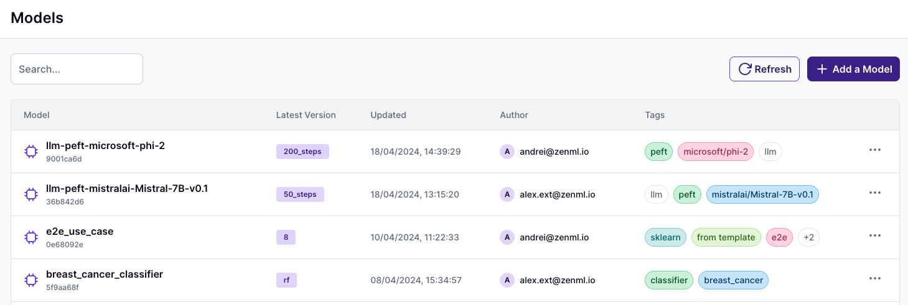

# Organizing data with tags

Organizing and categorizing your machine learning artifacts and models can
streamline your workflow and enhance discoverability. ZenML enables the use of
tags as a flexible tool to classify and filter your ML assets. In this guide,
we'll demonstrate how to assign tags to both artifacts and models within the
ZenML ecosystem.



## Assigning tags to artifacts

If you want to tag the artifact versions of a step or pipeline that is executed
repeatedly, you can use the `tags` property of `ArtifactConfig` to assign an arbitrary number of tags to the created artifacts:




```python
from zenml import step, ArtifactConfig

@step
def training_data_loader() -> (
    Annotated[pd.DataFrame, ArtifactConfig(tags=["sklearn", "pre-training"])]
):
    ...
```



You can use the `zenml artifacts` CLI to add tags:

```shell
# Tag the artifact
zenml artifacts update iris_dataset -t sklearn

# Tag the artifact version
zenml artifacts versions update iris_dataset raw_2023 -t sklearn
```




This will assign tags `sklearn` and `pre-training` to all artifacts created by
this step, which can later be used to filter and organize these artifacts.

Note that [ZenML Pro](https://zenml.io/pro) users can tag artifacts directly in the cloud dashboard.

## Assigning tags to models

Just like artifacts, you can also tag your models to organize them semantically. Here's how to use tags with models in the ZenML Python SDK and CLI (or in the [ZenML Pro Dashboard directly](https://zenml.io/pro)).

When creating a model using the `Model` object, you can specify tags as key-value pairs that will be attached to the model upon creation:

```python
from zenml.models import Model

# Define tags to be added to the model
tags = ["experiment", "v1", "classification-task"]

# Create a model with tags
model = Model(
    name="iris_classifier",
    version="1.0.0",
    tags=tags,
)

# Use this tagged model in your steps and pipelines as needed
@pipeline(model=model)
def my_pipeline(...):
    ...
```

You can also assign tags when creating or updating models with the Python SDK:

```python
from zenml.models import Model
from zenml.client import Client

# Create or register a new model with tags
Client().create_model(
    name="iris_logistic_regression",
    tags=["classification", "iris-dataset"],
)

# Create or register a new model version also with tags
Client().create_model_version(
    model_name_or_id="iris_logistic_regression",
    name="2",
    tags=["version-1", "experiment-42"],
)
```

To add tags to existing models and their versions using the ZenML CLI, you can use the following commands:

```shell
# Tag an existing model
zenml model update iris_logistic_regression --tag "classification"

# Tag a specific model version
zenml model version update iris_logistic_regression 2 --tag "experiment3"
```

<figure><figcaption></figcaption></figure>
