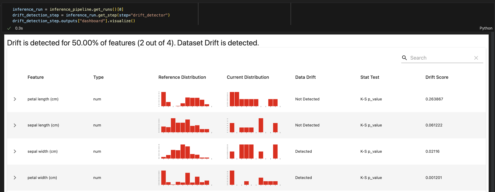
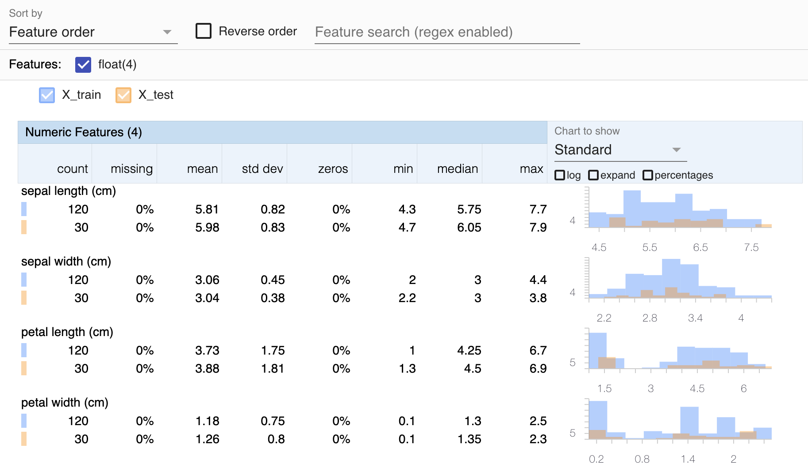

# Visualize artifacts

ZenML automatically saves visualizations of many common data types and allows you to view these visualizations in the ZenML dashboard:


Alternatively, any of these visualizations can also be displayed in Jupyter notebooks using the `artifact.visualize()` method:



Currently, the following visualization types are supported:

* **HTML:** Embedded HTML visualizations such as data validation reports,
* **Image:** Visualizations of image data such as Pillow images or certain numeric numpy arrays,
* **CSV:** Tables, such as the pandas DataFrame `.describe()` output,
* **Markdown:** Markdown strings or pages.

## Giving the ZenML Server Access to Visualizations

In order for the visualizations to show up on the dashboard, the following must be true:

### Configuring a Service Connector

Visualizations are usually stored alongside the artifact, in the [artifact store](../../component-guide/artifact-stores/artifact-stores.md). Therefore, if a user would like to see the visualization displayed on the ZenML dashboard, they must give access to the server to connect to the artifact store.

The [service connector](../auth-management/) documentation goes deeper into the concept of service connectors and how they can be configured to give the server permission to access the artifact store. For a concrete example, see the [AWS S3](../../component-guide/artifact-stores/s3.md) artifact store documentation.


When using the default/local artifact store with a deployed ZenML, the server naturally does not have access to your local files. In this case, the visualizations are also not displayed on the dashboard.

Please use a service connector enabled and remote artifact store alongside a deployed ZenML to view visualizations.


### Configuring Artifact Stores

If all visualizations of a certain pipeline run are not showing up in the dashboard, it might be that your ZenML server does not have the required dependencies or permissions to access that artifact store. See the [custom artifact store docs page](../../component-guide/artifact-stores/custom.md#enabling-artifact-visualizations-with-custom-artifact-stores) for more information.

## Creating Custom Visualizations

There are two ways how you can add custom visualizations to the dashboard:

* If you are already handling HTML, Markdown, or CSV data in one of your steps, you can have them visualized in just a few lines of code by casting them to a [special class](visualize-artifacts.md#visualization-via-special-return-types) inside your step.
* If you want to automatically extract visualizations for all artifacts of a certain data type, you can define type-specific visualization logic by [building a custom materializer](visualize-artifacts.md#visualization-via-materializers).
* If you want to create any other custom visualizations, you can [create a custom return type class with corresponding materializer](visualize-artifacts.md#visualization-via-custom-return-type-and-materializer) and build and return this custom return type from one of your steps.

### Visualization via Special Return Types

If you already have HTML, Markdown, or CSV data available as a string inside your step, you can simply cast them to one of the following types and return them from your step:

* `zenml.types.HTMLString` for strings in HTML format, e.g., `"<h1>Header</h1>Some text"`,
* `zenml.types.MarkdownString` for strings in Markdown format, e.g., `"# Header\nSome text"`,
* `zenml.types.CSVString` for strings in CSV format, e.g., `"a,b,c\n1,2,3"`.

#### Example:

```python
from zenml.types import CSVString

@step
def my_step() -> CSVString:
    some_csv = "a,b,c\n1,2,3"
    return CSVString(some_csv)
```

This would create the following visualization in the dashboard:


### Visualization via Materializers

If you want to automatically extract visualizations for all artifacts of a certain data type, you can do so by overriding the `save_visualizations()` method of the corresponding materializer. See the [materializer docs page](handle-custom-data-types.md#optional-how-to-visualize-the-artifact) for more information on how to create custom materializers that do this.

### Visualization via Custom Return Type and Materializer

By combining the ideas behind the above two visualization approaches, you can visualize virtually anything you want inside your ZenML dashboard in three simple steps:

1. Create a **custom class** that will hold the data that you want to visualize.
2. [Build a custom **materializer**](handle-custom-data-types.md#custom-materializers) for this custom class with the visualization logic implemented in the `save_visualizations()` method.
3. Return your custom class from any of your ZenML steps.

#### Example: Facets Data Skew Visualization

As an example, have a look at the models, materializers, and steps of the [Facets Integration](https://sdkdocs.zenml.io/latest/integration\_code\_docs/integrations-facets), which can be used to visualize the data skew between multiple Pandas DataFrames:



**1. Custom Class** The [FacetsComparison](https://sdkdocs.zenml.io/0.42.0/integration\_code\_docs/integrations-facets/#zenml.integrations.facets.models.FacetsComparison) is the custom class that holds the data required for the visualization.

```python
class FacetsComparison(BaseModel):
    datasets: List[Dict[str, Union[str, pd.DataFrame]]]
```

**2. Materializer** The [FacetsMaterializer](https://sdkdocs.zenml.io/0.42.0/integration\_code\_docs/integrations-facets/#zenml.integrations.facets.materializers.facets\_materializer.FacetsMaterializer) is a custom materializer that only handles this custom class and contains the corresponding visualization logic.

```python
class FacetsMaterializer(BaseMaterializer):

    ASSOCIATED_TYPES = (FacetsComparison,)
    ASSOCIATED_ARTIFACT_TYPE = ArtifactType.DATA_ANALYSIS

    def save_visualizations(
        self, data: FacetsComparison
    ) -> Dict[str, VisualizationType]:
        html = ...  # Create a visualization for the custom type 
        visualization_path = os.path.join(self.uri, VISUALIZATION_FILENAME)
        with fileio.open(visualization_path, "w") as f:
            f.write(html)
        return {visualization_path: VisualizationType.HTML}
```

**3. Step** There are three different steps in the `facets` integration that can be used to create `FacetsComparison`s for different sets of inputs. E.g., the `facets_visualization_step` below takes two DataFrames as inputs and builds a `FacetsComparison` object out of them:

```python
@step
def facets_visualization_step(
    reference: pd.DataFrame, comparison: pd.DataFrame
) -> FacetsComparison:  # Return the custom type from your step
    return FacetsComparison(
        datasets=[
            {"name": "reference", "table": reference},
            {"name": "comparison", "table": comparison},
        ]
    )
```


This is what happens now under the hood when you add the `facets_visualization_step` into your pipeline:

1. The step creates and returns a `FacetsComparison`.
2. When the step finishes, ZenML will search for a materializer class that can handle this type, finds the `FacetsMaterializer`, and calls the `save_visualizations()` method which creates the visualization and saves it into your artifact store as an HTML file.
3. When you open your dashboard and click on the artifact inside the run DAG, the visualization HTML file is loaded from the artifact store and displayed.


## Disabling Visualizations

If you would like to disable artifact visualization altogether, you can set `enable_artifact_visualization` at either pipeline or step level:

```python
@step(enable_artifact_visualization=False)
def my_step():
    ...

@pipeline(enable_artifact_visualization=False)
def my_pipeline():
    ...
```

<figure><figcaption></figcaption></figure>
