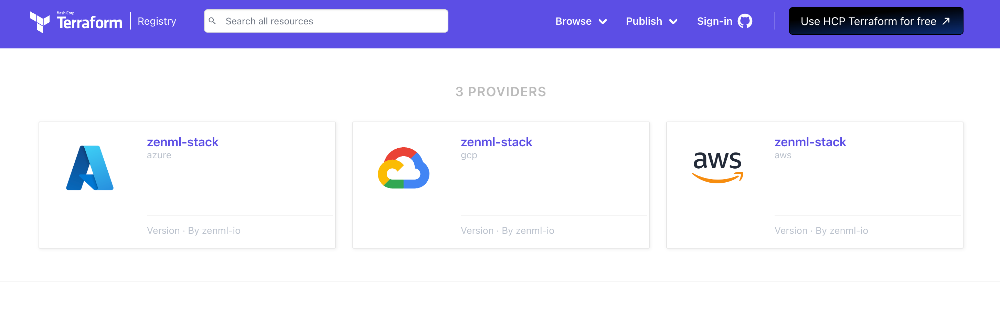

# Integrate with Infrastructure as Code

[Infrastructure as Code (IaC)](https://aws.amazon.com/what-is/iac) is 
the practice of managing and provisioning infrastructure through code 
instead of through manual processes.

In this section, we will show you how to integrate ZenML with popular
IaC tools such as [Terraform](https://www.terraform.io/).

