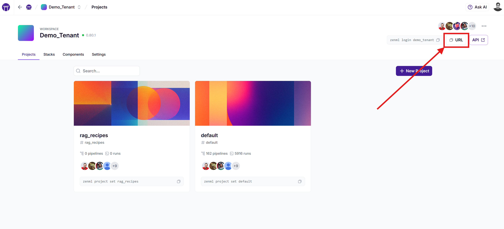


This is an older version of the ZenML documentation. To read and view the latest version please [visit this up-to-date URL](https://docs.zenml.io).



# Terraform Modules

ZenML maintains a collection of [Terraform modules](https://registry.terraform.io/modules/zenml-io/zenml-stack) designed to streamline the provisioning of cloud resources and seamlessly integrate them with ZenML Stacks. These modules simplify the setup process, allowing users to quickly provision cloud resources as well as configure and authorize ZenML to utilize them for running pipelines and other AI/ML operations.

By leveraging these Terraform modules, users can ensure a more efficient and scalable deployment of their machine learning infrastructure, ultimately enhancing their development and operational workflows. The modules' implementation can also be used as a reference for creating custom Terraform\
configurations tailored to specific cloud environments and requirements.


Terraform requires you to manage your infrastructure as code yourself. Among other things, this means that you will need to have Terraform installed on your machine, and you will need to manually manage the state of your infrastructure.

If you prefer a more automated approach, you can use [the 1-click stack deployment feature](deploy-a-cloud-stack.md) to deploy a cloud stack with ZenML with minimal knowledge of Terraform or cloud infrastructure for that matter.

If you have the required infrastructure pieces already deployed on your cloud, you can also use [the stack wizard to seamlessly register your stack](https://docs.zenml.io/how-to/infrastructure-deployment/stack-deployment/register-a-cloud-stack).


## Pre-requisites

To use this feature, you need a deployed ZenML server instance that is reachable from the cloud provider where you wish to have the stack provisioned (this can't be a local server started via `zenml login --local`). If you do not already have one set up, you can fast-track to trying out a ZenML Pro server by simply running `zenml login --pro` or [registering for a free ZenML Pro account](https://zenml.io/pro). If you prefer to host your own, you can learn about self-hosting a ZenML server [here](https://docs.zenml.io/getting-started/deploying-zenml).

Once you are connected to your deployed ZenML server, you need to create a service account and an API key for it. You will use the API key to give the Terraform module programmatic access to your ZenML server. You can find more about service accounts and API keys [here](https://docs.zenml.io/how-to/manage-zenml-server/connecting-to-zenml/connect-with-a-service-account). But the process is as simple as running the following CLI command while connected to your ZenML server:

```shell
zenml service-account create <account-name>
```

Example output:

```shell
$ zenml service-account create terraform-account
Created service account 'terraform-account'.
Successfully created API key `default`.
The API key value is: 'ZENKEY_...'
Please store it safely as it will not be shown again.
To configure a ZenML client to use this API key, run:

zenml login https://842ed6a9-zenml.staging.cloudinfra.zenml.io --api-key

and enter the following API key when prompted:
ZENKEY_...
```

If you're using a ZenML Pro server, you will need to create a Personal Access Token or an organization-level service account and an API key for it. You can find more about Personal Access Tokens [here](https://docs.zenml.io/pro/access-management/personal-access-tokens) and organization-level service accounts and API keys [here](https://docs.zenml.io/pro/access-management/service-accounts).


Finally, you will need the following on the machine where you will be running Terraform:

* [Terraform](https://developer.hashicorp.com/terraform/install) installed on your machine (version at least 1.9).
* the ZenML Terraform stack modules assume you are already locally authenticated with your cloud provider through the provider's CLI or SDK tool and have permissions to create the resources that the modules will provision. This is different depending on the cloud provider you are using and is covered in the following sections.

## How to use the Terraform stack deployment modules

If you are already knowledgeable about using Terraform and the cloud provider where you want to deploy the stack, this process will be straightforward. The ZenML Terraform provider lets you manage your ZenML resources (stacks, stack components, etc.) as infrastructure-as-code. In a nutshell, you will need to:

1. Set up the ZenML Terraform provider with your ZenML server URL and API key. It is recommended to use environment variables for this rather than hardcoding the values in your Terraform configuration file:

```shell
export ZENML_SERVER_URL="https://your-zenml-server.com"
export ZENML_API_KEY="<your-api-key>"
```




**For ZenML Pro users:** The `ZENML_SERVER_URL` should be your Workspace URL, which can be found in your dashboard. It typically looks like: `https://1bfe8d94-zenml.cloudinfra.zenml.io`. Make sure you use the complete URL of your workspace, not just the domain. The `ZENML_API_KEY` should be [the ZenML Pro API key](https://docs.zenml.io/pro/access-management/service-accounts).


2. Create a new Terraform configuration file (e.g., `main.tf`), preferably in a new directory, with the content that looks like this (`<cloud provider>` can be`aws`, `gcp`, or `azure`):

```hcl
terraform {
    required_providers {
        aws = {
            source  = "hashicorp/aws"
        }
        zenml = {
            source = "zenml-io/zenml"
        }
    }
}

provider "zenml" {
    # server_url = <taken from the ZENML_SERVER_URL environment variable if not set here>
    # For ZenML Pro users, this should be your Workspace URL from the dashboard
    # api_key = <taken from the ZENML_API_KEY environment variable if not set here>
}

module "zenml_stack" {
  source = "zenml-io/zenml-stack/<cloud-provider>"
  version = "x.y.z"

  # Optional inputs
  zenml_stack_name = "<your-stack-name>"
  orchestrator = "<your-orchestrator-type>" # e.g., "local", "sagemaker", "vertex", "azureml", "skypilot"
}
output "zenml_stack_id" {
  value = module.zenml_stack.zenml_stack_id
}
output "zenml_stack_name" {
  value = module.zenml_stack.zenml_stack_name
}
```

There might be a few additional required or optional inputs depending on the cloud provider you are using. You can find the full list of inputs for each module in the [Terraform Registry](https://registry.terraform.io/modules/zenml-io/zenml-stack) documentation for the relevant module, or you can read on in the following sections.

3. Run the following commands in the directory where you have your Terraform configuration file:

```shell
terraform init
terraform apply
```


The directory where you keep the Terraform configuration file and where you run the `terraform` commands is important. This is where Terraform will store the state of your infrastructure. Make sure you do not delete this directory or the state file it contains unless you are sure you no longer need to manage these resources with Terraform or after you have deprovisioned them up with`terraform destroy`.


4. Terraform will prompt you to confirm the changes it will make to your cloud infrastructure. If you are happy with the changes, type `yes` and hit enter.
5. Terraform will then provision the resources you have specified in your configuration file. Once the process is complete, you will see a message indicating that the resources have been successfully created and printing out the ZenML stack ID and name:

```shell
...
Apply complete! Resources: 15 added, 0 changed, 0 destroyed.

Outputs:

zenml_stack_id = "04c65b96-b435-4a39-8484-8cc18f89b991"
zenml_stack_name = "terraform-gcp-588339e64d06"
```

At this point, a ZenML stack has also been created and registered with your\
ZenML server, and you can start using it to run your pipelines:

```shell
zenml integration install <list-of-required-integrations>
zenml stack set <zenml_stack_id>
```

You can find more details specific to the cloud provider of your choice in the\
next section:



The [original documentation for the ZenML AWS Terraform module](https://registry.terraform.io/modules/zenml-io/zenml-stack/aws/latest) contains extensive information about required permissions, inputs, outputs, and provisioned resources. This is a summary of the key points from that documentation.

**Authentication**

To authenticate with AWS, you need to have [the AWS CLI](https://aws.amazon.com/cli/) installed on your machine, and you need to have run `aws configure` to set up your credentials.

**Example Terraform Configuration**

Here is an example Terraform configuration file for deploying a ZenML stack on AWS:

```hcl
terraform {
    required_providers {
        aws = {
            source  = "hashicorp/aws"
        }
        zenml = {
            source = "zenml-io/zenml"
        }
    }
}

provider "zenml" {
    # server_url = <taken from the ZENML_SERVER_URL environment variable if not set here>
    # For ZenML Pro users, this should be your Workspace URL from the dashboard
    # api_key = <taken from the ZENML_API_KEY environment variable if not set here>
}

provider "aws" {
    region = "eu-central-1"
}

module "zenml_stack" {
  source = "zenml-io/zenml-stack/aws"

  # Optional inputs
  orchestrator = "<your-orchestrator-type>" # e.g., "local", "sagemaker", "skypilot"
  zenml_stack_name = "<your-stack-name>"
}

output "zenml_stack_id" {
  value = module.zenml_stack.zenml_stack_id
}
output "zenml_stack_name" {
  value = module.zenml_stack.zenml_stack_name
}
```

**Stack Components**

The Terraform module will create a ZenML stack configuration with the\
following components:

1. An S3 Artifact Store linked to an S3 bucket via an AWS Service Connector configured with IAM role credentials
2. An ECR Container Registry linked to an ECR repository via an AWS Service Connector configured with IAM role credentials
3. Depending on the `orchestrator` input variable:
4. A local Orchestrator, if `orchestrator` is set to `local`. This can be used in combination with the SageMaker Step Operator to selectively run some steps locally and some on SageMaker.
5. If `orchestrator` is set to `sagemaker` (default): a SageMaker Orchestrator linked to the AWS account via an AWS Service Connector configured with IAM role credentials
6. If `orchestrator` is set to `skypilot`: a SkyPilot Orchestrator linked to the AWS account via an AWS Service Connector configured with IAM role credentials
7. An AWS App Runner Deployer linked to the AWS account via an AWS Service Connector configured with IAM role credentials
8. An AWS CodeBuild Image Builder linked to the AWS account via an AWS Service Connector configured with IAM role credentials
9. a SageMaker Step Operator linked to the AWS account via an AWS Service Connector configured with IAM role credentials

To use the ZenML stack, you will need to install the required integrations:

* For the local or SageMaker orchestrator:

```shell
zenml integration install aws s3
```

* For the SkyPilot orchestrator:

```shell
zenml integration install aws s3 skypilot_aws
```



The [original documentation for the ZenML GCP Terraform module](https://registry.terraform.io/modules/zenml-io/zenml-stack/gcp/latest) contains extensive information about required permissions, inputs, outputs, and provisioned resources. This is a summary of the key points from that documentation.

**Authentication**

To authenticate with GCP, you need to have [the `gcloud` CLI](https://cloud.google.com/sdk/gcloud) installed on your machine, and you need to have run `gcloud init` or `gcloud auth application-default login` to set up your credentials.

**Example Terraform Configuration**

Here is an example Terraform configuration file for deploying a ZenML stack on GCP:

```hcl
terraform {
    required_providers {
        google = {
            source  = "hashicorp/google"
        }
        zenml = {
            source = "zenml-io/zenml"
        }
    }
}

provider "zenml" {
    # server_url = <taken from the ZENML_SERVER_URL environment variable if not set here>
    # For ZenML Pro users, this should be your Workspace URL from the dashboard
    # api_key = <taken from the ZENML_API_KEY environment variable if not set here>
}

provider "google" {
    region  = "europe-west3"
    project = "my-project"
}

module "zenml_stack" {
  source = "zenml-io/zenml-stack/gcp"

  # Optional inputs
  orchestrator = "<your-orchestrator-type>" # e.g., "local", "vertex", "skypilot" or "airflow"
  zenml_stack_name = "<your-stack-name>"
}

output "zenml_stack_id" {
  value = module.zenml_stack.zenml_stack_id
}
output "zenml_stack_name" {
  value = module.zenml_stack.zenml_stack_name
}
```

**Stack Components**

The Terraform module will create a ZenML stack configuration with the\
following components:

1. An GCP Artifact Store linked to a GCS bucket via a GCP Service Connector configured with the GCP service account credentials
2. An GCP Container Registry linked to a Google Artifact Registry via a GCP Service Connector configured with the GCP service account credentials
3. Depending on the `orchestrator` input variable:
4. a local Orchestrator, if `orchestrator` is set to `local`. This can be used in combination with the Vertex AI Step Operator to selectively run some steps locally and some on Vertex AI.
5. If `orchestrator` is set to `vertex` (default): a Vertex AI Orchestrator linked to the GCP project via a GCP Service Connector configured with the GCP service account credentials
6. If `orchestrator` is set to `skypilot`: a SkyPilot Orchestrator linked to the GCP project via a GCP Service Connector configured with the GCP service account credentials
7. If `orchestrator` is set to `airflow`: an Airflow Orchestrator linked to the Cloud Composer environment
8. A GCP Cloud Run Deployer linked to the GCP project via a GCP Service Connector configured with the GCP service account credentials
9. A Google Cloud Build Image Builder linked to your GCP project via a GCP Service Connector configured with the GCP service account credentials
10. A Vertex AI Step Operator linked to the GCP project via a GCP Service Connector configured with the GCP service account credentials

To use the ZenML stack, you will need to install the required integrations:

* For the local and Vertex AI orchestrators:

```shell
zenml integration install gcp
```

* For the SkyPilot orchestrator:

```shell
zenml integration install gcp skypilot_gcp
```

* For the Airflow orchestrator:

```shell
zenml integration install gcp airflow
```



The original documentation for the ZenML Azure Terraform module contains extensive information about required permissions, inputs, outputs, and provisioned resources. This is a summary of the key points from that documentation.

**Authentication**

To authenticate with Azure, you need to have [the Azure CLI](https://learn.microsoft.com/en-us/cli/azure/) installed on your machine, and you need to have run `az login` to set up your credentials.

**Example Terraform Configuration**

Here is an example Terraform configuration file for deploying a ZenML stack on Azure:

```hcl
terraform {{
    required_providers {{
        azurerm = {{
            source  = "hashicorp/azurerm"
        }}
        azuread = {{
            source  = "hashicorp/azuread"
        }}
        zenml = {{
            source = "zenml-io/zenml"
        }}
    }}
}}

provider "zenml" {
    # server_url = <taken from the ZENML_SERVER_URL environment variable if not set here>
    # For ZenML Pro users, this should be your Workspace URL from the dashboard
    # api_key = <taken from the ZENML_API_KEY environment variable if not set here>
}

provider "azurerm" {{
    features {{
        resource_group {{
            prevent_deletion_if_contains_resources = false
        }}
    }}
}}

module "zenml_stack" {
  source = "zenml-io/zenml-stack/azure"

  # Optional inputs
  location = "<your-azure-location>"
  orchestrator = "<your-orchestrator-type>" # e.g., "local", "skypilot_azure"
  zenml_stack_name = "<your-stack-name>"
}

output "zenml_stack_id" {
  value = module.zenml_stack.zenml_stack_id
}
output "zenml_stack_name" {
  value = module.zenml_stack.zenml_stack_name
}
```

**Stack Components**

The Terraform module will create a ZenML stack configuration with the\
following components:

1. An Azure Artifact Store linked to an Azure Storage Account and Blob Container via an Azure Service Connector configured with Azure Service Principal credentials
2. An ACR Container Registry linked to an Azure Container Registry via an Azure Service Connector configured with Azure Service Principal credentials
3. Depending on the `orchestrator` input variable:
4. if `orchestrator` is set to `local`: a local Orchestrator. This can be used in combination with the AzureML Step Operator to selectively run some steps locally and some on AzureML.
5. If `orchestrator` is set to `skypilot` (default): an Azure SkyPilot Orchestrator linked to the Azure subscription via an Azure Service Connector configured with Azure Service Principal credentials
6. If `orchestrator` is set to `azureml`: an AzureML Orchestrator linked to an AzureML Workspace via an Azure Service Connector configured with Azure Service Principal credentials
7. An AzureML Step Operator linked to an AzureML Workspace via an Azure Service Connector configured with Azure Service Principal credentials

To use the ZenML stack, you will need to install the required integrations:

* For the local and AzureML orchestrators:

```shell
zenml integration install azure
```

* For the SkyPilot orchestrator:

```shell
zenml integration install azure skypilot_azure
```



## How to clean up the Terraform stack deployments

Cleaning up the resources provisioned by Terraform is as simple as running the`terraform destroy` command in the directory where you have your Terraform configuration file. This will remove all the resources that were provisioned by the Terraform module and will also delete the ZenML stack that was registered with your ZenML server.

```shell
terraform destroy
```
