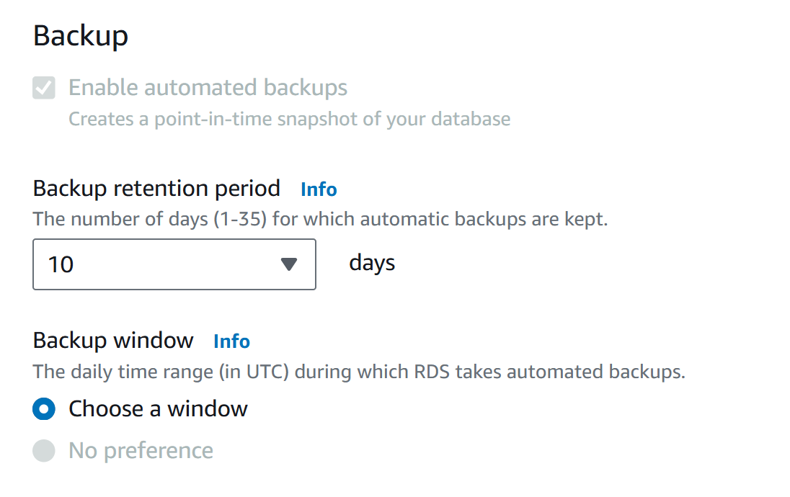
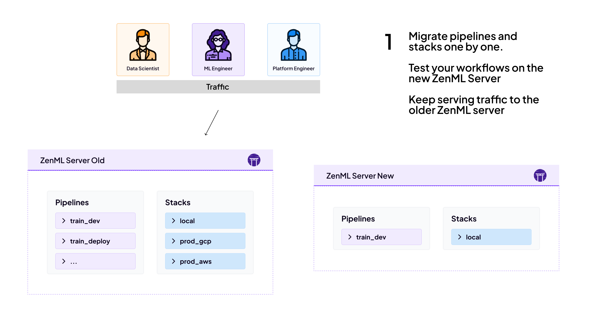
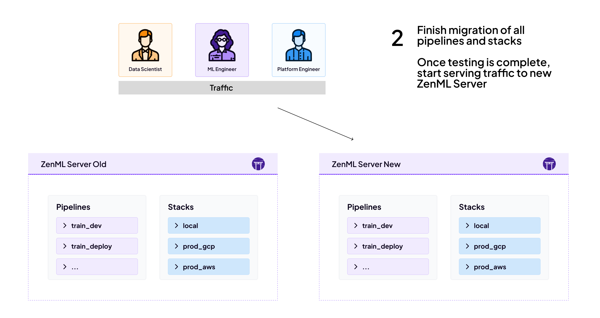

# Best practices for upgrading ZenML

While upgrading ZenML is generally a smooth process, there are some best practices that you should follow to ensure a successful upgrade. Based on experiences shared by ZenML users, here are some key strategies and considerations.

## Upgrading your server

Follow the tips below while upgrading your server to mitigate data losses, downtime and other issues.

### Data Backups

- **Database Backup**: Before upgrading, create a backup of your MySQL database. This allows you to rollback if necessary.
- **Automated Backups**: Consider setting up automatic daily backups of your database for added security. Most managed services like AWS RDS, Google Cloud SQL, and Azure Database for MySQL offer automated backup options.



### Upgrade Strategies

- **Staged Upgrade**: For large organizations or critical systems, consider using two ZenML server instances (old and new) and migrating services one by one to the new version.
    

    

- **Team Coordination**: If multiple teams share a ZenML server instance, coordinate the upgrade timing to minimize disruption.
- **Separate ZenML Servers**: Coordination between teams might be difficult if one team requires new features but the other can't upgrade yet. In such cases, it is recommended to use dedicated ZenML server instances per team or product to allow for more flexible upgrade schedules.


ZenML Pro comes with multi-tenacy which makes it easy for you to have multiple ZenML servers and switch between them. This is useful if you have multiple teams and you want to upgrade them at different times.


### Minimizing Downtime

- **Upgrade Timing**: Plan upgrades during low-activity periods to minimize disruption.

- **Avoid Mid-Pipeline Upgrades**: Be cautious of automated upgrades or redeployments that might interrupt long-running pipelines.

## Upgrading your code

Sometimes, you might have to upgrade your code to work with a new version of ZenML. This is true especially when you are moving from a really old version to a new major version. The following tips might help, in addition to everything you've learnt in this document so far.

### Testing and Compatibility

- **Local Testing**: It's a good idea to test it locally first after you upgrade (`pip install zenml --upgrade`) and run some old pipelines to check for compatibility issues between the old and new versions.
- **End-to-End Testing**: You can also develop simple end-to-end tests to ensure that the new version works with your pipeline code and your stack. ZenML already has an [extensive test suite](https://github.com/zenml-io/zenml/tree/main/tests) that we use for releases and you can use it as an example.
- **Artifact Compatibility**: Be cautious with pickle-based [materializers](../../how-to/handle-data-artifacts/handle-custom-data-types.md), as they can be sensitive to changes in Python versions or libraries. Consider using version-agnostic materialization methods for critical artifacts. You can try to load older artifacts with the new version of ZenML to see if they are compatible. Every artifact has an ID which you can use to load it in the following way:

```python
from zenml.client import Client

artifact = Client().get_artifact_version('YOUR_ARTIFACT_ID')
loaded_artifact = artifact.load()
```

### Dependency Management

- **Python Version**: Make sure that the Python version you are using is compatible with the ZenML version you are upgrading to. Check out the [installation guide](../../getting-started/installation.md) to find out which Python version is supported.
- **External Dependencies**: Be mindful of external dependencies (e.g. from integrations) that might be incompatible with the new version of ZenML. This could be the case when some older versions are no longer supported or maintained and the ZenML integration is updated to use a newer version. You can find this information in the [release notes](https://github.com/zenml-io/zenml/releases) for the new version of ZenML.

### Handling API Changes

While ZenML strives for backward compatibility, be prepared for occasional breaking changes (e.g., [the Pydantic 2 upgrade](https://github.com/zenml-io/zenml/releases/tag/0.60.0)).

- **Changelog Review**: Always review the [changelog from new releases](https://github.com/zenml-io/zenml/releases) for new syntax, instructions, or breaking changes.
- **Migration Scripts**: Use provided [migration scripts](../../how-to/manage-the-zenml-server/migration-guide/migration-guide.md) when available to handle database schema changes.

By following these best practices, you can minimize risks and ensure a smoother upgrade process for your ZenML server. Remember that each environment is unique, so adapt these guidelines to your specific needs and infrastructure.
