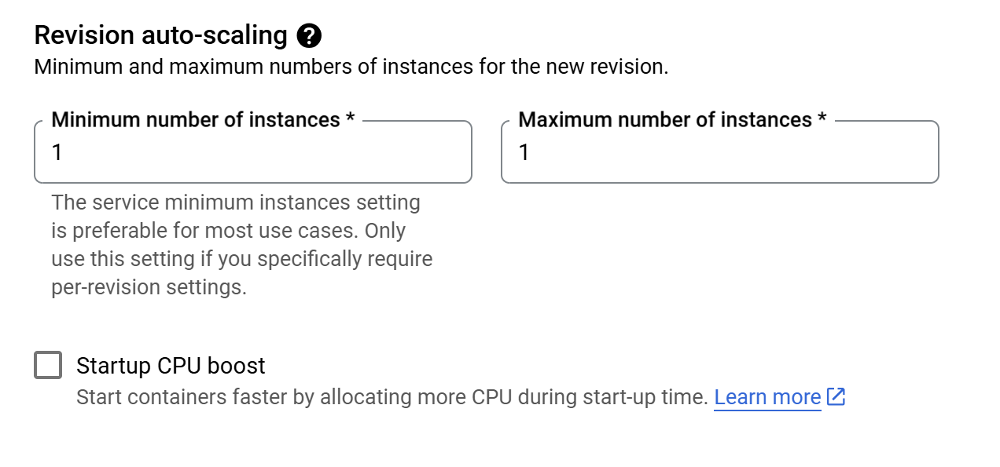
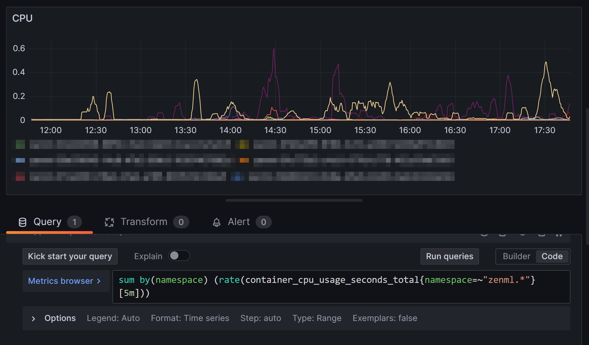
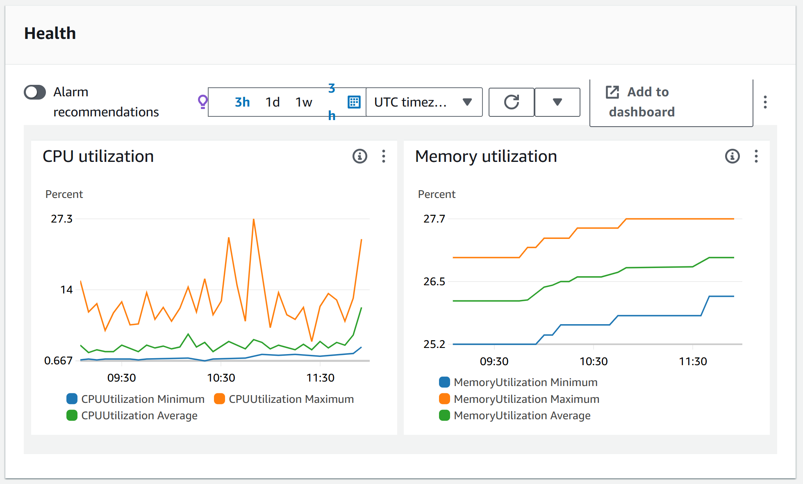
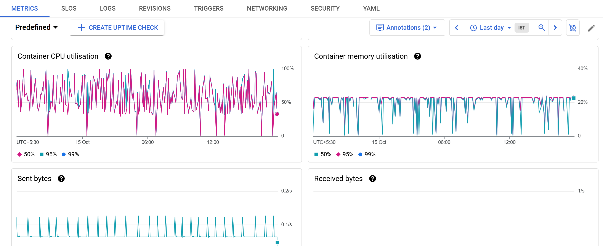

# Using ZenML server in production

Setting up a ZenML server for testing is a quick process. However, most people have to move beyond so-called 'day zero' operations and in such cases, it helps to learn best practices around setting up your ZenML server in a production-ready way. This guide encapsulates all the tips and tricks we've learned ourselves and from working with people who use ZenML in production environments. Following are some of the best practices we recommend.


If you are using ZenML Pro, you don't have to worry about any of these. We have got you covered!
You can sign up for a free trial [here](https://cloud.zenml.io).


## Autoscaling replicas

In production, you often have to run bigger and longer running pipelines that might strain your server's resources. It is a good idea to set up autoscaling for your ZenML server so that you don't have to worry about your pipeline runs getting interrupted or your Dashboard slowing down due to high traffic.

How you do it depends greatly on the environment in which you have deployed your ZenML server. Below are some common deployment options and how to set up autoscaling for them.




If you are using the official [ZenML Helm chart](https://artifacthub.io/packages/helm/zenml/zenml), you can take advantage of the `autoscaling.enabled` flag to enable autoscaling for your ZenML server. For example:

```yaml
autoscaling:
  enabled: true
  minReplicas: 1
  maxReplicas: 10
  targetCPUUtilizationPercentage: 80
```

This will create a horizontal pod autoscaler for your ZenML server that will scale the number of replicas up to 10 and down to 1 based on the CPU utilization of the pods.



For folks using AWS, [ECS](https://docs.aws.amazon.com/AmazonECS/latest/developerguide/Welcome.html) is a popular choice for running ZenML server. ECS is a container orchestration service that allows you to run and scale your containers in a managed environment.

To scale your ZenML server deployed as a service on ECS, you can follow the steps below:

- Go to the ECS console, find you service pertaining to your ZenML server and click on it.
- Click on the "Update Service" button.
- If you scroll down, you will see the "Service auto scaling - optional" section.
- Here you can enable autoscaling and set the minimum and maximum number of tasks to run for your service and also the ECS service metric to use for scaling.





For folks on GCP, [Cloud Run](https://cloud.google.com/run) is a popular choice for running ZenML server. Cloud Run is a container orchestration service that allows you to run and scale your containers in a managed environment.

In Cloud Run, each revision is automatically scaled to the number of instances needed to handle all incoming requests, events, or CPU utilization and by default, when a revision does not receive any traffic, it is scaled in to zero instances. For production use cases, we recommend setting the minimum number of instances to at least 1 so that you have "warm" instances ready to serve incoming requests.

To scale your ZenML server deployed on Cloud Run, you can follow the steps below:

- Go to the Cloud Run console, find you service pertaining to your ZenML server and click on it.
- Click on the "Edit & Deploy new Revision" button.
- Scroll down to the "Revision auto-scaling" section.
- Here you can set the minimum and maximum number of instances to run for your service.




If you use Docker Compose, you don't get autoscaling out of the box. However, you can scale your service to N number of replicas using the `scale` flag. For example:

```bash
docker compose up --scale zenml-server=N
```

This will scale your ZenML server to N replicas.




## High connection pool values

One other way to improve the performance of your ZenML server is to increase the number of threads that your server process uses, provided that you have hardware that can support it.

You can control this by setting the `zenml.threadPoolSize` value in the ZenML Helm chart values. For example:

```yaml
zenml:
  threadPoolSize: 100
```

By default, it is set to 40. If you are using any other deployment option, you can set the `ZENML_SERVER_THREAD_POOL_SIZE` environment variable to the desired value.

Once this is set, you should also modify the `zenml.database.poolSize` and `zenml.database.maxOverflow` values to ensure that the ZenML server workers do not block on database connections (i.e. the sum of the pool size and max overflow should be greater than or equal to the thread pool size). If you manage your own database, ensure these values are set appropriately.


## Scaling the backing database

An important component of the ZenML server deployment is the backing database. When you start scaling your ZenML server instances, you will also need to scale your database to avoid any bottlenecks.

We would recommend starting out with a simple (single) database instance and then monitoring it to decide if it needs scaling. Some common metrics to look out for:
- CPU Utilization: If the CPU Utilization is consistently above 50%, you may need to scale your database. Some spikes in the utlization are expected but it should not be consistently high.
- Freeable Memory: It is natural for the freeable memory to go down with time as your database uses it for caching and buffering but if it drops below 100-200 MB, you may need to scale your database.


## Setting up an ingress/load balancer

Exposing your ZenML server to the internet securely and reliably is a must for production use cases. One way to do this is to set up an ingress/load balancer.




If you are using the official [ZenML Helm chart](https://artifacthub.io/packages/helm/zenml/zenml), you can take advantage of the `zenml.ingress.enabled` flag to enable ingress for your ZenML server. For example:

```yaml
zenml:
  ingress:
    enabled: true
    className: "nginx"
    annotations:
      # nginx.ingress.kubernetes.io/ssl-redirect: "true"
      # nginx.ingress.kubernetes.io/rewrite-target: /$1
      # kubernetes.io/ingress.class: nginx
      # kubernetes.io/tls-acme: "true"
      # cert-manager.io/cluster-issuer: "letsencrypt"
```

This will create an [NGINX ingress](https://github.com/kubernetes/ingress-nginx) for your ZenML service that will create a LoadBalancer on whatever cloud provider you are using.


With ECS, you can use Application Load Balancers to evenly route traffic to your tasks running your ZenML server. 

Follow the steps in the official [AWS documentation](https://docs.aws.amazon.com/AmazonECS/latest/developerguide/service-load-balancing.html) to learn how to set this up.



With Cloud Run, you can use Cloud Load Balancing to route traffic to your service.

Follow the steps in the official [GCP documentation](https://cloud.google.com/load-balancing/docs/https/setting-up-https-serverless) to learn how to set this up.



If you are using Docker Compose, you can set up an NGINX server as a reverse proxy to route traffic to your ZenML server. Here's a [blog](https://www.docker.com/blog/how-to-use-the-official-nginx-docker-image/) that shows how to do it.



## Monitoring

Monitoring your service is crucial to ensure that it is running smoothly and to catch any issues early before they can cause problems. Depending on the deployment option you are using, you can use different tools to monitor your service.



You can set up Prometheus and Grafana to monitor your ZenML server. We recommned using the `kube-prometheus-stack` [Helm chart from the prometheus-community](https://artifacthub.io/packages/helm/prometheus-community/kube-prometheus-stack) to get started quickly.

Once you have deployed the chart, you can find your grafana service by searching for services in the namespace you have deployed the chart in. Port-forward it to your local machine or deploy it through an ingress.

You can now use queries like the following to monitor your ZenML server:

```
sum by(namespace) (rate(container_cpu_usage_seconds_total{namespace=~"zenml.*"}[5m]))
```

This query would give you the CPU utilization of your server pods in all namespaces that start with `zenml`. The image below shows how this query would look like in Grafana.






On ECS, you can utilize the [CloudWatch integration](https://docs.aws.amazon.com/AmazonECS/latest/developerguide/cloudwatch-metrics.html) to monitor your ZenML server.

In the "Health and metrics" section of your ECS console, you should see metrics pertaining to your ZenML service like CPU utilization and Memory utilization.





In Cloud Run, you can utilize the [Cloud Monitoring integration](https://cloud.google.com/run/docs/monitoring) to monitor your ZenML server.

The "Metrics" tab in the Cloud Run console will show you metrics like Container CPU utilization, Container memory utilization, and more.






## Backups

The data in your ZenML server is critical as it contains your pipeline runs, stack configurations, and other important information. It is, therefore, recommended to have a backup strategy in place to avoid losing any data.

Some common strategies include:

- Setting up automated backups with a good retention period (say 30 days).
- Periodically exporting the data to an external storage (e.g. S3, GCS, etc.).
- Manual backups before upgrading your server to avoid any problems.


