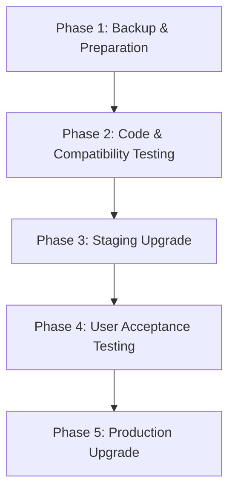

# Best Practices for Upgrading ZenML Servers (Workspaces)

This document serves as a comprehensive guide for platform teams managing ZenML upgrades at enterprise scale.


**ZenML Pro (SaaS Workspaces)**: ZenML Pro is available in two deployment modes: self-hosted and hosted (SaaS). If you're using the hosted **ZenML Pro SaaS** offering, many server-side upgrade procedures are handled automatically by the ZenML team. Look for the 🔧 **ZenML Pro SaaS Workspace** call-outs throughout this document to see which sections you can skip. Self-hosted ZenML Pro users should follow all steps exactly as documented for self-hosted deployments.


This high-level checklist summarizes the entire upgrade process at a glance.

- **Phase 1 – Backup & Preparation:** Safeguard database and configurations; inventory critical pipelines.
- **Phase 2 – Code & Compatibility Testing:** Validate code, artifacts, and dependencies locally and in CI.
- **Phase 3 – Staging Upgrade:** Upgrade the staging server and run smoke tests.
- **Phase 4 – User Acceptance Testing:** Power users and teams validate real workflows.
- **Phase 5 – Production Upgrade:** Perform the production cut-over, monitor, and sign-off.



This guide provides best practices specifically designed for platform teams responsible for managing ZenML infrastructure across multiple teams, environments, and business units. It builds upon general upgrade practices with enterprise-specific considerations.

## Pre-Upgrade Planning

### 1. Release Assessment

**Review Release Notes Thoroughly**
- Check [GitHub releases](https://github.com/zenml-io/zenml/releases) for breaking changes (look for highlighted breaking change sections)
- Identify any security updates or critical patches
- Review migration scripts availability for major version changes
- Check integration dependencies for version conflicts
- Review custom materializers and pipeline code for potential compatibility issues


All of these will be clearly indicated in the [release notes](https://github.com/zenml-io/zenml/releases).


### 2. Environment Strategy


🔧 **ZenML Pro SaaS Workspace**: Users on the hosted ZenML Pro SaaS don't need to manage server environments because upgrades are handled automatically. However, you should still maintain development and staging workspaces for testing your pipeline code.


**Multi-Environment Approach**
```
Development (local) → Staging → Production
     ↓                 ↓         ↓
  Quick test         Full UAT   Rollout
```

In general, the goal is to move from one environment to the other step by step:


**Staging Environment Setup**
- Maintain a staging environment that mirrors production
- Use same stack configurations and integrations
- Include representative data samples for testing
- Ensure staging has same security configurations

### 3. Team Coordination

**Communication Plan**
- Notify all teams at least 1 week before upgrade
- Provide clear timeline with maintenance windows
- Create upgrade announcement templates
- Establish rollback communication procedures
- Instruct users to prepare to upgrade their local ZenML client (`pip install -U zenml`) once the server upgrade is complete to avoid API mismatches
- Instruct user to update the requirements for the gitops environments that interact with ZenML if applicable

**Multi-Team Considerations**
- For teams with different upgrade readiness, consider separate ZenML server instances
- Coordinate with teams that have long-running pipelines


**ZenML Pro Multi-Tenancy**: ZenML Pro comes with multi-tenancy which makes it easy for you to have multiple ZenML servers (workspaces) and switch between them. This is useful if you have multiple teams and you want to upgrade them at different times. ZenML Pro SaaS users can request additional workspaces for different teams or upgrade schedules.


### 4. Metrics and KPIs

Track upgrade success with these metrics:
- **Downtime Duration**: Minimize maintenance window duration *(Self-hosted only)*
- **Rollback Rate**: Target < 5% of upgrades require rollback
- **Issue Resolution Time**: Average time to resolve post-upgrade issues
- **Team Adoption**: Percentage of teams successfully using new version within 1 week

### 5. Handling Breaking Changes and Dependencies

#### API Changes and Migration

While ZenML strives for backward compatibility, be prepared for occasional breaking changes (e.g., [the Pydantic 2 upgrade](https://github.com/zenml-io/zenml/releases/tag/0.60.0)).

- **Changelog Review**: Always review the [changelog from new releases](https://github.com/zenml-io/zenml/releases) for new syntax, instructions, or breaking changes
- **Migration Scripts**: Use provided [migration scripts](migration-guide/migration-guide.md) when available to handle database schema changes
- **External Dependencies**: Be mindful of external dependencies (e.g. from integrations) that might be incompatible with the new version of ZenML

#### End-to-End Testing
Develop simple end-to-end tests to ensure that the new version works with your pipeline code and your stack. ZenML already has an [extensive test suite](https://github.com/zenml-io/zenml/tree/main/tests) that we use for releases and you can use it as an example.

### 6. Rollback Procedures


🔧 **ZenML Pro SaaS Workspace**: Server rollbacks are handled by the ZenML team if needed. Contact support if you experience issues after an automatic upgrade.


#### Automated Rollback *(Self-hosted only)*

- [ ] Prepare rollback scripts before upgrade
- [ ] Test rollback procedures in staging
- [ ] Document rollback decision criteria
- [ ] Maintain rollback communication templates

#### Manual Rollback Steps *(Self-hosted only)*

1. Stop all running pipelines
2. Restore database from backup
3. Revert server to previous version
4. Verify system functionality
5. Communicate rollback to all teams


## Upgrade Execution Checklist

### Phase 1: Backup and Preparation



🔧 **ZenML Pro SaaS Workspace**: Database backups and server configuration backups are handled automatically by the ZenML team. You can skip the server-related backup steps below.


- [ ] **Database Backup** *(Self-hosted only)*
  - Create full MySQL database backup
  - Verify backup integrity
  - Document backup location and restore procedures
  - Test restore process on non-production environment

- [ ] **Pipeline Inventory** *(All users)*
  - Identify critical/key pipelines for testing
  - List long-running pipelines that shouldn't be interrupted

- [ ] **Run Template Audit** *(Pro only)*
  - 🔧 ZenML Pro SaaS Workspace: Run templates must be rebuilt and re-executed with the upgraded ZenML version.
  - Export or list all existing run templates
  - Plan to delete and rebuild them after the server upgrade to avoid incompatibilities

- [ ] **Scheduled Pipeline Audit** *(All users)*
  - List all currently scheduled pipelines and their schedules
  - Plan to reschedule them after the server upgrade to ensure compatibility
  - Document pipeline schedules for recreation after upgrade

### Phase 2: Code and Compatibility Testing

**Local Testing and Validation**
- Test locally first after upgrading (`pip install zenml --upgrade`)
- Run existing pipelines to check for compatibility issues
- Verify Python version compatibility with new ZenML version
- Check integration dependencies for version conflicts

**Artifact Compatibility Testing**
Be cautious with pickle-based [materializers](../../how-to/artifacts/materializers.md), as they can be sensitive to changes in Python versions or libraries. Test loading older artifacts with the new version:

```python
# Test artifact loading from previous versions
from zenml.client import Client

def test_artifact_compatibility(artifact_ids):
    client = Client()
    failed_artifacts = []
    
    for artifact_id in artifact_ids:
        try:
            artifact = client.get_artifact_version(artifact_id)
            loaded_artifact = artifact.load()
            print(f"✓ Artifact {artifact_id} loaded successfully")
        except Exception as e:
            print(f"✗ Artifact {artifact_id} failed: {e}")
            failed_artifacts.append(artifact_id)
    
    return failed_artifacts
```

**Automated Testing Framework**
Create automated tests for post-upgrade validation:

```python
# Example automated test structure
def test_upgrade_compatibility():
    """Test suite for post-upgrade validation"""
    
    # Test 1: Pipeline execution
    test_basic_pipeline_execution()
    
    # Test 2: Artifact compatibility
    test_artifact_loading_from_previous_versions()
    
    # Test 3: Stack connectivity
    test_all_stack_components()
    
    # Test 4: Integration functionality
    test_critical_integrations()
    
    # Test 5: UI functionality
    test_dashboard_access()
```

**Key Pipeline Testing**

Identify and maintain a set of representative pipelines for testing:
- **Basic Pipeline**: Simple training pipeline with standard components
- **Complex Pipeline**: Multi-step pipeline with custom components
- **Integration Pipeline**: Pipeline using specific integrations (MLflow, Kubeflow, etc.)
- **Artifact Pipeline**: Pipeline that loads artifacts from previous runs

### Phase 3: Staging Environment Upgrade


🔧 **ZenML Pro SaaS Workspace**: Server upgrades are handled automatically. Focus on testing your pipeline code and configurations in your development environment.


- [ ] **Server Upgrade** *(Self-hosted only)*
  - Upgrade staging ZenML server first
  - Verify server health after upgrade
  - Check all integrations are functioning
  - Validate user authentication and permissions

- [ ] **Smoke Testing** *(All users)*
  - Run lightweight pipelines to verify basic functionality
  - Test stack connectivity and service connectors
  - Verify UI functionality and dashboards
  - Check experiment tracking and model registry

- [ ] **Refresh Run Templates** *(Pro only)*
  - 🔧 ZenML Pro SaaS Workspace: Run templates must be rebuilt and re-executed to ensure compatibility with the new version.
  - Delete outdated run templates
  - Rebuild templates using the upgraded ZenML version
  - Execute each run template in the staging environment to verify it completes successfully
  - Rebuild all custom parent images that you need within your ZenML pipelines
 

**Code example for recreating run templates:**

```python
from zenml.client import Client

# Get the pipeline by name
pipeline = Client().get_pipeline("your_pipeline_name")

# Get the most recent runs for this pipeline
runs = Client().list_pipeline_runs(
    pipeline_id=pipeline.id, 
    sort_by="desc:created", 
    size=1
)

if runs:
    latest_run = runs[0]
    
    # Create a template from this run
    template = latest_run.create_run_template(
        name="upgraded-template-name",
        deployment_id=latest_run.deployment_id,
        config={"steps": {"your_step": {"parameters": {"param": "value"}}}}
    )
    
    print(f"Created template: {template.name} with ID: {template.id}")
```

```bash
# Alternative: Using CLI
zenml pipeline create-run-template your_pipeline_name \
    --name=upgraded-template-name \
    --config=config.yaml \
    --stack=your-stack-name
```

Read [here](https://docs.zenml.io/user-guides/tutorial/trigger-pipelines-from-external-systems#method-1-using-run-templates-zenml-pro) for more details on how to re-create run templates.

- [ ] **Reschedule Pipelines** *(All users)*
  - Cancel existing scheduled pipelines
  - Recreate pipeline schedules using the upgraded ZenML version
  - Test scheduled pipeline execution in the staging environment

Read [here](https://docs.zenml.io/user-guides/tutorial/managing-scheduled-pipelines) for more details on how to manage schedules.

### Phase 4: User Acceptance Testing (UAT)

- [ ] **Power User Testing** *(All users)*
  - Invite key power users to test staging environment
  - Have them run their typical workflows
  - Test both pipeline execution and artifact retrieval
  - Verify custom code and integrations work correctly

- [ ] **Team Validation** *(All users)*
  - Each team tests their specific use cases
  - Validate team-specific stacks and configurations
  - Test permission boundaries and access controls
  - Confirm custom materializers and step implementations
  - For Pro users, run all rebuilt run templates end-to-end in the UAT workspace to ensure they execute without errors

### Phase 5: Production Upgrade


🔧 **ZenML Pro SaaS Workspace**: Production server upgrades are handled automatically with minimal downtime. You'll be notified of upgrade schedules and any required actions.


**For Non-Breaking Changes:**
- [ ] Schedule upgrade during low-activity periods *(All users)*
- [ ] Provide migration guides to teams *(All users)*
- [ ] Allow time for teams to adjust their code *(All users)*
- [ ] Upgrade production server *(All users)*
- [ ] Run post-upgrade smoke tests *(All users)*
- [ ] Rebuild and execute run templates in production *(Pro only)*
  - 🔧 ZenML Pro SaaS Workspace: Like in staging, run templates must be rebuilt and re-executed in production with the upgraded ZenML version to ensure compatibility
  - Use the same code patterns from Phase 3 to recreate templates in production
- [ ] Reschedule pipelines in production *(All users)*
  - Cancel existing scheduled pipelines and recreate them with the upgraded ZenML version, critical for breaking changes. Read [these docs](https://docs.zenml.io/user-guides/tutorial/managing-scheduled-pipelines) for more details.
- [ ] Monitor system health for 24 hours *(All users)*
- [ ] Communicate successful upgrade to teams *(All users)*
- [ ] Prompt all users to upgrade their local ZenML client (`pip install -U zenml`) *(All users)*

## Troubleshooting Common Issues

### Database Migration Issues *(Self-hosted only)*

- Always test migration scripts on staging first
- Keep detailed logs of migration process
- Have database administrator on standby
- Prepare rollback scripts for failed migrations

### Data Backups *(Self-hosted only)*

- **Database Backup**: Before upgrading, create a backup of your MySQL database. This allows you to rollback if necessary.
- **Automated Backups**: Consider setting up automatic daily backups of your database for added security. Most managed services like AWS RDS, Google Cloud SQL, and Azure Database for MySQL offer automated backup options.

### Minimizing Downtime

- **Upgrade Timing**: Plan upgrades during low-activity periods to minimize disruption.
- **Avoid Mid-Pipeline Upgrades**: Be cautious of automated upgrades or redeployments that might interrupt long-running pipelines.

## Conclusion

Successful enterprise ZenML upgrades require careful planning, thorough testing, and clear communication. This checklist ensures minimal disruption while maintaining system reliability and security. Regular practice of these procedures in staging environments will improve your team's confidence and reduce upgrade-related incidents.


**ZenML Pro Advantage**: ZenML Pro SaaS users benefit from automated server upgrades, professional support, and reduced operational overhead, allowing platform teams to focus on pipeline code testing and team coordination rather than infrastructure management.


Remember: **Always prioritize data safety and team productivity over speed of deployment.**