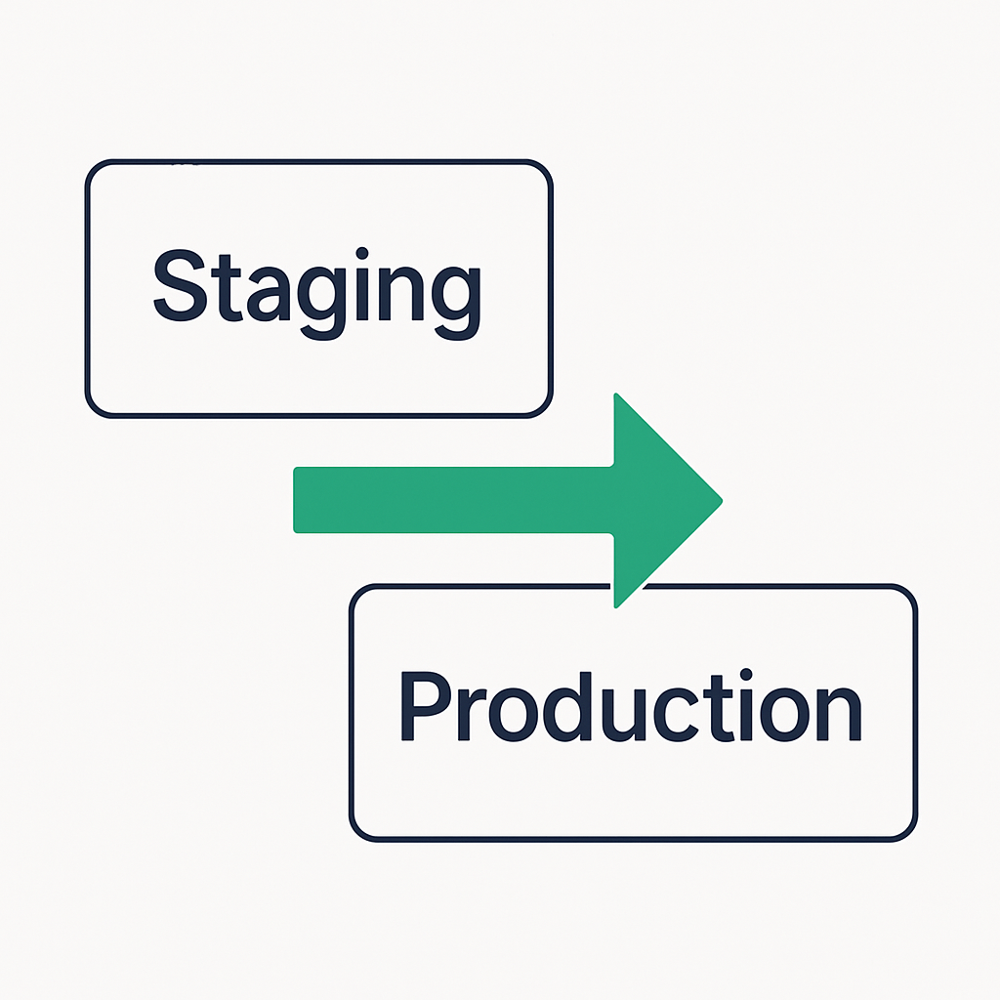

# Keeping ZenML Upgraded — Without Breaking Things

Upgrading ZenML doesn't have to be scary.

Whether you're using the open-source (OSS) version or ZenML Pro (where servers are called _workspaces_), this guide will help you set up a clean, testable, and stress-free upgrade process using a production + staging pattern.

1. Always have **two environments**: _production_ and _staging_.
2. Mirror everything in both places.
3. Use GitOps to automate upgrades.
4. Run the right tests in staging.
5. Re-create snapshots.
6. Cut over to production once staging is green.


That's it. The rest of this chapter just fills in the details.

## ☝️ Step #1: Always Use Two Environments

Whether you're OSS or Pro:

- You should **always have two environments**:
  - **Production** — where your team builds and runs real pipelines.
  - **Staging** — used *only* to test ZenML upgrades before they hit production.

> 🏢 **ZenML Pro** users: use **two workspaces** (e.g. `prod-workspace`, `staging-workspace`)  
> 💻 **ZenML OSS** users: run **two ZenML servers** (same logic applies)


## 🧱 Step #2: Mirror Your Stacks in Both Environments

At setup time:

- For every **stack in production**, create a **mirrored stack in staging**
- Ideally, they point to **separate infra**, but can also share infra if needed

| Stack Component     | Production              | Staging                   |
|---------------------|--------------------------|----------------------------|
| Kubernetes cluster  | `prod-k8s-cluster`       | `staging-k8s-cluster`     |
| Artifact store      | `s3://prod-bucket`       | `s3://staging-bucket`     |
| Container registry  | `gcr.io/prod-images`     | `gcr.io/staging-images`   |



* Point staging stacks to **staging variants** of your infra (e.g., a smaller K8s cluster, a test S3 bucket).
* When you change a stack in production, immediately update the twin in staging.


## 🛠️ Step #3: Use [GitOps](https://about.gitlab.com/topics/gitops/) to Manage Upgrades


Put your workspace configuration in a Git repository (Helm charts, Terraform, or the ZenML Pro API – pick your tool). Set up two long-lived branches:

* `staging`  – auto-deploys to the **staging workspace**
* `main`     – auto-deploys to **production**

```mermaid
flowchart LR
    dev["PR → staging branch"] --> stg["CI/CD upgrades Staging workspace"]
    stg --> tests["Run upgrade test suite"]
    tests -->|✅| merge["Merge staging ➜ main"]
    merge --> prod["CI/CD upgrades Production workspace"]
```




ZenML Pro users can call the [Workspace API](https://cloudapi.zenml.io/) from CI to bump the version. OSS users typically re-deploy the Helm chart/Docker image with the new tag.

## 🤝 Step #4: Run a test suite in staging

After upgrading staging, assume things might break — this is normal and expected.

At this point, the platform and data science / ML engineering teams should have mutually:

* Agree on a smoke test suite of pipelines or steps
* Maintain shared expectations on what counts as "upgrade success"

For example, the data science repo could contain a test suite that does the following checks:

```python
def test_artifact_loading():
    artifact = Client().get_artifact_version("xyz").load()
    assert artifact is not None

def test_simple_pipeline():
    run = run_pipeline(pipeline_name="...")
    assert run.status == "COMPLETED"
```

## 🔄 Step #5: Update all snapshots

Pipeline snapshots may now break as they have the older version of the ZenML client installed. Therefore, you would need to rebuild the snapshot and associated images.

The easiest way to do this is to re-create a snapshot using the CLI:

```shell
zenml pipeline snapshot create run.my_pipeline \
  --name upgraded-template \
  --stack staging-stack \
  --config configs/run.yaml
```


Read about [how snapshots work](https://docs.zenml.io/user-guides/tutorial/trigger-pipelines-from-external-systems).


After building, execute all snapshots end-to-end as a smoke test.
Ideally, your data science teams have a "smoke test" parameter in the pipeline
to load mock data just for this scenario!

## 🚀 Step #6: Upgrade Production and Go Live

Once staging is ✅ :

1. Merge `staging` ➜ `main`.
2. CI upgrades the production workspace.
3. Immediately:
   * Rebuild **all snapshots** in prod
   * **Reschedule** recurring pipelines (delete old schedules, create new ones). Read more [here](https://docs.zenml.io/user-guides/tutorial/managing-scheduled-pipelines)
4. Monitor for a few hours. Done.



## Ops Notes (OSS only)

If you self-host the ZenML server:

* Take a **database backup** before every upgrade.
* Keep the old Docker image tag handy for rollbacks.
* Store logs from the migration job.

[ZenML Pro](http://zenml.io/pro) SaaS handles all of the above for you.

## ✅ Summary: The Upgrade Flow

```
     ┌───────────────┐
     │ Git PR to dev │
     │ → staging env │
     └──────┬────────┘
            │
            ▼
   Upgrade staging server
            │
       Run all pipelines / tests
            │
     ✔ All tests pass?
        /               \
      Yes                 No
      |                    |
Recreate snapshots        Fix
     │
Upgrade prod
     |
 Rebuild & reschedule

```

* Two workspaces keep upgrades safe.
* GitOps makes them repeatable.
* A simple pipeline test suite keeps you honest.

Upgrade with confidence 🚀.

## 🔚 Final Notes

ZenML Pro: Hosted workspaces are upgraded automatically, but you still need to test your pipelines in staging before changes hit production.

ZenML OSS: You are responsible for upgrades, backups, and reconfiguration — this guide helps you minimize downtime and bugs.