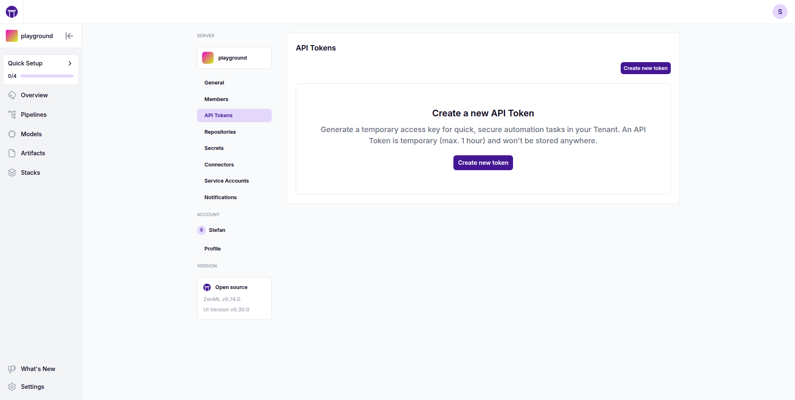
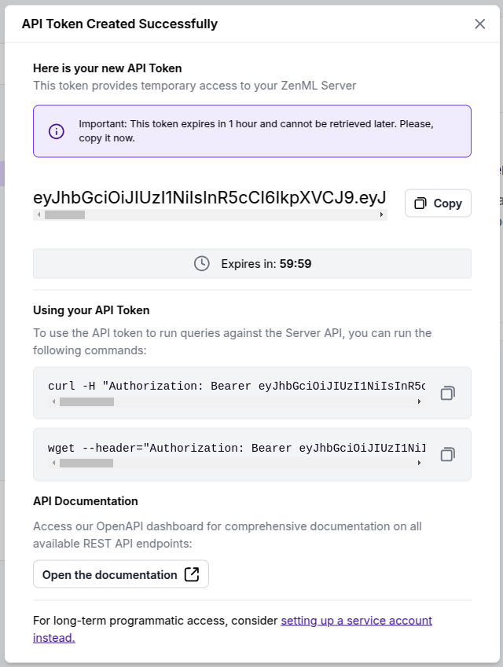

# Connect with an API Token

API tokens provide a way to authenticate with the ZenML server for temporary automation tasks. These tokens are scoped to your user account and are valid for a maximum of 1 hour.

## Generating an API Token

To generate a new API token:

1. Navigate to the server's Settings page in your ZenML dashboard (or the workspace's Settings page in your ZenML Pro dashboard)
2. Select "API Tokens" from the left sidebar

    

3. Click the "Create new token" button. Once generated, you'll see a dialog showing your new API token. 

    

## Programmatic access with API tokens

You can use the generated API tokens for programmatic access to the ZenML server's REST API. This is the quickest way to access the ZenML API programmatically when you're not using the ZenML CLI or Python client and you don't want to set up a service account.

Accessing the API with this method is thoroughly documented in the [API reference section](../../../reference/api-reference.md#using-a-short-lived-api-token).

<!-- For scarf -->
<figure></figure>

