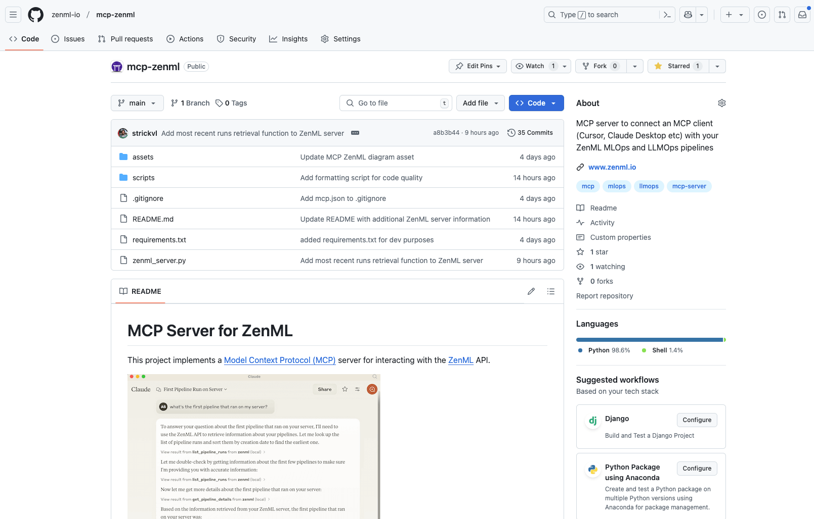
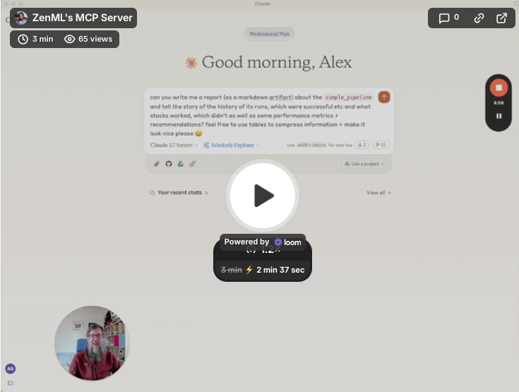
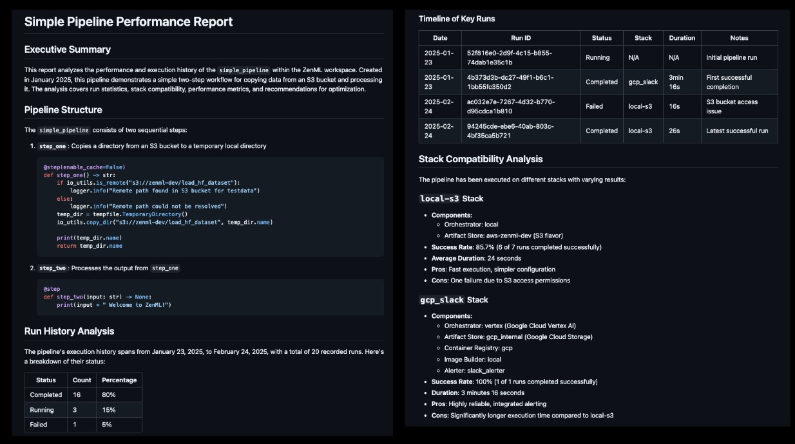
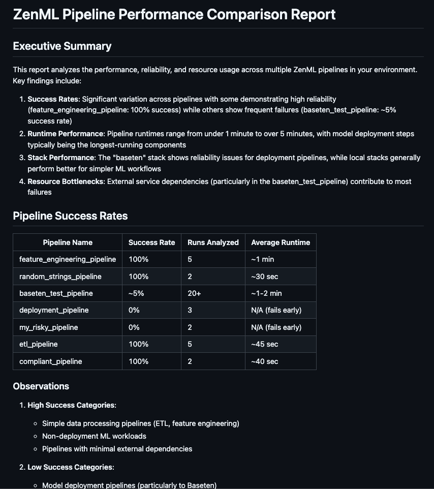
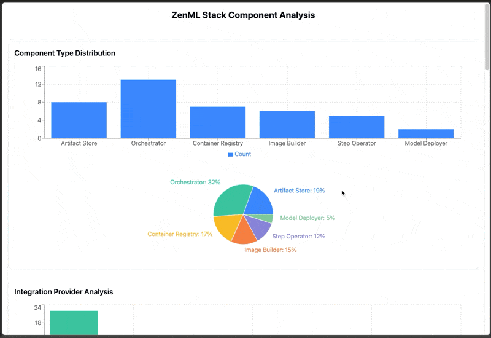

# Chat with your ZenML server

ZenML server supports a chat interface that allows you to interact with the server using natural language through the [Model Context Protocol (MCP)](https://modelcontextprotocol.io/). This feature enables you to query your ML pipelines, analyze performance metrics, and generate reports using conversational language instead of traditional CLI commands or dashboard interfaces.



## What is MCP?

The Model Context Protocol (MCP) is an open protocol that standardizes how applications provide context to Large Language Models (LLMs). Think of it as a "USB-C port for AI applications" - providing a standardized way to connect AI models to different data sources and tools.

MCP follows a client-server architecture where:
- **MCP Clients**: Programs like Claude Desktop or IDEs (Cursor, Windsurf, etc.) that want to access data through MCP
- **MCP Servers**: Lightweight programs that expose specific capabilities
  through the standardized protocol. Our implementation is of an MCP server that connects to your ZenML server.

## Why use MCP with ZenML?

The ZenML MCP Server offers several advantages for developers and teams:

1. **Natural Language Interaction**: Query your ZenML metadata, code and logs using conversational language instead of memorizing CLI commands or navigating dashboard interfaces.
2. **Contextual Development**: Get insights about failing pipelines or performance metrics without switching away from your development environment.
3. **Accessible Analytics**: Generate custom reports and visualizations about your pipelines directly through conversation.
4. **Streamlined Workflows**: Trigger pipeline runs via natural language requests when you're ready to execute.

You can get a sense of how it works in the following video:

[](https://www.loom.com/share/4cac0c90bd424df287ed5700e7680b14?sid=200acd11-2f1b-4953-8577-6fe0c65cad3c)

## Features

The ZenML MCP server provides access to core read functionality from your ZenML server, allowing you to get live information about:

- Users
- Stacks
- Pipelines
- Pipeline runs
- Pipeline steps
- Services
- Stack components
- Flavors
- Pipeline run templates
- Schedules
- Artifacts (metadata about data artifacts, not the data itself)
- Service Connectors
- Step code
- Step logs (if the step was run on a cloud-based stack)

It also allows you to trigger new pipeline runs through existing run templates.

## Getting Started

For the most up-to-date setup instructions and code, please refer to the [ZenML
MCP Server GitHub repository](https://github.com/zenml-io/mcp-zenml). We
recommend using the `uv` package manager to install the dependencies since it's
the most reliable and fastest setup experience.

The setup process for the ZenML MCP Server is straightforward:‍

### Prerequisites:
- Access to a ZenML Cloud server
- [`uv`](https://docs.astral.sh/uv/) installed locally
- A local clone of the repository

### Configuration:

- Create an MCP config file with your ZenML server details
- Configure your preferred MCP client (Claude Desktop or Cursor)

For detailed setup instructions, please refer to the [GitHub repository](https://github.com/zenml-io/mcp-zenml).

## Example Usage

Once set up, you can interact with your ZenML infrastructure through natural language. Here are some example prompts you can try:

1. **Pipeline Analysis Report**:
   ```
   Can you write me a report (as a markdown artifact) about the 'simple_pipeline' and tell the story of the history of its runs, which were successful etc., and what stacks worked, which didn't, as well as some performance metrics + recommendations?
   ```



2. **Comparative Pipeline Analysis**:
   ```
   Could you analyze all our ZenML pipelines and create a comparison report (as a markdown artifact) that highlights differences in success rates, average run times, and resource usage? Please include a section on which stacks perform best for each pipeline type.
   ```



3. **Stack Component Analysis**:
   ```
   Please generate a comprehensive report or dashboard on our ZenML stack components, showing which ones are most frequently used across our pipelines. Include information about version compatibility issues and performance variations.
   ```



## Get Involved

We invite you to try the [ZenML MCP Server](https://github.com/zenml-io/mcp-zenml) and share your experiences with us through our [Slack community](https://zenml.io/slack). We're particularly interested in:

- Whether you need additional write actions (creating stacks, registering components, etc.)
- Examples of how you're using the server in your workflows
- Suggestions for additional features or improvements

Contributions and pull requests to [the core repository](https://github.com/zenml-io/mcp-zenml) are always welcome!
