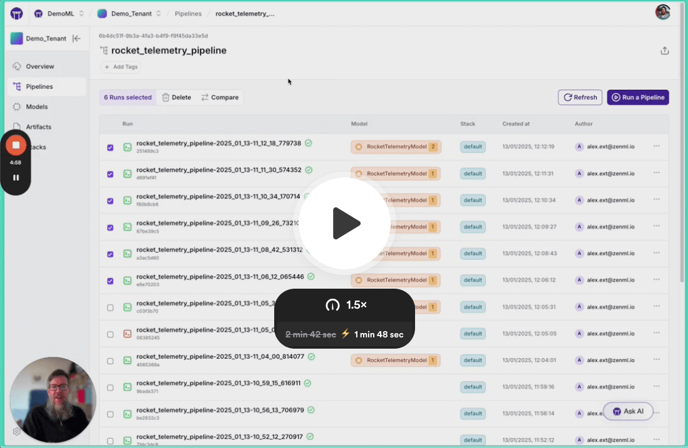
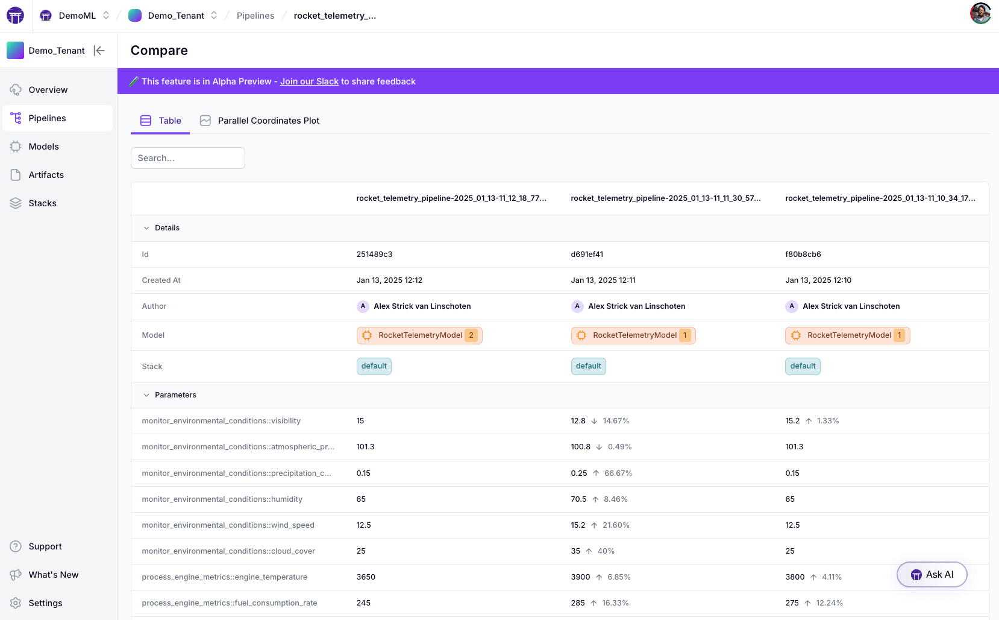
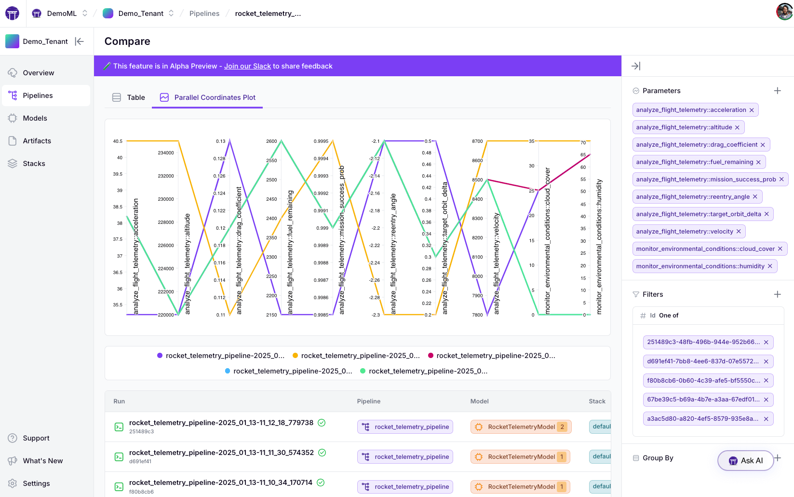

# Metadata

Metadata in ZenML provides critical context to your ML workflows, allowing you to track additional information about your steps, runs, artifacts, and models. This enhanced traceability helps you better understand, compare, and reproduce your experiments.


Metadata is any additional contextual information you want to associate with your ML workflow components. In ZenML, you can attach metadata to:

* **Steps**: Log evaluation metrics, execution details, or configuration information
* **Pipeline Runs**: Track overall run characteristics like environment variables or git information
* **Artifacts**: Document data characteristics, source information, or processing details
* **Models**: Capture evaluation results, hyperparameters, or deployment information

ZenML makes it easy to log and retrieve this information through a simple interface, and visualizes it in the dashboard for quick analysis.

## Logging Metadata

The primary way to log metadata in ZenML is through the `log_metadata` function, which allows you to attach JSON-serializable key-value pairs to various entities.

```python
from zenml import log_metadata

# Basic metadata logging
log_metadata(
    metadata={"accuracy": 0.95, "precision": 0.92},
    # Additional parameters to specify where to log the metadata
)
```

The `log_metadata` function is versatile and can target different entities depending on the parameters provided.

### Attaching Metadata to Steps

To log metadata for a step, you can either call `log_metadata` within the step (which automatically associates with the current step), or specify a step explicitly:

```python
from zenml import step, log_metadata

# Method 1: Within a step (automatically associates with current step)
@step
def train_model_step(data):
    model = train_model(data)
    accuracy = evaluate_model(model, data)
    
    # Log metrics directly within the step
    log_metadata(
        metadata={"evaluation_metrics": {"accuracy": accuracy}}
    )
    
    return model

# Method 2: Targeting a specific step after execution
log_metadata(
    metadata={"post_analysis": {"feature_importance": [0.2, 0.5, 0.3]}},
    step_name="train_model_step",
    run_id_name_or_prefix="my_run_id"
)

# Alternative: Using step_id
log_metadata(
    metadata={"post_analysis": {"feature_importance": [0.2, 0.5, 0.3]}},
    step_id="step_uuid"
)
```

### Attaching Metadata to Pipeline Runs

You can log metadata for an entire pipeline run, either from within a step during execution or manually after the run:

```python
from zenml import pipeline, step, log_metadata

# Method 1: Within a step (logs to the current run)
@step
def log_run_info_step():
    # Get some runtime information
    git_commit = get_git_hash()
    environment = get_env_info()
    
    # Log to the current pipeline run
    log_metadata(
        metadata={
            "git_info": {"commit": git_commit},
            "environment": environment
        }
    )

# Method 2: Manually targeting a specific run
log_metadata(
    metadata={"post_run_analysis": {"total_training_time": 350}},
    run_id_name_or_prefix="my_run_id"
)
```

When logging from within a step to the pipeline run, the metadata key will have the pattern `step_name::metadata_key`, allowing multiple steps to use the same metadata key.

### Attaching Metadata to Artifacts

Artifacts are the data objects produced by pipeline steps. You can log metadata for these artifacts to provide more context about the data:

```python
from zenml import step, log_metadata
from zenml.metadata.metadata_types import StorageSize

# Method 1: Within a step for an output artifact
@step
def process_data_step(raw_data):
    processed_data = transform(raw_data)
    
    # Log metadata for the output artifact (when step has single output)
    log_metadata(
        metadata={
            "data_stats": {
                "row_count": len(processed_data),
                "columns": list(processed_data.columns),
                "storage_size": StorageSize(processed_data.memory_usage().sum())
            }
        },
        infer_artifact=True  # Automatically target the output artifact
    )
    
    return processed_data

# Method 2: For a step with multiple outputs
@step
def split_data_step(data):
    train, test = split_data(data)
    
    # Log metadata for specific output by name
    log_metadata(
        metadata={"split_info": {"train_size": len(train)}},
        artifact_name="output_0",  # Name of the specific output
        infer_artifact=True
    )
    
    return train, test

# Method 3: Explicitly target an artifact by name and version
log_metadata(
    metadata={"validation_results": {"distribution_shift": 0.03}},
    artifact_name="processed_data",
    artifact_version="20230615"
)

# Method 4: Target by artifact version ID
log_metadata(
    metadata={"validation_results": {"distribution_shift": 0.03}},
    artifact_version_id="artifact_uuid"
)
```

### Attaching Metadata to Models

Models in ZenML represent a higher-level concept that can encapsulate multiple artifacts and steps. Logging metadata for models helps track performance and other important information:

```python
from zenml import step, log_metadata

# Method 1: Within a step that produces a model
@step
def train_model_step(data):
    model = train_model(data)
    metrics = evaluate_model(model, data)
    
    # Log metadata to the model
    log_metadata(
        metadata={
            "evaluation_metrics": metrics,
            "hyperparameters": model.get_params()
        },
        infer_model=True  # Automatically target the model associated with this step
    )
    
    return model

# Method 2: Explicitly target a model by name and version
log_metadata(
    metadata={"deployment_info": {"endpoint": "api.example.com/model"}},
    model_name="fraud_detector",
    model_version="1.0.0"
)

# Method 3: Target by model version ID
log_metadata(
    metadata={"deployment_info": {"endpoint": "api.example.com/model"}},
    model_version_id="model_version_uuid"
)
```

## Special Metadata Types

ZenML includes several special metadata types that provide standardized ways to represent common metadata:

```python
from zenml import log_metadata
from zenml.metadata.metadata_types import StorageSize, DType, Uri, Path

log_metadata(
    metadata={
        "dataset_source": Uri("gs://my-bucket/datasets/source.csv"),  # External URI
        "preprocessing_script": Path("/scripts/preprocess.py"),  # File path
        "column_types": {
            "age": DType("int"),  # Data type
            "income": DType("float"),
            "score": DType("int")
        },
        "processed_data_size": StorageSize(2500000)  # Size in bytes
    },
    infer_artifact=True
)
```

These special types ensure metadata is logged in a consistent and interpretable manner, and they receive special treatment in the ZenML dashboard.

## Organizing Metadata in the Dashboard

To improve visualization in the ZenML dashboard, you can group metadata into logical sections by passing a dictionary of dictionaries:

```python
from zenml import log_metadata
from zenml.metadata.metadata_types import StorageSize

log_metadata(
    metadata={
        "model_metrics": {  # First card in the dashboard
            "accuracy": 0.95,
            "precision": 0.92,
            "recall": 0.90
        },
        "data_details": {   # Second card in the dashboard
            "dataset_size": StorageSize(1500000),
            "feature_columns": ["age", "income", "score"]
        }
    },
    artifact_name="my_artifact",
    artifact_version="version",
)
```

In the ZenML dashboard, "model\_metrics" and "data\_details" will appear as separate cards, each containing their respective key-value pairs, making it easier to navigate and interpret the metadata.

## Visualizing and Comparing Metadata (Pro)

Once you've logged metadata in your runs, you can use ZenML's Experiment Comparison tool to analyze and compare metrics across different run.


The metadata comparison tool is a [ZenML Pro](https://zenml.io/pro)-only feature.


[](https://www.loom.com/share/693b2d829600492da7cd429766aeba6a?sid=7182e55b-31e9-4b38-a3be-07c989dbea32)

### Comparison Views

The Experiment Comparison tool offers two complementary views for analyzing your pipeline metadata:

1. **Table View**: Compare metadata across runs with automatic change tracking



2. **Parallel Coordinates Plot**: Visualize relationships between different metrics



The tool lets you compare up to 20 pipeline runs simultaneously and supports any
numerical metadata (`float` or `int`) that you've logged in your pipelines.

## Fetching Metadata

### Retrieving Metadata Programmatically

Once metadata has been logged, you can retrieve it using the ZenML Client:

```python
from zenml.client import Client

client = Client()

# Get metadata from a step
step = client.get_pipeline_run("pipeline_run_id").steps["step_name"]
step_metadata = step.run_metadata["metadata_key"]

# Get metadata from a run
run = client.get_pipeline_run("pipeline_run_id")
run_metadata = run.run_metadata["metadata_key"]

# Get metadata from an artifact
artifact = client.get_artifact_version("artifact_name", "version")
artifact_metadata = artifact.run_metadata["metadata_key"]

# Get metadata from a model
model = client.get_model_version("model_name", "version")
model_metadata = model.run_metadata["metadata_key"]
```


When fetching metadata using a specific key, the returned value will always reflect the latest entry for that key.


### Accessing Context Within Steps

The `StepContext` object is your handle to the *current* pipeline/step run while a step executes. Use it to read run/step information, inspect upstream input metadata, and work with step outputs: URIs, materializers, run metadata, and tags.

It is available:
- Inside functions decorated with `@step` (during execution, not composition time).
- Inside step hooks like `on_failure` / `on_success`.
- Inside materializers triggered by a step’s `save` / `load`.
- Calling `get_step_context()` elsewhere raises `RuntimeError`.

Getting the context is done via `get_step_context()`:

```python
from zenml import step, get_step_context

@step
def trainer(param: int = 1):
    ctx = get_step_context()
    print("run:",  ctx.pipeline_run.name, ctx.pipeline_run.id)
    print("step:", ctx.step_run.name,   ctx.step_run.id)
    print("params:", ctx.step_run.config.parameters)
```

This exposes the following properties:

* `ctx.pipeline` → the `PipelineResponse` for this run (convenience; may raise if the run has no pipeline object).
* `ctx.pipeline_run` → `PipelineRunResponse` (id, name, status, timestamps, etc.).
* `ctx.step_run` → `StepRunResponse` (name, parameters via `ctx.step_run.config.parameters`, status).
* `ctx.model` → the configured `Model` (resolved from step or pipeline); raises if none configured.
* `ctx.inputs` → `{input_name: StepRunInputResponse}`; use `...["x"].run_metadata` to read upstream metadata.
* `ctx.step_name` → convenience name string.

### Working with outputs

For a single-output step you can omit `output_name`. For multi-output steps you **must** pass it (unnamed outputs are called `output_1`, `output_2`, …).

* `get_output_artifact_uri(output_name=None) -> str` – where the output artifact lives (write side files, etc.).
* `get_output_materializer(output_name=None, *, custom_materializer_class=None, data_type=None) -> BaseMaterializer` – get an initialized materializer; pass `data_type` to select from `Union[...]` materializers or `custom_materializer_class` to override.
* `add_output_metadata(metadata, output_name=None)` / `get_output_metadata(output_name=None)` – set/read run metadata for the output. Values provided via `ArtifactConfig(..., run_metadata=...)` on the return annotation are merged with runtime values.
* `add_output_tags(tags, output_name=None)` / `get_output_tags(output_name=None)` / `remove_output_tags(tags, output_name=None)` – manage tags for the produced artifact version. Configured tags via `ArtifactConfig(..., tags=...)` are unioned with runtime tags; duplicates are de‑duplicated in the final artifact.

Minimal example:

```python
from typing import Annotated, Tuple
from zenml import step, get_step_context, log_metadata
from zenml.artifacts.artifact_config import ArtifactConfig

@step
def produce(name: str) -> Tuple[
    Annotated[
        str,
        ArtifactConfig(
            name="custom_name",
            run_metadata={"config_metadata": "bar"},
            tags=["config_tags"],
        ),
    ],
    str,
]:
    ctx = get_step_context()
    # Attach metadata and tags to the named (or default) output
    ctx.add_output_metadata({"m": 1}, output_name=name)
    ctx.add_output_tags(["t1", "t1"], output_name=name)  # duplicates ok
    return "a", "b"
```

#### Reading upstream metadata via `inputs`

```python
from zenml import step, get_step_context, log_metadata

@step
def upstream() -> int:
    log_metadata({"quality": "ok"}, infer_artifact=True)
    return 42

@step
def downstream(x: int) -> None:
    md = get_step_context().inputs["x"].run_metadata
    assert md["quality"] == "ok"
```

#### Hooks and materializers (advanced)

```python
from zenml import step, get_step_context
from zenml.materializers.base_materializer import BaseMaterializer

def on_failure(exc: BaseException):
    c = get_step_context()
    print("Failed step:", c.step_run.name, "-", type(exc).__name__)

class ExampleMaterializer(BaseMaterializer):
    def save(self, data):
        # Context is available while the step triggers materialization
        data.meta = get_step_context().pipeline.name
        super().save(data)

@step(on_failure=on_failure)
def my_step():
    raise ValueError("boom")
```

**Common errors to expect.**

* `RuntimeError` if `get_step_context()` is called outside a running step.
* `StepContextError` for output helpers when:

  * The step has no outputs,
  * You omit `output_name` on a multi‑output step,
  * You reference an unknown `output_name`.

See the [full SDK docs for `StepContext`](https://sdkdocs.zenml.io/latest/core_code_docs/core-steps.html#zenml.steps.StepContext) for a concise reference to this object.

### Accessing Context During Pipeline Composition

During pipeline composition, you can access the pipeline configuration using the `PipelineContext`:

```python
from zenml import pipeline, get_pipeline_context

@pipeline(
    extra={
        "model_configs": [
            ("sklearn.tree", "DecisionTreeClassifier"),
            ("sklearn.ensemble", "RandomForestClassifier"),
        ]
    }
)
def my_pipeline():
    # Get the pipeline context
    context = get_pipeline_context()
    
    # Access the configuration
    model_configs = context.extra["model_configs"]
    
    # Use the configuration to dynamically create steps
    for i, (model_package, model_class) in enumerate(model_configs):
        train_model(
            model_package=model_package,
            model_class=model_class,
            id=f"train_model_{i}"
        )
```

## Best Practices

To make the most of ZenML's metadata capabilities:

1. **Use consistent keys**: Define standard metadata keys for your organization to ensure consistency
2. **Group related metadata**: Use nested dictionaries to create logical groupings in the dashboard
3. **Leverage special types**: Use ZenML's special metadata types for standardized representation
4. **Log relevant information**: Focus on metadata that aids reproducibility, understanding, and decision-making
5. **Consider automation**: Set up automatic metadata logging for standard metrics and information
6. **Combine with tags**: Use metadata alongside tags for a comprehensive organization system

## Conclusion

Metadata in ZenML provides a powerful way to enhance your ML workflows with contextual information. By tracking additional details about your steps, runs, artifacts, and models, you can gain deeper insights into your experiments, make more informed decisions, and ensure reproducibility of your ML pipelines.
