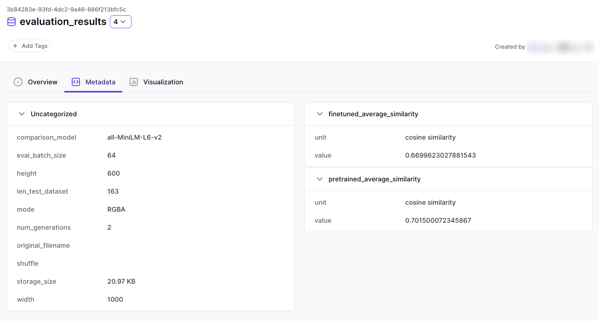

# Attach metadata to an artifact



In ZenML, metadata enhances artifacts by adding context and important details, 
such as size, structure, or performance metrics. This metadata is accessible 
in the ZenML dashboard, making it easier to inspect, compare, and track 
artifacts across pipeline runs.

## Logging Metadata for Artifacts

Artifacts in ZenML are outputs of steps within a pipeline, such as datasets, 
models, or evaluation results. Associating metadata with artifacts can help 
users understand the nature and characteristics of these outputs.

To log metadata for an artifact, use the `log_metadata` function, specifying 
the artifact name, version, or ID. The metadata can be any JSON-serializable 
value, including ZenML custom types like `Uri`, `Path`, `DType`, and 
`StorageSize`. Find out more about these different types 
[here](../../model-management-metrics/track-metrics-metadata/logging-metadata.md).

Here's an example of logging metadata for an artifact:

```python
import pandas as pd

from zenml import step, log_metadata
from zenml.metadata.metadata_types import StorageSize


@step
def process_data_step(dataframe: pd.DataFrame) -> pd.DataFrame:
    """Process a dataframe and log metadata about the result."""
    processed_dataframe = ...

    # Log metadata about the processed dataframe
    log_metadata(
        metadata={
            "row_count": len(processed_dataframe),
            "columns": list(processed_dataframe.columns),
            "storage_size": StorageSize(
                processed_dataframe.memory_usage().sum())
        },
        infer_artifact=True,
    )
    return processed_dataframe
```

### Selecting the artifact to log the metadata to

When using `log_metadata` with an artifact name, ZenML provides flexible 
options to attach metadata to the correct artifact:

1. **Using `infer_artifact`**: If used within a step, ZenML will use the step
context to infer the outputs artifacts of the step. If the step has only one 
output, this artifact will be selected. However, if you additionally 
provide an `artifact_name`, ZenML will search for this name in the output space
of the step (useful for step with multiple outputs).
2. **Name and Version Provided**: If both an artifact name and version are 
provided, ZenML will use these to identify and attach metadata to the 
specific artifact version.
3. **Artifact Version ID Provided**: If an artifact version ID is provided 
directly, ZenML will use it to fetch and attach the metadata to that 
specific artifact version.

## Fetching logged metadata

Once metadata has been logged in an artifact, or 
[step](../track-metrics-metadata/attach-metadata-to-a-model.md), we can easily 
fetch the metadata with the ZenML Client:

```python
from zenml.client import Client

client = Client()
artifact = client.get_artifact_version("my_artifact", "my_version")

print(artifact.run_metadata["metadata_key"])
```


When you are fetching metadata using a specific key, the returned value will 
always reflect the latest entry.


## Grouping Metadata in the Dashboard

When logging metadata passing a dictionary of dictionaries in the `metadata` 
parameter will group the metadata into cards in the ZenML dashboard. This 
feature helps organize metadata into logical sections, making it easier to 
visualize and understand.

Here's an example of grouping metadata into cards:

```python
from zenml import log_metadata

from zenml.metadata.metadata_types import StorageSize

log_metadata(
    metadata={
        "model_metrics": {
            "accuracy": 0.95,
            "precision": 0.92,
            "recall": 0.90
        },
        "data_details": {
            "dataset_size": StorageSize(1500000),
            "feature_columns": ["age", "income", "score"]
        }
    },
    artifact_name="my_artifact",
    artifact_version="version",
)
```

In the ZenML dashboard, `model_metrics` and `data_details` would appear as 
separate cards, each containing their respective key-value pairs.

<!-- For scarf -->
<figure></figure>