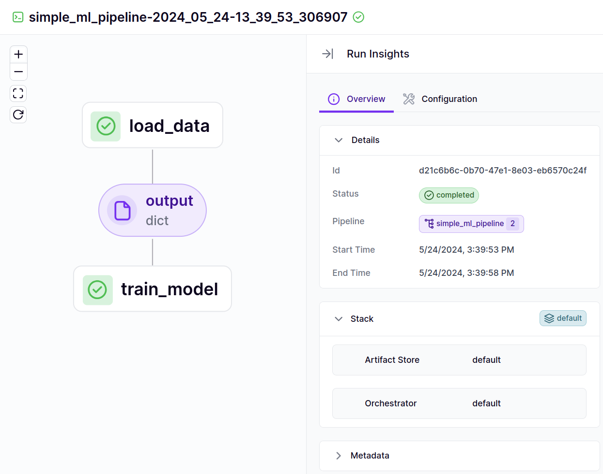

# Build a pipeline

```python
from zenml import pipeline, step


@step  # Just add this decorator
def load_data() -> dict:
    training_data = [[1, 2], [3, 4], [5, 6]]
    labels = [0, 1, 0]
    return {'features': training_data, 'labels': labels}


@step
def train_model(data: dict) -> None:
    total_features = sum(map(sum, data['features']))
    total_labels = sum(data['labels'])

    # Train some model here

    print(f"Trained model using {len(data['features'])} data points. "
          f"Feature sum is {total_features}, label sum is {total_labels}")


@pipeline  # This function combines steps together 
def simple_ml_pipeline():
    dataset = load_data()
    train_model(dataset)
```

You can now run this pipeline by simply calling the function:

```python
simple_ml_pipeline()
```

When this pipeline is executed, the run of the pipeline gets logged to the ZenML dashboard where you can now go to look
at its DAG and all the associated metadata. To access the dashboard you need to have a ZenML server either running
locally or remotely. See our documentation on this [here](https://docs.zenml.io/getting-started/deploying-zenml).

<figure><figcaption><p>DAG representation in the ZenML Dashboard.</p></figcaption></figure>

Check below for more advanced ways to build and interact with your pipeline.

<table data-view="cards"><thead><tr><th></th><th></th><th></th><th data-hidden data-card-target data-type="content-ref"></th></tr></thead><tbody><tr><td>Configure pipeline/step parameters</td><td></td><td></td><td><a href="use-pipeline-step-parameters.md">use-pipeline-step-parameters.md</a></td></tr><tr><td>Name and annotate step outputs</td><td></td><td></td><td><a href="step-output-typing-and-annotation.md">step-output-typing-and-annotation.md</a></td></tr><tr><td>Control caching behavior</td><td></td><td></td><td><a href="control-caching-behavior.md">control-caching-behavior.md</a></td></tr><tr><td>Customize the step invocation ids</td><td></td><td></td><td><a href="using-a-custom-step-invocation-id.md">using-a-custom-step-invocation-id.md</a></td></tr><tr><td>Name your pipeline runs</td><td></td><td></td><td><a href="name-your-pipeline-runs.md">name-your-pipeline-runs.md</a></td></tr><tr><td>Use failure/success hooks</td><td></td><td></td><td><a href="use-failure-success-hooks.md">use-failure-success-hooks.md</a></td></tr><tr><td>Hyperparameter tuning</td><td></td><td></td><td><a href="hyper-parameter-tuning.md">hyper-parameter-tuning.md</a></td></tr><tr><td>Attach metadata to a step</td><td></td><td></td><td><a href="https://docs.zenml.io/how-to/model-management-metrics/track-metrics-metadata/attach-metadata-to-a-step">attach-metadata-to-a-step.md</a></td></tr><tr><td>Fetch metadata within steps</td><td></td><td></td><td><a href="https://docs.zenml.io/how-to/model-management-metrics/track-metrics-metadata/fetch-metadata-within-steps">fetch-metadata-within-steps.md</a></td></tr><tr><td>Fetch metadata during pipeline composition</td><td></td><td></td><td><a href="https://docs.zenml.io/how-to/model-management-metrics/track-metrics-metadata/fetch-metadata-within-pipeline">fetch-metadata-within-pipeline.md</a></td></tr><tr><td>Enable or disable logs storing</td><td></td><td></td><td><a href="https://docs.zenml.io/how-to/control-logging/enable-or-disable-logs-storing">enable-or-disable-logs-storing.md</a></td></tr><tr><td>Special Metadata Types</td><td></td><td></td><td><a href="https://docs.zenml.io/how-to/model-management-metrics/track-metrics-metadata/logging-metadata">logging-metadata.md</a></td></tr><tr><td>Access secrets in a step</td><td></td><td></td><td><a href="access-secrets-in-a-step.md">access-secrets-in-a-step.md</a></td></tr></tbody></table>

<figure><figcaption></figcaption></figure>
