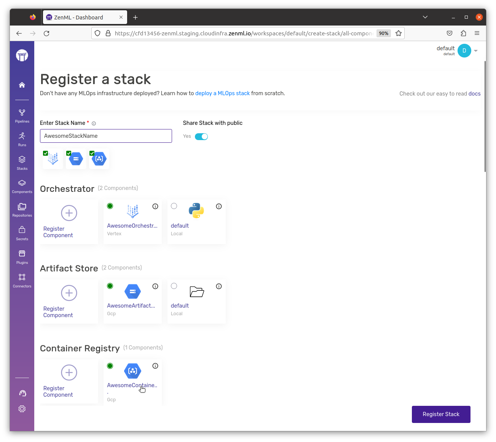
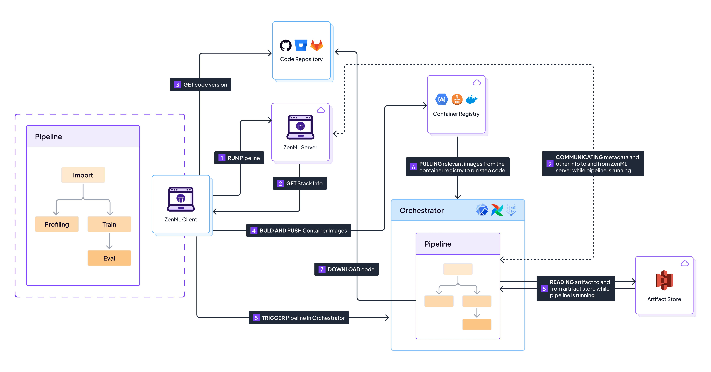

# Run on AWS

This page aims to quickly set up a minimal production stack on AWS. With just a few simple steps, you will set up an IAM role with specifically-scoped permissions that ZenML can use to authenticate with the relevant AWS resources.


Would you like to skip ahead and deploy a full AWS ZenML cloud stack already?

Check out the
[easy cloud deployment wizard](../../how-to/stack-deployment/deploy-a-cloud-stack.md),
the [easy cloud registration wizard](../../how-to/stack-deployment/register-a-cloud-stack.md),
or [the ZenML AWS Terraform module](../../how-to/stack-deployment/deploy-a-cloud-stack-with-terraform.md)
for a shortcut on how to deploy & register this stack.



## 1) Set up credentials and local environment

To follow this guide, you need:

* An active AWS account with necessary permissions for AWS S3, SageMaker, ECR, and ECS.
* ZenML [installed](../../getting-started/installation.md)
* AWS CLI installed and configured with your AWS credentials. You can follow the instructions [here](https://docs.aws.amazon.com/cli/latest/userguide/getting-started-install.html).

Once ready, navigate to the AWS console:

1. Choose an AWS region In the AWS console, choose the region where you want to deploy your ZenML stack resources. Make note of the region name (e.g., `us-east-1`, `eu-west-2`, etc.) as you will need it in subsequent steps.
2. Create an IAM role

For this, you'll need to find out your AWS account ID. You can find this by running:

```shell
aws sts get-caller-identity --query Account --output text
```

This will output your AWS account ID. Make a note of this as you will need it in the next steps. (If you're doing anything more esoteric with your AWS account and IAM roles, this might not work for you. The account ID here that we're trying to get is the root account ID that you use to log in to the AWS console.)

Then create a file named `assume-role-policy.json` with the following content:

```json
{
  "Version": "2012-10-17",
  "Statement": [
    {
      "Effect": "Allow",
      "Principal": {
        "AWS": "arn:aws:iam::<YOUR_ACCOUNT_ID>:root",
        "Service": "sagemaker.amazonaws.com"
      },
      "Action": "sts:AssumeRole"
    }
  ]
}
```

Make sure to replace the placeholder `<YOUR_ACCOUNT_ID>` with your actual AWS account ID that we found earlier.

Now create a new IAM role that ZenML will use to access AWS resources. We'll use `zenml-role` as a role name in this example, but you can feel free to choose something else if you prefer. Run the following command to create the role:

```shell
aws iam create-role --role-name zenml-role --assume-role-policy-document file://assume-role-policy.json
```

Be sure to take note of the information that is output to the terminal, as you will need it in the next steps, especially the Role ARN.

1. Attach policies to the role

Attach the following policies to the role to grant access to the necessary AWS services:

* `AmazonS3FullAccess`
* `AmazonEC2ContainerRegistryFullAccess`
* `AmazonSageMakerFullAccess`

```shell
aws iam attach-role-policy --role-name zenml-role --policy-arn arn:aws:iam::aws:policy/AmazonS3FullAccess
aws iam attach-role-policy --role-name zenml-role --policy-arn arn:aws:iam::aws:policy/AmazonEC2ContainerRegistryFullAccess
aws iam attach-role-policy --role-name zenml-role --policy-arn arn:aws:iam::aws:policy/AmazonSageMakerFullAccess
```

1. If you have not already, install the AWS and S3 ZenML integrations:

```shell
zenml integration install aws s3 -y
```

## 2) Create a Service Connector within ZenML

Create an AWS Service Connector within ZenML. The service connector will allow ZenML and other ZenML components to authenticate themselves with AWS using the IAM role.



```shell
zenml service-connector register aws_connector \
  --type aws \
  --auth-method iam-role \
  --role_arn=<ROLE_ARN> \
  --region=<YOUR_REGION> \
  --aws_access_key_id=<YOUR_ACCESS_KEY_ID> \
  --aws_secret_access_key=<YOUR_SECRET_ACCESS_KEY>
```

Replace `<ROLE_ARN>` with the ARN of the IAM role you created in the previous step, `<YOUR_REGION>` with the respective value and use your AWS access key ID and secret access key that we noted down earlier.



## 3) Create Stack Components

### Artifact Store (S3)

An [artifact store](../../user-guide/production-guide/remote-storage.md) is used for storing and versioning data flowing through your pipelines.

1. Before you run anything within the ZenML CLI, create an AWS S3 bucket. If you already have one, you can skip this step. (Note: the bucket name should be unique, so you might need to try a few times to find a unique name.)

```shell
aws s3api create-bucket --bucket your-bucket-name
```

Once this is done, you can create the ZenML stack component as follows:

1. Register an S3 Artifact Store with the connector

```shell
zenml artifact-store register cloud_artifact_store -f s3 --path=s3://bucket-name --connector aws_connector
```

More details [here](../../component-guide/artifact-stores/s3.md).

### Orchestrator (SageMaker Pipelines)

An [orchestrator](../../user-guide/production-guide/cloud-orchestration.md) is the compute backend to run your pipelines.

1. Before you run anything within the ZenML CLI, head on over to AWS and create a SageMaker domain (Skip this if you already have one). The instructions for creating a domain can be found [in the AWS core documentation](https://docs.aws.amazon.com/sagemaker/latest/dg/onboard-quick-start.html).

A SageMaker domain is a central management unit for all SageMaker users and resources within a region. It provides a single sign-on (SSO) experience and enables users to create and manage SageMaker resources, such as notebooks, training jobs, and endpoints, within a collaborative environment.

When you create a SageMaker domain, you specify the configuration settings, such as the domain name, user profiles, and security settings. Each user within a domain gets their own isolated workspace, which includes a JupyterLab interface, a set of compute resources, and persistent storage.

The SageMaker orchestrator in ZenML requires a SageMaker domain to run pipelines because it leverages the SageMaker Pipelines service, which is part of the SageMaker ecosystem. SageMaker Pipelines allows you to define, execute, and manage end-to-end machine learning workflows using a declarative approach.

By creating a SageMaker domain, you establish the necessary environment and permissions for the SageMaker orchestrator to interact with SageMaker Pipelines and other SageMaker resources seamlessly. The domain acts as a prerequisite for using the SageMaker orchestrator in ZenML.

Once this is done, you can create the ZenML stack component as follows:

1. Register a SageMaker Pipelines orchestrator stack component:

You'll need the IAM role ARN that we noted down earlier to register the orchestrator. This is the 'execution role' ARN you need to pass to the orchestrator.

```shell
zenml orchestrator register sagemaker-orchestrator --flavor=sagemaker --region=<YOUR_REGION> --execution_role=<ROLE_ARN>
```

**Note**: The SageMaker orchestrator utilizes the AWS configuration for operation and does not require direct connection via a service connector for authentication, as it relies on your AWS CLI configurations or environment variables.

More details [here](../../component-guide/orchestrators/sagemaker.md).

### Container Registry (ECR)

A [container registry](../../component-guide/container-registries/container-registries.md) is used to store Docker images for your pipelines.

1. You'll need to create a repository in ECR. If you already have one, you can skip this step.

```shell
aws ecr create-repository --repository-name zenml --region <YOUR_REGION>
```

Once this is done, you can create the ZenML stack component as follows:

1. Register an ECR container registry stack component:

```shell
zenml container-registry register ecr-registry --flavor=aws --uri=<ACCOUNT_ID>.dkr.ecr.<YOUR_REGION>.amazonaws.com --connector aws-connector
```

More details [here](../../component-guide/container-registries/aws.md).

## 4) Create stack



```shell
export STACK_NAME=aws_stack

zenml stack register ${STACK_NAME} -o ${ORCHESTRATOR_NAME} \
    -a ${ARTIFACT_STORE_NAME} -c ${CONTAINER_REGISTRY_NAME} --set
```


In case you want to also add any other stack components to this stack, feel free to do so.




<figure><figcaption><p>Combine the three stack components and you have your AWS stack. Feel free to add any other component of your choice as well.</p></figcaption></figure>



## 5) And you're already done!

Just like that, you now have a fully working AWS stack ready to go. Feel free to take it for a spin by running a pipeline on it.

Define a ZenML pipeline:

```python
from zenml import pipeline, step

@step
def hello_world() -> str:
    return "Hello from SageMaker!"

@pipeline
def aws_sagemaker_pipeline():
    hello_step()

if __name__ == "__main__":
    aws_sagemaker_pipeline()
```

Save this code to run.py and execute it. The pipeline will use AWS S3 for artifact storage, Amazon SageMaker Pipelines for orchestration, and Amazon ECR for container registry.

```shell
python run.py
```

<figure><figcaption><p>Sequence of events that happen when running a pipeline on a remote stack with a code repository</p></figcaption></figure>

Read more in the [production guide](../../user-guide/production-guide/production-guide.md).

## Cleanup


Make sure you no longer need the resources before deleting them. The instructions and commands that follow are DESTRUCTIVE.


Delete any AWS resources you no longer use to avoid additional charges. You'll want to do the following:

```shell
# delete the S3 bucket
aws s3 rm s3://your-bucket-name --recursive
aws s3api delete-bucket --bucket your-bucket-name

# delete the SageMaker domain
aws sagemaker delete-domain --domain-id <DOMAIN_ID>

# delete the ECR repository
aws ecr delete-repository --repository-name zenml-repository --force

# detach policies from the IAM role
aws iam detach-role-policy --role-name zenml-role --policy-arn arn:aws:iam::aws:policy/AmazonS3FullAccess
aws iam detach-role-policy --role-name zenml-role --policy-arn arn:aws:iam::aws:policy/AmazonEC2ContainerRegistryFullAccess
aws iam detach-role-policy --role-name zenml-role --policy-arn arn:aws:iam::aws:policy/AmazonSageMakerFullAccess

# delete the IAM role
aws iam delete-role --role-name zenml-role
```

Make sure to run these commands in the same AWS region where you created the resources.

By running these cleanup commands, you will delete the S3 bucket, SageMaker domain, ECR repository, and IAM role, along with their associated policies. This will help you avoid any unnecessary charges for resources you no longer need.

Remember to be cautious when deleting resources and ensure that you no longer require them before running the deletion commands.

## Conclusion

In this guide, we walked through the process of setting up an AWS stack with ZenML to run your machine learning pipelines in a scalable and production-ready environment. The key steps included:

1. Setting up credentials and the local environment by creating an IAM role with the necessary permissions.
2. Creating a ZenML service connector to authenticate with AWS services using the IAM role.
3. Configuring stack components, including an S3 artifact store, a SageMaker Pipelines orchestrator, and an ECR container registry.
4. Registering the stack components and creating a ZenML stack.

By following these steps, you can leverage the power of AWS services, such as S3 for artifact storage, SageMaker Pipelines for orchestration, and ECR for container management, all within the ZenML framework. This setup allows you to build, deploy, and manage machine learning pipelines efficiently and scale your workloads based on your requirements.

The benefits of using an AWS stack with ZenML include:

* Scalability: Leverage the scalability of AWS services to handle large-scale machine learning workloads.
* Reproducibility: Ensure reproducibility of your pipelines with versioned artifacts and containerized environments.
* Collaboration: Enable collaboration among team members by using a centralized stack and shared resources.
* Flexibility: Customize and extend your stack components based on your specific needs and preferences.

Now that you have a functional AWS stack set up with ZenML, you can explore more advanced features and capabilities offered by ZenML. Some next steps to consider:

* Dive deeper into ZenML's [production guide](../../user-guide/production-guide/production-guide.md) to learn best practices for deploying and managing production-ready pipelines.
* Explore ZenML's [integrations](../../component-guide/README.md) with other popular tools and frameworks in the machine learning ecosystem.
* Join the [ZenML community](https://zenml.io/slack) to connect with other users, ask questions, and get support.

By leveraging the power of AWS and ZenML, you can streamline your machine learning workflows, improve collaboration, and deploy production-ready pipelines with ease. Happy experimenting and building!

<figure><figcaption></figcaption></figure>
