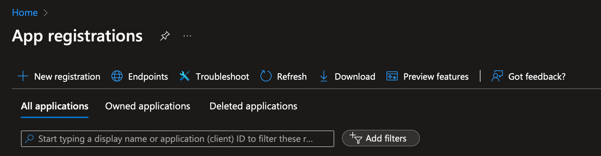
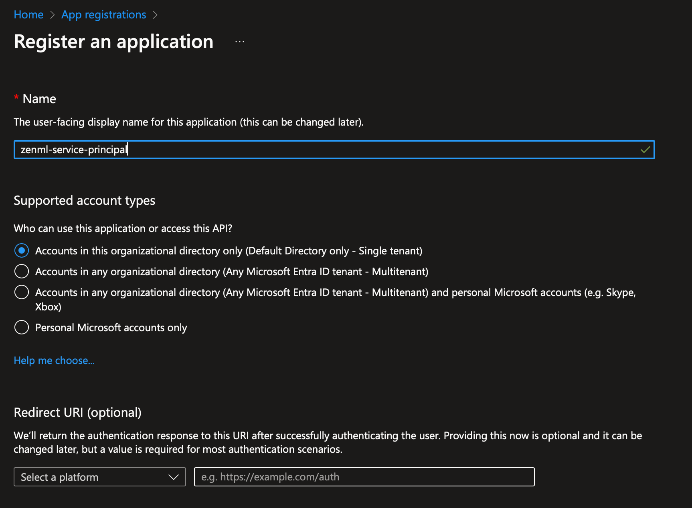
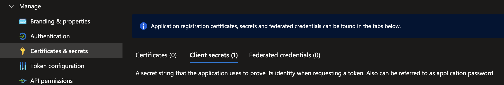
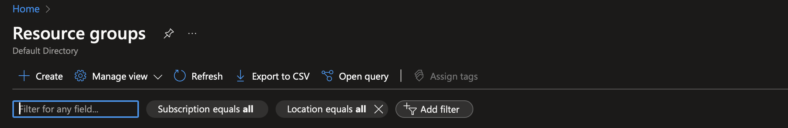
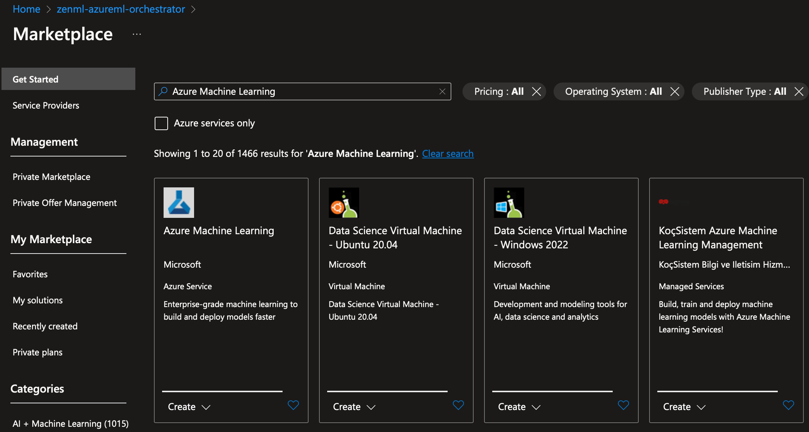
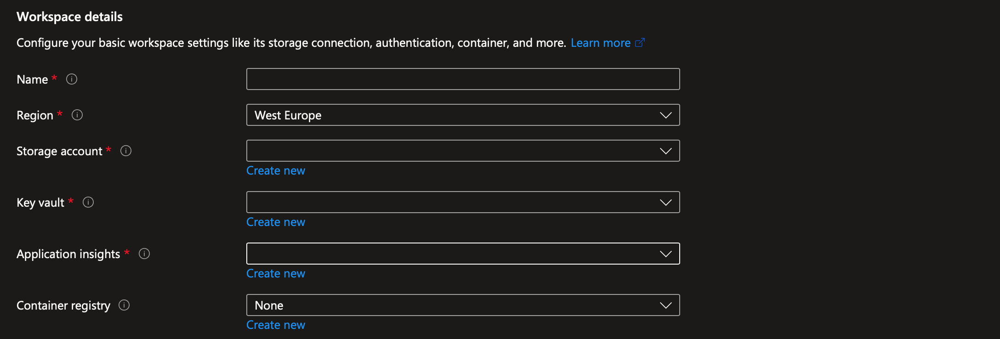
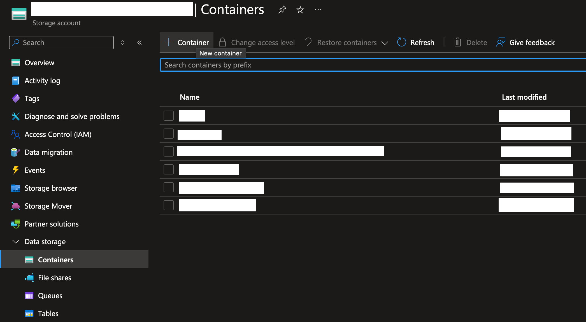

# Run on Azure

This page aims to quickly set up a minimal production stack on Azure. With 
just a few simple steps, you will set up a resource group, a service principal 
with correct permissions and the relevant ZenML stack and components.


Would you like to skip ahead and deploy a full Azure ZenML cloud stack already?

Check out the
[in-browser stack deployment wizard](../../how-to/stack-deployment/deploy-a-cloud-stack.md),
the [stack registration wizard](../../how-to/stack-deployment/register-a-cloud-stack.md),
or [the ZenML Azure Terraform module](../../how-to/stack-deployment/deploy-a-cloud-stack-with-terraform.md)
for a shortcut on how to deploy & register this stack.


To follow this guide, you need:

* An active Azure account.
* ZenML [installed](../../getting-started/installation.md).
* ZenML `azure` integration installed with `zenml integration install azure`.

## 1. Set up proper credentials

You can start by [creating a service principal by creating an app registration](https://github.com/Azure/MachineLearningNotebooks/blob/master/how-to-use-azureml/manage-azureml-service/authentication-in-azureml/authentication-in-azureml.ipynb) 
on Azure:

1. Go to the App Registrations on the Azure portal.
2. Click on `+ New registration`,
3. Give it a name and click register.





Once you create the service principal, you will get an Application ID and 
Tenant ID as they will be needed later.

Next, go to your service principal and click on the `Certificates & secrets` in
the `Manage` menu. Here, you have to create a client secret. Note down the 
secret value as it will be needed later.



## 2. Create a resource group and the AzureML instance

Now, you have to [create a resource group on Azure](https://learn.microsoft.com/en-us/azure/azure-resource-manager/management/manage-resource-groups-portal).
To do this, go to the Azure portal and go to the `Resource Groups` page and 
click `+ Create`. 



Once the resource group is created, go to the overview page of your new resource
group and click `+ Create`. This will open up the marketplace where you can 
select a variety of resource to create. Look for `Azure Machine Learning`.



Select it, and you will start the process of creating an AzureML workspace. 
As you can see from the `Workspace details`, AzureML workspaces come equipped 
with a storage account, key vault, and application insights. It is highly 
recommended that you create a container registry as well.



## 3. Created the required role assignments

TODO: Write this!

## 4. Create a service connector

Once you have created the service principal and the client secret, you can 
go ahead and create [a ZenML Azure Service Connector](../../how-to/auth-management/azure-service-connector.md).

```bash
zenml service-connector register azure_connector --type azure \
  --auth-method service-principal \
  --client_secret=<CLIENT_SECRET> \
  --tenant_id=<TENANT_ID> \
  --client_id=<APPLICATION_ID>
```

You will use this service connector later on to connect your components with 
proper authentication.

## 4. Create Stack Components

In order to run any workflows on Azure using ZenML, you need an artifact store,
an orchestrator and a container registry.

### Artifact Store (Azure Blob Storage)

For the artifact store, we will be using the storage account attached to our
AzureML workspace. But before registering the component itself, you have to 
create a container for blob storage. To do this, go to the corresponding 
storage account in your workspace and create a new container:



Once you create the container, you can go ahead, register your artifact 
store using its path and connect it to your service connector:

```bash 
zenml artifact-store register azure_artifact_store -f azure \
  --path=<PATH_TO_YOUR_CONTAINER> \ 
  --connector azure_connector
```

For more information regarding Azure Blob Storage artifact stores, feel free to
[check the docs](../../component-guide/artifact-stores/azure.md).

### Orchestrator (AzureML)

As for the orchestrator, no additional setup is needed. Simply use the following
command to register it and connect it your service connector:

```bash
zenml orchestrator register azure_orchestrator -f azureml \
    --subscription_id=<YOUR_AZUREML_SUBSCRIPTION_ID> \
    --resource_group=<NAME_OF_YOUR_RESOURCE_GROUP> \
    --workspace=<NAME_OF_YOUR_AZUREML_WORKSPACE> \ 
    --connector azure_connector
```

For more information regarding AzureML orchestrator, feel free to
[check the docs](../../component-guide/orchestrators/azureml.md).

### Container Registry (Azure Container Registry)

Similar to the orchestrator, you can register and connect your container 
registry using the following command:

```bash
zenml container-registry register azure_container_registry -f azure \
  --uri=<URI_TO_YOUR_AZURE_CONTAINER_REGISTRY> \ 
  --connector azure_connector
```

For more information regarding Azure container registries, feel free to
[check the docs](../../component-guide/container-registries/azure.md).

## 5. Create a Stack

Now, you can use the registered components to create an Azure ZenML stack:

```shell
zenml stack register azure_stack \
    -o azure_orchestrator \
    -a azure_artifact_store \
    -c azure_container_registry \
    --set
```

## 6. ...and you are done.

Just like that, you now have a fully working Azure stack ready to go. 
Feel free to take it for a spin by running a pipeline on it.

Define a ZenML pipeline:

```python
from zenml import pipeline, step

@step
def hello_world() -> str:
    return "Hello from Azure!"

@pipeline
def azure_pipeline():
    hello_world()

if __name__ == "__main__":
    azure_pipeline()
```

Save this code to run.py and execute it. The pipeline will use Azure Blob 
Storage for artifact storage, AzureML for orchestration, and an Azure container 
registry.

```shell
python run.py
```

Now that you have a functional Azure stack set up with ZenML, you can explore 
more advanced features and capabilities offered by ZenML. Some next steps to 
consider:

* Dive deeper into ZenML's [production guide](../../user-guide/production-guide/production-guide.md) to learn best practices for deploying and managing production-ready pipelines.
* Explore ZenML's [integrations](../../component-guide/README.md) with other popular tools and frameworks in the machine learning ecosystem.
* Join the [ZenML community](https://zenml.io/slack) to connect with other users, ask questions, and get support.

<!-- For scarf -->
<figure></figure>
