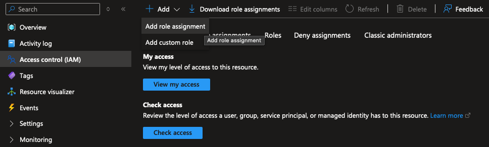
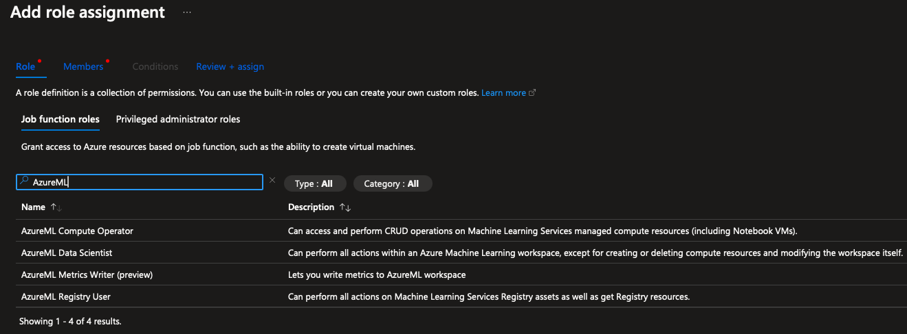
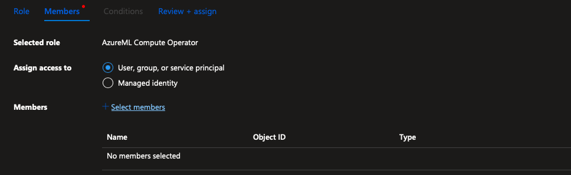


This is an older version of the ZenML documentation. To read and view the latest version please [visit this up-to-date URL](https://docs.zenml.io).



# Azure

This page aims to quickly set up a minimal production stack on Azure. With just a few simple steps, you will set up a resource group, a service principal with correct permissions, and the relevant ZenML stack and components.


Would you like to skip ahead and deploy a full Azure ZenML cloud stack already?

Check out the [in-browser stack deployment wizard](https://docs.zenml.io/how-to/infrastructure-deployment/stack-deployment/deploy-a-cloud-stack), the [stack registration wizard](https://docs.zenml.io/how-to/infrastructure-deployment/stack-deployment/register-a-cloud-stack), or [the ZenML Azure Terraform module](https://docs.zenml.io/how-to/infrastructure-deployment/stack-deployment/deploy-a-cloud-stack-with-terraform) for a shortcut on how to deploy & register this stack.


To follow this guide, you need:

* An active Azure account.
* ZenML [installed](https://docs.zenml.io/getting-started/installation).
* ZenML `azure` integration installed with `zenml integration install azure`.

## 1. Set up proper credentials

You can start by [creating a service principal by creating an app registration](https://github.com/Azure/MachineLearningNotebooks/blob/master/how-to-use-azureml/manage-azureml-service/authentication-in-azureml/authentication-in-azureml.ipynb) on Azure:

1. Go to the App Registrations on the Azure portal.
2. Click on `+ New registration`,
3. Give it a name and click register.


Once you create the service principal, you will get an Application ID and Tenant ID as they will be needed later.

Next, go to your service principal and click on the `Certificates & secrets` in the `Manage` menu. Here, you have to create a client secret. Note down the secret value as it will be needed later.


## 2. Create a resource group and the AzureML instance

Now, you have to [create a resource group on Azure](https://learn.microsoft.com/en-us/azure/azure-resource-manager/management/manage-resource-groups-portal). To do this, go to the Azure portal and go to the `Resource Groups` page, and click `+ Create`.


Once the resource group is created, go to the overview page of your new resource group and click `+ Create`. This will open up the marketplace where you can select a variety of resources to create. Look for `Azure Machine Learning`.


Select it, and you will start the process of creating an AzureML workspace. As you can see from the `Workspace details`, AzureML workspaces come equipped with a storage account, key vault, and application insights. It is highly recommended that you create a container registry as well.


## 3. Create the required role assignments with least privilege

Now, that you have your app registration and the resources, you have to create the corresponding role assignments following the principle of least privilege. In order to do this, go to your resource group, open up `Access control (IAM)` on the left side and `+Add` a new role assignment.



### Required Role Assignments for ZenML Components

**For AzureML Orchestrator:**
- **`AzureML Data Scientist`** - Allows creating and managing AzureML jobs and experiments
- **`AzureML Compute Operator`** - Allows managing compute resources (instances, clusters)

**For Azure Blob Storage Artifact Store:**
- **`Storage Blob Data Contributor`** - Allows read/write access to blob storage containers
- **`Reader and Data Access`** - Required for listing containers (if needed)

**For Azure Container Registry:**
- **`AcrPush`** - Allows pushing container images
- **`AcrPull`** - Allows pulling container images
- **`Contributor`** (scoped to ACR only) - Allows listing registries for discovery

### Assign the Roles

In the role assignment page, search for the specific roles mentioned above:



**Step 1:** Assign AzureML roles
One by one, select `AzureML Data Scientist` and `AzureML Compute Operator` and click `Next`.

**Step 2:** Assign Storage roles
Assign `Storage Blob Data Contributor` role to your service principal.

**Step 3:** Assign Container Registry roles
Assign `AcrPush`, `AcrPull`, and `Contributor` (scoped to ACR resource) roles to your service principal.



Finally, click `+Select Members`, search for your registered app by its ID, and assign each role accordingly.


**Security Best Practice:** These role assignments provide the minimum permissions required for ZenML operations. Avoid using broader roles like `Contributor` or `Owner` at the resource group level, as they grant unnecessary permissions.


## 4. Create a service connector

Now you have everything set up, you can go ahead and create [a ZenML Azure Service Connector](https://docs.zenml.io/how-to/infrastructure-deployment/auth-management/azure-service-connector).

```bash
zenml service-connector register azure_connector --type azure \
  --auth-method service-principal \
  --client_secret=<CLIENT_SECRET> \
  --tenant_id=<TENANT_ID> \
  --client_id=<APPLICATION_ID>
```

You will use this service connector later on to connect your components with proper authentication.

## 5. Create Stack Components

In order to run any workflows on Azure using ZenML, you need an artifact store, an orchestrator, and a container registry.

### Artifact Store (Azure Blob Storage)

For the artifact store, we will be using the storage account attached to our AzureML workspace. But before registering the component itself, you have to create a container for blob storage. To do this, go to the corresponding storage account in your workspace and create a new container:


Once you create the container, you can go ahead, register your artifact store using its path and connect it to your service connector:

```bash
zenml artifact-store register azure_artifact_store -f azure \
  --path=<PATH_TO_YOUR_CONTAINER> \ 
  --connector azure_connector
```

For more information regarding Azure Blob Storage artifact stores, feel free to [check the docs](https://docs.zenml.io/stacks/artifact-stores/azure).

### Orchestrator (AzureML)

As for the orchestrator, no additional setup is needed. Simply use the following command to register it and connect it to your service connector:

```bash
zenml orchestrator register azure_orchestrator -f azureml \
    --subscription_id=<YOUR_AZUREML_SUBSCRIPTION_ID> \
    --resource_group=<NAME_OF_YOUR_RESOURCE_GROUP> \
    --workspace=<NAME_OF_YOUR_AZUREML_WORKSPACE> \ 
    --connector azure_connector
```

For more information regarding AzureML orchestrator, feel free to [check the docs](https://docs.zenml.io/stacks/orchestrators/azureml).

### Container Registry (Azure Container Registry)

Similar to the orchestrator, you can register and connect your container registry using the following command:

```bash
zenml container-registry register azure_container_registry -f azure \
  --uri=<URI_TO_YOUR_AZURE_CONTAINER_REGISTRY> \ 
  --connector azure_connector
```

For more information regarding Azure container registries, feel free to [check the docs](https://docs.zenml.io/stacks/container-registries/azure).

## 6. Create a Stack

Now, you can use the registered components to create an Azure ZenML stack:

```shell
zenml stack register azure_stack \
    -o azure_orchestrator \
    -a azure_artifact_store \
    -c azure_container_registry \
    --set
```

## 7. ...and you are done.

Just like that, you now have a fully working Azure stack ready to go. Feel free to take it for a spin by running a pipeline on it.

Define a ZenML pipeline:

```python
from zenml import pipeline, step

@step
def hello_world() -> str:
    return "Hello from Azure!"

@pipeline
def azure_pipeline():
    hello_world()

if __name__ == "__main__":
    azure_pipeline()
```

Save this code to run.py and execute it. The pipeline will use Azure Blob Storage for artifact storage, AzureML for orchestration, and an Azure container registry.

```shell
python run.py
```

Now that you have a functional Azure stack set up with ZenML using least privilege permissions, you can explore more advanced features and capabilities offered by ZenML. Some next steps to consider:

* Dive deeper into ZenML's [production guide](https://docs.zenml.io/user-guides/production-guide) to learn best practices for deploying and managing production-ready pipelines.
* Explore ZenML's [integrations](https://docs.zenml.io/stacks) with other popular tools and frameworks in the machine learning ecosystem.
* Join the [ZenML community](https://zenml.io/slack) to connect with other users, ask questions, and get support.

## Best Practices for Using an Azure Stack with ZenML

### Security and Least Privilege

The guide above implements security best practices by:

- **Using specific Azure roles** instead of broad permissions like `Owner` or `Contributor`
- **Scoping permissions to resources** rather than subscription-wide access
- **Separating concerns** with different roles for different components (storage, compute, registry)
- **Following Azure's principle of least privilege** for service principal authentication

### Regular Security Maintenance

- **Rotate service principal credentials** regularly using Azure Key Vault
- **Review role assignments** periodically to ensure they remain necessary
- **Use Azure Security Center** to monitor for security recommendations
- **Enable Azure AD Conditional Access** for additional security layers when appropriate

<figure><figcaption></figcaption></figure>
