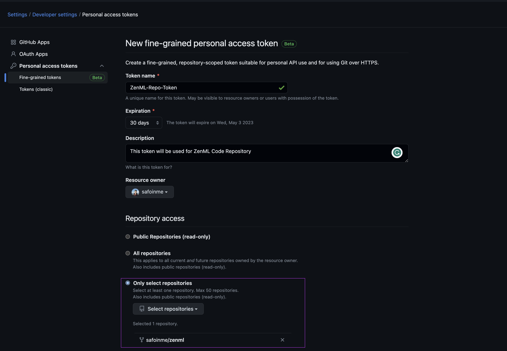
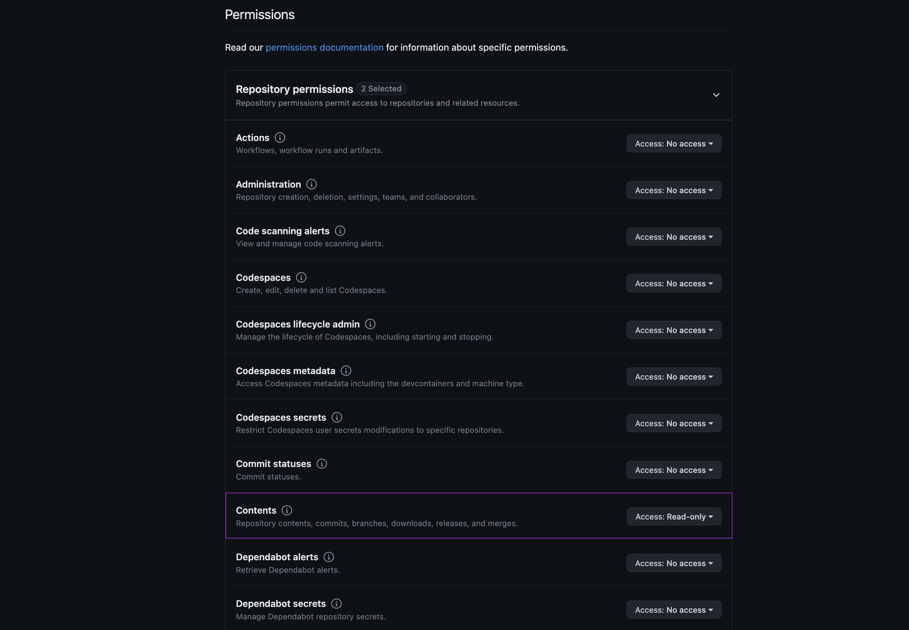
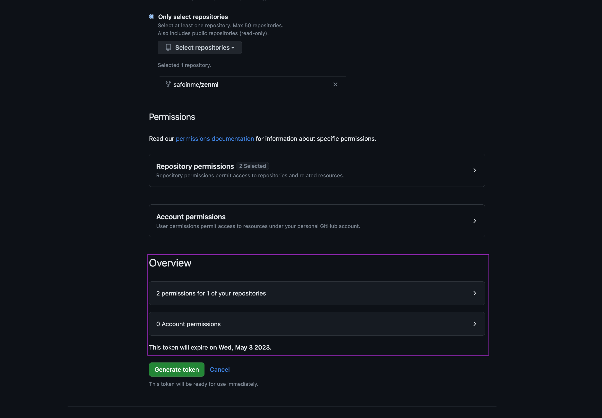
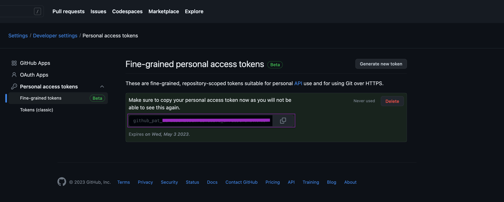
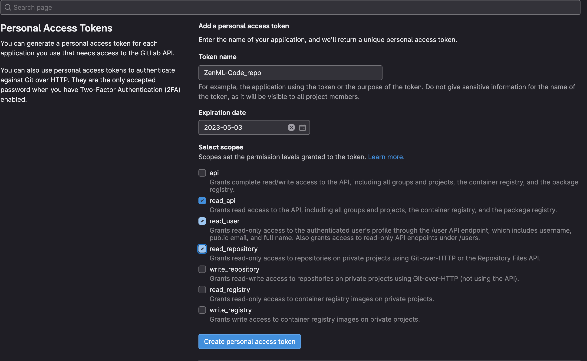
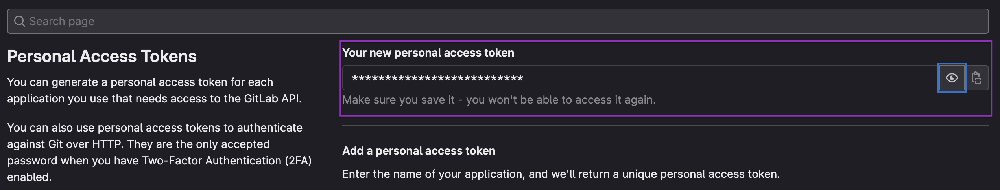


This is an older version of the ZenML documentation. To read and view the latest version please [visit this up-to-date URL](https://docs.zenml.io).



# Connect your git repository

A code repository in ZenML refers to a remote storage location for your code. Some commonly known code repository platforms include [GitHub](https://github.com/) and [GitLab](https://gitlab.com/).

<figure><figcaption><p>A visual representation of how the code repository fits into the general ZenML architecture.</p></figcaption></figure>

Code repositories enable ZenML to keep track of the code version that you use for your pipeline runs. Additionally, running a pipeline that is tracked in a registered code repository can [speed up the Docker image building for containerized stack components](../../infrastructure-deployment/customize-docker-builds/use-code-repositories-to-speed-up-docker-build-times.md) by eliminating the need to rebuild Docker images each time you change one of your source code files.

Learn more about how code repositories benefit development [here](../../infrastructure-deployment/customize-docker-builds/use-code-repositories-to-speed-up-docker-build-times.md).

## Registering a code repository

If you are planning to use one of the [available implementations of code repositories](connect-your-git-repository.md#available-implementations), first, you need to install the corresponding ZenML integration:

```
zenml integration install <INTEGRATION_NAME>
```

Afterward, code repositories can be registered using the CLI:

```shell
zenml code-repository register <NAME> --type=<TYPE> [--CODE_REPOSITORY_OPTIONS]
```

For concrete options, check out the section on the [`GitHubCodeRepository`](connect-your-git-repository.md#github), the [`GitLabCodeRepository`](connect-your-git-repository.md#gitlab) or how to develop and register a [custom code repository implementation](connect-your-git-repository.md#developing-a-custom-code-repository).

## Available implementations

ZenML comes with builtin implementations of the code repository abstraction for the `GitHub` and `GitLab` platforms, but it's also possible to use a [custom code repository implementation](connect-your-git-repository.md#developing-a-custom-code-repository).

### GitHub

ZenML provides built-in support for using GitHub as a code repository for your ZenML pipelines. You can register a GitHub code repository by providing the URL of the GitHub instance, the owner of the repository, the name of the repository, and a GitHub Personal Access Token (PAT) with access to the repository.

Before registering the code repository, first, you have to install the corresponding integration:

```sh
zenml integration install github
```

Afterward, you can register a GitHub code repository by running the following CLI command:

```shell
zenml code-repository register <NAME> --type=github \
--url=<GITHUB_URL> --owner=<OWNER> --repository=<REPOSITORY> \
--token=<GITHUB_TOKEN>
```

where \<REPOSITORY> is the name of the code repository you are registering, \<OWNER> is the owner of the repository, \<NAME> is the name of the repository, \<GITHUB\_TOKEN> is your GitHub Personal Access Token and \<GITHUB\_URL> is the URL of the GitHub instance which defaults to `https://github.com.` You will need to set a URL if you are using GitHub Enterprise.

After registering the GitHub code repository, ZenML will automatically detect if your source files are being tracked by GitHub and store the commit hash for each pipeline run.

<details>

<summary>How to get a token for GitHub</summary>

1. Go to your GitHub account settings and click on [Developer settings](https://github.com/settings/tokens?type=beta).
2. Select "Personal access tokens" and click on "Generate new token".
3.  Give your token a name and a description.

    
4.  We recommend selecting the specific repository and then giving `contents` read-only access.

    

    
5.  Click on "Generate token" and copy the token to a safe place.

    

</details>

### GitLab

ZenML also provides built-in support for using GitLab as a code repository for your ZenML pipelines. You can register a GitLab code repository by providing the URL of the GitLab project, the group of the project, the name of the project, and a GitLab Personal Access Token (PAT) with access to the project.

Before registering the code repository, first, you have to install the corresponding integration:

```sh
zenml integration install gitlab
```

Afterward, you can register a GitLab code repository by running the following CLI command:

```shell
zenml code-repository register <NAME> --type=gitlab \
--url=<GITLAB_URL> --group=<GROUP> --project=<PROJECT> \
--token=<GITLAB_TOKEN>
```

where `<NAME>` is the name of the code repository you are registering, `<GROUP>` is the group of the project, `<PROJECT>` is the name of the project, \<GITLAB\_TOKEN> is your GitLab Personal Access Token, and \<GITLAB\_URL> is the URL of the GitLab instance which defaults to `https://gitlab.com.` You will need to set a URL if you have a self-hosted GitLab instance.

After registering the GitLab code repository, ZenML will automatically detect if your source files are being tracked by GitLab and store the commit hash for each pipeline run.

<details>

<summary>How to get a token for GitLab</summary>

1. Go to your GitLab account settings and click on [Access Tokens](https://gitlab.com/-/profile/personal\_access\_tokens).
2.  Name the token and select the scopes that you need (e.g. `read_repository`, `read_user`, `read_api`)

    
3.  Click on "Create personal access token" and copy the token to a safe place.

    

</details>

## Developing a custom code repository

If you're using some other platform to store your code, and you still want to use a code repository in ZenML, you can implement and register a custom code repository.

First, you'll need to subclass and implement the abstract methods of the `zenml.code_repositories.BaseCodeRepository` class:

```python
class BaseCodeRepository(ABC):
    """Base class for code repositories."""

    @abstractmethod
    def login(self) -> None:
        """Logs into the code repository."""

    @abstractmethod
    def download_files(
            self, commit: str, directory: str, repo_sub_directory: Optional[str]
    ) -> None:
        """Downloads files from the code repository to a local directory.

        Args:
            commit: The commit hash to download files from.
            directory: The directory to download files to.
            repo_sub_directory: The subdirectory in the repository to
                download files from.
        """

    @abstractmethod
    def get_local_context(
            self, path: str
    ) -> Optional["LocalRepositoryContext"]:
        """Gets a local repository context from a path.

        Args:
            path: The path to the local repository.

        Returns:
            The local repository context object.
        """
```

After you're finished implementing this, you can register it as follows:

```shell
# The `CODE_REPOSITORY_OPTIONS` are key-value pairs that your implementation will receive
# as configuration in its __init__ method. This will usually include stuff like the username
# and other credentials necessary to authenticate with the code repository platform.
zenml code-repository register <NAME> --type=custom --source=my_module.MyRepositoryClass \
    [--CODE_REPOSITORY_OPTIONS]
```

<figure><figcaption></figcaption></figure>
