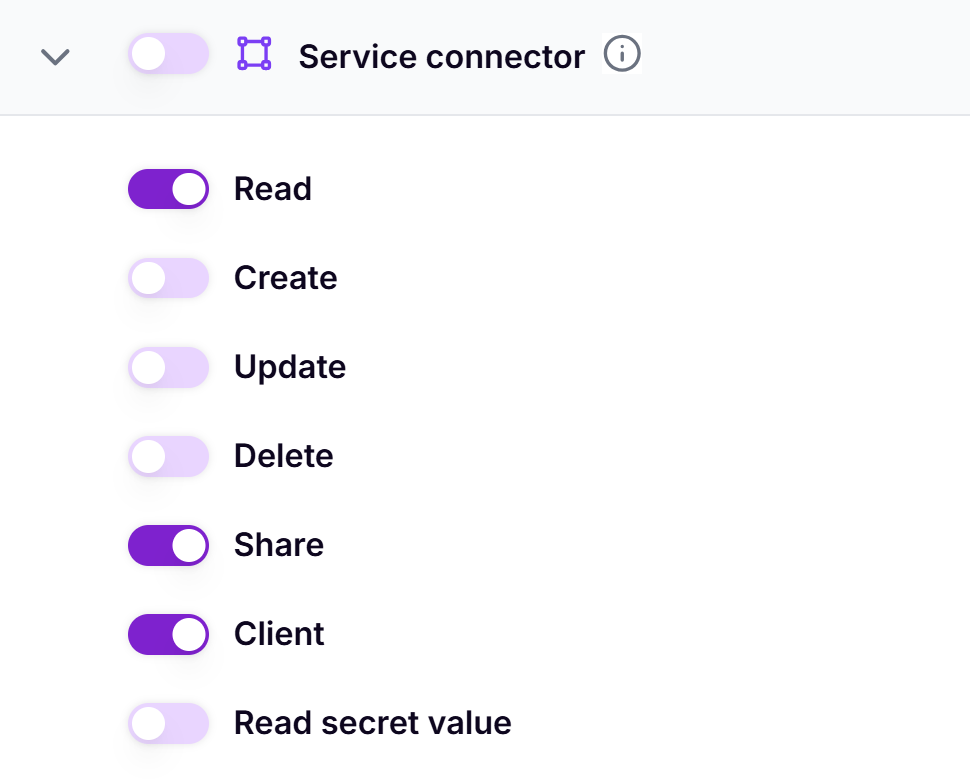
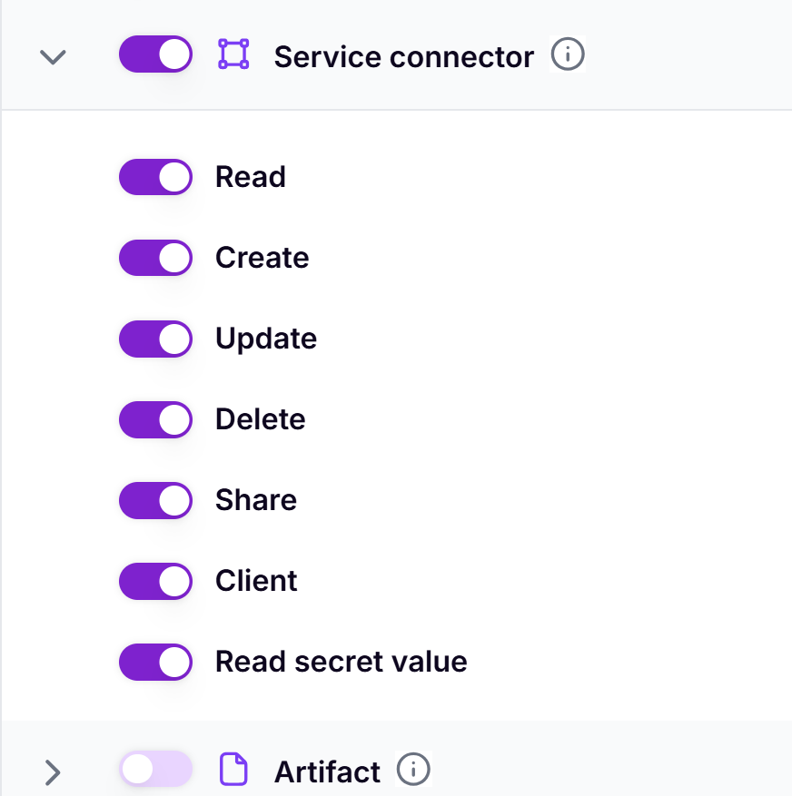


This is an older version of the ZenML documentation. To read and view the latest version please [visit this up-to-date URL](https://docs.zenml.io).


# Access Management and Roles in ZenML

Effective access management is crucial for maintaining security and efficiency in your ZenML projects. This guide will help you understand the different roles within a ZenML server and how to manage access for your team members.

## Typical Roles in an ML Project

In an ML project, you will typically have the following roles:

- Data Scientists: Primarily work on developing and running pipelines.
- MLOps Platform Engineers: Manage the infrastructure and stack components.
- Project Owners: Oversee the entire ZenML deployment and manage user access.

The above is an estimation of roles that you might have in your team. In your case, the names might be different or there might be more roles, but you can relate the responbilities we discuss in this document to your own project loosely.


You can create [Roles in ZenML Pro](../../getting-started/zenml-pro/roles.md) with a given set of permissions and assign them to either Users or Teams that represent your real-world team structure. Sign up for a free trial to try it yourself: https://cloud.zenml.io/


## Service Connectors: Gateways to External Services

Service connectors are how different cloud services are integrated with ZenML. They are used to abstract away the credentials and other configurations needed to access these services.

Ideally, you would want that only the MLOps Platform Engineers have access for creating and managing connectors. This is because they are closest to your infrastructure and can make informed decisions about what authentication mechanisms to use and more.

Other team members can use connectors to create stack components that talk to the external services but should not have to worry about setting them and shouldn't have access to the credentials used to configure them.

Let's look at an example of how this works in practice.
Imagine you have a `DataScientist` role in your ZenML server. This role should only be able to use the connectors to create stack components and run pipelines. They shouldn't have access to the credentials used to configure these connectors. Therefore, the permissions for this role could look like the following:

You can notice that the role doesn't grant the data scientist permissions to create, update, or delete connectors, or read their secret values.

On the other hand, the `MLOpsPlatformEngineer` role has the permissions to create, update, and delete connectors, as well as read their secret values. The permissions for this role could look like the following:


Note that you can only use the RBAC features in ZenML Pro. Learn more about roles in ZenML Pro [here](../../getting-started/zenml-pro/roles.md).


Learn more about the best practices in managing credentials and recommended roles in our [Managing Stacks and Components guide](../stack-deployment/README.md).

## Who is responsible for upgrading the ZenML server?

The decision to upgrade your ZenML server is usually taken by your Project Owners after consulting with all the teams using the server. This is because there might be teams with conflicting requirements and moving to a new version of ZenML (that might come with upgrades to certain libraries) can break code for some users.


You can choose to have different servers for different teams and that can alleviate some of the pressure to upgrade if you have multiple teams using the same server. ZenML Pro offers [multi-tenancy](../../getting-started/zenml-pro/tenants.md) out of the box, for situations like these. Sign up for a free trial to try it yourself: https://cloud.zenml.io/


Performing the upgrade itself is a task that typically falls on the MLOps Platform Engineers. They should:

- ensure that all data is backed up before performing the upgrade
- no service disruption or downtime happens during the upgrade

and more. Read in detail about the best practices for upgrading your ZenML server in the [Best Practices for Upgrading ZenML Servers](../manage-the-zenml-server/best-practices-upgrading-zenml.md) guide.

## Who is responsible for migrating and maintaining pipelines?

When you upgrade to a new version of ZenML, you might have to test if your code works as expected and if the syntax is up to date with what ZenML expects. Although we do our best to make new releases compatible with older versions, there might be some breaking changes that you might have to address.

The pipeline code itself is typically owned by the Data Scientist, but the Platform Engineer is responsible for making sure that new changes can be tested in a safe environment without impacting existing workflows. This involves setting up a new server and doing a staged upgrade and other strategies.

The Data Scientist should also check out the release notes, and the migration guide where applicable when upgrading the code. Read more about the best practices for upgrading your ZenML server and your code in the [Best Practices for Upgrading ZenML Servers](../manage-the-zenml-server/best-practices-upgrading-zenml.md) guide.

## Best Practices for Access Management

Apart from the role-specific tasks we discussed so far, there are some general best practices you should follow to ensure a secure and well-managed ZenML environment that supports collaboration while maintaining proper access controls.

- Regular Audits: Conduct periodic reviews of user access and permissions.
- Role-Based Access Control (RBAC): Implement RBAC to streamline permission management.
- Least Privilege: Grant minimal necessary permissions to each role.
- Documentation: Maintain clear documentation of roles, responsibilities, and access policies.


The Role-Based Access Control (RBAC) and assigning of permissions is only available for ZenML Pro users.


By following these guidelines, you can ensure a secure and well-managed ZenML environment that supports collaboration while maintaining proper access controls.

<!-- For scarf -->
<figure></figure>

