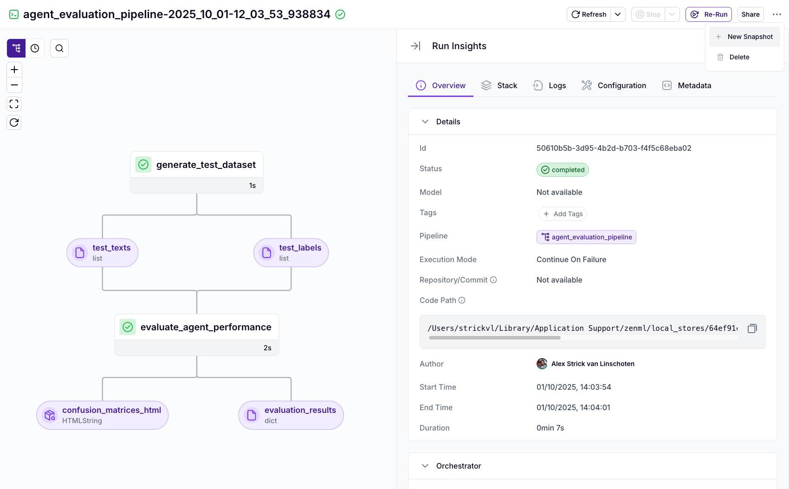
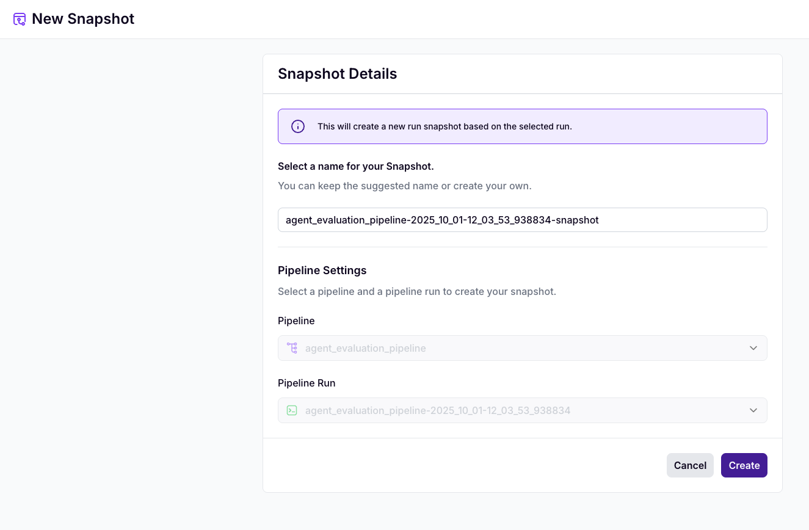

# Pipeline Snapshots

A **Pipeline Snapshot** is an immutable snapshot of your pipeline that includes the pipeline DAG, code, configuration, and container images. Snapshots can be run from the SDK, CLI, ZenML dashboard or via a REST API. Additionally, snapshots can also be [deployed](../deployment/deployment.md).


Snapshots are the successor and replacement of ZenML run templates.



Running snapshots is a [ZenML Pro](https://zenml.io/pro)-only feature.


## Real-world Use Case

Imagine your team has built a robust training pipeline that needs to be run regularly with different parameters:

- **Data Scientists** need to experiment with new datasets and hyperparameters
- **MLOps Engineers** need to schedule regular retraining with production data
- **Stakeholders** need to trigger model training through a simple UI without coding

Without snapshots, each scenario would require:
1. Direct access to the codebase 
2. Knowledge of pipeline implementation details
3. Manual pipeline configuration for each run

**Pipeline snapshots solve this problem by creating a reusable configuration** that can be executed with different parameters from any interface:

- **Through Python**: Data scientists can programmatically trigger snapshots with custom parameters
```python
  from zenml.client import Client
  
  Client().trigger_pipeline(
      snapshot_name_or_id=<NAME-OR-ID>,
      run_configuration={
          "steps": {
              "data_loader": {"parameters": {"data_path": "s3://new-data/"}},
              "model_trainer": {"parameters": {"learning_rate": 0.01}}
          }
      }
  )
```

- **Through REST API**: Your CI/CD system can trigger snapshots via API calls
```bash
  curl -X POST 'https://your-zenml-server/api/v1/pipeline-snapshots/<ID>/runs' -H 'Authorization: Bearer <TOKEN>' -d '{"steps": {...}}'
```
- **Through Browser** (Pro feature): Non-technical stakeholders can run snapshots directly from the ZenML dashboard by simply filling in a form with the required parameters - no coding required!

This enables your team to standardize execution patterns while maintaining flexibility - perfect for production ML workflows that need to be triggered from various systems.

## Understanding Pipeline Snapshots

While the simplest way to execute a ZenML pipeline is to directly call your pipeline function, pipeline snapshots offer several advantages for more complex workflows:

* **Standardization**: Ensure all pipeline runs follow a consistent configuration pattern
* **Parameterization**: Easily modify inputs and settings without changing code
* **Remote Execution**: Trigger pipelines through the dashboard or API without code access
* **Team Collaboration**: Share ready-to-use pipeline configurations with team members
* **Automation**: Integrate with CI/CD systems or other automated processes

## Creating Pipeline Snapshots

You have several ways to create a snapshot in ZenML:

### Using the Python SDK

You can create a snapshot from your local code and configuration like this:

```python
from zenml import pipeline

@pipeline
def my_pipeline():
    ...

snapshot = my_pipeline.create_snapshot(name="<NAME>")
```

### Using the CLI

You can create a snapshot using the ZenML CLI, by passing the [source path](../steps-pipelines/sources.md#source-paths) of your pipeline: 

```bash
zenml pipeline snapshot create <PIPELINE-SOURCE-PATH> --name=<SNAPSHOT-NAME>
```


If you later want to run this snapshot, you need to have an active **remote stack** while running this command or you can specify one with the `--stack` option.


### Using the Dashboard

To create a snapshot through the ZenML dashboard:

1. Navigate to a pipeline run
2. Click on `...` in the top right, and then on `+ New Snapshot`
3. Enter a name for the snapshot
4. Click `Create`





## Running Pipeline Snapshots

Once you've created a snapshot, you can run it through various interfaces:

### Using the Python SDK

Run a snapshot programmatically:

```python
from zenml.client import Client

snapshot = Client().get_snapshot("<NAME-OR-ID>", ...)
config = snapshot.config_template

# [OPTIONAL] Modify the configuration if needed
config.steps["my_step"].parameters["my_param"] = new_value

Client().trigger_pipeline(
    snapshot_name_or_id=snapshot.id,
    run_configuration=config,
)
```

### Using the CLI

Run a snapshot using the CLI:
```bash
zenml pipeline snapshot run <SNAPSHOT-NAME-OR-ID>
# If you want to run the snapshot with a modified configuration, use the `--config=...` parameter
```

### Using the Dashboard

To run a snapshot from the dashboard:

1. Either click `Run a Pipeline` on the main `Pipelines` page, or navigate to a specific snapshot and click `Run Snapshot`
2. On the `Run Details` page, you can:
   * Modify the configuration using the built-in editor
   * Upload a `.yaml` configuration file
3. Click `Run` to start the pipeline run


Once you run the snapshot, a new run will be executed on the same stack as the original run.

### Using the REST API

To run a snapshot through the REST API, you need to make a series of calls:

1. First, get the pipeline ID:

```bash
curl -X 'GET' \
  '<YOUR_ZENML_SERVER_URL>/api/v1/pipelines?hydrate=false&name=<PIPELINE-NAME>' \
  -H 'accept: application/json' \
  -H 'Authorization: Bearer <YOUR-TOKEN>'
```

2. Using the pipeline ID, get the snapshot ID:

```bash
curl -X 'GET' \
  '<YOUR_ZENML_SERVER_URL>/api/v1/pipeline_snapshots?hydrate=false&logical_operator=and&page=1&size=20&pipeline_id=<PIPELINE-ID>' \
  -H 'accept: application/json' \
  -H 'Authorization: Bearer <YOUR-TOKEN>'
```

3. Finally, trigger the snapshot:

```bash
curl -X 'POST' \
  '<YOUR_ZENML_SERVER_URL>/api/v1/pipeline_snapshots/<SNAPSHOT-ID>/runs' \
  -H 'accept: application/json' \
  -H 'Content-Type: application/json' \
  -H 'Authorization: Bearer <YOUR-TOKEN>' \
  -d '{
  "steps": {"model_trainer": {"parameters": {"model_type": "rf"}}}
}'
```


Learn how to get a bearer token for the curl commands:

- For a ZenML OSS API: use [service accounts + API keys](https://docs.zenml.io/how-to/manage-zenml-server/connecting-to-zenml/connect-with-a-service-account).
- For a ZenML Pro workspace API: use [ZenML Pro Personal Access Tokens](https://docs.zenml.io/pro/access-management/personal-access-tokens) or [ZenML Pro Organization Service Accounts](https://docs.zenml.io/pro/access-management/service-accounts).


## Deleting Pipeline Snapshots

You can delete a snapshot using the CLI:
```bash
zenml pipeline snapshot delete <SNAPSHOT-NAME-OR-ID>
```

You can also delete a snapshot using the Python SDK:
```python
from zenml.client import Client

Client().delete_snapshot(name_id_or_prefix=<SNAPSHOT-NAME-OR-ID>)
```

## Advanced Usage: Running Snapshots from Other Pipelines

You can run snapshots from within other pipelines, enabling complex workflows. There are two ways to do this:

### Method 1: Trigger by Pipeline Name (Uses Latest Snapshot)

If you want to run the latest runnable snapshot for a specific pipeline:

```python
import pandas as pd

from zenml import pipeline, step
from zenml.artifacts.unmaterialized_artifact import UnmaterializedArtifact
from zenml.artifacts.utils import load_artifact
from zenml.client import Client
from zenml.config.pipeline_run_configuration import PipelineRunConfiguration

@step
def trainer(data_artifact_id: str):
    df = load_artifact(data_artifact_id)

@pipeline
def training_pipeline():
    trainer()

@step
def load_data() -> pd.DataFrame:
    # Your data loading logic here
    return pd.DataFrame()

@step
def trigger_pipeline(df: UnmaterializedArtifact):
    # By using UnmaterializedArtifact we can get the ID of the artifact
    run_config = PipelineRunConfiguration(
        steps={"trainer": {"parameters": {"data_artifact_id": df.id}}}
    )

    # This triggers the LATEST runnable snapshot for the "training_pipeline" pipeline
    Client().trigger_pipeline(pipeline_name_or_id="training_pipeline", run_configuration=run_config)

@pipeline
def loads_data_and_triggers_training():
    df = load_data()
    trigger_pipeline(df)  # Will trigger the other pipeline
```

### Method 2: Trigger by Specific Snapshot ID

If you want to run a specific snapshot (not necessarily the latest one):

```python
@step
def trigger_specific_snapshot(df: UnmaterializedArtifact):
    run_config = PipelineRunConfiguration(
        steps={"trainer": {"parameters": {"data_artifact_id": df.id}}}
    )
    
    Client().trigger_pipeline(snapshot_name_or_id=<SNAPSHOT-NAME-OR-ID>, run_configuration=run_config)
```


**Key Difference**: 
- `Client().trigger_pipeline("pipeline_name", ...)` uses the pipeline name and runs the **latest** snapshot for that pipeline
- `Client().trigger_pipeline(snapshot_id=<ID>, ...)` runs a **specific** snapshot by its unique ID


The newly created pipeline run will show up in the DAG next to the step that triggered it:


This pattern is useful for:

* Creating pipeline dependencies
* Implementing dynamic workflow orchestration
* Building multi-stage ML pipelines where different steps require different resources
* Separating data preparation from model training

Read more about:

* [PipelineRunConfiguration](https://sdkdocs.zenml.io/latest/core_code_docs/core-config.html#zenml.config.pipeline_run_configuration)
* [trigger\_pipeline API](https://sdkdocs.zenml.io/latest/core_code_docs/core-client.html#zenml.client.Client)
* [Unmaterialized Artifacts](https://docs.zenml.io/concepts/artifacts)

## Best Practices

1. **Use descriptive names** for your snapshots to make them easily identifiable
2. **Document snapshot parameters** so other team members understand how to configure them
3. **Start with a working pipeline run** before creating a snapshot to ensure it's properly configured
4. **Test snapshots with different configurations** to verify they work as expected
5. **Use version control** for your snapshot configurations when storing them as YAML files
6. **Implement access controls** to manage who can run specific snapshots
7. **Monitor snapshot usage** to understand how your team is using them


**Important:** You need to recreate your snapshots after upgrading your ZenML server. Snapshots are tied to specific server versions and may not work correctly after an upgrade.

