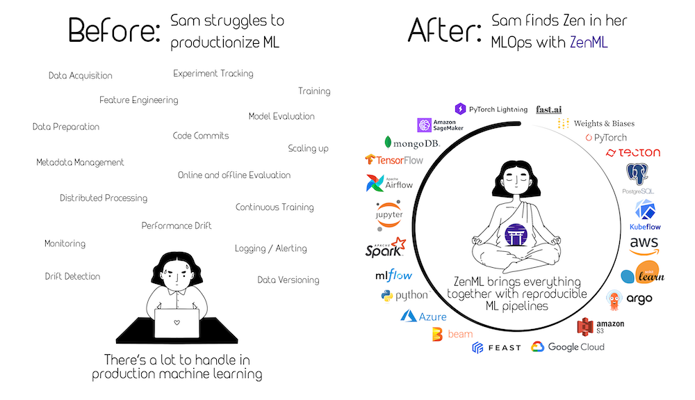


This is an older version of the ZenML documentation. To read and view the latest version please [visit this up-to-date URL](https://docs.zenml.io).



# Implement a custom integration



One of the main goals of ZenML is to find some semblance of order in the ever-growing MLOps landscape. ZenML already provides [numerous integrations](https://zenml.io/integrations) into many popular tools, and allows you to come up with ways to [implement your own stack component flavors](implement-a-custom-stack-component.md) in order to fill in any gaps that are remaining.

_However, what if you want to make your extension of ZenML part of the main codebase, to share it with others?_ If you are such a person, e.g., a tooling provider in the ML/MLOps space, or just want to contribute a tooling integration to ZenML, this guide is intended for you.

### Step 1: Plan out your integration

In [the previous page](implement-a-custom-stack-component.md), we looked at the categories and abstractions that core ZenML defines. In order to create a new integration into ZenML, you would need to first find the categories that your integration belongs to. The list of categories can be found [here](../../component-guide/README.md) as well.

Note that one integration may belong to different categories: For example, the cloud integrations (AWS/GCP/Azure) contain [container registries](../../component-guide/container-registries/container-registries.md), [artifact stores](../../component-guide/artifact-stores/artifact-stores.md) etc.

### Step 2: Create individual stack component flavors

Each category selected above would correspond to a [stack component type](../../component-guide/README.md). You can now start developing individual stack component flavors for this type by following the detailed instructions on the respective pages.

Before you package your new components into an integration, you may want to use/test them as a regular custom flavor. For instance, if you are [developing a custom orchestrator](../../component-guide/orchestrators/custom.md) and your flavor class `MyOrchestratorFlavor` is defined in `flavors/my_flavor.py`, you can register it by using:

```shell
zenml orchestrator flavor register flavors.my_flavor.MyOrchestratorFlavor
```


ZenML resolves the flavor class by taking the path where you initialized zenml (via `zenml init`) as the starting point of resolution. Therefore, please ensure you follow [the best practice](../setting-up-a-project-repository/best-practices.md) of initializing zenml at the root of your repository.

If ZenML does not find an initialized ZenML repository in any parent directory, it will default to the current working directory, but usually it's better to not have to rely on this mechanism, and initialize zenml at the root.


Afterward, you should see the new flavor in the list of available flavors:

```shell
zenml orchestrator flavor list
```

See the docs on extensibility of the different components [here](../../component-guide/README.md) or get inspired by the many integrations that are already implemented such as [the MLflow experiment tracker](../../component-guide/experiment-trackers/mlflow.md).

### Step 3: Create an integration class

Once you are finished with your flavor implementations, you can start the process of packaging them into your integration and ultimately the base ZenML package. Follow this checklist to prepare everything:

**1. Clone Repo**

Once your stack components work as a custom flavor, you can now [clone the main zenml repository](https://github.com/zenml-io/zenml) and follow the [contributing guide](https://github.com/zenml-io/zenml/blob/main/CONTRIBUTING.md) to set up your local environment for develop.

**2. Create the integration directory**

All integrations live within [`src/zenml/integrations/`](https://github.com/zenml-io/zenml/tree/main/src/zenml/integrations) in their own sub-folder. You should create a new folder in this directory with the name of your integration.

An example integration directory would be structured as follows:

```
/src/zenml/integrations/                        <- ZenML integration directory
    <example-integration>                       <- Root integration directory
        |
        ├── artifact-stores                     <- Separated directory for  
        |      ├── __init_.py                      every type
        |      └── <example-artifact-store>     <- Implementation class for the  
        |                                          artifact store flavor
        ├── flavors 
        |      ├── __init_.py 
        |      └── <example-artifact-store-flavor>  <- Config class and flavor
        |
        └── __init_.py                          <- Integration class 
```

**3. Define the name of your integration in constants**

In [`zenml/integrations/constants.py`](https://github.com/zenml-io/zenml/blob/main/src/zenml/integrations/constants.py), add:

```python
EXAMPLE_INTEGRATION = "<name-of-integration>"
```

This will be the name of the integration when you run:

```shell
 zenml integration install <name-of-integration>
```

**4. Create the integration class \_\_init\_\_.py**

In `src/zenml/integrations/<YOUR_INTEGRATION>/init__.py` you must now create a new class, which is a subclass of the `Integration` class, set some important attributes (`NAME` and `REQUIREMENTS`), and overwrite the `flavors` class method.

```python
from zenml.integrations.constants import <EXAMPLE_INTEGRATION>
from zenml.integrations.integration import Integration
from zenml.stack import Flavor

# This is the flavor that will be used when registering this stack component
#  `zenml <type-of-stack-component> register ... -f example-orchestrator-flavor`
EXAMPLE_ORCHESTRATOR_FLAVOR = <"example-orchestrator-flavor">

# Create a Subclass of the Integration Class
class ExampleIntegration(Integration):
    """Definition of Example Integration for ZenML."""

    NAME = <EXAMPLE_INTEGRATION>
    REQUIREMENTS = ["<INSERT PYTHON REQUIREMENTS HERE>"]

    @classmethod
    def flavors(cls) -> List[Type[Flavor]]:
        """Declare the stack component flavors for the <EXAMPLE> integration."""
        from zenml.integrations.<example_flavor> import <ExampleFlavor>
        
        return [<ExampleFlavor>]
        
ExampleIntegration.check_installation() # this checks if the requirements are installed
```

Have a look at the [MLflow Integration](https://github.com/zenml-io/zenml/blob/main/src/zenml/integrations/mlflow/\_\_init\_\_.py) as an example for how it is done.

**5. Import in all the right places**

The Integration itself must be imported within [`src/zenml/integrations/__init__.py`](https://github.com/zenml-io/zenml/blob/main/src/zenml/integrations/\_\_init\_\_.py).

### Step 4: Create a PR and celebrate :tada:

You can now [create a PR](https://github.com/zenml-io/zenml/compare) to ZenML and wait for the core maintainers to take a look. Thank you so much for your contribution to the codebase, rock on! 💜

<figure><figcaption></figcaption></figure>
