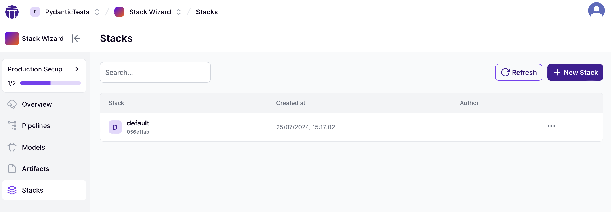
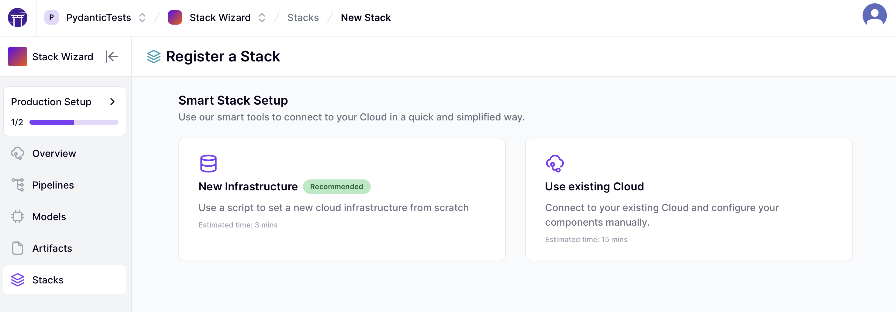
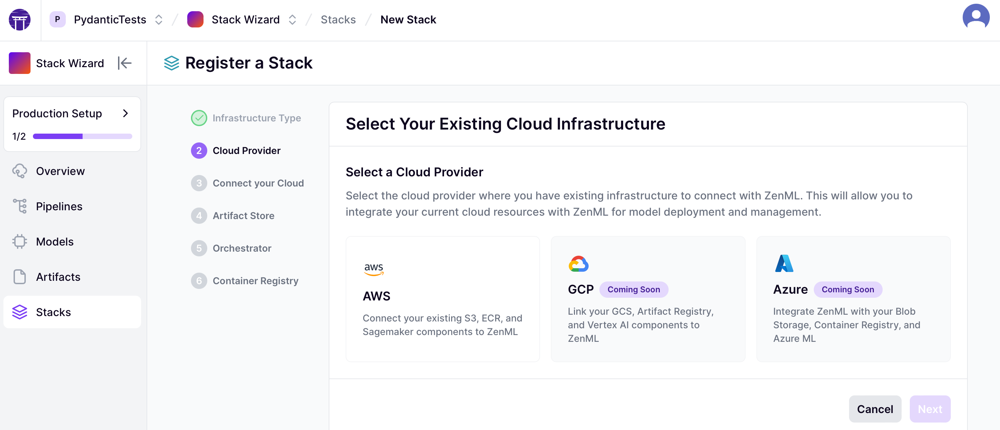
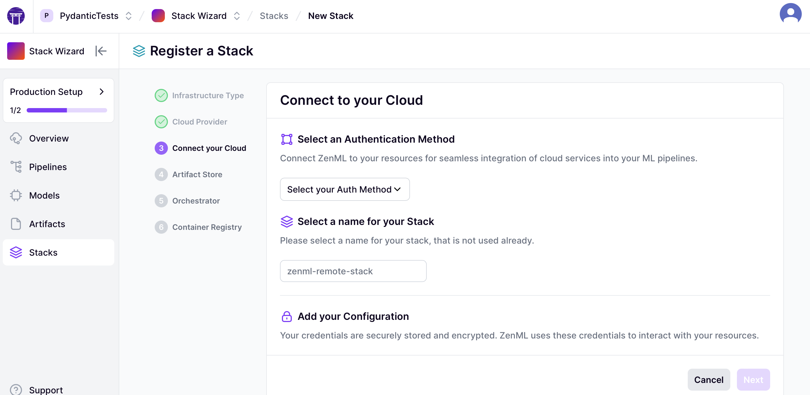


This is an older version of the ZenML documentation. To read and view the latest version please [visit this up-to-date URL](https://docs.zenml.io).



In ZenML, the [stack](../../user-guide/production-guide/understand-stacks.md) 
is a fundamental concept that represents the configuration of your 
infrastructure. In a normal workflow, creating a stack requires you to first 
deploy the necessary pieces of infrastructure and then define them as stack 
components in ZenML with proper authentication.

Especially in a remote setting, this process can be challenging and 
time-consuming, and it may create multi-faceted problems. This is why we 
implemented a feature called the stack wizard, that allows you to **browse 
through your existing infrastructure and use it to register a ZenML cloud 
stack**.


If you do not have the required infrastructure pieces already deployed
on your cloud, you can also use [the 1-click deployment tool to build your 
cloud stack](deploy-a-cloud-stack.md).

Alternatively, if you prefer to have more control over where and how resources
are provisioned in your cloud, you can [use one of our Terraform modules](deploy-a-cloud-stack-with-terraform.md)
to manage your infrastructure as code yourself.


# How to use the Stack Wizard?

The stack wizard is available to you by both our CLI and our dashboard.




If you are using the dashboard, the stack wizard is available through 
the stacks page. 



Here you can click on "+ New Stack" and choose the option "Use existing Cloud".



Next, you have to select the cloud provider that you want to work with.



Choose one of the possible authentication methods based on your provider and
fill in the required fields.



<details>

<summary>AWS: Authentication methods</summary>

If you select `aws` as your cloud provider, and you haven't selected a connector
or declined auto-configuration, you will be prompted to select an authentication 
method for your cloud connector.


```
                  Available authentication methods for AWS                   
┏━━━━━━━━━┳━━━━━━━━━━━━━━━━━━━━━━━━━━━━━━━━┳━━━━━━━━━━━━━━━━━━━━━━━━━━━━━━━━┓
┃ Choice  ┃ Name                           ┃ Required                       ┃
┡━━━━━━━━━╇━━━━━━━━━━━━━━━━━━━━━━━━━━━━━━━━╇━━━━━━━━━━━━━━━━━━━━━━━━━━━━━━━━┩
│ [0]     │ AWS Secret Key                 │ aws_access_key_id  (AWS Access │
│         │                                │ Key ID)                        │
│         │                                │ aws_secret_access_key  (AWS    │
│         │                                │ Secret Access Key)             │
│         │                                │ region  (AWS Region)           │
│         │                                │                                │
├─────────┼────────────────────────────────┼────────────────────────────────┤
│ [1]     │ AWS STS Token                  │ aws_access_key_id  (AWS Access │
│         │                                │ Key ID)                        │
│         │                                │ aws_secret_access_key  (AWS    │
│         │                                │ Secret Access Key)             │
│         │                                │ aws_session_token  (AWS        │
│         │                                │ Session Token)                 │
│         │                                │ region  (AWS Region)           │
│         │                                │                                │
├─────────┼────────────────────────────────┼────────────────────────────────┤
│ [2]     │ AWS IAM Role                   │ aws_access_key_id  (AWS Access │
│         │                                │ Key ID)                        │
│         │                                │ aws_secret_access_key  (AWS    │
│         │                                │ Secret Access Key)             │
│         │                                │ region  (AWS Region)           │
│         │                                │ role_arn  (AWS IAM Role ARN)   │
│         │                                │                                │
├─────────┼────────────────────────────────┼────────────────────────────────┤
│ [3]     │ AWS Session Token              │ aws_access_key_id  (AWS Access │
│         │                                │ Key ID)                        │
│         │                                │ aws_secret_access_key  (AWS    │
│         │                                │ Secret Access Key)             │
│         │                                │ region  (AWS Region)           │
│         │                                │                                │
├─────────┼────────────────────────────────┼────────────────────────────────┤
│ [4]     │ AWS Federation Token           │ aws_access_key_id  (AWS Access │
│         │                                │ Key ID)                        │
│         │                                │ aws_secret_access_key  (AWS    │
│         │                                │ Secret Access Key)             │
│         │                                │ region  (AWS Region)           │
│         │                                │                                │
└─────────┴────────────────────────────────┴────────────────────────────────┘
```

</details>

<details>
<summary>GCP: Authentication methods</summary>


If you select `gcp` as your cloud provider, and you haven't selected a connector
or declined auto-configuration, you will be prompted to select an authentication 
method for your cloud connector.


```
                  Available authentication methods for GCP                   
┏━━━━━━━━━┳━━━━━━━━━━━━━━━━━━━━━━━━━━━━━━━━┳━━━━━━━━━━━━━━━━━━━━━━━━━━━━━━━━┓
┃ Choice  ┃ Name                           ┃ Required                       ┃
┡━━━━━━━━━╇━━━━━━━━━━━━━━━━━━━━━━━━━━━━━━━━╇━━━━━━━━━━━━━━━━━━━━━━━━━━━━━━━━┩
│ [0]     │ GCP User Account               │ user_account_json  (GCP User   │
│         │                                │ Account Credentials JSON       │
│         │                                │ optionally base64 encoded.)    │
│         │                                │ project_id  (GCP Project ID    │
│         │                                │ where the target resource is   │
│         │                                │ located.)                      │
│         │                                │                                │
├─────────┼────────────────────────────────┼────────────────────────────────┤
│ [1]     │ GCP Service Account            │ service_account_json  (GCP     │
│         │                                │ Service Account Key JSON       │
│         │                                │ optionally base64 encoded.)    │
│         │                                │                                │
├─────────┼────────────────────────────────┼────────────────────────────────┤
│ [2]     │ GCP External Account           │ external_account_json  (GCP    │
│         │                                │ External Account JSON          │
│         │                                │ optionally base64 encoded.)    │
│         │                                │ project_id  (GCP Project ID    │
│         │                                │ where the target resource is   │
│         │                                │ located.)                      │
│         │                                │                                │
├─────────┼────────────────────────────────┼────────────────────────────────┤
│ [3]     │ GCP Oauth 2.0 Token            │ token  (GCP OAuth 2.0 Token)   │
│         │                                │ project_id  (GCP Project ID    │
│         │                                │ where the target resource is   │
│         │                                │ located.)                      │
│         │                                │                                │
├─────────┼────────────────────────────────┼────────────────────────────────┤
│ [4]     │ GCP Service Account            │ service_account_json  (GCP     │
│         │ Impersonation                  │ Service Account Key JSON       │
│         │                                │ optionally base64 encoded.)    │
│         │                                │ target_principal  (GCP Service │
│         │                                │ Account Email to impersonate)  │
│         │                                │                                │
└─────────┴────────────────────────────────┴────────────────────────────────┘
```

</details>

<details>
<summary>Azure: Authentication methods</summary>

If you select `azure` as your cloud provider, and you haven't selected a 
connector or declined auto-configuration, you will be prompted to select an 
authentication method for your cloud connector.


```
    Available authentication methods for AZURE                         
┏━━━━━━━━┳━━━━━━━━━━━━━━━━━━━━━━━━━┳━━━━━━━━━━━━━━━━━━━━━━━━━━━━━━━━━━━━┓
┃ Choice ┃ Name                    ┃ Required                           ┃
┡━━━━━━━━╇━━━━━━━━━━━━━━━━━━━━━━━━━╇━━━━━━━━━━━━━━━━━━━━━━━━━━━━━━━━━━━━┩
│ [0]    │ Azure Service Principal │ client_secret  (Service principal  │
│        │                         │ client secret)                     │
│        │                         │ tenant_id  (Azure Tenant ID)       │
│        │                         │ client_id  (Azure Client ID)       │
│        │                         │                                    │
├────────┼─────────────────────────┼────────────────────────────────────┤
│ [1]    │ Azure Access Token      │ token  (Azure Access Token)        │
│        │                         │                                    │
└────────┴─────────────────────────┴────────────────────────────────────┘
```


</details>

From this step forward, ZenML will show you different selections of resources 
that you can use from your existing infrastructure so that you can create the 
required stack components such as an artifact store, an orchestrator, 
and a container registry.




In order to register a remote stack over the CLI with the stack wizard,
you can use the following command:

```shell
zenml stack register <STACK_NAME> -p {aws|gcp|azure}
```

To register the cloud stack, the first thing that the wizard needs is a [service 
connector](../auth-management/service-connectors-guide.md). You can either use 
an existing connector by providing its ID or name 
`-sc <SERVICE_CONNECTOR_ID_OR_NAME>` (CLI-Only) or the wizard will create one 
for you.


Similar to the service connector, if you use the CLI, you can also use existing 
stack components. However, this is only possible if these components are already 
configured with the same service connector that you provided through the 
parameter described above.


### Define Service Connector

As the very first step the configuration wizard will check if the selected 
cloud provider credentials can be acquired automatically from the local environment.
If the credentials are found, you will be offered to use them or proceed to 
manual configuration.


```
AWS cloud service connector has detected connection 
credentials in your environment.
Would you like to use these credentials or create a new 
configuration by providing connection details? [y/n] (y):
```


If you decline auto-configuration next you might be offered the list of already 
created service connectors available on the server: pick one of them and proceed or pick 
`0` to create a new one.

<details>
<summary>AWS: Authentication methods</summary>

If you select `aws` as your cloud provider, and you haven't selected a connector
or declined auto-configuration, you will be prompted to select an authentication 
method for your cloud connector.


```
                  Available authentication methods for AWS                   
┏━━━━━━━━━┳━━━━━━━━━━━━━━━━━━━━━━━━━━━━━━━━┳━━━━━━━━━━━━━━━━━━━━━━━━━━━━━━━━┓
┃ Choice  ┃ Name                           ┃ Required                       ┃
┡━━━━━━━━━╇━━━━━━━━━━━━━━━━━━━━━━━━━━━━━━━━╇━━━━━━━━━━━━━━━━━━━━━━━━━━━━━━━━┩
│ [0]     │ AWS Secret Key                 │ aws_access_key_id  (AWS Access │
│         │                                │ Key ID)                        │
│         │                                │ aws_secret_access_key  (AWS    │
│         │                                │ Secret Access Key)             │
│         │                                │ region  (AWS Region)           │
│         │                                │                                │
├─────────┼────────────────────────────────┼────────────────────────────────┤
│ [1]     │ AWS STS Token                  │ aws_access_key_id  (AWS Access │
│         │                                │ Key ID)                        │
│         │                                │ aws_secret_access_key  (AWS    │
│         │                                │ Secret Access Key)             │
│         │                                │ aws_session_token  (AWS        │
│         │                                │ Session Token)                 │
│         │                                │ region  (AWS Region)           │
│         │                                │                                │
├─────────┼────────────────────────────────┼────────────────────────────────┤
│ [2]     │ AWS IAM Role                   │ aws_access_key_id  (AWS Access │
│         │                                │ Key ID)                        │
│         │                                │ aws_secret_access_key  (AWS    │
│         │                                │ Secret Access Key)             │
│         │                                │ region  (AWS Region)           │
│         │                                │ role_arn  (AWS IAM Role ARN)   │
│         │                                │                                │
├─────────┼────────────────────────────────┼────────────────────────────────┤
│ [3]     │ AWS Session Token              │ aws_access_key_id  (AWS Access │
│         │                                │ Key ID)                        │
│         │                                │ aws_secret_access_key  (AWS    │
│         │                                │ Secret Access Key)             │
│         │                                │ region  (AWS Region)           │
│         │                                │                                │
├─────────┼────────────────────────────────┼────────────────────────────────┤
│ [4]     │ AWS Federation Token           │ aws_access_key_id  (AWS Access │
│         │                                │ Key ID)                        │
│         │                                │ aws_secret_access_key  (AWS    │
│         │                                │ Secret Access Key)             │
│         │                                │ region  (AWS Region)           │
│         │                                │                                │
└─────────┴────────────────────────────────┴────────────────────────────────┘
```

</details>

<details>
<summary>GCP: Authentication methods</summary>


If you select `gcp` as your cloud provider, and you haven't selected a connector
or declined auto-configuration, you will be prompted to select an authentication 
method for your cloud connector.


```
                  Available authentication methods for GCP                   
┏━━━━━━━━━┳━━━━━━━━━━━━━━━━━━━━━━━━━━━━━━━━┳━━━━━━━━━━━━━━━━━━━━━━━━━━━━━━━━┓
┃ Choice  ┃ Name                           ┃ Required                       ┃
┡━━━━━━━━━╇━━━━━━━━━━━━━━━━━━━━━━━━━━━━━━━━╇━━━━━━━━━━━━━━━━━━━━━━━━━━━━━━━━┩
│ [0]     │ GCP User Account               │ user_account_json  (GCP User   │
│         │                                │ Account Credentials JSON       │
│         │                                │ optionally base64 encoded.)    │
│         │                                │ project_id  (GCP Project ID    │
│         │                                │ where the target resource is   │
│         │                                │ located.)                      │
│         │                                │                                │
├─────────┼────────────────────────────────┼────────────────────────────────┤
│ [1]     │ GCP Service Account            │ service_account_json  (GCP     │
│         │                                │ Service Account Key JSON       │
│         │                                │ optionally base64 encoded.)    │
│         │                                │                                │
├─────────┼────────────────────────────────┼────────────────────────────────┤
│ [2]     │ GCP External Account           │ external_account_json  (GCP    │
│         │                                │ External Account JSON          │
│         │                                │ optionally base64 encoded.)    │
│         │                                │ project_id  (GCP Project ID    │
│         │                                │ where the target resource is   │
│         │                                │ located.)                      │
│         │                                │                                │
├─────────┼────────────────────────────────┼────────────────────────────────┤
│ [3]     │ GCP Oauth 2.0 Token            │ token  (GCP OAuth 2.0 Token)   │
│         │                                │ project_id  (GCP Project ID    │
│         │                                │ where the target resource is   │
│         │                                │ located.)                      │
│         │                                │                                │
├─────────┼────────────────────────────────┼────────────────────────────────┤
│ [4]     │ GCP Service Account            │ service_account_json  (GCP     │
│         │ Impersonation                  │ Service Account Key JSON       │
│         │                                │ optionally base64 encoded.)    │
│         │                                │ target_principal  (GCP Service │
│         │                                │ Account Email to impersonate)  │
│         │                                │                                │
└─────────┴────────────────────────────────┴────────────────────────────────┘
```

</details>

<details>
<summary>Azure: Authentication methods</summary>

If you select `azure` as your cloud provider, and you haven't selected a 
connector or declined auto-configuration, you will be prompted to select an 
authentication method for your cloud connector.


```
    Available authentication methods for AZURE                         
┏━━━━━━━━┳━━━━━━━━━━━━━━━━━━━━━━━━━┳━━━━━━━━━━━━━━━━━━━━━━━━━━━━━━━━━━━━┓
┃ Choice ┃ Name                    ┃ Required                           ┃
┡━━━━━━━━╇━━━━━━━━━━━━━━━━━━━━━━━━━╇━━━━━━━━━━━━━━━━━━━━━━━━━━━━━━━━━━━━┩
│ [0]    │ Azure Service Principal │ client_secret  (Service principal  │
│        │                         │ client secret)                     │
│        │                         │ tenant_id  (Azure Tenant ID)       │
│        │                         │ client_id  (Azure Client ID)       │
│        │                         │                                    │
├────────┼─────────────────────────┼────────────────────────────────────┤
│ [1]    │ Azure Access Token      │ token  (Azure Access Token)        │
│        │                         │                                    │
└────────┴─────────────────────────┴────────────────────────────────────┘
```


</details>

### Defining cloud components

Next, you will define three major components of your target stack:
- artifact store
- orchestrator
- container registry

All three are crucial for a basic cloud stack. Extra components can be added later 
if they are needed.

For each component, you will be asked:
- if you would like to reuse one of the existing components connected via a defined 
service connector (if any)


```
                    Available orchestrator
┏━━━━━━━━━━━━━━━━━━┳━━━━━━━━━━━━━━━━━━━━━━━━━━━━━━━━━━━━━━━━━━━━━━━━━━━━┓
┃ Choice           ┃ Name                                               ┃
┡━━━━━━━━━━━━━━━━━━╇━━━━━━━━━━━━━━━━━━━━━━━━━━━━━━━━━━━━━━━━━━━━━━━━━━━━┩
│ [0]              │ Create a new orchestrator                          │
├──────────────────┼────────────────────────────────────────────────────┤
│ [1]              │ existing_orchestrator_1                            │
├──────────────────┼────────────────────────────────────────────────────┤
│ [2]              │ existing_orchestrator_2                            │
└──────────────────┴────────────────────────────────────────────────────┘
```


- to create a new one from available to the service connector resources 
(if the existing not picked)


```
                        Available GCP storages                            
┏━━━━━━━━━━━━━━━┳━━━━━━━━━━━━━━━━━━━━━━━━━━━━━━━━━━━━━━━━━━━━━━━━━━━━━━━┓
┃ Choice        ┃ Storage                                               ┃
┡━━━━━━━━━━━━━━━╇━━━━━━━━━━━━━━━━━━━━━━━━━━━━━━━━━━━━━━━━━━━━━━━━━━━━━━━┩
│ [0]           │ gs://***************************                      │
├───────────────┼───────────────────────────────────────────────────────┤
│ [1]           │ gs://***************************                      │
└───────────────┴───────────────────────────────────────────────────────┘
```


Based on your selection, ZenML will create the stack component and ultimately 
register the stack for you.





There you have it! Through the wizard, you just registered a cloud stack 
and, you can start running your pipelines on a remote setting.

<figure><figcaption></figcaption></figure>
