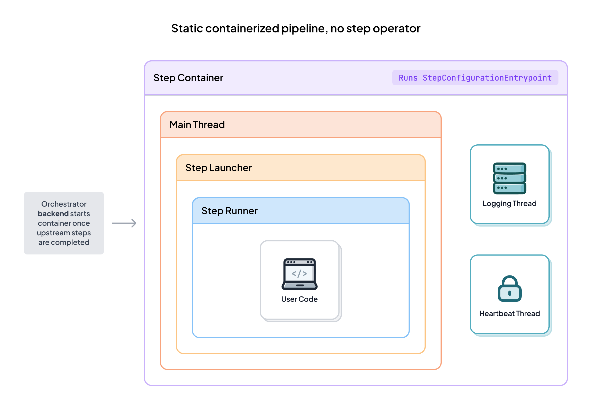
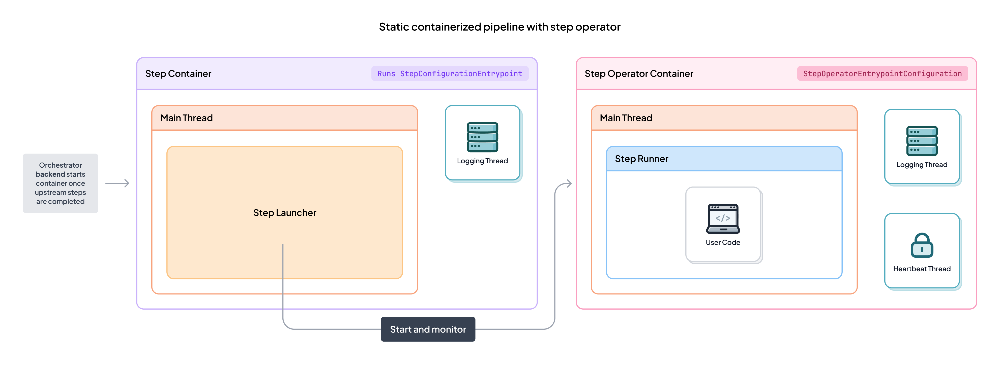
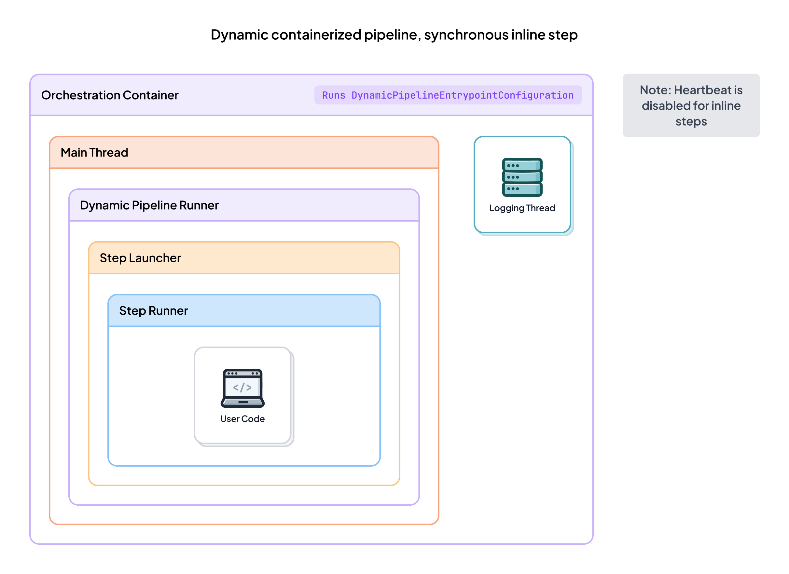
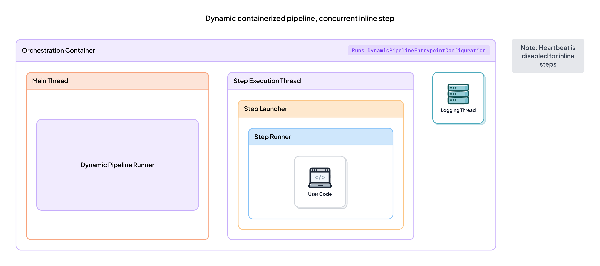
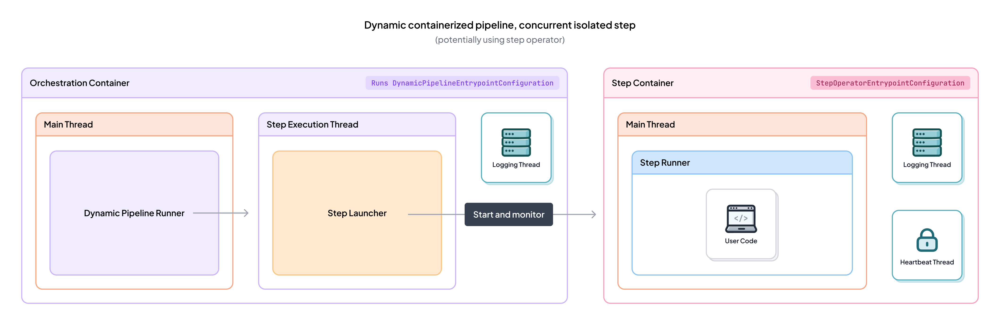

# How ZenML executes steps

This page explains what happens under the hood when ZenML executes steps in static and dynamic pipelines. 
Regardless of where or how a step executes (inline or in an isolated environment, synchronous or concurrent), ZenML applies the same core semantics:
inputs are loaded via materializers, outputs are materialized as versioned artifacts, lineage/metadata and logs are recorded, caching policies are respected, and step/run status is published consistently.

## Static pipelines

In static pipelines, ZenML executes the pipeline function before running the pipeline to compile a DAG of steps, which the orchestrator then schedules according to their upstream dependencies. This pre-compilation allows ZenML to optimize execution order and validate the DAG structure before any steps run.

### Execution scenarios

## Dynamic pipelines

Dynamic pipelines execute the pipeline function at runtime. Each step executed inside the pipeline function can be:

- **Inline** (runs inside the orchestration environment)
- **Isolated** (runs in a separate environment via the orchestrator or a step operator)

And each step call can be:

- **Synchronous** (via `my_step(...)`): blocks until completion and returns the step output artifacts.
- **Concurrent** (via `my_step.submit(...)`): starts step execution in a separate thread and returns a future. The pipeline function resumes execution immediately.

### Execution scenarios

#### Synchronous inline

The step runs in-process inside the orchestration environment. The pipeline function blocks until the step completes.

#### Concurrent inline

The step runs in-process in a separate thread. The pipeline function continues immediately and only waits when results are consumed.

#### Synchronous isolated

The step runs in a separate environment (via the orchestrator or step operator). The pipeline function blocks until the job completes.

#### Concurrent isolated

The step runs in a separate environment (via the orchestrator or step operator). The pipeline function continues immediately and only waits when results are consumed.

