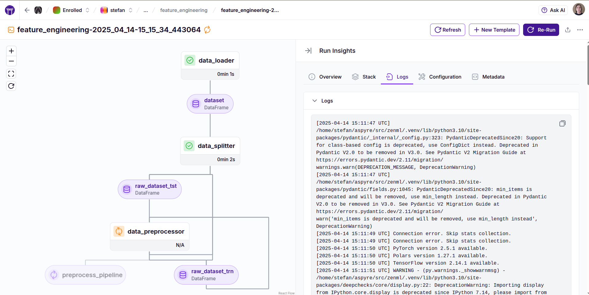

# Logging

By default, ZenML uses a logging handler to capture two types of logs:

* the logs collected from your ZenML client while triggering and waiting for a pipeline to run. These logs cover everything that happens client-side: building and pushing container images, triggering the pipeline, waiting for it to start, and waiting for it to finish. Note that these logs are not available for scheduled pipelines and the logs might not be available for pipeline runs that fail while building or pushing the container images.
* the logs collected from the execution of a step. These logs only cover what happens during the execution of a single step and originate mostly from the user-provided step code and the libraries it calls.

For step logs, users are free to use the default python logging module or print statements, and ZenML's logging handler will catch these logs and store them.

```python
import logging

from zenml import step

@step 
def my_step() -> None:
    logging.warning("`Hello`")  # You can use the regular `logging` module.
    print("World.")  # You can utilize `print` statements as well. 
```

All these logs are stored within the respective artifact store of your stack. You can visualize the pipeline run logs and step logs in the dashboard as follows:

* Local ZenML server (`zenml login --local`): Both local and remote artifact stores may be accessible
* Deployed ZenML server: Local artifact store logs won't be accessible; remote artifact store logs require [service connector](https://docs.zenml.io//how-to/infrastructure-deployment/auth-management/service-connectors-guide) configuration (see [remote storage guide](https://docs.zenml.io/user-guides/production-guide/remote-storage))




## Logging Configuration

### Environment Variables and Remote Execution

For all logging configurations below, note:
- Setting environment variables on your local machine only affects local pipeline runs
- For remote pipeline runs, you must set these variables in the pipeline's execution environment using Docker settings:

```python
from zenml import pipeline
from zenml.config import DockerSettings

docker_settings = DockerSettings(environment={"ENVIRONMENT_VARIABLE": "value"})

# Either add it to the decorator
@pipeline(settings={"docker": docker_settings})
def my_pipeline() -> None:
    my_step()

# Or configure the pipelines options
my_pipeline = my_pipeline.with_options(
    settings={"docker": docker_settings}
)
```

### Enabling or Disabling Logs Storage

You can disable storing logs in your artifact store by:

1. Using the `enable_step_logs` or the `enable_pipeline_logs` parameter with decorators:

    ```python
    from zenml import pipeline, step

    @step(enable_step_logs=False)  # disables logging for this step
    def my_step() -> None:
        ...

    @pipeline(enable_pipeline_logs=False)  # disables logging for the entire pipeline
    def my_pipeline():
        ...
    ```

2. Setting the `ZENML_DISABLE_STEP_LOGS_STORAGE=true` environment variable in the execution environment:

    ```python
    from zenml import pipeline
    from zenml.config import DockerSettings

    docker_settings = DockerSettings(environment={"ZENML_DISABLE_STEP_LOGS_STORAGE": "true"})

    # Either add it to the decorator
    @pipeline(settings={"docker": docker_settings})
    def my_pipeline() -> None:
        my_step()

    # Or configure the pipelines options
    my_pipeline = my_pipeline.with_options(
        settings={"docker": docker_settings}
    )
    ```

    This environmental variable takes precedence over the parameter mentioned above. 

### Setting Logging Verbosity

Change the default logging level (`INFO`) with:

```bash
export ZENML_LOGGING_VERBOSITY=INFO
```

Options: `INFO`, `WARN`, `ERROR`, `CRITICAL`, `DEBUG`

For remote pipeline runs:

```python
from zenml import pipeline
from zenml.config import DockerSettings

docker_settings = DockerSettings(environment={"ZENML_LOGGING_VERBOSITY": "DEBUG"})

# Either add it to the decorator
@pipeline(settings={"docker": docker_settings})
def my_pipeline() -> None:
    my_step()

# Or configure the pipelines options
my_pipeline = my_pipeline.with_options(
    settings={"docker": docker_settings}
)
```

### Setting Logging Format

Change the default logging format with:

```bash
export ZENML_LOGGING_FORMAT='%(asctime)s %(message)s'
```

The format must use `%`-string formatting style. See [available attributes](https://docs.python.org/3/library/logging.html#logrecord-attributes).

### Disabling Rich Traceback Output

ZenML uses [rich](https://rich.readthedocs.io/en/stable/traceback.html) for enhanced traceback display. Disable it with:

```bash
export ZENML_ENABLE_RICH_TRACEBACK=false
```

### Disabling Colorful Logging

Disable colorful logging with:

```bash
ZENML_LOGGING_COLORS_DISABLED=true
```

### Disabling Step Names in Logs

By default, ZenML adds step name prefixes to console logs:

```
[data_loader] Loading data from source...
[data_loader] Data loaded successfully.
[model_trainer] Training model with parameters...
```

These prefixes only appear in console output, not in stored logs. Disable them with:

```bash
ZENML_DISABLE_STEP_NAMES_IN_LOGS=true
```

## Best Practices for Logging

1. **Use appropriate log levels**:
   - `DEBUG`: Detailed diagnostic information
   - `INFO`: Confirmation that things work as expected
   - `WARNING`: Something unexpected happened
   - `ERROR`: A more serious problem occurred
   - `CRITICAL`: A serious error that may prevent continued execution

2. **Include contextual information** in logs
3. **Log at decision points** to track execution flow
4. **Avoid logging sensitive information**
5. **Use structured logging** when appropriate
6. **Configure appropriate verbosity** for different environments

## See Also
- [Steps & Pipelines](./steps_and_pipelines.md)
- [Configuration with YAML](./configuration_with_yaml.md)
- [Advanced Features](./advanced_features.md) 